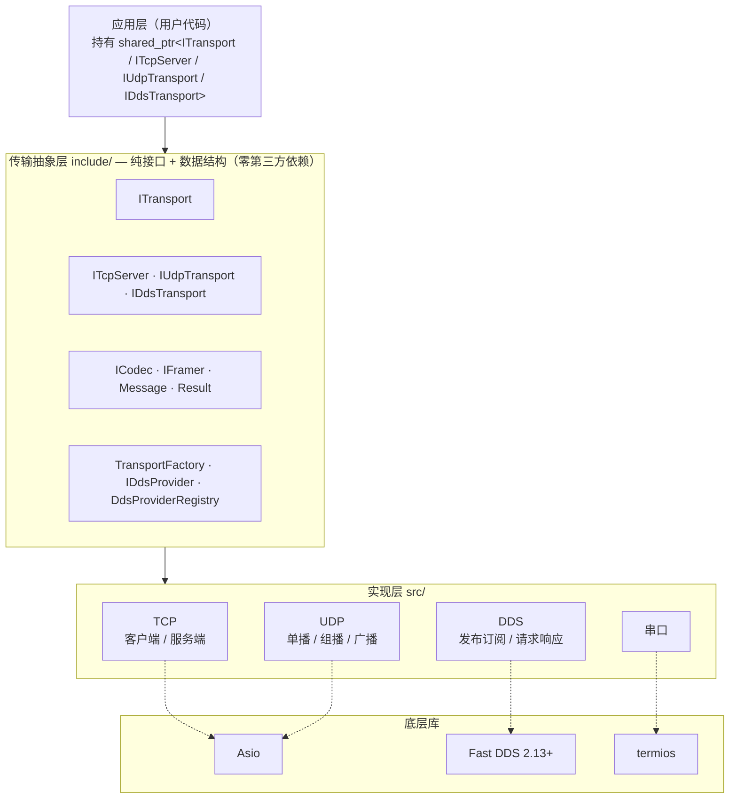
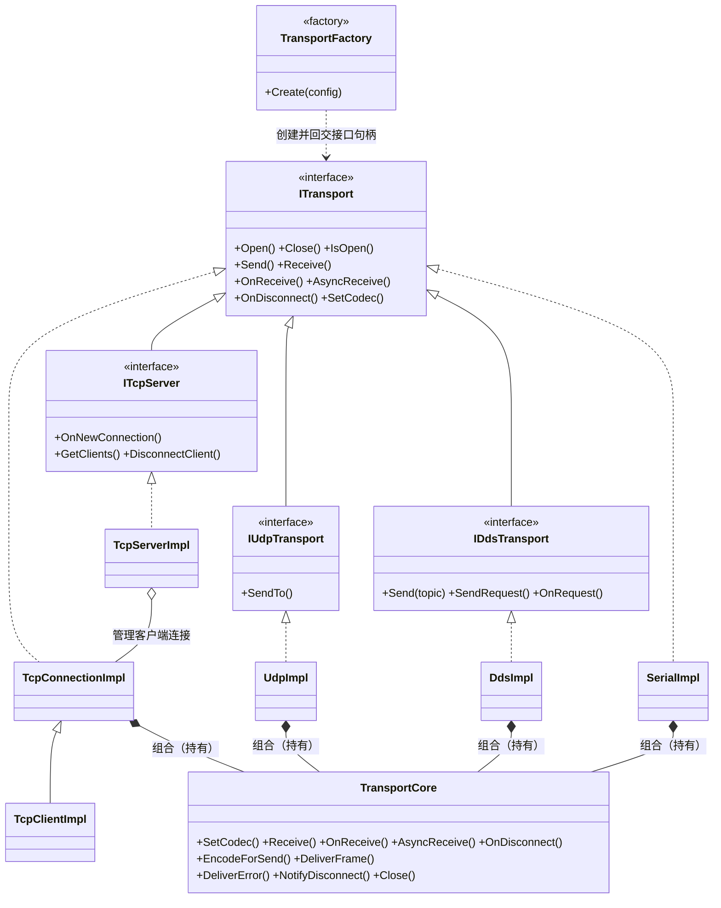
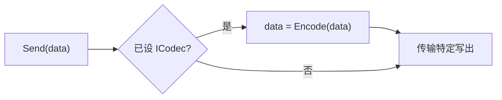
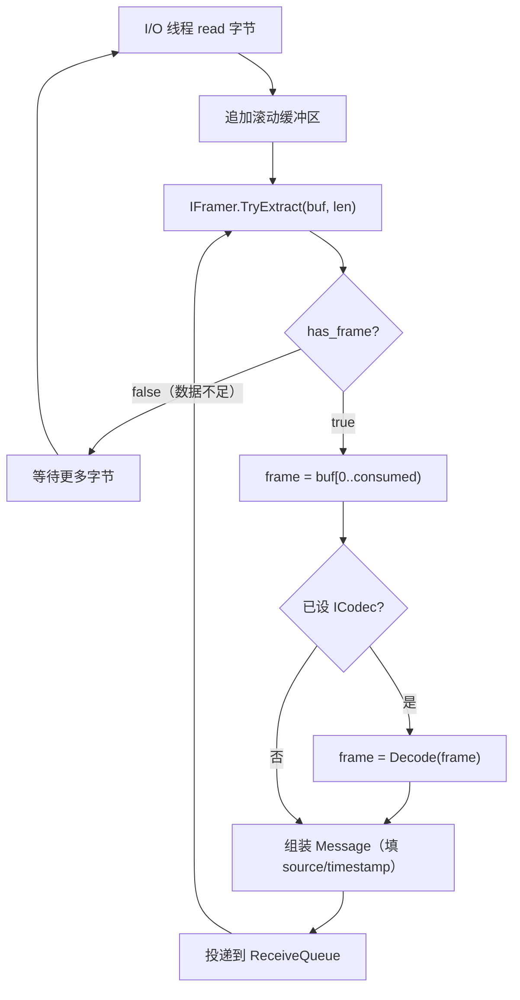
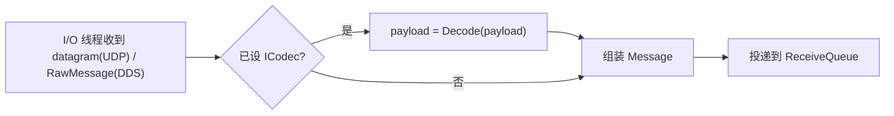

# 通信中间件框架 — 设计规格文档

**日期：** 2026-06-09  
**状态：** 已确认  
**修订：**
- 2026-06-09 增补 —— 发送时指定目的地（UDP 目的 ip:port、DDS topic）、DDS 实例内部多 topic 路由、接收侧流式分帧层、`ICodec` 可报错、所有发送接口去除 `len` 参数改用 `std::vector<uint8_t>`、移除 `DdsTransportManager`、DDS req-resp 仅客户端发请求。
- 2026-06-09 二次增补 —— DDS 统一字节流承载：单个 `RawMessage` C++ 类（`request_id`/`reply_topic`/`payload`）+ 自定义 `TopicDataType`，绕过 IDL/Fast DDS-Gen/Fast CDR 直发原始字节；req-resp 框架自动关联（`request_id`+`reply_topic`）、自动超时，移除 `DdsConfig.type_name`；明确 TCP/UDP/串口直接发送 `std::vector<uint8_t>`；新增 req-resp 响应端 `OnRequest`、`SendRequest` 增 `timeout_ms`；新增「收发数据流与调用时序」「测试策略」「使用示例」章节。
- 2026-06-11 DDS 实现期增补 —— `DdsConfig.qos_profile` 字符串改为 `DdsQos` 结构体（reliability/durability/history_depth，借鉴 Apollo Cyber RT 的 QoS 简化包装）；Fast DDS 版本 3.6 → **2.13+**（仅用 DDS-PIM API + 自定义 `TopicDataType`，版本敏感面封在 provider 文件对内，RTPS 线协议与 3.x 互通）；同机 SHM 由 Fast DDS 内建 SHM transport 覆盖，自研 SHM 传输列入远期 roadmap。详见 `2026-06-11-dds-transport-design.md`。

---

## 1. 概述

一个 C++ 通信中间件库，将数据传输与数据编解码解耦。库负责跨多种协议的原始字节流传输，不关心数据的具体类型、格式和内容。编解码由用户实现的 `ICodec` 接口负责，框架在发送/接收边界自动调用，用户无需手动调用。

**非目标：** 库不解析、解释或转换消息内容（超出 `ICodec` 范围的部分），不是消息代理或路由守护进程。

---

## 2. 目标环境与集成方式

- **平台：** Linux（桌面/服务器，如 Ubuntu、CentOS 等）
- **使用场景：** 本机进程间通信 + 跨网络通信（混合）
- **集成方式：** 静态库（`.a`）或动态库（`.so`），由应用层直接链接
- **C++ 标准：** C++17
- **构建系统：** CMake
- **编码规范：** [Google C++ 风格指南](https://google.github.io/styleguide/cppguide.html)

---

## 3. 架构

### 3.1 层次图

分层（包/层视图，UML 风格，Mermaid 渲染）：



### 3.2 设计原则

- 传输抽象层（`include/`）只包含纯虚接口和数据结构，零第三方依赖。
- 每个实现模块仅依赖自身的底层库，与其他实现模块完全隔离。
- `ICodec` 由框架在发送/接收边界自动调用，用户无需直接调用 `Encode`/`Decode`。
- 分帧（`IFramer`）仅作用于流式传输（TCP、串口）的**接收侧**；UDP/DDS 报文天然保边界，跳过分帧。
- `TransportFactory` 是创建所有传输实例的唯一入口。

### 3.3 目录结构

```
transport/
├── include/transport/
│   ├── ITransport.hpp
│   ├── ICodec.hpp
│   ├── IFramer.hpp
│   ├── Message.hpp
│   ├── Result.hpp
│   ├── TransportFactory.hpp
│   ├── framing/
│   │   └── LengthFieldFramer.hpp
│   ├── tcp/
│   │   ├── TcpClientConfig.hpp
│   │   ├── TcpServerConfig.hpp
│   │   └── ITcpServer.hpp
│   ├── udp/
│   │   ├── UdpConfig.hpp
│   │   └── IUdpTransport.hpp
│   ├── dds/
│   │   ├── DdsConfig.hpp
│   │   ├── IDdsTransport.hpp
│   │   ├── IDdsProvider.hpp
│   │   └── DdsProviderRegistry.hpp
│   └── serial/
│       └── SerialConfig.hpp
├── src/
│   ├── framing/
│   │   ├── LengthFieldFramer.cpp
│   │   └── FrameAssembler.hpp        // 滚动缓冲 + IFramer 驱动的接收侧装配器
│   ├── tcp/                              // 实现类用 *Impl 后缀；头文件实际在 include/transport/tcp/
│   │   ├── TcpConnectionImpl.{hpp,cpp}   // ITransport 实现（client/accepted 连接共用）
│   │   ├── TcpClientImpl.{hpp,cpp}       // 客户端：connect + 指数退避重连
│   │   └── TcpServerImpl.{hpp,cpp}       // ITcpServer 实现：acceptor + 广播
│   ├── udp/
│   │   ├── UdpTransport.hpp
│   │   └── UdpTransport.cpp
│   ├── dds/
│   │   ├── RawMessage.hpp              // DDS 承载类（普通 C++ 类）：{ request_id, reply_topic, payload }，provider 无关
│   │   ├── DdsTransport.hpp            // req-resp 关联/超时/id 配对在此层完成
│   │   ├── DdsTransport.cpp
│   │   ├── FastDdsRawType.hpp          // 自定义 TopicDataType：绕过 IDL/Fast DDS-Gen/Fast CDR，手写原始字节序列化
│   │   ├── FastDdsRawType.cpp
│   │   ├── FastDdsProvider.hpp
│   │   └── FastDdsProvider.cpp
│   ├── serial/
│   │   ├── SerialTransport.hpp
│   │   └── SerialTransport.cpp
│   └── TransportFactory.cpp
├── tests/
├── examples/
├── docs/
└── CMakeLists.txt
```

### 3.4 接口 vs 实现 的依赖分层

框架贯穿同一约定：每类传输 = **接口 `I*`（契约，纯虚，零第三方依赖）** + **实现类 `*Impl`（落地，封装 asio / Fast DDS / termios）**。应用层与 `TransportFactory` 只依赖接口；第三方库被关在实现类内部。`ITcpServer` 与 `TcpServerImpl` 即这一关系的一个实例——前者声明服务端契约，后者用 Asio 实现它。

UML 类图（Mermaid 渲染；`<|--` 继承 / `<|..` 实现 / `o--` 聚合 / `..>` 依赖）：



> **状态：** `ITransport` / `ITcpServer` / `IUdpTransport` / `TransportCore` / `TcpConnectionImpl` / `TcpClientImpl` / `TcpServerImpl` / `UdpImpl` / `SerialImpl` 已实现（Foundation + TCP + UDP + 串口）；`IDdsTransport` / `DdsImpl` / `TransportFactory` 规划中。
>
> **支撑设施：** `ICodec`（用户实现）、`IFramer ◁── LengthFieldFramer`、`FrameAssembler`、`ReceiveQueue`、`Message`、`Result<T>`——均已实现。`TransportCore` 内部持有 `ReceiveQueue` 并用 `ICodec` 编解码，被各「会收数据」的传输**组合持有**；流式传输（TCP/串口）接收侧经 `FrameAssembler` + `IFramer` 分帧。`TcpServerImpl` 不组合 `TransportCore`（只 accept + 广播，不维护接收队列）。
>
> 为什么要 `I*` 接口而不止一个实现类：① `TransportFactory` 据接口返回句柄；② 消费者头文件不被 asio/Fast DDS 等依赖污染；③ 可替换 / 可用 fake 测试上层；④ 全框架一致。
>
> 注：接收交付基座**已由继承式 `TransportBase` 重构为组合式组件 `TransportCore`**（B 方案：组合替代继承，从根上消除「与扩展接口同源 `ITransport`」的菱形）。`TcpConnectionImpl`/`UdpImpl`/（未来）`DdsImpl`/`SerialImpl` 均**持有** `TransportCore` 并转发接收侧方法。详见 `2026-06-10-foundation-tcp-architecture.md`。
>
> **已实现部分（Foundation + TCP）的 as-built 类图/时序图/依赖说明**见 `docs/superpowers/specs/2026-06-10-foundation-tcp-architecture.md`。

---

## 4. 核心接口

### 4.1 `Result<T>`

所有可能失败的操作返回 `Result<T>`，框架不抛出异常。

```cpp
template <typename T>
struct Result {
  T           value;
  bool        ok;
  std::string error;

  explicit operator bool() const { return ok; }

  static Result<T> Success(T v)          { return {std::move(v), true, ""}; }
  static Result<T> Fail(std::string msg) { return {{}, false, std::move(msg)}; }
};

using Status = Result<std::monostate>;
```

- `T` 需可默认构造（`Fail` 用 `{}` 初始化 `value`）。`std::vector<uint8_t>`、`Message`、`std::monostate` 均满足。

错误字符串前缀分类：

| 前缀 | 含义 |
|------|------|
| `timeout:` | 操作超时 |
| `conn:` | 连接断开或被拒绝 |
| `codec:` | 编解码失败 |
| `frame:` | 分帧失败（帧头非法、帧长越界等） |
| `io:` | 底层 I/O 错误 |
| `config:` | 配置无效 |

### 4.2 `Message`

```cpp
struct Message {
  std::vector<uint8_t> payload;    // 经 ICodec.Decode 处理后的字节流（含用户 header + body）
  std::string          topic;      // DDS topic 或逻辑通道名；TCP/UDP/串口时为空
  std::string          source;     // 发送方标识："ip:port"、topic 名、设备路径等
  int64_t              timestamp;  // 接收时间戳（微秒，由框架填充）
};
```

### 4.3 `ICodec`

发送/接收边界由框架自动调用；可返回失败。

```cpp
class ICodec {
 public:
  virtual ~ICodec() = default;

  // 发送前由框架调用，将数据编码为字节流（用户在此组装 header + body，header 内含帧长）
  virtual Result<std::vector<uint8_t>> Encode(const std::vector<uint8_t>& data) = 0;

  // 接收后由框架调用，将一帧完整字节流解码
  virtual Result<std::vector<uint8_t>> Decode(const std::vector<uint8_t>& data) = 0;
};
```

未设置 `ICodec` 时，原始字节直接透传（`Encode`/`Decode` 视为恒等）。

### 4.4 `IFramer`（流式分帧）

字节流传输（TCP、串口）没有消息边界，接收侧需把字节流切分为完整帧。`IFramer` 负责从滚动缓冲区中识别并切出一帧。

```cpp
struct FrameResult {
  size_t consumed;    // 本次消耗的字节数；帧 = buf[0 .. consumed)
  bool   has_frame;   // 是否切出了一整帧；不够一帧时 consumed=0, has_frame=false
};

class IFramer {
 public:
  virtual ~IFramer() = default;
  virtual FrameResult TryExtract(const uint8_t* buf, size_t len) = 0;
};
```

**框架内置实现：`LengthFieldFramer`** —— 适配「固定长 header + header 内长度字段」的协议。

```cpp
struct LengthFieldFramerConfig {
  size_t header_size;                  // 固定 header 总长（字节）
  size_t length_offset;                // 长度字段在 header 内的偏移
  size_t length_size           = 4;    // 长度字段字节数（2 / 4 / 8）
  bool   big_endian            = true; // 长度字段字节序
  bool   length_includes_header = false; // 长度值是否已包含 header 本身
  size_t max_frame_size        = 16 * 1024 * 1024; // 帧长上限，超出则报 frame: 错误并断开
};
```

`LengthFieldFramer` 流程：缓冲不足 `header_size` → 等待；够 header 后读取长度字段算出整帧长度；缓冲凑齐整帧 → 返回 `has_frame=true`、`consumed=整帧长`。

**分帧规则：**
- 仅作用于 TCP、串口的**接收侧**。UDP、DDS 报文天然保边界，不经分帧。
- 发送侧不分帧、不加任何前缀——`codec.Encode` 输出的字节流（已含用户 header 中的帧长）原样写出。
- TCP/串口配置中若未提供 framer，则接收为「透传模式」：每次底层读到多少字节，即作为一条 `Message` 交付（边界由应用层自理）。

### 4.5 `ITransport`

```cpp
class ITransport {
 public:
  virtual ~ITransport() = default;

  using ReceiveCallback    = std::function<void(Result<Message>)>;
  using DisconnectCallback = std::function<void(const std::string& reason)>;

  // 生命周期
  virtual Status  Open()         = 0;
  virtual void    Close()        = 0;
  virtual bool    IsOpen() const = 0;

  // 发送（若已设置 ICodec，自动 Encode 后传输）。data 自带长度，无需 len。
  virtual Status  Send(const std::vector<uint8_t>& data) = 0;

  // 同步接收（阻塞直到收到数据或超时；timeout_ms == 0 表示永久阻塞）
  virtual Result<Message> Receive(uint32_t timeout_ms = 0) = 0;

  // 异步接收 — 回调模式（回调在内部 I/O 线程执行，必须非阻塞）
  virtual void OnReceive(ReceiveCallback cb) = 0;

  // 异步接收 — future 模式（每次调用消费一条到来的消息）
  virtual std::future<Result<Message>> AsyncReceive() = 0;

  // 断连通知（TCP 客户端、串口适用）
  virtual void OnDisconnect(DisconnectCallback cb) = 0;

  // 挂载编解码器；未设置时原始字节直接透传
  virtual void SetCodec(std::shared_ptr<ICodec> codec) = 0;
};
```

**`Send` 语义：** `Send(data)` 发往实例创建时绑定的默认目的地——UDP 发往 config 的 `remote_addr:remote_port`（组播时为 `multicast_group`）、DDS 发往 config 的默认 `topic`、TCP/串口发往已建立的连接。运行期指定目的地见 §6（UDP `SendTo`）、§7（DDS `Send(data, topic)`）。返回的 `Status` 表示「入队/写出成功」，不代表对端已收（见 §10）。

**接收模式规则：**
- 同步（`Receive`）、回调（`OnReceive`）、future（`AsyncReceive`）三种模式在同一实例上互斥。
- 模式由 `Open()` 后首次接收调用决定，之后不可切换。
- 回调和 future 模式在内部启动 I/O 线程；同步模式阻塞调用方线程。

---

## 5. TCP 传输

### 5.1 配置结构

```cpp
struct TcpClientConfig {
  std::string host;
  uint16_t    port               = 0;
  uint32_t    connect_timeout_ms = 5000;
  bool        auto_reconnect     = true;
  std::optional<LengthFieldFramerConfig> framer;  // 不设则接收为透传模式
};

struct TcpServerConfig {
  std::string bind_addr   = "0.0.0.0";
  uint16_t    port        = 0;
  int         max_clients = 10;
  std::optional<LengthFieldFramerConfig> framer;  // 应用于每个被接受连接的接收侧
};
```

### 5.2 客户端与服务端连接共用 `ITransport`

TCP 客户端与「服务端为某个被接受连接创建的 transport」**共用同一个 `ITransport` 接口**，仅初始化方式不同：

- 客户端：内部执行 `connect()` 到 `host:port`。
- 服务端侧的 client_transport：由已 `accept()` 的 socket fd 构造，无需再连接。

两者之后的 `Send`/`Receive`/`OnReceive`/`AsyncReceive`/`OnDisconnect` 行为一致。

### 5.3 `ITcpServer`

TCP 服务端需要专属扩展接口。每个客户端连接通过 `OnNewConnection()` 回调获得独立的 `client_transport`，由此进行该客户端的收发。

**`ITcpServer` 上继承自 `ITransport` 的方法行为说明：**

| 方法 | 行为 |
|------|------|
| `Send(data)` | 向所有当前已连接的客户端广播 |
| `Receive()` / `OnReceive()` / `AsyncReceive()` | 不适用于服务端——返回 `Fail("config: 请使用 OnNewConnection 获取的 client_transport 进行接收")` / 无操作。应通过 `OnNewConnection()` 获取的 `client_transport` 进行每客户端收发。 |
| `Open()` / `Close()` / `IsOpen()` | 控制监听 socket 的生命周期 |
| `OnDisconnect()` | 监听 socket 本身意外关闭时触发 |

```cpp
class ITcpServer : public ITransport {
 public:
  using ConnectionCallback =
      std::function<void(std::shared_ptr<ITransport> client_transport)>;

  // 新客户端连接时触发；client_transport 是该连接的完整 ITransport 实例
  virtual void OnNewConnection(ConnectionCallback cb) = 0;

  // 返回当前所有已连接客户端的 transport 快照
  virtual std::vector<std::shared_ptr<ITransport>> GetClients() const = 0;

  // 根据 source 标识（"ip:port"）主动断开指定客户端
  virtual void DisconnectClient(const std::string& client_id) = 0;
};
```

每个 `client_transport` 是独立的 `ITransport` 实例，拥有自己的 `Send()`/`Receive()`/`OnReceive()`/`AsyncReceive()`。服务端为每个客户端维护持久连接，直到主动断开或客户端关闭。

---

## 6. UDP 传输

```cpp
enum class UdpMode { kUnicast, kMulticast, kBroadcast };

struct UdpConfig {
  UdpMode     mode            = UdpMode::kUnicast;
  std::string local_addr      = "0.0.0.0";
  uint16_t    local_port      = 0;
  std::string remote_addr;        // Send() 默认目的地
  uint16_t    remote_port     = 0;
  std::string multicast_group;    // 仅 kMulticast 时有效
  uint8_t     ttl             = 1;
};
```

### 6.1 `IUdpTransport`

UDP 需要在发送时动态指定目的地（而非仅静态绑定）。

```cpp
class IUdpTransport : public ITransport {
 public:
  // 发往运行期指定的目的地；忽略 config 的默认 remote
  virtual Status SendTo(const std::vector<uint8_t>& data,
                        const std::string& ip, uint16_t port) = 0;
};
```

- `Send(data)`（基类）：单播/广播模式发往 `remote_addr:remote_port`，组播模式发往 `multicast_group:remote_port`。
- `SendTo(data, ip, port)`：发往运行期指定地址，适合无固定对端的场景。
- 接收到的 `Message.source` 包含发送方地址。

---

## 7. DDS 传输

### 7.1 配置结构

```cpp
enum class DdsMode { kPubSub, kReqResp };

// QoS 简化结构（借鉴 Apollo Cyber RT）：可枚举、可校验、provider 无关；
// provider 负责映射到底层 DDS QoS 策略。
struct DdsQos {
  enum class Reliability { kReliable, kBestEffort };
  enum class Durability  { kVolatile, kTransientLocal };
  Reliability reliability   = Reliability::kReliable;
  Durability  durability    = Durability::kVolatile;
  uint32_t    history_depth = 10;   // KEEP_LAST depth
};

struct DdsConfig {
  DdsMode                  mode      = DdsMode::kPubSub;
  std::vector<std::string> topics;          // 实例关注的 topic 列表；topics[0] 为默认 topic
  int                      domain_id = 0;    // 一个实例 = 一个 DomainParticipant（绑定 domain_id）
  DdsQos                   qos;              // writer/reader 共用（原 qos_profile 字符串已废除）
  std::string              provider  = "FastDDS";  // 选择已注册的 IDdsProvider
};
```

> **已移除 `type_name`：** DDS 承载的统一是不透明字节流，类型固定为 §7.2 的内置 `RawMessage` 承载类，无需用户指定。

### 7.2 DDS 承载类 `RawMessage` 与自定义 `TopicDataType`

Fast DDS **不强制使用 IDL 或 CDR**——它只要求实现 `TopicDataType` 的序列化/反序列化接口。框架据此采用 Fast DDS（2.13+）推荐的高级用法：**自定义 `TopicDataType`，完全绕过 IDL、Fast DDS-Gen 与 Fast CDR，直接收发原始字节流。** TCP/UDP/串口本就直接发送 `std::vector<uint8_t>`，仅 DDS 需要这层承载类把字节装进 sample。

承载类是一个**普通 C++ 类（非 IDL）**，provider 无关，pub-sub 与 req-resp 共用一个类型：

```cpp
// transport/dds/RawMessage.hpp
class RawMessage {
 public:
  std::string          request_id;   // req-resp 关联 id；pub-sub 为空
  std::string          reply_topic;  // req-resp 回包 topic；pub-sub 为空
  std::vector<uint8_t> payload;      // ICodec.Encode 输出的原始字节
};
```

Fast DDS 端实现 `FastDdsRawType : public eprosima::fastdds::dds::TopicDataType`，**手写紧凑序列化，不经 CDR**：

- `serialize`：依次写入 `request_id`（uint16 长度前缀 + 字节）、`reply_topic`（同）、`payload`（其余全部，无需长度前缀）。
- `deserialize`：按相同布局逆向解析。
- `calculate_serialized_size` / `create_data` / `delete_data`：依此布局实现。

pub-sub 时 `request_id`/`reply_topic` 为空串（各占 2 字节长度前缀 = 0），开销可忽略。

- `payload` = `ICodec.Encode` 输出（用户 header + body）。框架不解析 payload；用户自有的 id/topic 等元数据若存在，都在 payload 内部，由用户 codec 处理。
- `request_id` / `reply_topic` 是**框架级**关联信息，与用户 payload 分离，由框架在 req-resp 模式下自动填充/读取，对用户不可见。
- provider 在 `Init()` 时一次性注册 `RawMessage` 的自定义 `TopicDataType`（默认 type 名 `"RawMessage"`）。所有 topic（含 req-resp 的 `_Request`/`_Reply`）共用此类型，topic 路由由 DDS Topic 名负责。
- 接收侧 `Message.topic` 由 DDS Topic 名填充。

**互通约定（wire layout）：** 跨系统经 DDS 与本框架互通时，对端须注册同名 type（`"RawMessage"`）并按此布局收发：

```
[uint16 LE: id_len][id_len 字节 request_id]
[uint16 LE: reply_len][reply_len 字节 reply_topic]
[payload 字节 ... 到 sample 末尾]
```

接入其它 DDS 实现时，等价地实现各自的「原始字节 TopicDataType / 自定义序列化」并遵循同一 wire layout 即可。

### 7.3 `IDdsTransport`（实例内部多 topic + req-resp）

一个 `IDdsTransport` 实例对应一个 `DomainParticipant`，内部以 `map<topic, writer/reader>` 懒加载维护多个 topic：`Send(data, topic)` 自动创建/复用该 topic 的 DataWriter，`Subscribe(topic)` 自动创建该 topic 的 DataReader。因此「同一用户用 map 维护多个 topic」由实例内部完成，无需外部管理器。

```cpp
class IDdsTransport : public ITransport {
 public:
  // ---- pub-sub ----
  // 向运行期指定 topic 发布（topic 不存在则建 writer，存在则复用）
  virtual Status Send(const std::vector<uint8_t>& data,
                      const std::string& topic) = 0;
  // 动态订阅/退订；收到的消息经 OnReceive/Receive/AsyncReceive 交付，
  // Message.topic 标识来源 topic
  virtual Status Subscribe(const std::string& topic)   = 0;
  virtual Status Unsubscribe(const std::string& topic) = 0;

  // ---- req-resp 客户端：发请求 ----
  // 框架生成 request_id、订阅对应 reply topic、自动配对响应或超时。
  // 收到响应时 on_reply(Success(msg)) 调用一次；超时则 on_reply(Fail("timeout:..."))。
  virtual Status SendRequest(const std::vector<uint8_t>& data,
                             const std::string& topic,
                             std::function<void(Result<Message>)> on_reply,
                             uint32_t timeout_ms = 5000) = 0;

  // ---- req-resp 响应端：处理请求 ----
  using ReplyFn        = std::function<Status(const std::vector<uint8_t>&)>;
  using RequestHandler = std::function<void(const Message& request, ReplyFn reply)>;
  // 注册某 topic 的请求处理器；handler 内（或稍后异步）调用 reply 回包
  virtual Status OnRequest(const std::string& topic, RequestHandler handler) = 0;

  virtual DdsMode     Mode()     const = 0;
  virtual std::string Provider() const = 0;
};
```

- 基类 `Send(data)`：发往 config `topics` 的默认 topic（`topics[0]`）。
- 基类 `Receive()`/`OnReceive()`/`AsyncReceive()`：交付所有已 `Subscribe` topic 收到的消息，`Message.topic` 标识来源。
- `ReplyFn` 可在 handler 内同步调用，也可存起来稍后异步调用 → 支持耗时处理。

### 7.4 req-resp 机制（基于 pub-sub + 关联 ID）

req-resp 完全建在 pub-sub 之上，**provider 无关**，其它 DDS 实现照搬即可。

- **topic 命名约定：** 逻辑 topic `foo` → 请求走 `foo_Request`，响应走 `foo_Reply`；两者均承载同一个 `RawMessage` 类型。
- **客户端 `SendRequest`：**
  1. 生成唯一 `request_id`；确保已订阅 `foo_Reply`；
  2. 发布 `RawMessage{request_id, reply_topic="foo_Reply", payload=Encode(data)}` 到 `foo_Request`；
  3. 内部维护 `map<request_id, {on_reply, deadline}>`，由 I/O 线程上的定时检查驱动超时；
  4. 收到匹配 `request_id` 的 `RawMessage` → `Decode` 后 `on_reply(Success(msg))` 并清理该条目；到期未收到 → `on_reply(Fail("timeout: ..."))` 并清理。
- **响应端 `OnRequest`：**
  1. 订阅 `foo_Request`；
  2. 每条 `RawMessage`（带 `request_id`）→ 构造 `Message`（payload 经 `Decode`）+ 一个绑定了该请求 `request_id`/`reply_topic` 的 `ReplyFn`；
  3. 调用用户 handler；handler 调用 `reply(bytes)` 时，发布 `RawMessage{request_id, reply_topic 留空, payload=Encode(bytes)}` 到该请求携带的 `reply_topic`。
- 同一 `foo_Reply` 上若有多个客户端，各自按 `request_id` 过滤；框架以唯一 id 保证只兑现自己发出的请求。

### 7.5 `IDdsProvider`

抽象底层 DDS 库。实现此接口可接入新的 DDS 实现。关联/超时、`request_id` 生成与配对都在 `DdsTransport` 层完成；provider 只负责「按类型在指定 topic 上收发字节」，因此其它 DDS 实现无需理解 req-resp 语义。

```cpp
class IDdsProvider {
 public:
  virtual ~IDdsProvider() = default;

  // 注册 RawMessage 的自定义 TopicDataType（如 FastDdsRawType），建立 participant
  virtual Status Init(const DdsConfig& config) = 0;

  // ---- pub-sub（RawMessage）----
  virtual Status Publish(const std::string& topic,
                         const std::vector<uint8_t>& data)  = 0;
  virtual Status Subscribe(const std::string& topic,
                           ITransport::ReceiveCallback cb)   = 0;
  virtual Status Unsubscribe(const std::string& topic)       = 0;

  // ---- req-resp 客户端：发布 RawMessage(带 request_id/reply_topic) 到 <topic>_Request ----
  virtual Status SendRequest(const std::string& request_topic,
                             const std::string& request_id,
                             const std::string& reply_topic,
                             const std::vector<uint8_t>& data) = 0;

  // ---- req-resp 客户端：订阅 reply_topic，对每条回复 RawMessage 回调（懒加载，幂等）----
  using ReplySink = std::function<void(const std::string& request_id,
                                       const std::vector<uint8_t>& payload)>;
  virtual Status SubscribeReplies(const std::string& reply_topic,
                                  ReplySink sink)             = 0;

  // ---- req-resp 响应端：订阅 <request_topic>，对每条请求 RawMessage 回调 ----
  using RequestSink = std::function<void(const std::vector<uint8_t>& payload,
                                         const std::string& request_id,
                                         const std::string& reply_topic)>;
  virtual Status ServeRequests(const std::string& request_topic,
                               RequestSink sink)              = 0;

  // ---- req-resp 响应端：发布回复 RawMessage 到 reply_topic ----
  virtual Status Reply(const std::string& reply_topic,
                       const std::string& request_id,
                       const std::vector<uint8_t>& data)      = 0;

  virtual void   Shutdown()                = 0;
  virtual std::string ProviderName() const = 0;
};
```

> **codec 边界：** provider 收发的 `payload`/`data` 都是 **`ICodec` 处理前/后的原始字节**——`Encode`/`Decode` 由 `DdsTransport` 层在调用 provider 之前/之后完成，provider 不感知 codec。`Subscribe` 的 `cb` 中 `Message.payload` 即为待 `Decode` 的原始字节，`DdsTransport` 以包装回调拦截、`Decode` 后再交付用户。

### 7.6 `DdsProviderRegistry`

```cpp
class DdsProviderRegistry {
 public:
  using Factory = std::function<std::unique_ptr<IDdsProvider>()>;

  static void RegisterProvider(const std::string& name, Factory factory);
  static std::unique_ptr<IDdsProvider> Create(const std::string& name);
};
```

Fast DDS 在库初始化时自动注册。接入 CycloneDDS 示例：

```cpp
DdsProviderRegistry::RegisterProvider("CycloneDDS", [] {
  return std::make_unique<MyCycloneDdsProvider>();
});
```

> **注：** 原设计中的 `DdsTransportManager`（按 topic 维护多实例的外部 map）已移除——topic 路由现由单个 `IDdsTransport` 实例内部消化。用户若需跨多个 `domain_id` 通信，直接创建多个 `IDdsTransport` 实例即可。

---

## 8. 串口传输

```cpp
struct SerialConfig {
  std::string device;              // 例如 "/dev/ttyS0"
  uint32_t    baud_rate  = 115200;
  uint8_t     data_bits  = 8;
  uint8_t     stop_bits  = 1;
  char        parity     = 'N';   // 'N'（无校验）/ 'E'（偶校验）/ 'O'（奇校验）
  std::optional<LengthFieldFramerConfig> framer;  // 不设则接收为透传模式
};
```

串口为字节流，接收侧分帧规则与 TCP 相同（见 §4.4）。

---

## 9. TransportFactory

所有传输实例的统一创建入口。返回各传输的最具体接口，以便访问 `SendTo`/按 topic `Send` 等专属方法。

```cpp
class TransportFactory {
 public:
  // 代码配置方式
  static std::shared_ptr<ITransport>     Create(const TcpClientConfig& config);
  static std::shared_ptr<ITcpServer>     Create(const TcpServerConfig& config);
  static std::shared_ptr<IUdpTransport>  Create(const UdpConfig& config);
  static std::shared_ptr<IDdsTransport>  Create(const DdsConfig& config);
  static std::shared_ptr<ITransport>     Create(const SerialConfig& config);

  // 配置文件方式（JSON）。解析传输对象数组，每条配置返回一个实例。
  // 返回基类指针；如需专属方法可 dynamic_pointer_cast 到对应接口。
  static std::vector<std::shared_ptr<ITransport>> CreateFromFile(const std::string& path);
};
```

> JSON 解析依赖 nlohmann/json，封装在 `TransportFactory.cpp` 内部；公共头文件 `TransportFactory.hpp` 不暴露 nlohmann 类型，保持抽象层零第三方依赖。

### 9.1 JSON 配置格式

```json
{
  "transports": [
    { "type": "tcp_client", "host": "192.168.1.1", "port": 9000, "auto_reconnect": true,
      "framer": { "header_size": 8, "length_offset": 4, "length_size": 4, "big_endian": true } },
    { "type": "tcp_server", "bind_addr": "0.0.0.0", "port": 9001, "max_clients": 10 },
    { "type": "udp",        "mode": "multicast", "multicast_group": "239.0.0.1", "local_port": 5000 },
    { "type": "dds",        "mode": "pubsub", "topics": ["sensor_data"], "domain_id": 0, "provider": "FastDDS" },
    { "type": "serial",     "device": "/dev/ttyS0", "baud_rate": 115200 }
  ]
}
```

---

## 10. 异步模型与线程设计

- 每个传输实例内部维护一个 **I/O 线程**，在 `Open()` 时启动，在 `Close()` 时停止。
- `Send()` 线程安全，内部加锁将数据加入发送队列，由 I/O 线程异步写出。返回的 `Status` 表示入队/写出成功，**不代表对端已收**；连接级失败通过 `OnDisconnect()` 或接收侧 `Result<Message>{ok=false}` 异步上报。
- 接收侧（TCP/串口）：I/O 线程把读到的字节追加进滚动缓冲，由 `IFramer` 切出完整帧后逐帧经 `ICodec.Decode` 交付。
- `OnReceive()` 注册的回调在 I/O 线程中执行，**回调函数必须非阻塞**。
- `AsyncReceive()` 每次调用返回一个 `std::future<Result<Message>>`，消费下一条到来的消息。
- `Receive()` 阻塞调用方线程，不可与 `OnReceive()`/`AsyncReceive()` 在同一实例上混用。
- TCP 客户端开启 `auto_reconnect = true` 时，框架自动重连；`OnDisconnect()` 仍会触发以通知应用层。

---

## 11. 错误处理

- 框架不抛出异常。
- 所有可能失败的方法返回 `Result<T>` 或 `Status`。
- 错误通过字符串前缀分类（`timeout:`、`conn:`、`codec:`、`frame:`、`io:`、`config:`）。
- 连接级错误也会通过 `OnReceive()` 回调以 `Result<Message>{ok=false}` 的形式传递给应用层。

---

## 12. 依赖库

| 模块 | 库 | 版本要求 |
|------|----|---------|
| TCP / UDP | standalone Asio（≥ 1.28）或 Boost.Asio（Boost ≥ 1.81） | 二选一 |
| DDS（Fast DDS） | Fast DDS | 2.13+（DDS-PIM API；升 3.x 仅改 provider 文件对） |
| JSON 配置 | nlohmann/json | ≥ 3.11 |
| 串口 | POSIX termios（无额外依赖） | — |
| 单元测试 | GoogleTest | ≥ 1.14 |

---

## 13. 编码规范

所有代码遵循 **Google C++ 风格指南**：

- 文件名：`snake_case.hpp` / `snake_case.cpp`
- 类型名：`PascalCase`
- 变量名：`snake_case`
- 常量与枚举值：`kCamelCase`
- 成员变量：`snake_case_`（尾部下划线）
- 方法名：`PascalCase`
- 宏：`UPPER_SNAKE_CASE`（尽量避免使用）
- 头文件保护：`#pragma once`
- 优先使用 `std::` 类型，避免裸指针
- 禁止非 const 全局变量
- 单参数构造函数加 `explicit`
- 所有权用智能指针（`unique_ptr`、`shared_ptr`）；非所有权引用才使用裸指针

---

## 14. 收发数据流与调用时序

### 14.1 发送路径（所有传输统一）



- **发送侧不分帧、不加任何前缀**——`Encode` 输出的字节流（帧长已在用户 header 内）原样写出。
- TCP/UDP/串口：直接写 `std::vector<uint8_t>`。
- DDS：`payload = Encode(data)` 装入 `RawMessage`（req-resp 时附带 `request_id`/`reply_topic`）后由 writer 发布。
- 返回的 `Status` 表示「入队/写出成功」，不代表对端已收（见 §10）。

### 14.2 接收路径 — 流式（TCP / 串口）



- 无 framer 时为「透传模式」：底层每次读到多少字节即作为一条 `Message` 投递。
- `Decode` 失败 → 投递 `Result<Message>{ok=false, error="codec:..."}`；`TryExtract` 报错（帧头非法/越界）→ `error="frame:..."` 并断开。

### 14.3 接收路径 — 报文式（UDP / DDS）



报文天然保边界，**不经分帧**。

### 14.4 三种交付模式与 `AsyncReceive` 队列语义

- 同步（`Receive`）、回调（`OnReceive`）、future（`AsyncReceive`）在同一实例上**互斥**，由 `Open()` 后首次接收调用确定，之后不可切换。
- 实例内部维护一个 **FIFO 消息队列**，I/O 线程入队，交付侧出队：
  - **`Receive(timeout_ms)`**：阻塞出队一条；空队列等待至超时（`0` = 永久）。
  - **`OnReceive(cb)`**：I/O 线程每入队一条即调用 `cb`（回调必须非阻塞）。
  - **`AsyncReceive()`**：返回 `std::future<Result<Message>>`；若队列非空则立即就绪，否则在下一条到达时就绪。多个未决 future 按**到达顺序 FIFO** 兑现。
- 连接级错误以 `Result<Message>{ok=false}` 同样经上述队列/回调投递。

---

## 15. 测试策略

测试框架 GoogleTest，目录映射到 `tests/{framing,tcp,udp,dds,serial,integration}/`。

### 15.1 单元测试（不依赖网络/硬件）

- **`LengthFieldFramer`（表驱动）**：半包、粘包、跨多次读到达的整帧、超长帧（触发 `frame:` 错误并断开）、非法帧头、大小端、`length_includes_header` 两种取值、`length_size ∈ {2,4,8}`。
- **`Result` / `Status`**：`Success`/`Fail`、`operator bool`、错误前缀。
- **codec 边界**：未设 codec 时透传恒等；设 codec 时发送侧调 `Encode`、接收侧调 `Decode`，且顺序正确（用 `MockCodec` 断言调用）。

### 15.2 Mock 隔离

- **`FakeDdsProvider`**：纯内存回环实现 `IDdsProvider`，不依赖 Fast DDS。用于测 `DdsTransport` 的 topic 懒加载路由、req-resp 的 `request_id` 配对、超时触发、并发多请求互不串扰。
- **`MockCodec` / `MockFramer`**：验证框架在收发边界对编解码/分帧的调用次数与顺序。

### 15.3 回环集成测试

- **TCP**：localhost 上 server↔client，覆盖连接建立、`OnNewConnection`、每客户端独立收发、广播 `Send`、`DisconnectClient`、`auto_reconnect`。
- **UDP**：localhost 单播、组播（loopback 加入组）、`SendTo` 动态目的地、`Message.source` 正确。
- **串口**：用 `openpty`/`socat -d -d pty,raw pty,raw` 造虚拟串口对，覆盖分帧与透传两种模式。
- **DDS（Fast DDS）**：同 `domain_id` 双 participant，覆盖 pub-sub 多 topic、req-resp 端到端（含响应端 `OnRequest` 同步与异步回包）、超时。

### 15.4 场景测试

超时、断连 + 自动重连、req-resp 并发多请求关联正确性、三种交付模式互斥约束。

---

## 16. 使用示例

### 16.1 一个用户同时持有多类 / 多实例（需求 5）

```cpp
// 1) TCP 客户端 + length-field 分帧 + 自定义 codec
auto tcp = TransportFactory::Create(TcpClientConfig{
    .host = "192.168.1.10", .port = 9000,
    .framer = LengthFieldFramerConfig{.header_size = 8, .length_offset = 4}});
tcp->SetCodec(std::make_shared<MyCodec>());
tcp->Open();
tcp->OnReceive([](Result<Message> m) { /* I/O 线程，非阻塞 */ });
tcp->Send(payload);                       // Encode 后写出

// 2) UDP 组播，发送时动态指定目的地
auto udp = TransportFactory::Create(UdpConfig{
    .mode = UdpMode::kMulticast, .multicast_group = "239.0.0.1",
    .local_port = 5000, .remote_port = 5000});
udp->Open();
udp->Send(payload);                       // 发往组播组
udp->SendTo(payload, "10.0.0.7", 6000);   // 运行期指定单播目的地

// 3) DDS pub-sub：单实例内部多 topic
auto dds = TransportFactory::Create(DdsConfig{
    .mode = DdsMode::kPubSub, .topics = {"cmd", "telemetry"}, .domain_id = 0});
dds->Open();
dds->Subscribe("telemetry");
dds->OnReceive([](Result<Message> m) { /* m.topic 标识来源 */ });
dds->Send(payload, "cmd");                // 向指定 topic 发布
```

### 16.2 DDS 请求响应（框架自动关联）

```cpp
// 响应端
auto server = TransportFactory::Create(DdsConfig{
    .mode = DdsMode::kReqResp, .topics = {"calc"}, .domain_id = 0});
server->Open();
server->OnRequest("calc", [](const Message& req, IDdsTransport::ReplyFn reply) {
  auto result = Compute(req.payload);     // 处理（可同步或异步）
  reply(result);                          // 框架自动发到 calc_Reply，并带回 request_id
});

// 客户端
auto client = TransportFactory::Create(DdsConfig{
    .mode = DdsMode::kReqResp, .topics = {"calc"}, .domain_id = 0});
client->Open();
client->SendRequest(request_bytes, "calc",
    [](Result<Message> reply) {
      if (!reply) { /* reply.error 形如 "timeout:..." */ return; }
      Use(reply.value.payload);           // 框架已按 request_id 配对
    },
    /*timeout_ms=*/3000);
```

### 16.3 同步接收

```cpp
auto serial = TransportFactory::Create(SerialConfig{.device = "/dev/ttyS0"});
serial->Open();
Result<Message> m = serial->Receive(/*timeout_ms=*/1000);  // 阻塞
if (m) Use(m.value.payload);
```
