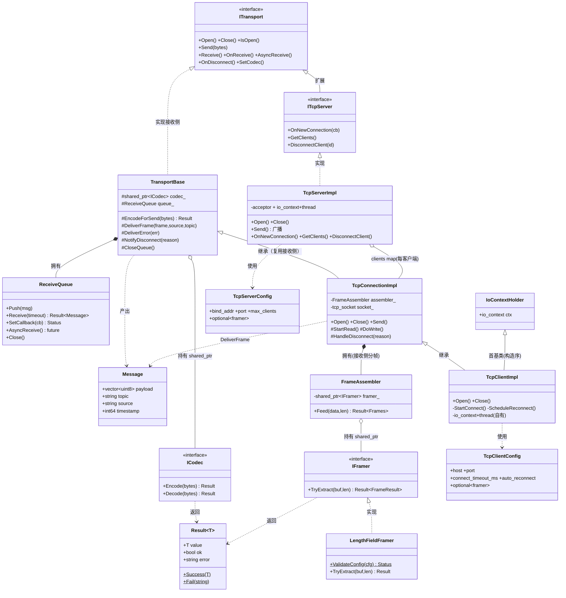
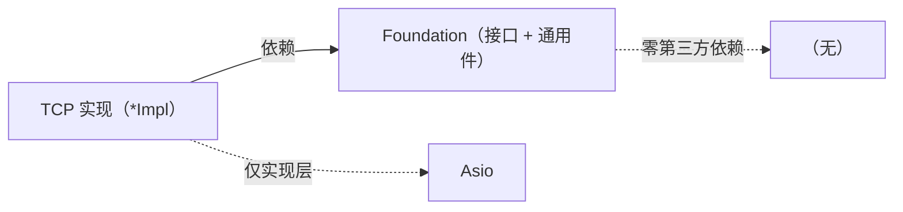
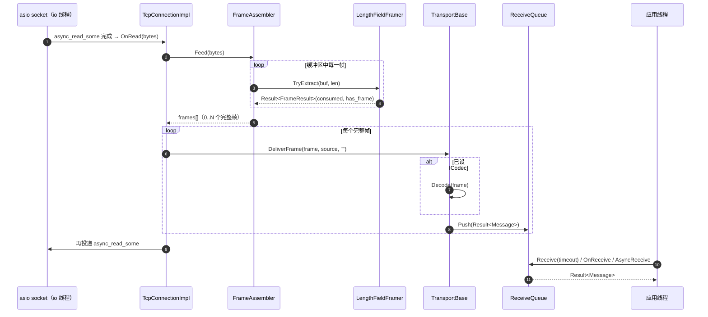

# Foundation + TCP 整体设计与依赖关系（as-built）

> 本文用 UML 说明**已实现部分**（Foundation 层 + TCP 传输）的真实类结构与运行期协作，是对主 spec §3.4 框架级视图的「落地详图」。命名遵循约定：`I*` = 接口，`*Impl` = 具体实现。

---

## 1. 结构依赖（UML 类图）

---

## 2. 依赖关系说明

### 2.1 Foundation 内部

- **`Result<T>` / `Status`**：所有可能失败的操作的返回值，框架不抛异常。被 `ICodec` / `IFramer` / `ITransport` / `ReceiveQueue` 普遍依赖（图中只画了 codec/framer 的 `..> Result` 以免线太密）。
- **`ICodec`（接口）**：发送/接收边界的编解码扩展点，由**用户实现**。`TransportBase` 以 `shared_ptr<ICodec>` 持有它（聚合 `o--`），发送前 `Encode`、接收后 `Decode`。
- **`IFramer`（接口）← `LengthFieldFramer`**：流式分帧扩展点。`LengthFieldFramer` 是内置实现（长度字段协议）。
- **`FrameAssembler`**：滚动缓冲 + 持有一个 `shared_ptr<IFramer>`（聚合），把字节流循环切成整帧；framer 为空则透传。**仅流式传输接收侧需要**。
- **`ReceiveQueue`**：FIFO + 同步/回调/future 三模式互斥交付。被 `TransportBase` **组合拥有**（`*--`，值成员）。
- **`ITransport`（接口）← `TransportBase`**：`TransportBase` 实现 `ITransport` 的「接收侧 + 编解码」通用部分（`Receive/OnReceive/AsyncReceive/SetCodec/OnDisconnect`），并给子类 protected 工具（`EncodeForSend/DeliverFrame/DeliverError/NotifyDisconnect/CloseQueue`）；把 `Open/Close/IsOpen/Send` 留给子类。产出 `Message` 投入 `queue_`。

### 2.2 TCP 对 Foundation 的依赖

- **`ITcpServer` ──▷ `ITransport`**：服务端扩展接口（加 `OnNewConnection/GetClients/DisconnectClient`）。
- **`TcpConnectionImpl` ──▷ `TransportBase`**：已连接 socket 的收发实现，**继承**复用接收侧；**拥有** `FrameAssembler`（`*--`）做接收侧分帧；收到帧调 `DeliverFrame` → `queue_`。client 与 server-accepted 连接共用它。
- **`TcpClientImpl` ──▷ `TcpConnectionImpl`（+ `IoContextHolder`）**：客户端 = 连接实现 + connect/超时/指数退避重连，自有 `io_context`+线程；首基类 `IoContextHolder` 保证 `io_context` 先于 `TcpConnectionImpl` 的 socket 构造。
- **`TcpServerImpl` ⋯▷ `ITcpServer`**：实现服务端接口；**聚合**多个 `TcpConnectionImpl`（`clients_` map，每客户端一个独立 `ITransport`）；**不经 `TransportBase`**（只 accept + 广播，自身不维护接收队列）。
- **`TcpClientConfig` / `TcpServerConfig`**：含 `std::optional<LengthFieldFramerConfig> framer`——决定连接是否启用分帧。

### 2.3 依赖方向（原则）

- **依赖倒置**：实现依赖接口，不反向。`TcpServerImpl` 面向 `ITcpServer`/`ITransport`，应用层只见接口。
- **Foundation 零第三方依赖、不依赖 TCP**；**TCP 依赖 Foundation**；**Asio 只出现在 TCP 实现层**（`*Impl.cpp`），头文件 `ITcpServer.hpp` 等不含 Asio。
- 单向无环：`应用层 → 接口 → 实现 → 底层库`。

---

## 3. 运行期协作（UML 时序图：TCP 接收一帧）

要点：分帧（`FrameAssembler`+`IFramer`）与交付（`TransportBase`+`ReceiveQueue`）解耦；I/O 线程只负责切帧+入队，应用线程按三模式之一出队。UDP/DDS 报文式传输将跳过 `FrameAssembler`/`IFramer`，直接 `DeliverFrame`（见主 spec §14.3）。

---

> 框架级（含规划中的 UDP/DDS/串口/工厂）视图见主 spec `2026-06-09-transport-middleware-design.md` §3.1 / §3.4。
