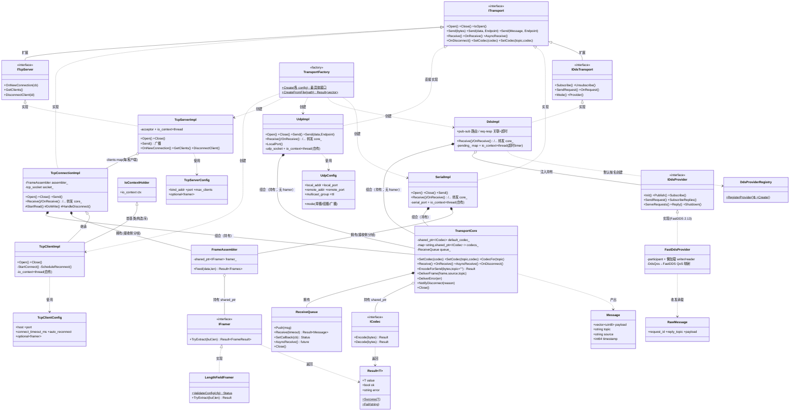
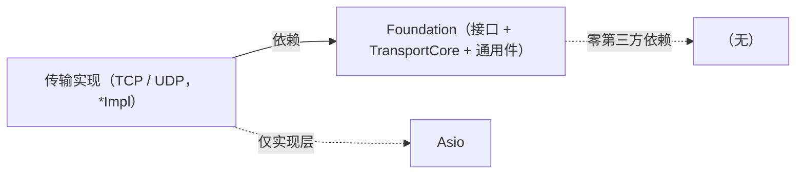
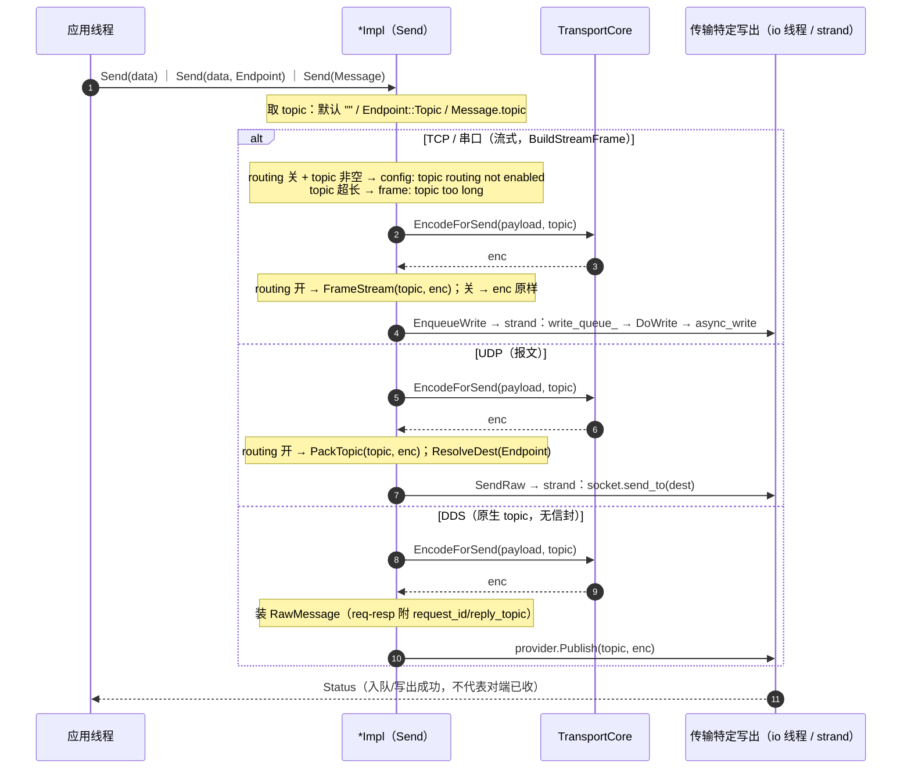
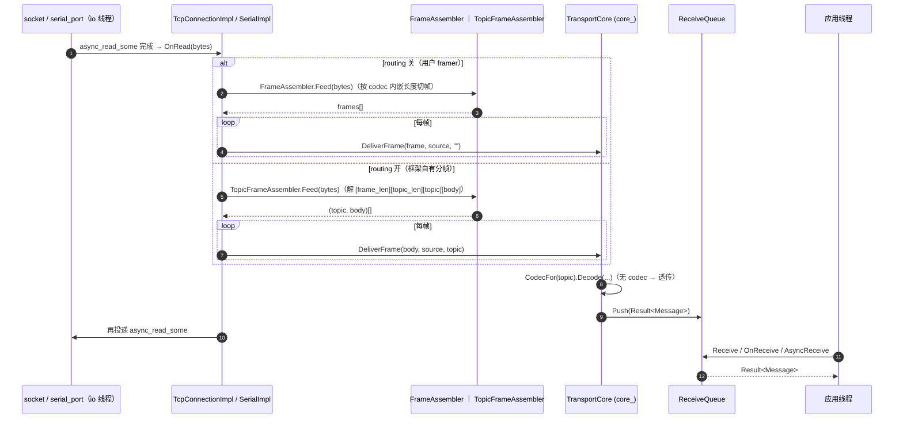
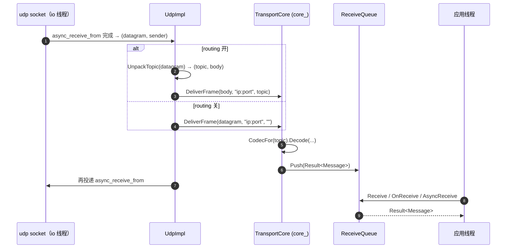
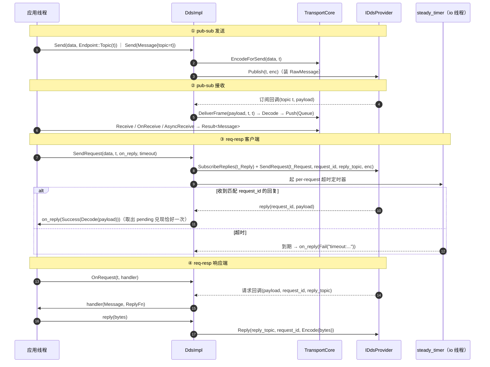

# Foundation + TCP / UDP / 串口 / DDS + Factory 整体设计与依赖关系（as-built 总结版）

> 本文用 UML 总结**全部已实现部分**（Foundation 层 + TCP / UDP / 串口 / DDS 传输 + TransportFactory，含 Endpoint 寻址、topic 路由、`TransportCore` 组合内核）的真实类结构与运行期协作，是对主 spec §3.4 框架级视图的「落地详图」。完整设计见 [`docs/设计说明书.md`](../../设计说明书.md)（SDD）。命名约定：`I*` = 接口，`*Impl` = 具体实现。
>
> 接收交付基座为**组合式组件 `TransportCore`**（不是 `ITransport`）：会收数据的传输（TCP 连接 / UDP / 串口 / DDS）**持有**它并把接收侧方法转发过去——从根上避免「与扩展接口同源 `ITransport`」的菱形。
>
> **§3 运行期协作覆盖全部四种传输的收发**：发送统一一图（§3.1），接收分流式（§3.2）/ 报文式（§3.3），DDS 收发 + req-resp 单列（§3.4）。

---

## 1. 结构依赖（UML 类图）

---

## 2. 依赖关系说明

### 2.1 Foundation 内部

- **`Result<T>` / `Status`**：所有可能失败的操作的返回值，框架不抛异常。被 `ICodec` / `IFramer` / `ITransport` / `ReceiveQueue` 普遍依赖（图中只画了 codec/framer 的 `..> Result` 以免线太密）。
- **`ICodec`（接口）**：发送/接收边界的编解码扩展点，由**用户实现**。`TransportCore` 维护一个默认 codec（`shared_ptr<ICodec>`，聚合 `o--`）+ 一张 `topic→codec` 注册表（`topic_codecs_`）；发送前按 topic 选 codec `Encode`、接收后按 topic 选 codec `Decode`，topic 为空或未注册则用默认 codec / 透传。
- **`IFramer`（接口）← `LengthFieldFramer`**：流式分帧扩展点。`LengthFieldFramer` 是内置实现（长度字段协议）。
- **`FrameAssembler`**：滚动缓冲 + 持有一个 `shared_ptr<IFramer>`（聚合），把字节流循环切成整帧；framer 为空则透传。**仅流式传输接收侧需要**（UDP 不用）。
- **`ReceiveQueue`**：FIFO + 同步/回调/future 三模式互斥交付。被 `TransportCore` **组合拥有**（`*--`，值成员）。
- **`ITransport`（接口）**：所有传输的统一抽象（生命周期/发送/三模式接收/编解码挂载）。
- **`TransportCore`（组件，非 `ITransport`）**：把「接收侧 + 编解码」机能收成一个**被持有**的组件——公开默认 + 按 topic 两种 `SetCodec`、`Receive/OnReceive/AsyncReceive/OnDisconnect`（持有者转发给 `ITransport`）+ 生产侧 `EncodeForSend(bytes, topic="")` / `DeliverFrame(frame, source, topic)`（按 topic 选 codec 解码）/ `DeliverError/NotifyDisconnect/Close`（io 线程调用）。内部组合 `ReceiveQueue`、持有默认 `ICodec` + `topic→codec` 注册表、产出 `Message`。**它不在 `ITransport` 继承树上**，所以任何「扩展接口 + 复用接收机能」的传输都不会产生菱形。
- **`TopicEnvelope`（header-only）**：topic 路由的 in-band 信封编解码——`PackTopic`/`UnpackTopic`（报文式 `[topic_len:2][topic][body]`）、`FrameStream`/`TopicFrameAssembler`（流式 `[frame_len:4][topic_len:2][topic][body]`）、`TopicFitsEnvelope`（topic ≤ 65535 字节守卫）。无状态纯函数 + 一个流式装配器，无第三方依赖；TCP/UDP/串口在 `enable_topic_routing` 开启时使用，DDS 不用（原生 topic）。
- **`StreamSend`（header-only）**：流式发送决策自由函数 `BuildStreamFrame(core, routing, payload, topic)`——把 TCP 与串口完全相同的「routing 分支 + `TopicFitsEnvelope` 守卫 + 按 topic `EncodeForSend` + `FrameStream`」收成一处；各传输只保留自身 open 检查 + 入队（绑定各自 socket/strand）。UDP 报文寻址不同，单独走 `PackTopic` + `ResolveDest`/`SendRaw`。

### 2.2 TCP 对 Foundation 的依赖

- **`ITcpServer` ──▷ `ITransport`**：服务端扩展接口（加 `OnNewConnection/GetClients/DisconnectClient`）。
- **`TcpConnectionImpl` ⋯▷ `ITransport`，且 `*--` `TransportCore`**：已连接 socket 的收发实现，**直接实现** `ITransport`，**组合持有** `TransportCore core_`（接收侧 5 方法一行转发给 core_）；另**拥有** `FrameAssembler` 做接收侧分帧；收到帧调 `core_.DeliverFrame`。client 与 server-accepted 连接共用它。
- **`TcpClientImpl` ──▷ `TcpConnectionImpl`（+ `IoContextHolder`）**：客户端 = 连接实现 + connect/超时/指数退避重连，自有 `io_context`+线程；首基类 `IoContextHolder` 保证 `io_context` 先于 `TcpConnectionImpl` 的 socket 构造；其 `core_`（基类 protected 成员）用于断连交付。
- **`TcpServerImpl` ⋯▷ `ITcpServer`**：实现服务端接口；**聚合**多个 `TcpConnectionImpl`（`clients_` map，每客户端一个独立 `ITransport`）；**不组合 `TransportCore`**（只 accept + 广播，自身不维护接收队列）。
- **`TcpClientConfig` / `TcpServerConfig`**：含 `std::optional<LengthFieldFramerConfig> framer`——决定连接是否启用分帧。

### 2.3 UDP 对 Foundation 的依赖

- **`UdpImpl` ──▷ `ITransport`**：直接实现（`Endpoint::Net` 运行期寻址）。
- **`UdpImpl` ⋯▷ `ITransport`，且 `*--` `TransportCore`**：单类处理单播/组播/广播，**直接实现** `ITransport`（无专属扩展接口）、**组合持有** `TransportCore core_`（接收侧转发）。自有 `io_context`+线程；`Open()` 按 `mode` 配置 socket。**无 `FrameAssembler`**——UDP 报文天然保边界，每个 datagram 经 `core_.DeliverFrame` 直接成一条 `Message`。
- **`UdpConfig`**：mode + 本地绑定 + 默认目的地 + 组播组/TTL。

> `UdpImpl` 正是「组合优于继承」的范例：它要实现 `ITransport`（含 `Endpoint::Net` 运行期寻址）又复用接收机能；若让基座 `TransportCore` 也继承 `ITransport`，就会两路到达 `ITransport` 形成菱形。把基座做成**被持有的组件**，`UdpImpl` 到 `ITransport` 只剩直接实现一条路，菱形不复存在。

### 2.3b 串口 / DDS 对 Foundation 的依赖

- **`SerialImpl` ⋯▷ `ITransport`，且 `*--` `TransportCore` + `FrameAssembler`**：流式（分帧同 TCP），底层 `asio::serial_port`，无连接/无重连。
- **`IDdsTransport` ──▷ `ITransport`**：DDS 扩展接口（`Subscribe`/req-resp/`Mode`/`Provider`；按 topic 发送走基类 `Send(data, Endpoint::Topic(...))`）。
- **`DdsImpl` ⋯▷ `IDdsTransport`，且 `*--` `TransportCore`、`o--` `IDdsProvider`（构造注入）**：provider 无关的全部业务逻辑——pub-sub 多 topic 路由、req-resp `request_id` 关联/超时（自有 io 线程跑 per-request `steady_timer`，`pending_` take-then-invoke 保证 `on_reply` 恰好一次）、codec 边界、模式约束。**长期回调一律捕获 `weak_ptr`**（避免 `DdsImpl→provider→callback→DdsImpl` 引用环）。
- **`IDdsProvider` ← `FastDdsProvider`**：底层 DDS 抽象；FastDDS 2.13 实现 = participant + `RawMessage` 类型注册（`FastDdsRawType` 手写 wire layout，不经 CDR）+ 懒加载 topic→writer/reader + `DdsQos` 映射。版本敏感面全封在这对文件。测试用 `FakeDdsProvider`（进程内 topic 总线）替换——DDS 业务逻辑零 FastDDS 依赖即可全测。
- **`DdsProviderRegistry`**：name→工厂；`DdsImpl` 未注入 provider 时按 `config.provider` 创建。

### 2.3c Factory

- **`TransportFactory`**：统一创建入口，依赖全部 `*Impl` 与各 config（创建关系 `..>`）。JSON 解析（nlohmann/json）PRIVATE 封装在 `TransportFactory.cpp`，公共头零第三方类型；`CreateFromFile` 严格校验（未知字段报错），错误带 `transports[i].field` 定位，任一条目失败整体失败。`Create(DdsConfig)` 显式调用 `RegisterFastDdsProvider()`，根治静态库下匿名注册器被链接器裁剪的问题。

### 2.4 依赖方向（原则）

- **依赖倒置**：实现依赖接口，不反向。应用层只见 `ITransport`/`I*Transport`。
- **Foundation 零第三方依赖、不依赖任何传输**；**传输实现依赖 Foundation**；**Asio 只出现在实现层**（`*Impl.cpp`），接口头不含 Asio。
- 单向无环：`应用层 → 接口 → 实现 → 底层库`。

---

## 3. 运行期协作（UML 时序图，覆盖全部传输的收发）

四种传输共享同一**编码（`TransportCore.EncodeForSend` 按 topic 选 codec）+ 交付（`TransportCore.DeliverFrame` → `ReceiveQueue`）**内核；差异只在「写出 / 取入」的传输特定层。下面四图：3.1 发送（全部）、3.2 流式接收（TCP/串口）、3.3 报文接收（UDP）、3.4 DDS 收发 + req-resp。

### 3.1 发送路径（所有传输：统一编码 + 各自写出）

### 3.2 接收路径 — 流式（TCP / 串口）

### 3.3 接收路径 — 报文式（UDP）

报文天然保边界，**不经分帧**；UDP 无 `FrameAssembler`。

### 3.4 DDS 收发（pub-sub + req-resp；原生 topic，无 in-band 信封）

**统一要点：**
- **编码/解码内核统一**：四种传输都经 `TransportCore.EncodeForSend(payload, topic)` 编码、`DeliverFrame(..., topic)` 按 `CodecFor(topic)` 解码并入 `ReceiveQueue`；I/O 线程只切帧/取报文 + 入队，应用线程按三模式之一出队（互斥）。
- **分帧只在流式**：TCP/串口接收侧用 `FrameAssembler`（关路由）或 `TopicFrameAssembler`（开路由）；UDP/DDS 报文保边界、无分帧。
- **写出各异**：TCP/串口经 strand 的 `write_queue_`/`DoWrite`，UDP `socket.send_to`，DDS `provider.Publish`。`Status` 一律表「入队/写出成功」，不代表对端已收。
- **topic 路由 opt-in**：TCP/UDP/串口由 `enable_topic_routing` 决定是否加 in-band 信封（关时与旧格式逐字节一致）；DDS 用原生 topic，无开关无信封。

---

> 完整需求/设计见 [`docs/需求规格说明书.md`](../../需求规格说明书.md)（SRS）、[`docs/设计说明书.md`](../../设计说明书.md)（SDD）；框架级总设计见主 spec `2026-06-09-transport-middleware-design.md`。
