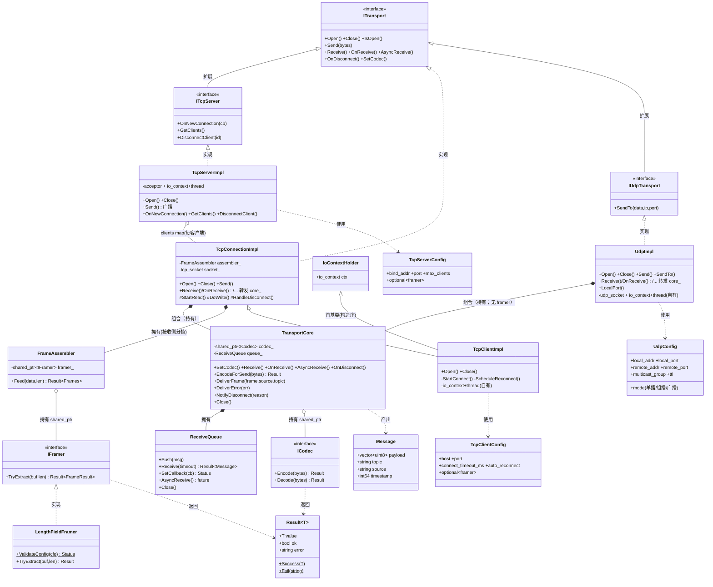
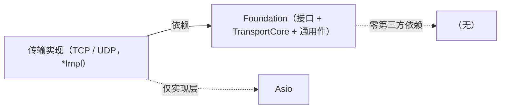
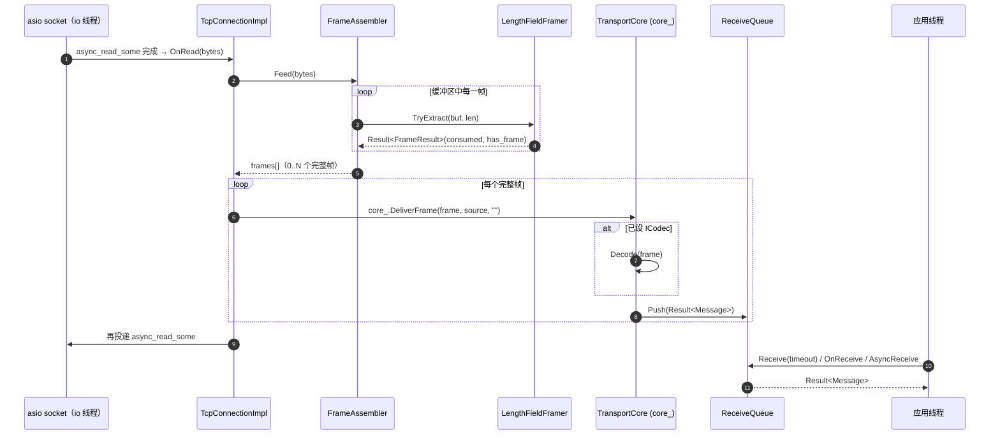
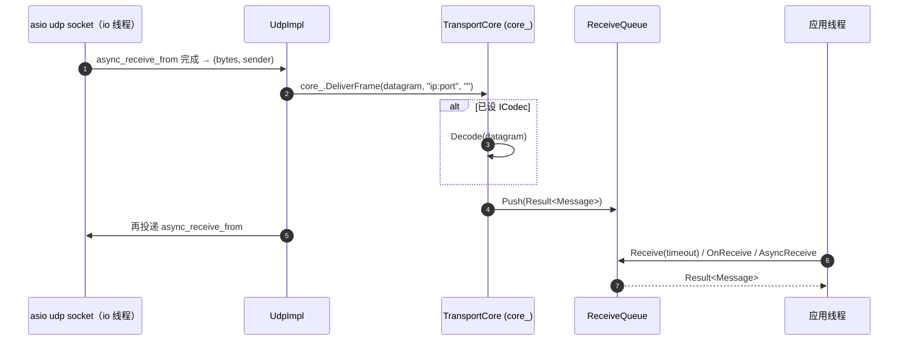

# Foundation + TCP + UDP 整体设计与依赖关系（as-built）

> 本文用 UML 说明**已实现部分**（Foundation 层 + TCP + UDP 传输）的真实类结构与运行期协作，是对主 spec §3.4 框架级视图的「落地详图」。命名约定：`I*` = 接口，`*Impl` = 具体实现。
>
> 接收交付基座为**组合式组件 `TransportCore`**（不是 `ITransport`）：会收数据的传输（TCP 连接 / UDP /（未来）串口、DDS）**持有**它并把接收侧方法转发过去——从根上避免「与扩展接口同源 `ITransport`」的菱形。

---

## 1. 结构依赖（UML 类图）

---

## 2. 依赖关系说明

### 2.1 Foundation 内部

- **`Result<T>` / `Status`**：所有可能失败的操作的返回值，框架不抛异常。被 `ICodec` / `IFramer` / `ITransport` / `ReceiveQueue` 普遍依赖（图中只画了 codec/framer 的 `..> Result` 以免线太密）。
- **`ICodec`（接口）**：发送/接收边界的编解码扩展点，由**用户实现**。`TransportCore` 以 `shared_ptr<ICodec>` 持有它（聚合 `o--`），发送前 `Encode`、接收后 `Decode`。
- **`IFramer`（接口）← `LengthFieldFramer`**：流式分帧扩展点。`LengthFieldFramer` 是内置实现（长度字段协议）。
- **`FrameAssembler`**：滚动缓冲 + 持有一个 `shared_ptr<IFramer>`（聚合），把字节流循环切成整帧；framer 为空则透传。**仅流式传输接收侧需要**（UDP 不用）。
- **`ReceiveQueue`**：FIFO + 同步/回调/future 三模式互斥交付。被 `TransportCore` **组合拥有**（`*--`，值成员）。
- **`ITransport`（接口）**：所有传输的统一抽象（生命周期/发送/三模式接收/编解码挂载）。
- **`TransportCore`（组件，非 `ITransport`）**：把「接收侧 + 编解码」机能收成一个**被持有**的组件——公开 `SetCodec/Receive/OnReceive/AsyncReceive/OnDisconnect`（持有者转发给 `ITransport`）+ 生产侧 `EncodeForSend/DeliverFrame/DeliverError/NotifyDisconnect/Close`（io 线程调用）。内部组合 `ReceiveQueue`、持有 `ICodec`、产出 `Message`。**它不在 `ITransport` 继承树上**，所以任何「扩展接口 + 复用接收机能」的传输都不会产生菱形。

### 2.2 TCP 对 Foundation 的依赖

- **`ITcpServer` ──▷ `ITransport`**：服务端扩展接口（加 `OnNewConnection/GetClients/DisconnectClient`）。
- **`TcpConnectionImpl` ⋯▷ `ITransport`，且 `*--` `TransportCore`**：已连接 socket 的收发实现，**直接实现** `ITransport`，**组合持有** `TransportCore core_`（接收侧 5 方法一行转发给 core_）；另**拥有** `FrameAssembler` 做接收侧分帧；收到帧调 `core_.DeliverFrame`。client 与 server-accepted 连接共用它。
- **`TcpClientImpl` ──▷ `TcpConnectionImpl`（+ `IoContextHolder`）**：客户端 = 连接实现 + connect/超时/指数退避重连，自有 `io_context`+线程；首基类 `IoContextHolder` 保证 `io_context` 先于 `TcpConnectionImpl` 的 socket 构造；其 `core_`（基类 protected 成员）用于断连交付。
- **`TcpServerImpl` ⋯▷ `ITcpServer`**：实现服务端接口；**聚合**多个 `TcpConnectionImpl`（`clients_` map，每客户端一个独立 `ITransport`）；**不组合 `TransportCore`**（只 accept + 广播，自身不维护接收队列）。
- **`TcpClientConfig` / `TcpServerConfig`**：含 `std::optional<LengthFieldFramerConfig> framer`——决定连接是否启用分帧。

### 2.3 UDP 对 Foundation 的依赖

- **`IUdpTransport` ──▷ `ITransport`**：UDP 扩展接口（加 `SendTo`，运行期指定目的地）。
- **`UdpImpl` ⋯▷ `IUdpTransport`，且 `*--` `TransportCore`**：单类处理单播/组播/广播，**直接实现** `IUdpTransport`、**组合持有** `TransportCore core_`（接收侧转发）。自有 `io_context`+线程；`Open()` 按 `mode` 配置 socket。**无 `FrameAssembler`**——UDP 报文天然保边界，每个 datagram 经 `core_.DeliverFrame` 直接成一条 `Message`。
- **`UdpConfig`**：mode + 本地绑定 + 默认目的地 + 组播组/TTL。

> `UdpImpl` 正是「组合优于继承」的范例：它要同时是 `IUdpTransport`（=`ITransport`+`SendTo`）又复用接收机能；若让基座 `TransportCore` 也继承 `ITransport`，就会两路到达 `ITransport` 形成菱形。把基座做成**被持有的组件**，`UdpImpl` 到 `ITransport` 只剩 `IUdpTransport` 一条路，菱形不复存在。

### 2.4 依赖方向（原则）

- **依赖倒置**：实现依赖接口，不反向。应用层只见 `ITransport`/`I*Transport`。
- **Foundation 零第三方依赖、不依赖任何传输**；**传输实现依赖 Foundation**；**Asio 只出现在实现层**（`*Impl.cpp`），接口头不含 Asio。
- 单向无环：`应用层 → 接口 → 实现 → 底层库`。

---

## 3. 运行期协作（UML 时序图）

### 3.1 TCP 接收一帧（流式：分帧 + 交付）

### 3.2 UDP 接收一个报文（报文式：无分帧）

要点：分帧（`FrameAssembler`+`IFramer`）只在流式传输出现；交付（`TransportCore`+`ReceiveQueue`）对所有传输统一。I/O 线程只负责切帧/取报文 + 入队，应用线程按三模式之一出队。两图唯一区别就是 UDP 跳过了分帧那段。

---

> 框架级（含规划中的 DDS / 串口 / 工厂）视图见主 spec `2026-06-09-transport-middleware-design.md` §3.1 / §3.4。
