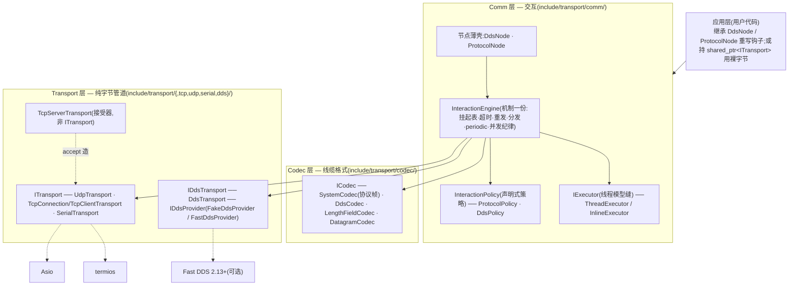
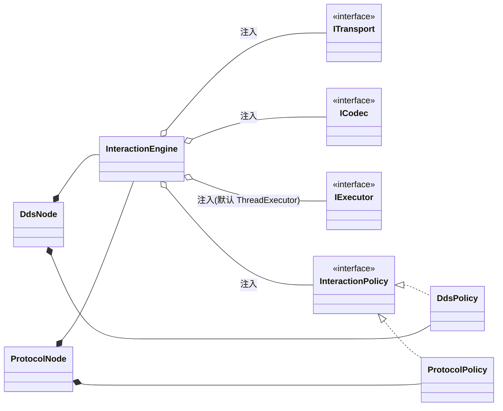
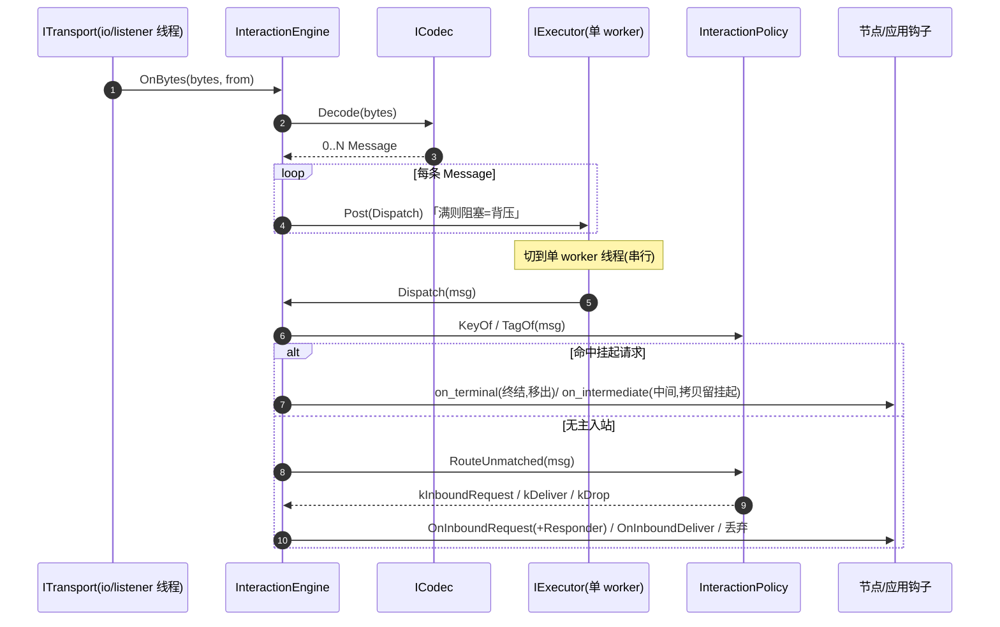
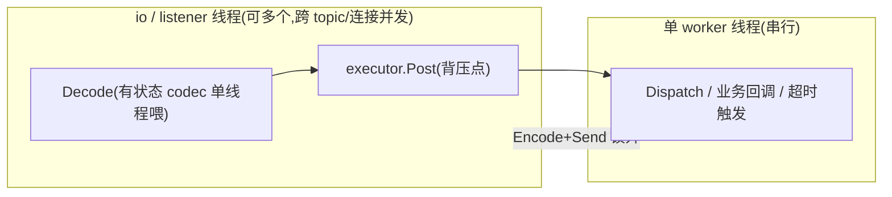

# 通信中间件 — 架构与运行期协作（UML）

**版本：** 0.2.0 开发线（as-built，2026-06-24）
**配套：**《需求规格说明书》`docs/需求规格说明书.md`、《设计说明书》`docs/设计说明书.md`

本文件以 UML 图为主,刻画**整体设计**、**依赖关系**与**运行期协作时序**,覆盖 0.2.0 全部首发构件。取代 0.1.0 期的 `docs/superpowers/specs/2026-06-10-foundation-tcp-architecture.md`(那份描述已废弃的 `TransportCore`/三模式接收架构)。

---

## 1. 整体设计：三层 + 执行器缝



**一句话:** Transport 只搬裸字节(回调式 `OnBytes`),ICodec 在边界做 `Message`↔线缆字节,`InteractionEngine` 在其上跑交互机制、把协议差异问 `InteractionPolicy`,节点是薄壳;线程模型经 `IExecutor` 可换。

---

## 2. 首发构件清单（0.2.0）

| 层 | 构件 | 职责 |
|---|---|---|
| Transport | `ITransport` | 纯字节管道接口:`Open/Close/IsOpen`、`Send(bytes[,Endpoint])`、`OnBytes/OnConnect/OnDisconnect` |
| | `UdpTransport` | 单播/组播/广播(单类);运行期 `Endpoint::Net` 寻址 |
| | `TcpConnection` | 已连接 socket 收发(client 与 accepted 共用) |
| | `TcpClientTransport` | connect + 连接超时 + 指数退避自动重连 |
| | `TcpServerTransport` | 接受器(非 `ITransport`):每 accept 造 `TcpConnection`,经 `OnAccept` 交付 |
| | `SerialTransport` | 串口(termios) |
| | `IDdsTransport`/`DdsTransport` | DDS 纯字节 pub-sub(加 `Subscribe`/`Unsubscribe`) |
| | `IDdsProvider`/`DdsProviderRegistry` | provider 抽象;`FakeDdsProvider`(进程内总线)、`FastDdsProvider`(可选) |
| | `Endpoint` | 中立寻址值类型(`Default`/`Net`/`Topic`) |
| Codec | `ICodec` | `Encode(Message)→bytes` / `Decode(bytes)→0..N Message` |
| | `SystemCodec` | 外部协议帧(`AA BB CC DD` 同步头 + CRC 注入 + resync,有状态流式) |
| | `DdsCodec` | 无状态、带交互元数据(kind/corr/reply_to)的 DDS 线缆 |
| | `LengthFieldCodec` / `DatagramCodec` | 长度字段分帧 / 报文直通 |
| Comm | `IExecutor`/`ThreadExecutor` | 执行器缝 + 内置(worker + 有界队列背压 + 最小堆定时器) |
| | `InteractionEngine` | 交互机制一份(3 原语 + 挂起/超时/重发/分发/periodic/并发纪律) |
| | `InteractionPolicy` | 声明式策略接口(7 法) |
| | `ProtocolPolicy` / `DdsPolicy` | 外部协议 / DDS 的具体策略 |
| | `ProtocolNode` / `DdsNode` | 薄壳节点(引擎 + 对应 policy) |
| 基础 | `Result<T>`/`Status`、`Message` | 不抛异常错误模型;消息数据模型(通用 + 协议字段) |

---

## 3. 类结构与依赖

> 完整类图见《设计说明书》§2.3。核心依赖关系:



- **引擎只依赖接口**(`ITransport`/`ICodec`/`IExecutor`/`InteractionPolicy`),零具体协议判别符或节点名(护栏)。
- **节点 `*--` 持有引擎**(组合),并注入对应 policy;节点自身无挂起/定时/并发逻辑。
- Transport/Codec 层互不依赖;`InteractionPolicy` 是协议差异的唯一落点 —— **接新协议 = 写新 policy**。

---

## 4. 运行期协作（时序图）

### 4.1 通用收发骨架（任何节点）


> `Decode`/`Post` 在 io 线程;`Dispatch` 与所有业务回调在单 worker 串行。`Encode`+`Send` 一律在锁外。

### 4.2 DDS 多路请求-应答（reply_to 精确回送）

```mermaid
sequenceDiagram
  autonumber
  participant A as DdsNode A(inbox=A_in)
  participant Ea as Engine A
  participant Bus as DDS 总线(provider)
  participant Eb as Engine B
  participant B as DdsNode B(订阅 svc)
  A->>Ea: Request(msg, cb, Topic(svc))
  Ea->>Ea: DdsPolicy.NewCorrelation → corr, reply_to=A_in;登记挂起+排超时
  Ea->>Bus: publish "svc" (kRequest, corr, reply_to=A_in)
  Bus->>Eb: 样本到达
  Eb->>B: OnRequest(req, Responder)
  B->>Eb: Responder.Reply(payload)
  Eb->>Eb: SendReply: EchoCorrelation(corr) + ReplyTo=Topic(A_in)
  Eb->>Bus: publish "A_in" (kReply, corr)
  Bus->>Ea: 样本到达(订阅 A_in)
  Ea->>Ea: KeyOf=corr 命中挂起;取消超时
  Ea-->>A: cb(Success(reply))
```
> `reply_to` 随 `DdsCodec` 上线缆 → 跨多请求 topic、多对等体不串台,无需节点间共享状态。

### 4.3 外部协议 `needfeedback`（重发 + 自动 ack）

```mermaid
sequenceDiagram
  autonumber
  participant App as 应用
  participant P as ProtocolNode(发起)
  participant Ep as Engine(发起)
  participant Eq as Engine(对端)
  participant Q as ProtocolNode(接收)
  App->>P: RequestNeedFeedback(cmd, payload, on_resp, on_result)
  P->>Ep: RequestAwait{req=COMMAND, intermediate=RESPONSE,<br/>terminal=RESULT, auto_ack=RESPONSE, max=3}
  Ep->>Ep: NewCorrelation: session++, message=cmd;<br/>挂起(advanced=false)+排超时
  Ep->>Eq: COMMAND(session, message)
  Note over Ep: 超时且 !advanced && retries<3 → 重发同帧
  Eq->>Q: OnCommand(req, Responder)
  Q->>Eq: Responder.Response(p1)
  Eq->>Ep: RESPONSE(echo session,message)
  Ep->>Ep: tag=intermediate → advanced=true;on_resp(p1);留挂起(停重发)
  Q->>Eq: Responder.Result(p2)
  Eq->>Ep: RESULT(echo session,message)
  Ep->>Ep: tag=terminal → 取消超时
  Ep->>Eq: RESPONSE(自动 ack, echo)
  Ep-->>App: on_result(Success(p2));erase 挂起
```
> 其它 4 模式是本图子集:`noresponse`=只发 COMMAND;`needresponse`/`withfeedback`=等单个终结帧(RESPONSE / RESULT);`repeating`=见 4.4。**「首帧停重发」一条规则**统辖全部。

### 4.4 `repeating` / 周期心跳

```mermaid
sequenceDiagram
  autonumber
  participant App as 应用
  participant P as ProtocolNode
  participant Ep as Engine
  participant T as IExecutor 定时器
  App->>P: StartRepeating(cmd, payload, interval)
  P->>Ep: StartPeriodic(Message{message_id=cmd, payload}, STATE, interval)
  Ep->>Ep: 立即 Fire 一帧 STATE
  Ep->>T: ScheduleAt(now+interval, FirePeriodic)
  loop 每 interval
    T->>Ep: FirePeriodic(handle)
    Ep->>Ep: Fire STATE;重排下一拍
  end
  App->>P: StopRepeating(handle)
  P->>Ep: StopPeriodic → Cancel 定时器
```
> 心跳同构:`heartbeat_interval_ms>0` 时 `Open()` 即 `StartPeriodic(HEARTBEAT, hb)`(首拍即发)。

### 4.5 TCP 服务端:每连接独立节点

```mermaid
sequenceDiagram
  autonumber
  participant Cli as 远端客户端
  participant Srv as TcpServerTransport
  participant Conn as TcpConnection(新建,ITransport)
  participant App as 应用 OnAccept
  Cli->>Srv: TCP connect
  Srv->>Conn: accept 造一个 TcpConnection
  Srv->>App: OnAccept(shared_ptr<ITransport> conn)
  App->>App: 在 conn 上构造节点(InteractionEngine+Policy)并 Open();持 shared_ptr 保活
  Note over Conn: 此后该连接独立收发,与 server 解耦(server 不广播/不收发)
```

---

## 5. 并发与生命周期（贯穿全节点,集中在引擎一份）



- posted 任务/transport 回调捕获 `weak_ptr` 防悬空;挂起表/periodic 表/计数器由 `mu_` 保护;`Encode`+`Send`(含 auto_ack/periodic/应答/重发)**一律锁外**(避免与同步执行器回环死锁)。
- 中间帧回调**拷贝调用**、终结帧回调**移出调用** → 防 `Close`/断连双触发;reply 与超时同在单 worker → **恰好一次**。
- `open_` 在 `transport->Open()` 前置位 + 失败回滚;`Close` 幂等:先终结挂起(`conn:`)+ 取消全部定时器(`mu_` 下)→ `executor->Stop()`(drain+join)→ `transport->Close()`;`ThreadExecutor::Stop` 自连接守卫(worker 内调 `Stop` 则 `detach` 不 `join`)。

---

## 6. 关键设计依据

- **机制集中、策略声明式**:`InteractionEngine` 一份机制 + `InteractionPolicy` 声明式协议差异;最难写对、曾各出 Critical 的并发生命周期只写一处复用。
- **「首帧停重发」一条规则**覆盖各交互模式,免 god-config flag。
- **缝切对的护栏**:引擎/策略代码零 `frm_type`/`kind`/节点名,只认抽象 `FrameTag`/`Key`。
- **统一寻址 `Endpoint`** + **回调式 Transport** + **`IExecutor` 可换线程模型**,使三层各自可独立替换/测试(`FakeTransport`+`InlineExecutor` 端到端、`FakeDdsProvider` 零 FastDDS 依赖)。
