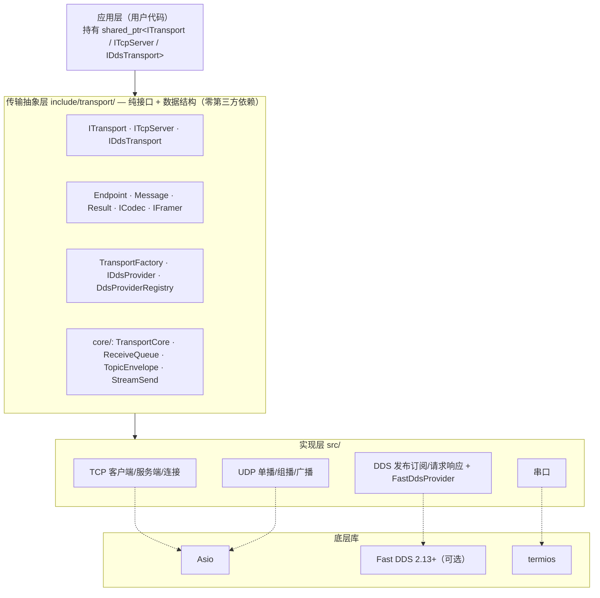
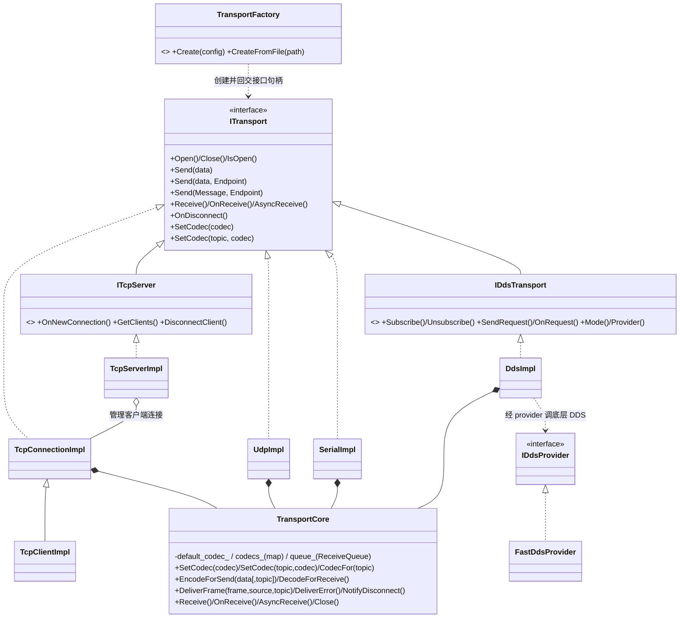
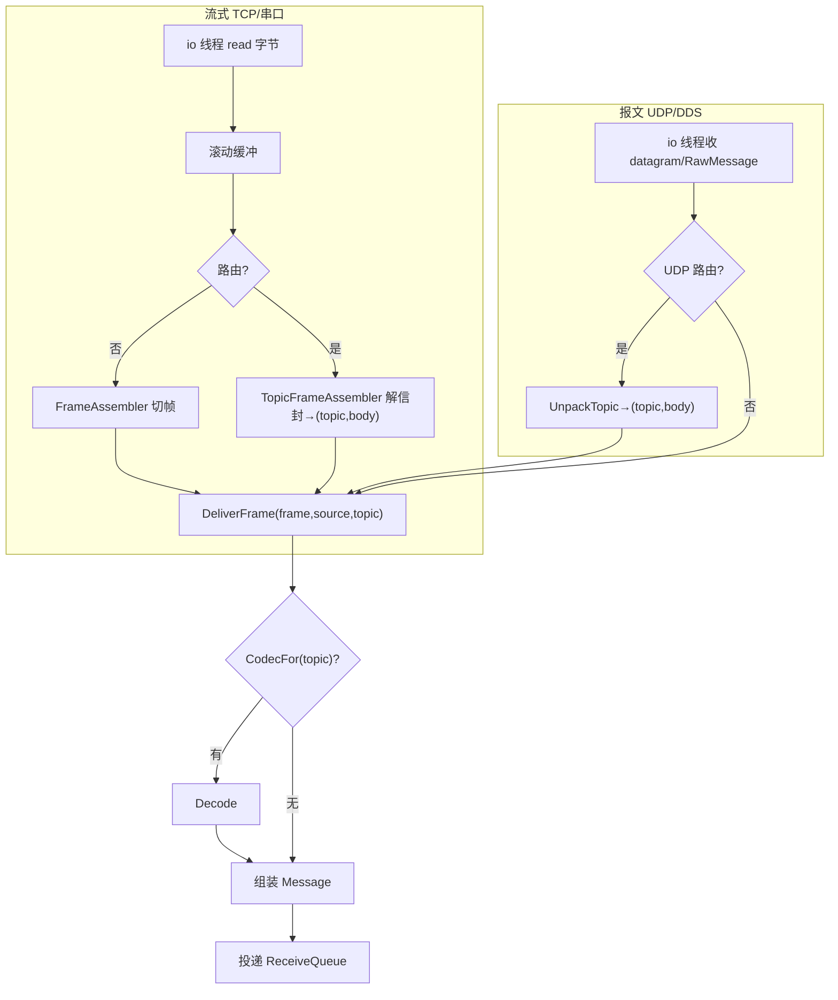

# 通信中间件框架 — 设计说明书（SDD）

**版本：** 1.0（as-built，基于当前实现整理）
**日期：** 2026-06-14
**配套文档：** 《需求规格说明书》`docs/需求规格说明书.md`

本文件描述框架的**设计与实现**（如何做），由分散的逐特性设计文档与当前代码整理为单一权威设计参考。需求见配套《需求规格说明书》。

---

## 1. 范围
覆盖架构分层、目录结构、核心数据类型、传输抽象与扩展接口、接收/编解码内核 `TransportCore`、四种传输实现、wire 格式、topic 路由、收发数据流与时序、并发模型、错误处理、工厂与 JSON、构建依赖、测试架构。所有类名/文件名/接口均为 as-built（当前代码真实状态）。

---

## 2. 架构总览

### 2.1 分层


### 2.2 设计原则
- 抽象层只含纯虚接口与数据结构，零第三方依赖；第三方库封在 `*Impl` / provider 内。
- 每类传输 = **接口 `I*`（契约）** + **实现 `*Impl`（落地）**；应用层与工厂只依赖接口。
- `ICodec` 由框架在收发边界自动调用。
- 分帧仅作用于流式传输（TCP/串口）接收侧；UDP/DDS 报文保边界。
- **组合优于继承**：接收交付 + 编解码内核 `TransportCore` 被各「会收数据」的传输**组合持有**（非继承），从根上消除「接收基座与扩展接口同源 `ITransport`」的菱形。
- `TransportFactory` 是创建所有实例的唯一入口。

### 2.3 类结构（UML）

> 注：`TcpServerImpl` **不**组合 `TransportCore`（只 accept + 广播，不维护接收队列），持有一个供新连接复用的默认 codec。

---

## 3. 目录与文件结构（as-built）
```
include/transport/
├── ITransport.hpp  Endpoint.hpp  ICodec.hpp  IFramer.hpp  Message.hpp  Result.hpp
├── TransportFactory.hpp  version.hpp
├── core/   TransportCore.hpp  ReceiveQueue.hpp  TopicEnvelope.hpp  StreamSend.hpp
├── framing/   LengthFieldFramer.hpp  FrameAssembler.hpp
├── tcp/   ITcpServer.hpp  TcpClientConfig.hpp  TcpServerConfig.hpp
│          TcpConnectionImpl.hpp  TcpClientImpl.hpp  TcpServerImpl.hpp
├── udp/   UdpConfig.hpp  UdpImpl.hpp
├── serial/   SerialConfig.hpp  SerialImpl.hpp
└── dds/   DdsConfig.hpp  IDdsTransport.hpp  IDdsProvider.hpp
           DdsProviderRegistry.hpp  RawMessage.hpp  DdsImpl.hpp
src/
├── core/ReceiveQueue.cpp  version.cpp
├── framing/LengthFieldFramer.cpp
├── tcp/TcpConnectionImpl.cpp  TcpClientImpl.cpp  TcpServerImpl.cpp
├── udp/UdpImpl.cpp   serial/SerialImpl.cpp
├── dds/DdsImpl.cpp  DdsProviderRegistry.cpp
│      FastDdsProvider.{hpp,cpp}  FastDdsRawType.{hpp,cpp}   # FastDDS 耦合，置于 src/
└── TransportFactory.cpp
```
> `*Impl` 头文件实际放在 `include/transport/<area>/`（供工厂/测试构造）；FastDDS 强耦合的 provider/type 文件置于 `src/dds/`，仅在探测到 Fast DDS 时编译。

---

## 4. 核心数据类型

### 4.1 `Result<T>` / `Status`
不抛异常的统一返回：`{ T value; bool ok; std::string error; }`，`Success(v)` / `Fail("prefix: msg")`，`explicit operator bool`。`Status = Result<std::monostate>`。错误前缀：`timeout:` / `conn:` / `codec:` / `frame:` / `io:` / `config:`。

### 4.2 `Message`
`{ vector<uint8_t> payload; string topic; string source; int64_t timestamp; }`。`payload` 为 `Decode` 后的应用原始字节；`topic` 为 DDS topic 或路由通道名（否则空）；`source` 为 "ip:port" / topic / 设备路径；`timestamp` 由框架填充（微秒）。

### 4.3 `Endpoint`
中立寻址值类型：`Kind{kDefault,kNet,kTopic}` + `host/port/topic`；工厂 `Default()/Net(ip,port)/Topic(name)`。镜像 `Message` 的两种寻址，使「收到后回发」对称。

### 4.4 `ICodec`
`Encode/Decode : vector<uint8_t> → Result<vector<uint8_t>>`。框架在发送前/接收后自动调用；未设置时透传。

### 4.5 `IFramer` / `LengthFieldFramer`
`IFramer::TryExtract(buf,len) → Result<FrameResult{consumed,has_frame}>`。`LengthFieldFramer` 适配「固定 header + 长度字段」协议（可配 header_size、length_offset、length_size∈{2,4,8}、big_endian、length_includes_header、max_frame_size）。`FrameAssembler`（header-only）持 `IFramer`，把字节追加进滚动缓冲循环切帧；framer 为空 → 透传。

---

## 5. 传输抽象与扩展接口

### 5.1 `ITransport`
生命周期 + 三个 `Send` 重载 + 三模式接收 + 断连 + 两个 `SetCodec`。三个 `Send`：
- `Send(data)`（纯虚）→ 默认目的地。
- `Send(data, Endpoint)`（非纯虚默认：`kDefault`→`Send(data)`，否则 `io: addressed send not supported`）→ UDP 覆写 `kNet`、DDS 覆写 `kTopic`。
- `Send(Message, Endpoint=Default())`（非纯虚默认：topic 空→`Send(payload,to)`，否则 `io: topic routing not supported`）→ 四传输覆写。

`SetCodec(codec)`（纯虚，默认 codec）与 `SetCodec(topic,codec)`（非纯虚 no-op，路由能力者覆写转发给 `TransportCore`）。各 `*Impl` 用 `using ITransport::Send;` / `using ITransport::SetCodec;` 防 C++ 名字隐藏。

### 5.2 `ITcpServer`
`ITransport` + `OnNewConnection(cb)` / `GetClients()` / `DisconnectClient(id)`。继承的 `Send(data)`=广播；`Receive` 不适用（在每客户端 transport 上收发）。

### 5.3 `IDdsTransport`
`ITransport` + `Subscribe/Unsubscribe` + `SendRequest/OnRequest` + `Mode/Provider`。

---

## 6. 接收/编解码内核 `TransportCore`
组合式组件（非 `ITransport`），被 `TcpConnectionImpl`/`UdpImpl`/`SerialImpl`/`DdsImpl` **持有**，转发接收侧方法。内部：
- **codec 注册表：** `default_codec_` + `map<topic, ICodec>`；`CodecFor(topic)` = 命中 topic 专用，否则默认，否则 nullptr（透传）。
- **发送侧：** `EncodeForSend(data[,topic])` 按 topic 选 codec 编码。
- **接收侧：** `DeliverFrame(frame, source, topic)` 按 topic 选 codec 解码、组装 `Message`（填 source/timestamp）、投递 `ReceiveQueue`；`DeliverError` 投递失败；`DecodeForReceive` 供 DDS req-resp 等不经队列的路径用。
- **`ReceiveQueue`：** FIFO 队列，统一支撑 `Receive`/`OnReceive`/`AsyncReceive` 三种交付（见 §10.3）。

---

## 7. wire 格式

### 7.1 流式分帧（非路由，TCP/串口）
发送侧不加前缀，codec 输出原样写出（帧长在用户 header 内）；接收侧 `LengthFieldFramer` 按 codec 内嵌长度切帧。

### 7.2 topic 信封（路由开启）
- **报文式（UDP）：** `[topic_len:2 BE][topic][body]`（`body`=codec 编码后的应用帧），由 `PackTopic`/`UnpackTopic` 编解码，报文边界天然分帧。
- **流式（TCP/串口）：** `[frame_len:4 BE][topic_len:2 BE][topic][body]`，由 `FrameStream` 打包、`TopicFrameAssembler` 流式切帧。**路由开启时框架自有分帧，codec 只编解码 body，用户 framer 配置被忽略。**
- `topic_len` 为 `uint16`（上限 65535），`TopicFitsEnvelope` 守卫超限。封装均在 header-only `TopicEnvelope`。

### 7.3 DDS 承载 `RawMessage`
内置承载类 `{ request_id, reply_topic, payload }` + 自定义 `FastDdsRawType : TopicDataType`，手写紧凑序列化（绕过 IDL/CDR）：
```
[uint16 LE id_len][request_id][uint16 LE reply_len][reply_topic][payload ... 到末尾]
```
pub-sub 时 `request_id`/`reply_topic` 空（各占 2 字节 0）。所有 topic 共用此 type，topic 路由由 DDS Topic 名负责，`request_id`/`reply_topic` 是框架级关联信息（对用户不可见）。互通要求对端注册同名 type 并遵循此布局。

---

## 8. topic 路由设计
- **概念正交：** `topic` = 编解码通道（选 codec、in-band 标识），`Endpoint` = 地址。DDS 两者重合（topic 即地址即 codec 键）。
- **opt-in：** TCP/UDP/串口 config 上 `enable_topic_routing`（默认关）；关闭时逐字节兼容旧格式，`Send(Message{topic 非空})` → `config: topic routing not enabled`。DDS 无开关、无信封、始终启用注册表。
- **流式发送决策共享：** TCP 与串口的发送决策（routing 分支 + `TopicFitsEnvelope` 守卫 + 按 topic 编码 + `FrameStream`）抽到 header-only 自由函数 `BuildStreamFrame(core, routing, payload, topic) → Result<vector<uint8_t>>`（`core/StreamSend.hpp`）；各传输只保留自身的 open 检查与入队（绑定各自 socket/strand/错误串）。UDP 因报文寻址不同单独处理（`PackTopic` + `ResolveDest`/`SendRaw`）。
- **decode 路由：** 接收侧把解出的 topic 传给 `DeliverFrame`，由 `CodecFor(topic)` 选 codec；DDS 订阅回调以订阅 topic 调用，天然路由。

---

## 9. 各传输实现设计

### 9.1 TCP
- `TcpConnectionImpl`（实现 `ITransport`，组合 `TransportCore`）：包装已连接 socket，`StartRead` 循环经 `FrameAssembler`（或路由时 `TopicFrameAssembler`）切帧 → `DeliverFrame`；写经 strand 串行化的 `write_queue_`/`DoWrite`，`EnqueueWrite` 入队。客户端与服务端被接受连接共用。
- `TcpClientImpl`（继承 `TcpConnectionImpl`）：自持 `io_context`+io 线程，`connect` + 连接超时 + 指数退避自动重连。
- `TcpServerImpl`（实现 `ITcpServer`）：`acceptor` 监听，每个 accept 造一个 `TcpConnectionImpl` 经 `OnNewConnection` 交付；`Send`=遍历客户端广播；持默认 codec 应用到新连接。
- 路由开关经构造参数从 client/server config 透传进 `TcpConnectionImpl`。

### 9.2 UDP
`UdpImpl`（实现 `ITransport`，组合 `TransportCore`）：自持 `io_context`+io 线程，单类按 `UdpMode` 配置 socket（单播/组播 join_group+TTL/广播）；收发经 strand。`ResolveDest(Endpoint)` 解析目的地，`SendRaw` 发原始字节；路由开启时收 `UnpackTopic`、发 `PackTopic`。

### 9.3 串口
`SerialImpl`（实现 `ITransport`，组合 `TransportCore`）：自持 io 线程，`Open` 配置 termios（波特率/数据位/停止位/校验/流控 none）；流式收发与 TCP 连接同构（共享 `BuildStreamFrame` / `TopicFrameAssembler`）；read 出错即终态断连。

### 9.4 DDS
- `DdsImpl`（实现 `IDdsTransport`，组合 `TransportCore`）：pub-sub 路由 + req-resp 关联/超时 + codec 边界 + 模式约束全在本层；底层经 `IDdsProvider`。req-resp 以 `map<request_id,{on_reply,timer}>` 关联，「取出再执行」保证恰好一次；定时器跑在自有 io 线程；长期回调捕获 `weak_ptr` 避免引用环。
- `FastDdsProvider`（实现 `IDdsProvider`，Fast DDS 2.13）：`Init` 注册 `FastDdsRawType`、建 participant；按类型在 topic 上收发字节。`DdsProviderRegistry` 名字→工厂，Fast DDS 库初始化时自动注册。
- codec 边界：provider 收发的是 `Encode`/`Decode` 前后的原始字节，provider 不感知 codec。

---

## 10. 收发数据流与时序

### 10.1 发送路径
`Send` → 选 codec `Encode`（按 topic）→ 传输特定写出。非路由：codec 输出原样写出；路由（流式）：`FrameStream(topic, enc)`；路由（UDP）：`PackTopic(topic, enc)` 发往 `ResolveDest`；DDS：`payload=Encode(data)` 装 `RawMessage`（req-resp 附 `request_id`/`reply_topic`）发布。返回 `Status`=入队/写出成功。

### 10.2 接收路径

`Decode` 失败 → `codec:` 错误投递；流式 framer 报错（帧头/越界）→ `frame:` 并断开。

### 10.3 三交付模式与队列语义
同一实例三模式互斥，由 `Open()` 后首次接收调用确定。内部 FIFO `ReceiveQueue`：io 线程入队，交付侧出队。
- `Receive(timeout_ms)`：阻塞出队一条（`0`=永久）。
- `OnReceive(cb)`：每入队一条即在 io 线程调 cb（非阻塞）。
- `AsyncReceive()`：返回 `future`；非空立即就绪，否则下一条到达就绪；多个未决 future 按到达 FIFO 兑现。
连接级错误同样经队列/回调以 `Result<Message>{ok=false}` 投递。

---

## 11. 并发与线程模型
- 每个收数据的传输实例一个 io 线程（`Open` 启、`Close` 停）；DDS 另有 io 线程跑 req-resp 超时定时器。
- 所有 socket 读写与共享状态（`write_queue_`/`writing_`/topic 装配器缓冲）经 `strand` 串行化，无需额外加锁。
- 每个 async handler 捕获 `self = shared_from_this()` 保活，故各 `*Impl` 须以 `shared_ptr` 持有。
- 断连只处理一次（`disconnected_` 闩）；`Close` 幂等（`closing_` 闩），停 `io_context` 并 join io 线程；长期回调用 `weak_ptr` 避免「最后引用在 io 线程析构 → 自我 join 死锁」。
- config 在构造后只读，io 线程读取无竞争（如 `enable_topic_routing`）。

---

## 12. 错误处理设计
不抛异常；`Result<T>`/`Status` 贯穿。前缀语义：`config:` 用错种类/配置非法、`frame:` 分帧/信封非法、`codec:` 编解码失败、`conn:` 连接断开/被拒、`timeout:` 超时、`io:` 底层 I/O/不支持。连接级错误经接收队列异步上报。

---

## 13. 工厂与 JSON
- `TransportFactory::Create(config)` 五个类型化重载，返回最具体接口，构造不失败（校验延后到 `Open`）。
- `CreateFromFile(path) → Result<vector<shared_ptr<ITransport>>>`：解析 `transports` 数组，每条一个实例；nlohmann/json 封在 `.cpp`，公共头不暴露。
- JSON 映射：字段名=结构体字段名；枚举用字符串（udp mode、dds mode、serial parity）；`framer`/`qos` 子对象。**严格校验**：未知 type/字段、类型不符、枚举非法、必填缺失 → `config:`（含条目序号+字段），任一失败整体失败。

---

## 14. 构建与依赖
- CMake；C++17。第三方 asio 1.30.2 / nlohmann json 3.11.3 / googletest 1.14 已 vendored 进 `third_party/`，**离线零联网**构建+测试（asio/json 为 header-only INTERFACE 目标，gtest 经 `add_subdirectory`）。
- Fast DDS 2.13+ 为唯一可选外部依赖，`find_package(fastrtps/fastcdr QUIET)` 自动探测：未装跳过 `FastDdsProvider` 及真实互通测试，装后自动启用并编译 `src/dds/FastDds*`。

---

## 15. 测试架构
- **单元：** `LengthFieldFramer`（表驱动：半包/粘包/跨读/超长/非法头/大小端/`length_size∈{2,4,8}`）、`Result`/`Status`、`TopicEnvelope`（pack/unpack/流式装配/越界）、`TransportCore` codec 注册表、codec 边界（mock 验证调用顺序）。
- **Mock 隔离：** `FakeDdsProvider`（内存回环，测 DDS topic 路由/req-resp 配对/超时，零 FastDDS 依赖）。
- **回环集成：** TCP（server↔client、广播、`DisconnectClient`、重连）、UDP（单播/组播/`Endpoint::Net`）、串口（`openpty` 虚拟串口对，分帧+透传）、DDS（同 domain 双 participant，pub-sub 多 topic + req-resp 端到端 + 超时）。
- **topic 路由：** 单连接双 topic 双 codec 交错收发各自解码、默认回退、opt-in 关闭拒绝、超长 topic 守卫、四传输各自路由、DDS 原生 topic 不加信封。

---

## 16. 设计依据要点（rationale）
- **组合（`TransportCore`）替代继承（原 `TransportBase`）：** 消除「接收基座与扩展接口 `ITcpServer`/`IDdsTransport` 同源 `ITransport`」的菱形。
- **Endpoint 统一寻址：** 基类句柄即可寻址发送，替代各传输形态不一的 `SendTo`/`Send(data,topic)`（旧 `IUdpTransport`、`IDdsTransport::Send(data,topic)` 已删除）。
- **topic 与寻址正交、opt-in 信封：** 不破坏既有单格式互通；DDS 复用原生 topic 零 wire 改动。
- **DDS 直发原始字节（自定义 TopicDataType）：** 绕过 IDL/CDR，与 TCP/UDP/串口「直发 `vector<uint8_t>`」对齐，req-resp 全部建在 pub-sub 之上、provider 无关。
