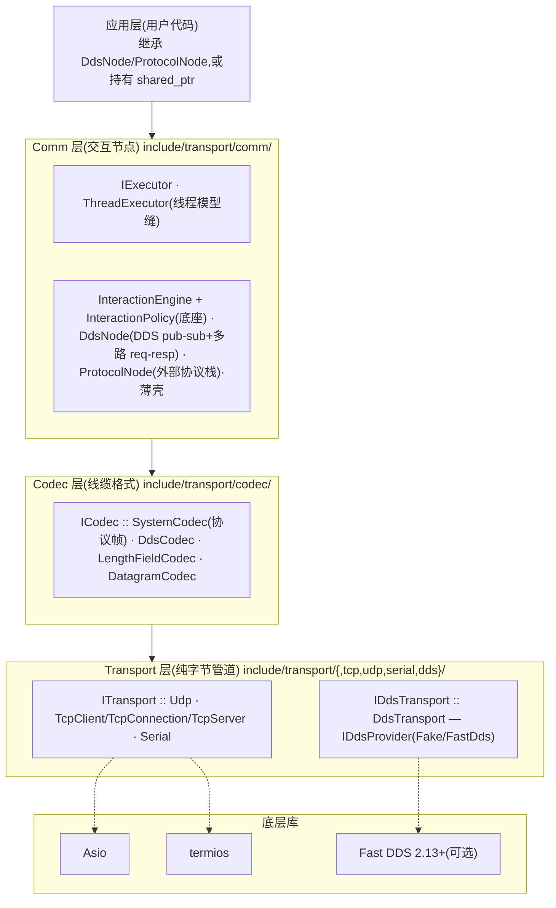
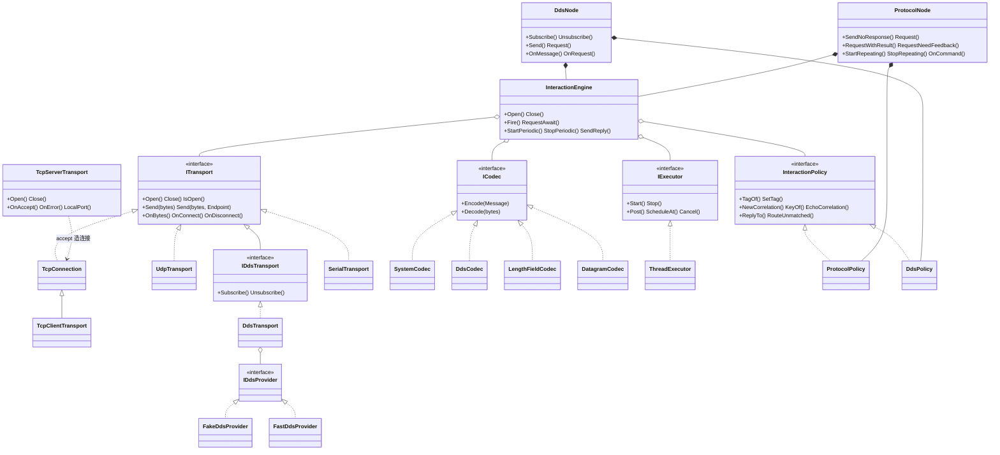
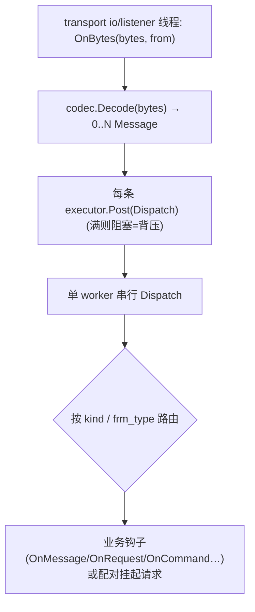

# 通信中间件框架 — 设计说明书（SDD）

**版本：** 2.0（0.2.0 开发线，as-built）
**日期：** 2026-06-23
**配套文档：** 《需求规格说明书》`docs/需求规格说明书.md`

本文件描述框架的**设计与实现**（如何做），由 `docs/superpowers/specs/` 的逐特性设计文档与当前代码整理为单一权威设计参考。所有类名/文件名/接口均为 as-built。

> **架构基线变更（vs 1.1 / 0.1.0）：** 0.2.0 为**三层解耦**架构,完全取代 0.1.0 的富 `ITransport` + `TransportCore` + 三模式接收 + `IFramer` + topic 路由 + `TransportFactory` + DDS `RawMessage`/`SendRequest`。本 SDD 描述 0.2.0 当前状态;旧设计见 `v0.1.0` 标签与历史 spec。

---

## 1. 范围
覆盖三层架构、目录结构、核心数据类型、各层接口与实现、外部协议帧格式、收发数据流与时序、执行器/并发模型、错误处理、构建依赖、测试架构、设计依据。

---

## 2. 架构总览

### 2.1 三层分层

- **Transport**:只收发裸字节,回调式交付(`OnBytes`/`OnConnect`/`OnDisconnect`),不知 Message/codec/交互。
- **ICodec**:`Message`↔线缆字节(分帧+序列化+承载交互元数据)。
- **Comm**:在 Transport+ICodec+IExecutor 之上实现交互模式;用户继承获得能力。

> **用户面定位（vs 0.1.0）：** **Comm 层节点是编程主入口**(继承 `DdsNode`/`ProtocolNode`——各为 `InteractionEngine`+`InteractionPolicy` 薄壳——重写交互钩子)。0.1.0 里 `ITransport` 是用户直接收发的主 API;0.2.0 重构后它**不再是主交互面**,降为两个角色:① **装配缝**——用户实例化具体 transport 注入节点构造,换协议只换注入的 transport,节点逻辑不动;② **裸字节逃生口**——只要字节管道的用户可直接持 `shared_ptr<ITransport>` 用 `OnBytes`/`Send`。`ITransport` 仍须是公共干净的纯虚契约,因为它是分层、可测(`FakeTransport` 替真实 socket)、可替换的支点——是缝,不是主交互面。

### 2.2 设计原则
- 三层各自只依赖下层**接口**:Transport 不依赖 Message/ICodec;ICodec 不依赖任何具体 transport;Comm 节点只依赖 `ITransport`/`ICodec`/`IExecutor`(+ 同层默认实现)。
- 抽象层零第三方依赖;asio/Fast DDS/termios 封在实现层/`src/`。
- **回调式交付**(非继承):Transport 经 `OnBytes` 回调交付,如 `ITransport` 的扩展能力 `IDdsTransport` 仅加 `Subscribe`(对称于上层节点的能力扩展)。
- **执行器缝 `IExecutor`**:Comm 节点逻辑与线程模型解耦,可换 `ThreadExecutor` / `InlineExecutor` / 未来 `CoroExecutor`。
- **交互机制抽一份**:`InteractionEngine`(机制)+ 声明式 `InteractionPolicy`(协议差异);`DdsNode`/`ProtocolNode` 为薄壳。最难写对、出过 Critical 的并发生命周期只写一处复用;扩新协议 = 新 policy。

### 2.3 类结构（UML，按层）

> 节点为薄壳:`DdsNode`/`ProtocolNode` 各持一个 `InteractionEngine`(注入对应 policy)。各自嵌套 `Responder`:`DdsNode::Responder`(绑 correlation_id)/ `ProtocolNode::Responder`(绑 session_id+message_id),均薄包 `engine->SendReply`,嵌套避免同一二进制内 ODR 冲突。

---

## 3. 目录与文件结构（as-built）
```
include/transport/
├── ITransport.hpp  Endpoint.hpp  ICodec.hpp  Message.hpp  Result.hpp  version.hpp
├── codec/   SystemCodec.hpp  DdsCodec.hpp  LengthFieldCodec.hpp  DatagramCodec.hpp
├── comm/    IExecutor.hpp  ThreadExecutor.hpp  InteractionPolicy.hpp  InteractionEngine.hpp
│            ProtocolPolicy.hpp  DdsPolicy.hpp  DdsNode.hpp  ProtocolNode.hpp
├── tcp/     TcpClientConfig.hpp  TcpServerConfig.hpp
│            TcpConnection.hpp  TcpClientTransport.hpp  TcpServerTransport.hpp
├── udp/     UdpConfig.hpp  UdpTransport.hpp
├── serial/  SerialConfig.hpp  SerialTransport.hpp
└── dds/     DdsConfig.hpp  IDdsTransport.hpp  DdsTransport.hpp
             IDdsProvider.hpp  DdsProviderRegistry.hpp  FakeDdsProvider.hpp
src/
├── core/version.cpp
├── codec/SystemCodec.cpp  LengthFieldCodec.cpp
├── comm/ThreadExecutor.cpp  InteractionEngine.cpp  DdsNode.cpp  ProtocolNode.cpp
├── tcp/TcpConnection.cpp  TcpClientTransport.cpp  TcpServerTransport.cpp
├── udp/UdpTransport.cpp   serial/SerialTransport.cpp
└── dds/DdsTransport.cpp  DdsProviderRegistry.cpp  FakeDdsProvider.cpp
       FastDdsProvider.{hpp,cpp}  FastDdsRawType.{hpp,cpp}   # FastDDS 耦合,仅探测到时编译
```
> `DatagramCodec`/`DdsCodec` 为 header-only(无对应 .cpp)。

---

## 4. 核心数据类型

### 4.1 `Result<T>` / `Status`
`{ T value; bool ok; std::string error; }`,`Success(v)` / `Fail("prefix: msg")`,`explicit operator bool`。`Status = Result<std::monostate>`。前缀:`timeout:`/`conn:`/`codec:`/`frame:`/`io:`/`config:`。标 **`[[nodiscard]]`**(忽略返回值 → 编译期告警;有意忽略处 `(void)`)。

### 4.2 `Message`
```
{ vector<uint8_t> payload; string topic; string source; int64_t timestamp;
  MessageKind kind; string correlation_id; string reply_to;             // 通用交互元数据
  FrameType frm_type; uint8_t protocol_id; uint8_t session_id; uint16_t message_id }  // 外部协议字段
```
- `MessageKind{kOneway,kRequest,kReply,kFeedback,kNotify}`:DDS 路径判别符(`DdsPolicy` tag);`DdsCodec` 上线缆。
- `correlation_id`(字符串)= DDS req-resp 匹配键(`DdsPolicy.Key`);`reply_to` = topic-based 应答回送目的(DDS);非 DDS 留空。
- `FrameType{kUnknown,kCommand,kResponse,kResult,kState,kHeartbeat}` 与 `protocol_id`/`session_id`/`message_id`:仅 `ProtocolNode`/`SystemCodec` 用,通用路径留默认。**协议字段为加性扩展,通用与协议两套互不干扰。**

### 4.3 `Endpoint`
`Kind{kDefault,kNet,kTopic}` + `host/port/topic`;工厂 `Default()/Net(ip,port)/Topic(name)`。与 `Message.topic`/`source` 对称,收到可据其回发。**发布即 `Send(Endpoint::Topic)`、UDP 寻址即 `Send(Endpoint::Net)`** —— 统一寻址,无冗余 `SendTo`。

### 4.4 `ICodec`
`Encode(const Message&)→Result<vector<uint8_t>>`(一对一)/ `Decode(const uint8_t*, size_t)→Result<vector<Message>>`(0..N)。实现可有状态(滚动缓冲、单 io 线程喂)或无状态(并发安全)。

---

## 5. Transport 层（纯字节管道）

### 5.1 `ITransport`
生命周期 + `Send(bytes)` / `Send(bytes, Endpoint)` + 回调注册 `OnBytes`/`OnConnect`/`OnDisconnect`。`OnBytes(Result<vector<uint8_t>>, from)` 由 io 线程绑 strand 串行调用;报文式一次=一个完整 datagram/sample,流式一次=本次 read 切片(切帧归上层)。

### 5.2 TCP
- `TcpConnection`(实现 `ITransport`):包装已连接 socket,strand 串行读写,client 与 accepted 共用。
- `TcpClientTransport`(继承 `TcpConnection`):自持 io 线程,`connect` + 连接超时 + 指数退避自动重连。
- `TcpServerTransport`(**独立接受器,非 `ITransport`**):`acceptor` 监听,每 accept 造一个 `TcpConnection` 经 `OnAccept(shared_ptr<ITransport>)` 交付;`OnError` 通知;`LocalPort()` 取回端口。**不广播**(用户在各连接上自行实现)。

### 5.3 UDP / 串口
- `UdpTransport`(实现 `ITransport`):单类按 `UdpMode` 配 socket(单播/组播 join_group+TTL/广播);`Send(bytes[,Endpoint::Net])`,`from` 含发送方 "ip:port"。
- `SerialTransport`(实现 `ITransport`):termios 配置(波特率/数据位/停止位/校验);字节流,切帧归上层。

### 5.4 DDS（纯字节 pub-sub）
- `IDdsTransport : ITransport`(加 `Subscribe`/`Unsubscribe`);`DdsTransport` 持 `IDdsProvider`,一实例=一 participant。`Send(bytes, Endpoint::Topic)`→publish,`Send(bytes)`→`default_topic`;`Subscribe(topic)` 后样本到达**直接在 provider listener 线程**调 `OnBytes(bytes, from=topic)`(同 topic 有序、跨 topic 并发)。订阅回调捕获 `weak_ptr` 防引用环。
- provider:`IDdsProvider`(`Init`/`Shutdown`/`Publish`/`Subscribe`/`Unsubscribe`)+ `DdsProviderRegistry`(名字→工厂)+ `FakeDdsProvider`(进程内 `Bus`:`topic→sinks`,`Publish` 同步分发;DI 共享 Bus 模拟多 participant,零 FastDDS 依赖即可全测)+ 可选 `FastDdsProvider`(Fast DDS 2.13,手写 `FastDdsRawType:TopicDataType` 绕 IDL/CDR)。
- **req-resp 不在此层**:DDS 传输仅纯字节;关联/超时全在 `DdsNode`。

---

## 6. Codec 层（线缆格式）
- **`SystemCodec`** —— 外部协议帧(见 §8),有状态流式 + 注入 CRC + resync。
- **`DdsCodec`**(header-only,无状态)—— `[kind:1][corr_len:2 BE][corr][reply_len:2 BE][reply_to][payload]`;每段即一条完整消息,无成员缓冲 → 多 topic 并发 `Decode` 安全。承载 DDS 交互元数据(kind/correlation_id/reply_to);`topic`/`source` 由上层按来源 topic 填。
- **`LengthFieldCodec`** —— 长度字段分帧的通用流式 codec(有状态滚动缓冲)。
- **`DatagramCodec`**(header-only,无状态)—— 报文直通:`Encode` 透传 payload,`Decode` 整段当一条 `kOneway`。

---

## 7. Comm 层（交互节点）

### 7.1 `IExecutor` / `ThreadExecutor`
- `IExecutor`:`Start`/`Stop`(drain+join)、`Post(Task)`(串行执行,满则阻塞=背压)、`ScheduleAt(deadline,Task)→TimerId`、`Cancel(TimerId)`(幂等)。
- `ThreadExecutor`:1 worker 线程 + 有界 `deque` 任务队列(2 条件变量:取任务/腾空间)+ 最小堆定时器(`priority_queue` + `map<TimerId,Task>` 懒取消);worker `wait_until` 兼顾取任务/触发超时;`Stop` 自连接守卫(worker 内调 `Stop` 则 `detach` 不 `join`,防自我 join terminate)。
- **可换性**:同一交互逻辑在确定性 `InlineExecutor`(同步 `Post`、`FireAll` 驱动定时器)与真实 `ThreadExecutor` 下都通过 → Comm 节点与执行器解耦,未来 `CoroExecutor` 即插即换。

### 7.2 `InteractionEngine`（通用交互机制,一份）
独立 `enable_shared_from_this`,持 `shared_ptr<ITransport>` + `unique_ptr<ICodec>` + `unique_ptr<InteractionPolicy>` + `unique_ptr<IExecutor>`(默认 `ThreadExecutor`)。把三节点曾各自重写的机制收成一处:
- **3 原语**:`Fire(Message, FrameTag, Endpoint)`(单向发,无追踪)/ `RequestAwait(Message, RequestSpec, Endpoint)`(发+登记挂起+排超时)/ `StartPeriodic(Message, FrameTag, interval, Endpoint)→handle`(立即发一帧+自重排定时器,`StopPeriodic` 停)。`SendReply(request, FrameTag, payload)` 供节点 Responder 用。原语收 `Message`(调用方预填语义字段),policy 补相关号,引擎补 tag。
- **数据流**:`Open()` 注册 `OnBytes`(io/listener 线程内联 `Decode` → 每条 `Post` 到 worker)→ 单 worker 串行 `Dispatch`。`Dispatch`:`policy.KeyOf` 配挂起 → 按 `RequestSpec` 的 tag 判**中间**(`on_intermediate` 拷贝调用、留挂起)/ **终结**(`on_terminal` 移出调用、取消定时器、erase、若有 `auto_ack` 先回一帧);无主入站 → `policy.RouteUnmatched` → `OnInboundRequest`(造 Responder)/`OnInboundDeliver`/丢弃。
- **超时/重发**:`RequestAwait` 经 `ScheduleAt` 超时。**「首帧停重发」**:挂起项记 `advanced`,首个配上的中间或终结帧置之;超时时 `!advanced && retries<max_retries` 重发原 `Message`+重排+`++retries`,否则 `on_terminal(Fail("timeout:"))`+erase。一条规则覆盖各模式,免协议专属 flag。
- **并发(集中此处一份)**:posted 任务/回调捕获 `weak_ptr`;挂起表/periodic 表/计数器由 `mu_` 保护,`Encode`+`Send`(含 auto_ack/periodic/SendReply/重发)一律锁外;中间帧回调拷贝、终结帧回调移出 → 防 `Close`/断连双触发;`open_` 在 `transport_->Open()` 前置位+失败回滚;`Close` 幂等,先终结挂起(`conn:`)+取消全部定时器(`mu_` 下)→ `executor->Stop()` → `transport->Close()`;reply 与超时**恰好一次**(单 worker)。

### 7.3 `InteractionPolicy`（声明式协议策略）
纯虚接口,7 法,引擎据此把抽象 `Key`/`FrameTag` 映射到具体协议字段(引擎从不解释 tag/key):
| 法 | 作用 |
|---|---|
| `TagOf` / `SetTag` | 读/写判别符(protocol→`frm_type`,dds→`kind`) |
| `NewCorrelation(out)→Key` | 出站请求盖全新相关号,返回挂起键 |
| `KeyOf(in)→Key` | 入站取匹配键 |
| `EchoCorrelation(reply, req)` | 应答回填相关号使 `KeyOf` 命中 |
| `ReplyTo(req)→Endpoint` | 应答寻址(dds→`Topic(reply_to)`,protocol→`Default`) |
| `RouteUnmatched(in)→{kInboundRequest, kDeliver, kDrop}` | 无主入站路由 |

`Key`=`std::string`(引擎不模板化);`FrameTag`=`int`。`RequestSpec`{request/intermediate/terminal/auto_ack 各 `FrameTag` + 回调 + `timeout_ms` + `max_retries`}。两个具体 policy:
- **`ProtocolPolicy`**(header-only,持 `protocol_id` + 滚动 `session_ctr_`):`Key=Pack(session_id, message_id)`(3 字节串);`NewCorrelation` 滚动 `session_id`(0–255)、盖 `protocol_id`、**不动 `message_id`(调用方命令码)**;`ReplyTo`=`Default`;`RouteUnmatched`:COMMAND/STATE→请求、HEARTBEAT→交付、余(含 UNKNOWN)→丢弃。
- **`DdsPolicy`**(header-only,持 `inbox` + corr 序号):`Key=correlation_id`;`NewCorrelation` 盖 `correlation_id`+`reply_to=inbox`;`ReplyTo`=`req.reply_to.empty()?Default():Topic(reply_to)`;`RouteUnmatched`:kRequest→请求、kOneway/kNotify→交付、余→丢弃。

### 7.4 `DdsNode`（DDS 节点薄壳）
`= InteractionEngine + DdsPolicy`(不再继承任何节点)。另持 `shared_ptr<IDdsTransport> dds_` 供 `Subscribe`/`Unsubscribe`;构造把 IDdsTransport 作引擎的 ITransport、默认 codec `DdsCodec`、policy `DdsPolicy(inbox)`。
- 命名模式 → 原语:`Send(Endpoint::Topic)`=`Fire(kNotify)`;`Request(...,Endpoint::Topic)`=`RequestAwait{kRequest→kReply}`(反馈重载 +`intermediate=kFeedback`,future 重载经 promise);嵌套 `DdsNode::Responder{Reply→SendReply(kReply), Feedback→SendReply(kFeedback)}`;钩子 `OnMessage`/`OnRequest`。
- `Open()` 接钩子 + `engine_->Open()` + `Subscribe(inbox)`。**多路 req-resp**:`DdsPolicy.NewCorrelation` 每请求盖 `reply_to=inbox`,服务端 `ReplyTo` 据 `reply_to` 精确回送发起方 inbox,`correlation_id` 配对 → 跨多 topic/多对等体不串台。

### 7.5 `ProtocolNode`（外部协议节点薄壳）
`= InteractionEngine + ProtocolPolicy`,默认 codec `SystemCodec`,持 `ProtocolConfig{protocol_id, response_timeout_ms, max_retries=3, heartbeat_interval_ms}`。
- **5 模式 → 原语**(发送方法首参 `uint16_t cmd`=`message_id` 命令码,`Cmd(cmd,p)` 建 Message):`SendNoResponse`=`Fire(kCommand)`;`Request`=`RequestAwait{kCommand→kResponse, max=cfg.max_retries}`;`RequestWithResult`→`terminal=kResult`;`RequestNeedFeedback`→`intermediate=kResponse, terminal=kResult, auto_ack=kResponse`(中间 `on_response` 包成引擎 `on_intermediate`);`StartRepeating`=`StartPeriodic(kState)`;心跳=`StartPeriodic(kHeartbeat)`(Open 起,首拍即发)。
- 嵌套 `ProtocolNode::Responder{Response→SendReply(kResponse), Result→SendReply(kResult)}`;钩子 `OnCommand`(COMMAND/STATE)/`OnHeartbeat`(HEARTBEAT)/`OnError`。匹配键 `(session_id, message_id)`,重发/双角色/心跳全由引擎机制承载。

---

## 8. 外部协议帧格式（`SystemCodec`）
```
偏移  字段        长度  说明
0     head_flag    4    固定 AA BB CC DD(逐字节匹配,扫描同步)
4     frm_type     1    COMMAND/RESPONSE/RESULT/STATE/HEARTBEAT/UNKNOWN(枚举占位值,真值后注入)
5     protocol_id  1    外部系统 id(按节点配置)
6     session_id   1    会话 id
7     reserve      4    0x00000000
11    crc          2    CRC16,小端,经 CrcFn 注入,校验整个 frm_body
13    frm_len      2    frm_body 长度,小端,≤65535
15    frm_body     N    [message_id:2 小端][payload]
```
- **CRC 注入**:`using CrcFn = function<uint16_t(const uint8_t* body, size_t len)>`;`SystemCodec(CrcFn = DefaultCrc16)`,两端用同一 `CrcFn` 即自洽,真实算法接入前替换。
- **Encode**:`payload.size()+2>65535` → `frame:`;`body=[message_id LE][payload]`,`crc=CrcFn(body)`;拼头(小端)。
- **Decode**(有状态滚动缓冲):扫描 `AA BB CC DD` 同步(无匹配保留末尾 ≤3 字节)→ 头不全/ body 不全则等 → `CrcFn(body)≠crc_in` 或坏同步头 → **前移 1 字节 resync**(不报致命错)→ 解出 `frm_type`(未知字节→`kUnknown`)/protocol_id/session_id/message_id/payload。坏帧一律跳过,仅编码越界报 `frame:`。

---

## 9. 收发数据流与时序

### 9.1 通用接收路径（Comm 层）

`Decode` 失败:`frame:`(引擎仅 `OnError` 上报,不升级断连——本库 codec 中 `SystemCodec` 坏帧 resync、`DdsCodec` 无状态,均不产致命 `frame:`)/ `codec:`(丢该批继续)。

### 9.2 请求-应答（RequestAwait）时序
`Request(corr)` → 登记 `pending_[corr]` + `ScheduleAt(超时)` → `Encode`+`Send`(锁外) → 对端 `Dispatch(kRequest)` → `OnRequest` → `Responder.Reply` → 对端收 `Dispatch(kReply)` → 配对 `pending_[corr]` → 回调。超时或断连终结挂起。

### 9.3 DdsNode 多路 req-resp 时序
A(inbox `A_in`) `Request(msg, …, Endpoint::Topic("svc"))` → `reply_to="A_in"` publish `svc` → B(订 `svc`) `OnRequest`(Responder 目的=`Topic("A_in")`) → `Reply` publish `A_in` → A(订 `A_in`) `Dispatch(kReply)` → corr 配对 → 回调。多对等体/多 topic 经各自 `reply_to` 精确回各自 inbox。

### 9.4 ProtocolNode needfeedback 时序
`RequestNeedFeedback`(分配 (s,m),登记挂起,发 COMMAND) → 收 RESPONSE(`got_response=true`,中间 `on_response`,**消费回调**保留挂起)→ 收 RESULT(`on_result`,自动 `SendFrame(RESPONSE,(s,m),{})` ack,锁外,erase)。超时:首个 RESPONSE 前重发 COMMAND ≤3;之后超时失败不重发。

---

## 10. 并发与线程模型
- **Transport**:各收数据实例一个 io 线程(`Open` 启/`Close` 停),socket 读写与共享状态绑 strand 串行;async handler `shared_from_this` 保活;DDS 样本在 provider listener 线程交付(同 topic 有序、跨 topic 并发)。
- **Comm**:io/listener 线程内联 `Decode` → `executor.Post` → **单 worker 串行**业务回调/分发;背压在 `Post`(队列满阻塞投递方)。挂起表/计数器由 `mu_` 保护,`Encode`+`Send` 在锁外。
- **恰好一次**:超时与 `Dispatch` 同在单 worker,配对/超时谁先 erase 谁生效,另一方落空。
- **生命周期**:`Close` 幂等;先终结挂起/取消全部定时器(在 `mu_` 下)→ `executor->Stop()`(drain+join)→ 关传输,保证无回调在节点析构后跑;`ThreadExecutor::Stop` 自连接守卫防 worker 内调 Close 自我 join。
- **可换线程模型**:`IExecutor` 缝使线程/协程/确定性测试可换而不改节点逻辑。

---

## 11. 错误处理设计
不抛异常;`Result<T>`/`Status` 贯穿,标 `[[nodiscard]]`。前缀:`config:`(未开/用错种类/配置非法)、`frame:`(分帧/帧越界/同步)、`codec:`(序列化失败)、`conn:`(断开/关闭/被拒)、`timeout:`(请求/重发耗尽)、`io:`(底层 I/O)。DDS/协议坏帧 resync 或丢批继续,不致命;Comm 节点断连终结全部挂起。

---

## 12. 构建与依赖
- CMake;C++17。asio 1.30.2 / nlohmann json 3.11.3 / googletest 1.14 vendored 进 `third_party/`(asio/json header-only INTERFACE,gtest `add_subdirectory`),**离线零联网**。
- Fast DDS 2.13+ 为唯一可选外部依赖,`find_package(fastrtps/fastcdr QUIET)` 自动探测:未装跳过 `FastDdsProvider` 及真实互通测试,装后编译 `src/dds/FastDds*`。

---

## 13. 测试架构
- **Codec 单元**:`SystemCodec`(字节级布局 / 拆包-粘包-跨读 / 坏 head_flag 与 CRC 不符 resync / 超长拒绝,注入确定性 CRC)、`DdsCodec`(元数据往返 / 空 / 截断 / 并发解码安全)、`LengthFieldCodec`、`DatagramCodec`。
- **执行器**:`ThreadExecutor`(串行有序 / 定时触发 / 取消 / 满则阻塞背压 / 自连接守卫)。
- **Comm 节点(端到端)**:`FakeTransport`(进程内双向回环,一次 Send 一次完整交付)+ `InlineExecutor`(确定性、同步、`FireAll` 驱动定时器):
  - `InteractionEngine`:Fire / RequestAwait 终结 / 中间帧留挂起 / auto_ack / 超时重发首帧停 / periodic / Close 不双触发 / worker 内 Close 自连接守卫(覆盖原 comm_node_test 通用面)。
  - `DdsNode`(`FakeDdsProvider` 共享 `Bus` DI):多 topic pub-sub / 退订 / 多路 req-resp 经 reply_to 精确回送 / 反馈 / 超时。
  - `ProtocolNode`:5 模式 / 重发 ≤3 / repeating(含零间隔拒绝)/ 心跳 / 双角色 / needfeedback 双触发回归 + 自动 ack 观测。
  - **可换性**:关键交互在 `InlineExecutor` 与真实 `ThreadExecutor` 下双跑(future/promise 同步),验证非 flaky。
- **Transport 回环**:UDP(单播/组播/`Endpoint::Net`)、TCP(client↔server accept、重连)、串口(`openpty`)、DDS(同 domain 双 participant pub-sub;可选 FastDDS 互通,未装 `GTEST_SKIP`)。

---

## 14. 设计依据要点（rationale）
- **三层解耦取代富 `ITransport`**:传输只搬字节、codec 只管线缆、交互模式上移到可继承节点,各层可独立替换/测试,消除旧 `TransportCore` 把接收+编解码+队列+三模式糅在一起的耦合。
- **执行器缝 `IExecutor`**:线程模型(线程/未来协程/确定性测试)可换而不动节点逻辑;背压、定时、单流有序统一由执行器提供。
- **机制集中、策略声明式**:`InteractionEngine` 一份机制(挂起/超时/重发/分发/periodic/并发纪律),`InteractionPolicy` 声明式协议差异;节点退成薄壳。最难写对的并发生命周期只写一处复用,policy 易写对;「首帧停重发」一条规则覆盖各模式免 god-config;引擎零 per-protocol 特判(护栏)。DDS 多路应答经 `reply_to` 上线缆,无节点间共享状态。
- **外部协议独立 `ProtocolNode` + 注入式 CRC/帧类型**:外部协议(6 帧类型、(session,message) 匹配、5 模式、重发/repeating/心跳、双角色)与通用 req-resp 差异极大,独立成节点;CRC 算法与 frm_type 真值经注入接口/枚举占位预留,接入前替换不改结构。
- **`Responder` 嵌套**:`ProtocolNode::Responder`(绑 session+message)与 `DdsNode::Responder`(绑 correlation)各自嵌套于所属节点,避免同一二进制内 ODR 冲突;均薄包 `engine->SendReply`。
- **统一寻址 `Endpoint`**:发布=`Send(Topic)`、UDP 寻址=`Send(Net)`,基类句柄即可寻址,无形态不一的 `SendTo`。
