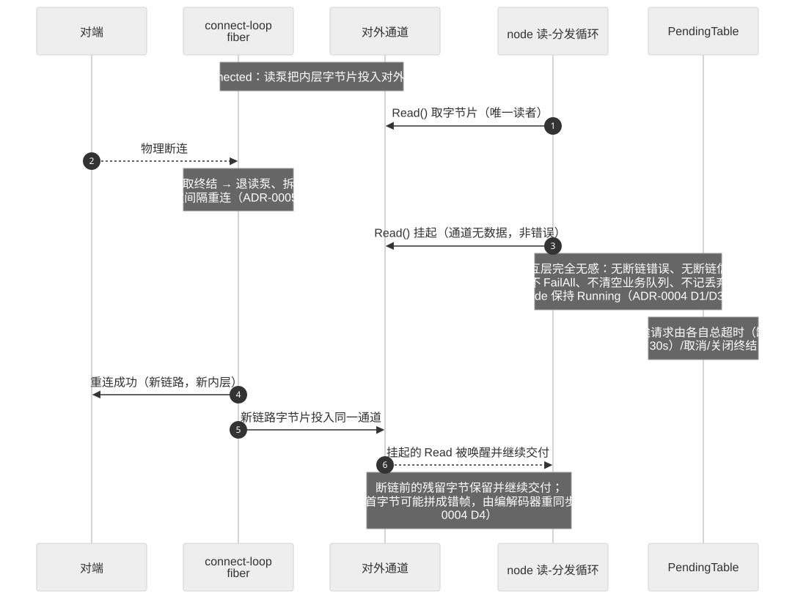

# 软件设计说明（SDD）

**文档标识：** transport-SDD-438C
**版本：** v1.0
**日期：** 2026-08-05
**编制依据：** GJB 438C《军用软件开发文档通用要求》——软件设计说明模板
**对应软件基线：** master `7994719`（里程碑 P0–P5 已交付，版本 `v0.4.5`）
**需求基线：** `docs/需求规格说明书-协程原生.md`（SRS v3，标识前缀 `RT_`）
**决策依据：** `docs/adr/`（ADR-0001/0002/0003）

> 说明：本文件按 GJB 438C 软件设计说明模板组织，描述 `transport` 通信中间件 CSCI 依据当前实现（as-built）的体系结构与详细设计。图形采用 Mermaid 源（`docs/diagrams/*.mmd`）渲染的 SVG，含类图、时序图、状态图、数据流图。本文件与既有 `docs/设计说明书-协程原生.md`（目标架构 + 分期路线图）互补：后者是路线图权威，本文件是按当前实现回填的结构化设计说明。

---

## 1 范围

### 1.1 标识

- **CSCI 名称：** transport（C++ 通信中间件库）
- **CSCI 标识号：** transport-CSCI-01
- **版本号：** 0.4.5（语义化版本，单一真源 `include/transport/core/version.hpp`）
- **适用产品：** 需要在 TCP / UDP / 串口 / DDS 等异构介质上实现请求-响应、发布-订阅等交互模式的宿主应用。

### 1.2 系统概述

transport 是一个 C++17 协程原生通信中间件库，把通信职责彻底解耦为**三层**，各层之间以可测替换的**缝（seam）**衔接：

1. **Transport（传输层，纯字节管道）** —— 在 TCP / UDP / 串口 / DDS 上搬运原始字节或样本，不解释消息类型、请求关联或 payload 语义。介质无关的协程拉模型：`Read` 一次一片（流式任意切片 / 报文一整报）。
2. **Codec（编解码层，线缆格式）** —— 在收发边界完成逻辑 `Message` ↔ 线缆字节的分帧、序列化、校验与重同步；应用可提供并装配。
3. **Node（交互层，交互节点）** —— 在前两层之上组合请求关联、入站分发、超时、连接状态与协议交互。**薄壳组合、不共享交互引擎**：协议可观察语义由各 node 自实现，公共只复用协议无关的挂起-应答纪律与生命周期收敛。

**运行时约束：** 全库以 AsyncTask（boost.fiber）协程运行时为强制异步运行环境，M:N 协作式调度；同一节点的状态/关联/入站处理串行，不同节点可并行。

**非目标：** 不解析 payload 业务语义，不是消息代理/通用路由守护进程，本版不内建加密/认证/访问控制。

### 1.3 文档概述

本文件描述 transport CSCI 的设计。第 3 章记录贯穿全局的设计决策；第 4 章给出体系结构（部件分解、执行概念、接口）；第 5 章给出各软件单元的详细设计；第 6 章给出需求可追踪性；第 7 章为注解。本文件面向实现者、评审者与维护者。可观察/可验收行为以 SRS 为准，本文件与 SRS 冲突时以 SRS 优先。

---

## 2 引用文件

| 编号 | 文件 | 说明 |
|---|---|---|
| DOC-1 | `docs/需求规格说明书-协程原生.md` | 软件需求规格说明（SRS v3），`RT_*` 需求基线 |
| DOC-2 | `docs/adr/0001-coroutine-native-interaction-architecture.md` | 协程原生交互架构总纲 |
| DOC-3 | `docs/adr/0002-send-completion-drop-attribution-and-lifecycle-refinements.md` | 发送完成 / 丢弃归因 / 生命周期细化 |
| DOC-4 | `docs/adr/0003-target-architecture-sdd-and-phased-roadmap.md` | 目标架构与分期路线图（决策 D1–D13） |
| DOC-5 | `docs/设计说明书-协程原生.md` | 目标架构设计 + 分期路线图（路线图权威） |
| DOC-6 | `CODING_STANDARDS.md` | 编码规范（Google C++ Style + 既有约定） |
| DOC-7 | `CONTEXT.md` | 项目术语单一权威 |
| STD-1 | GJB 438C | 军用软件开发文档通用要求 |

---

## 3 CSCI 级设计决策

以下决策贯穿全 CSCI，均可回溯到 ADR（DOC-4 决策编号 Dn）。

- **D-决策1（三层解耦，D1/RT_IN_INTERFACE_001）：** 传输不依赖逻辑消息或协议语义；codec 是公共扩展点；node 组合三者。`ITransport` 是内部缝（非用户 API），`ICodec` 是公共扩展点，编程主入口是交互层 node。
- **D-决策2（AsyncTask 强制运行时，D2/RT_DESIGN_002）：** 不设独立 `IExecutor`/`ThreadExecutor` 业务调度体系；M:N 协作式；同一节点交互状态串行访问，串行化以一把 `std::mutex` 守临界区实现（D8），运行时 await 只出现在 fiber 挂起点，唤醒/回调在锁外调用。
- **D-决策3（无共享交互引擎，D3/RT_DESIGN_003/RT_NODE_003）：** 不设独立 `InteractionEngine`/`InteractionPolicy` 层；协议特有语义（键派生、终结判别、寻址、帧盖章）内联各 node。公共只抽出**协议无关机制**：`PendingTable`、`BoundedQueue`、`NodeRuntime`、`SharedCompletion`。
- **D-决策4（不抛异常，RT_ERROR_001/002/003）：** 预期失败用 `Result<T>`/`Status`（标 `[[nodiscard]]`）+ 机器可判别的 `TransportErrc` 类别表达，不靠解析字符串前缀分类。唯一授权的 `catch` 在 handler 消费者边界（隔离第三方逃逸异常）。
- **D-决策5（发送完成语义 + 背压，RT_TRANSPORT_008）：** 一次发送在帧字节全部离开框架用户态缓冲（进入内核）后才报成功，背压经协程等待自然传导，不采用 fire-and-forget。
- **D-决策6（发送排序，RT_TRANSPORT_007/004）：** 同一 fiber 的先后发送按程序序上线；跨 fiber 并发发送串行化为一致全序（按到达节点执行域顺序），单帧字节不与另一帧交错。
- **D-决策7（两个独立生命周期轴，D3′）：** 节点生命周期 `Created→Running→Closing→Closed`（全介质通用）与 TCP 物理连接状态 `Disconnected/Connecting/Connected/Reconnecting`（仅 TCP 客户端，Running 内子状态）正交。连接概念不下沉纯字节管道基座。
- **D-决策8（协议无关基座可复用，D10/RT_DESIGN_008）：** `PendingTable<Key,T>`/`BoundedQueue<T>`/`NodeRuntime<Event>` 对协议类型不透明，经模板参数/注入回调解耦。DdsNode 复用它们：仅把 Key 从 `uint32` 换为 `std::string`，基座一行不改（实证）。
- **D-决策9（观测与完整性归因，D13/RT_TRACE）：** 每个丢弃点经唯一 `RecordDrop` 归因到七项 `DropReason` 之一 + 命名计数；可选 `ITraceSink` 结构化 Trace（push）与命名计数（pull）双面观测；未配置 sink 时零控制流/字节流影响。"无静默丢失"结构性可断言（Σ命名 = 总丢弃）。
- **D-决策10（底层回调不碰节点状态，RT_HANDLER_002/RT_NODE_004）：** Qt I/O 回调在 socket QThread、DDS 样本在 provider listener 线程，均须安全转交节点执行域，不在回调线程执行业务处理器；DDS 经跨线程有界交接边界（`BoundedQueue<Sample>`）转交。

---

## 4 CSCI 体系结构设计

### 4.1 CSCI 部件

CSCI 分为四个软件包（对应 `include/transport/` 与 `src/` 的子目录），部件与依赖关系见类图（图 4-1）。

**图 4-1 CSCI 三层解耦类图**



各软件包与主要软件单元：

| 软件包 | 目录 | 软件单元 | 职责 |
|---|---|---|---|
| **core** | `core/` | `Message`、`Endpoint`、`Result`/`Status`、`TransportErrc`、`Cancellation`、`SharedCompletion<T>`、`ITraceSink`、`Observability`、`DropReason`、`TraceCategories`、`version` | 值类型与基础原语 |
| **io** | `io/`（`tcp/`·`udp/`·`serial/`·`dds/`） | `ITransport`、`IConnectionObservable`、`TcpTransport`、`TcpClientTransport`、`TcpServer`、`UdpTransport`、`SerialTransport`、`DdsTransport`、`IDdsProvider`（Fake/FastDDS） | 纯字节管道（内部缝） |
| **codec** | `codec/` | `ICodec`、`SystemCodec`、`DatagramCodec`、`DdsCodec`、`LengthFieldCodec` | 线缆格式（公共扩展点） |
| **node** | `node/` | `ProtocolNode`、`DdsNode`、`NodeRuntime<Event>`、`PendingTable<K,T>`、`BoundedQueue<T>`、`HandlerContext` | 交互节点 + 协议无关机制 |

**部件间关系（图 4-1 要点）：**

- `ProtocolNode`/`DdsNode` **组合**（`*--`）`ITransport` + `ICodec` + `PendingTable` + `NodeRuntime`；不继承框架类型、不共享引擎。
- `NodeRuntime` **拥有** `BoundedQueue`；`PendingTable` **复用** `SharedCompletion` 作值信箱。
- 各介质传输类**实现**（`<|..`）`ITransport`；`TcpClientTransport` 额外实现 `IConnectionObservable`；各 codec 实现 `ICodec`。
- `TcpServer` 每接受一条连接**派生**一个 `ProtocolNode`（连接生命 = 节点生命）。

### 4.2 执行概念

#### 4.2.1 线程与执行域模型

- **节点所属执行域：** node 首次成功启动绑定稳定执行域（单 fiber 调度器下即单调度线程），运行期不迁移。公共异步操作可从任意 fiber 发起并转交所属域。
- **fiber 分工（一个 node 内）：** ①读-分发循环 fiber（`SpawnReadLoop`）；②handler 消费者 fiber（`SpawnHandlerLoop`，设 handler 时）；③reactor fiber（`RunReactorLoop`，传输为 `IConnectionObservable` 时）；④finalizer fiber（Close 时临时 spawn，驱动三方汇合收敛）。
- **控制优先级（仅约束可观察结果）：** 关闭/取消/代际切换 > 请求响应匹配 > 普通业务 > Trace。

#### 4.2.2 入站/出站数据流

数据流见图 4-2：出站（调用方 fiber）与入站（读循环 fiber）两条独立流，经 PendingTable 的 Resolve→Wait 唤醒闭环。

**图 4-2 请求-响应节点数据流图**


- **出站流：** `Request/Send` 分配 session_id 并盖章 → `Register`（Send 不登记）→ `Encode` → `Write`（帧进内核才成功）→ `Handle.Wait` 挂起。
- **入站流：** `Read` 一次一片 → `NodeRuntime` 读循环骨架（错误分类）→ `Decode`（坏帧归因 `kBadFrame`）→ `Dispatch` 分类：响应帧走 `Resolve`（未命中归因 `kUnmatchedOrLateResponse`）、业务帧入 `BoundedQueue`（满 tail-drop 归因 `business_queue_overflow`）交 handler 串行消费、无 handler 归因 `kNoHandlerConfigured`。

#### 4.2.3 请求-响应交互过程

图 4-3 给出一次 `Request` happy path 的时序，核心是**四方仲裁的恰好一次终结**。

**图 4-3 请求-响应时序图**


- 每个在途 entry 复用一个 `SharedCompletion<Message>` 作值信箱；**Resolve / 超时 / 取消 / FailAll 四方抢同一个原子首胜 `Complete`**，天然恰好一次终结。
- session_id 由 `SessionLease`（RAII）接管，任一返回路径析构自动归还空闲集，杜绝在途预算泄漏。

#### 4.2.4 关闭收敛过程

图 4-4 给出 Close 的三方汇合。首个关闭者发出三方汇合信号并 spawn 独立 finalizer fiber，由后者驱动收敛，天然规避 handler 消费者内 `RequestClose` 的自等待自锁。

**图 4-4 关闭三方汇合时序图**


#### 4.2.5 断连代际隔离过程

图 4-5 给出自动重连传输上的代际隔离。reactor fiber 观察连接状态机的"曾 Connected 且现非 Connected"下降沿，做恰好一次的旧代际隔离；node 保持 Running（非 Close 终态）。

**图 4-5 断连代际隔离时序图**



- 断连：`FailAll(kConnection, latch=false)` 令在途请求恰好一次收敛，表**不 latch**（新代际请求仍可 Register）；靠"FailAll 清空 ⇒ 在途恒属当前代际"不变式隔离代际，连接概念不下沉基座。
- 未启动的旧代际排队业务经 `DrainBusinessQueue` 逐条归因 `kGenerationIsolationDrop`；正在运行的 handler 让其跑完（不强杀）。

### 4.3 接口设计

#### 4.3.1 内部接口

| 接口 | 头文件 | 契约摘要 |
|---|---|---|
| **`ITransport`** | `io/ITransport.hpp` | `Start/Read(options)/Write(SendUnit)/RequestClose/WaitClosed` + 强制 I/O 观测面 `LastSendTime/LastReceiveTime/LastError`。介质无关拉模型，一次一片；可失败操作返回 `Result<T>`/`Status`。 |
| **`IConnectionObservable`** | `io/IConnectionObservable.hpp` | `State/WaitForState/WaitStateChange` + 代际/配置版本/失败/尝试次数诊断。不进 base `ITransport`（连接概念不下沉）；node 检测本接口后 spawn reactor。 |
| **`ICodec`** | `codec/ICodec.hpp` | `Encode(Message)→bytes`（一对一）/`Decode(bytes)→Message[]`（0..N，半包空、粘包多条）。可有状态（`SystemCodec` 单线程喂）或无状态并发（`DdsCodec`）。 |
| **`IDdsProvider`** | `io/dds/IDdsProvider.hpp` | `Init/Shutdown/Subscribe/Unsubscribe/Publish`，只管"按 topic 收发不透明字节"。实现：`FakeDdsProvider`（进程内总线）、`FastDdsProvider`（可选）。 |
| **`ITraceSink`** | `core/ITraceSink.hpp` | `OnTrace(TraceEvent)`，零分配视图事件。**重入契约（#98）**：OnTrace 可能在库内部锁临界区内被调，实现须快速返回、不阻塞、不回调本库任何 API。 |

#### 4.3.2 外部（编程）接口

宿主应用的编程主入口是交互层 node（`ProtocolNode`/`DdsNode`/`TcpServer`）及其 config 结构，而非 `ITransport`。装配方式：应用构造具体 transport 与 codec，注入 node 构造函数；经 config 注册 handler、设置关联键策略、队列上界、可选 trace_sink。

- **`ProtocolNode(unique_ptr<ITransport>, unique_ptr<ICodec>, ProtocolNodeConfig)`** —— `Request(Message,options)→Result<Message>`、`Send(Message)→Status`。
- **`DdsNode(unique_ptr<ITransport>, unique_ptr<ICodec>, DdsNodeConfig)`** —— `Request(Message,target,options)`、`Publish(Message,topic)`。
- **`TcpServer(TcpServerConfig, NodeFactory)`** —— 每连接经工厂装配一个 `ProtocolNode`。

#### 4.3.3 统一寻址

`Endpoint`（`kDefault`/`kNet(ip,port)`/`kTopic(name)`）经 `SendUnit.destination`/`Datagram.source` 贯通 UDP/DDS：调用方对恒发 `Default` 的传输无关代码，在 UDP 上解析为 config 默认目的地，在 DDS 上要求 `kTopic`。

---

## 5 CSCI 详细设计

本章逐一给出软件单元的详细设计。每个单元标注：职责、关键数据结构、算法/状态、错误与并发纪律、对应需求。

### 5.1 PendingTable\<Key, T\>（挂起-应答薄基座）

- **文件：** `node/PendingTable.hpp`（RT_IN_INTERFACE_004 / ADR-0001 D2）
- **职责：** 四件事——唯一登记（`Register`）、恰好一次完成（`Resolve`）、全部收敛（`FailAll`）、取消纪律（`Handle` 析构兜底）。不 decode、不算 key、不判终结、不跑读循环。
- **数据结构：** `std::map<Key, shared_ptr<Entry>>`，`Entry{SharedCompletion<T> completion; time_point registered_at}`；共享状态含 `closed` latch、可选 `sink`、`last_request_latency`，一把 `std::mutex` 守。
- **在途 entry 状态机：** 见图 5-1。四方（Resolve/超时/取消/FailAll）抢同一 `Complete`，原子首胜 → 恰好一次终结。`Handle::Wait` 的二段仲裁：本地超时/取消后先尝试 `Complete(error)` 置终结，抢输则采用真正终结结果（堵"超时返回但 entry 未终结、随后 Resolve 假成功"竞态缝）。

**图 5-1 PendingTable 在途 entry 四方仲裁状态图**



- **`FailAll(error, latch_closed)`：** `latch_closed=true`（Close 语义）之后 `Register` 返 `kClosed`，表永久收敛；`false`（断连语义）只清空当前在途、不 latch，表继续可用。绝不 un-latch。
- **容量：** 可选 `max_pending` 纯计数上限（协议无关）；ProtocolNode 传 256 作双重执法，仅防自定义键策略绕过 session 预算。
- **错误：** 重复键 `kInvalidState`；已 latch `kClosed`；计数满 `kResourceExhausted`。

### 5.2 SharedCompletion\<T\>（多等待者完成原语）

- **文件：** `core/SharedCompletion.hpp`
- **职责：** 一次性完成原语，支持多等待者、原子首胜 `Complete`、`Wait` 支持 deadline/取消。要求 `T` 为 void 或可拷贝（每个等待者持独立 `Result<T>`）。
- **实现：** 共享 `State{mutex; StoredResult completion; map<id, weak_ptr<Waiter>>}`；`Complete` 锁内置结果并摘取全部 waiter，锁外 `resolve+close`；`Wait` 已完成即返，否则登记 waiter 并 `await`/`await_for`，本地超时置 `kTimeout`、取消置 `kCancelled`。
- **用途：** PendingTable entry 值信箱；NodeRuntime 的 `start_done_`/`loop_done_`/`handler_done_`/`closed_`；reactor 的 `reactor_done_`。

### 5.3 BoundedQueue\<T\>（协议无关有界队列）

- **文件：** `node/BoundedQueue.hpp`（ADR-0003 D10 / ADR-0002 D5-D6）
- **职责：** 双上界入队（`Push`，满 tail-drop）、协作出队（`Pop`，空则消费者 await）、收敛（`Close`）、剩余枚举（`Drain`）。对 `T` 不透明，字节计量靠注入 `byte_size_of` 回调。
- **双上界：** 事件数 `max_events`（默认 1024，区间 [1,65536]）与字节数 `max_bytes`（默认 16 MiB，区间 [64 KiB,256 MiB]），任一达到即满。满时 tail-drop 正到达元素，经 `RecordDrop(drop_reason, dropped, sink)` 归因，`DroppedCount()` 语义不变。
- **归因：** `drop_reason`/`sink` 构造时注入（业务队列满 `kBusinessQueueOverflow` / DDS 交接满 `kDdsHandoffOverflow`）。RecordDrop 在 tail-drop 分支持锁调用（与原地 `++dropped` 同临界区）。

### 5.4 NodeRuntime\<Event\>（协议无关节点运行时机制）

- **文件：** `node/NodeRuntime.hpp`（ADR-0003 D10/D12）
- **职责：** 把多节点共享的协议无关机制收成可组合薄件——①生命周期状态机 + 并发幂等 Start + 三方汇合 + 多等待者 WaitClosed + 重入自锁防护；②handler 消费者 fiber + `BoundedQueue` 集成 + 异常隔离 + close_drop 归因；③读-分发循环骨架 `SpawnReadLoop(decodeAndDispatchFn)`。
- **节点生命周期状态机：** 见图 5-2。
- **并发幂等 Start：** 首个 Start 校验 config → 置 starting → 调 node `bring_up`；并发 Start await 同一 `start_done_`，不重复 spawn。
- **三方汇合（Close）：** 首个关闭者 Running→Closing → 三方汇合信号（transport.RequestClose + 业务队列 Close + handler 取消 + node 侧收敛回调）→ spawn finalizer fiber：等 `loop_done_` → 依序等追加 join（reactor）→ 等 `handler_done_`（超 500ms 记 kInternal 不强杀）→ `ConvergeToClosed()`（Drain close_drop + 置 Closed + 记时延）→ `closed_.Complete`。
- **重入自锁防护：** 比对 `boost::this_fiber::get_id()`；当前即 handler 消费者 fiber 时只发起拆卸、跳过自等待。
- **同步纪律（#98）：** `has_handler_` 读写、生命周期状态、计数均入锁；`ConvergeToClosed()` 收口两分支重复收敛段。

**图 5-2 节点生命周期状态图**


### 5.5 ProtocolNode（外部协议交互节点）

- **文件：** `node/ProtocolNode.hpp` / `src/node/ProtocolNode.cpp`（RT_NODE_003 / RT_REQUEST）
- **职责：** 组合 `ITransport` + `ICodec` + `PendingTable<uint32,Message>` + `NodeRuntime<Message>`，内联一条读-分发循环，交付 needresponse 请求-响应与 noresponse 发送。协议特有语义全内联本类。
- **协议特有语义（内联）：**
  - **键派生：** `CorrelationKeyStrategy`（可注入）；默认策略请求键 `(session_id<<16)|message_id`，响应键清响应标记位 `0x1000` 归一化。
  - **session_id 分配：** 空闲集 `deque<uint8_t>`（0..255），`Request` `pop_front` 取最久释放者（FIFO 最大化退休窗口，RT_REQUEST_005），`SessionLease` RAII 归还；256 全在途返 `kResourceExhausted`。`Send`（#98）只读空闲集尾部盖帧、不出队，不扰动 FIFO、不占预算。
  - **终结判别（`Dispatch`）：** `kResponse`/`kResult` = 响应帧 → `Resolve`；否则业务帧入队/丢弃。
  - **reactor（`RunReactorLoop`）：** 传输为 `IConnectionObservable` 时订阅连接下降沿做代际隔离。
- **观测计数：** `UnmatchedResponseCount`/`DroppedNoHandlerCount`/`BusinessQueueOverflowCount`/`HandlerExceptionCount`/`PendingCount`/`CloseDropCount`/`BadFrameCount`/`GenerationIsolationDropCount` + 指标 `LastRequestLatency`/`LastHandlerDuration`/`LastCloseLatency`。

### 5.6 DdsNode（DDS 交互节点）

- **文件：** `node/DdsNode.hpp` / `src/node/DdsNode.cpp`（RT_NODE_003 / RT_IF_DDS）
- **职责：** 组合 `NodeRuntime` + `DdsTransport` + `DdsCodec` + `PendingTable<std::string,Message>`，交付 DDS pub-sub 与多路请求-应答。**D10 可复用性实证：** PendingTable 仅把 Key 实例化为 `std::string`（P1 曾为 uint32），一行不改；BoundedQueue/NodeRuntime 零改动。
- **DDS 特有语义（内联）：** correlation_id 生成（`node_id:序号` 确定性）、`kReply` 终结判别、topic 寻址、`reply_to=inbox`。
- **无连接（D3′）：** 无连接状态机/reactor/重连；provider 致命 → Read 返 kClosed/kConnection → 读循环退出 → Closing→Closed。

### 5.7 HandlerContext（handler 能力面）

- **文件：** `node/ProtocolNode.hpp`（`DdsHandlerContext` 见 `node/DdsNode.hpp`）
- **职责：** handler 经它与节点交互（`Send`/`RequestClose`/`cancellation()`），而非裸捕获 node&，协议内部状态不外泄。由 node 在消费者 fiber 内构造并按引用传入；handler 不得持其地址越出单次调用。`DdsHandlerContext` 额外露 `Reply`（对入站 kRequest 回送 kReply）。

### 5.8 io 层软件单元

| 单元 | 文件 | 关键设计 |
|---|---|---|
| **TcpTransport** | `io/tcp/TcpTransport.cpp` | 接管已连接 socket；发送完成语义（帧进内核才成功 + 背压）；并发写按到达序串行化；复用 corosocket `readAll` 流。 |
| **TcpClientTransport** | `io/tcp/TcpClientTransport.cpp` | 实现 `ITransport`+`IConnectionObservable`；owns socket，组合一代际一个内层 TcpTransport；connect-loop fiber 跑连接状态机（图 5-3）；`Read` 透明跨重连；`ApplyConfig` 单调版本原子应用。 |
| **TcpServer** | `io/tcp/TcpServer.cpp` | accept 循环 fiber，每连接经 NodeFactory 派生 ProtocolNode + supervisor fiber；连接生命 = 节点生命（非重连）。 |
| **UdpTransport** | `io/udp/UdpTransport.cpp` | coroudpsocket 报文式收发，保报文边界与发送方地址；`Write` 寻址 kDefault→config 默认目的地 / kNet→ip:port；非重连。 |
| **SerialTransport** | `io/serial/SerialTransport.cpp` | coroiodevice 字节流收发，语义对称 TcpTransport；断开过渡默认致命（TBD-005）。 |
| **DdsTransport** | `io/dds/DdsTransport.cpp` | 组合 IDdsProvider + 跨线程有界交接边界（`BoundedQueue<Sample>`）；listener 线程非阻塞 Push（满归因 `dds_handoff_overflow`），Read 侧 fiber 出队；跨线程唤醒靠 boost.fiber channel 跨线程安全（闭合 ADR-0001 未决项）。 |

**图 5-3 TCP 客户端连接状态机**


### 5.9 codec 层软件单元

| 单元 | 关键设计 |
|---|---|
| **SystemCodec** | 外部协议流式 codec（占位帧常量 TBD-003），跨切片拼帧、坏帧重同步；分帧错误 `kFrame`、语义错误 `kCodec`。 |
| **DatagramCodec** | 报文式 codec，保消息边界。 |
| **DdsCodec** | DDS 元数据编解码（kind/correlation_id/reply_to），无状态支持并发 Decode。 |
| **LengthFieldCodec** | 长度字段分帧基元。 |

### 5.10 观测软件单元

- **文件：** `core/Observability.hpp`、`core/DropReason.hpp`、`core/TraceCategories.hpp`、`core/ITraceSink.hpp`
- **`DropReason` 七项：** `kBusinessQueueOverflow`、`kDdsHandoffOverflow`、`kBadFrame`、`kUnmatchedOrLateResponse`、`kCloseDrop`、`kGenerationIsolationDrop`、`kNoHandlerConfigured`。
- **原语：** `RecordDrop(reason, counter, sink, ...)`（一次调用计数 pull + 可选 Trace push）；`RecordEvent(category, sink, ...)`（仅 push）。
- **Trace 类别（九类，`TraceCategories.hpp` 单一权威）：** `connect`/`generation`/`send`/`recv`/`decode`/`match`/`timeout`·`cancel`/`handler`/`reconnect`/`lifecycle`。生命周期类别原名 `close`，#98 改名并集中常量（发射点不再散落字面量）。
- **完整性（loss=0 harness，`tests/loss_accounting_test.cpp`）：** 干净跑全部 DropReason 计数为 0；混合故障七类各触发、Σ命名 = 总丢弃（`drop_records.size()==Σ` 证无多记漏记）；未配 sink 零影响（RT_TRACE_002）。

---

## 6 需求可追踪性

本章给出 `RT_*` 需求到软件单元与验收测试的双向映射（正查：由 RT_* 定位设计落点与测试；反查：由单元/测试反查 RT_*）。状态：✅ 已交付验证 · ◐ 部分 · ○ 未开始。完整矩阵见 DOC-5 §7，本表摘录请求-响应链路相关项。

| RT_* | 软件单元 | 验收测试 | 状态 |
|---|---|---|---|
| RT_DESIGN_003 无独立引擎 | ProtocolNode（内联读循环） | protocol_node_tcp_loopback | ✅ |
| RT_DESIGN_008 协议可扩展基座 | PendingTable/BoundedQueue/NodeRuntime（协议无关） | pending_table, bounded_queue, dds_node | ✅（基座）|
| RT_REQUEST_001–005 请求关联/恰好一次 | PendingTable, ProtocolNode | pending_table, protocol_node, protocol_node_capacity | ✅ |
| RT_REQUEST_006 ≥256 在途 | session_id 空闲集 + PendingTable.max_pending | protocol_node_capacity | ✅ |
| RT_HANDLER_001–006 入站处理器 | ProtocolNode handler/HandlerContext/BoundedQueue | protocol_node_handler | ✅ |
| RT_LIFECYCLE_001/003–007 生命周期 | NodeRuntime（三方汇合/重入防护） | protocol_node_lifecycle | ✅ |
| RT_LIFECYCLE_002 TCP 连接子状态 | TcpClientTransport/ConnectionState | tcp_client_transport | ✅ |
| RT_TCP_RECONNECT 自动重连/代际 | TcpClientTransport/ProtocolNode reactor | protocol_node_reconnect, tcp_client_e2e | ✅ |
| RT_TCP_RECONFIG 运行时重配置 | TcpClientTransport::ApplyConfig | tcp_client_reconfig | ✅ |
| RT_TRANSPORT_007/008 排序/发送完成 | TcpTransport | send_semantics_fake, tcp_transport_send | ✅ |
| RT_CODEC 编解码/流式/坏帧 | SystemCodec/DatagramCodec/DdsCodec | codec/*, dds_transport | ✅ |
| RT_NODE_004/005/007 DDS 交接 | DdsTransport 跨线程交接 / DdsNode | dds_transport, dds_node | ✅ |
| RT_NODE_006 I/O 事实观测面 | 各传输 LastSend/Recv/Error | tcp/udp/serial/dds_transport | ◐（判活 QoS 留后续）|
| RT_TRACE_001/002 结构化 Trace + 出口 | ITraceSink/RecordDrop/RecordEvent | observability, trace_wiring, loss_accounting | ✅ |
| RT_ERROR_001–003 机器可判别错误 | TransportErrc/Result | error_test | ✅ |
| RT_IN_INTERFACE_001 三层职责隔离 | ITransport 缝传输无关 | protocol_node_udp（换传输零改动）| ✅ |
| RT_PERFORMANCE/TESTABILITY | — | — | ○（P6）|

---

## 7 注解

### 7.1 术语缩略语

| 术语 | 含义 |
|---|---|
| CSCI | 计算机软件配置项 |
| 缝（seam） | 可测替换点（接口边界） |
| 节点所属执行域 | node 首次启动绑定的稳定 fiber 调度域 |
| 发送完成语义 | 帧字节全部进内核后才报成功 |
| 连接代际 | 每次成功物理连接递增的单调计数，用于隔离旧代际迟到事件 |
| 退休窗口 | session_id 从释放到被复用的间隔，FIFO 复用最大化之以降迟到误配 |
| 四方仲裁 | Resolve/超时/取消/FailAll 抢同一原子首胜 Complete |
| loss=0 harness | 断言"无静默丢失"的测试：Σ命名计数 = 总丢弃 |

### 7.2 未决项与技术债（详见 DOC-5 §6、DOC-4）

- 五模式精确状态机与 `kFeedback` 中间反馈（TBD-001）；帧常量/CRC 真值（TBD-003）；性能基线固化（TBD-004，P6）；串口自动重连（TBD-005）。
- 站着的测试技术债（P6 硬化）：CGNAT 连接超时测试环境不稳、`FakeDdsProvider` 静态总线 `--gtest_repeat` 不重置（均单跑绿）。
- 延后重构：node getter 样板聚合为 `NodeStats`（等 P6 指标定型）；`DecodeAndDispatch` 下沉自由函数（等第三个 node）。

### 7.3 图形来源与再生成

全部图形以 Mermaid 源保存于 `docs/diagrams/*.mmd`，渲染为同名 `.svg`。再生成命令：

```bash
cd docs/diagrams
for f in *.mmd; do
  npx -y @mermaid-js/mermaid-cli -i "$f" -o "${f%.mmd}.svg" \
    -c mermaid-config.json -p puppeteer-config.json
done
```

| 图号 | 类型 | 源文件 |
|---|---|---|
| 图 4-1 | 类图 | `arch-class.mmd` |
| 图 4-2 | 数据流图 | `dataflow.mmd` |
| 图 4-3 | 时序图 | `seq-request-response.mmd` |
| 图 4-4 | 时序图 | `seq-close.mmd` |
| 图 4-5 | 时序图 | `seq-generation-isolation.mmd` |
| 图 5-1 | 状态图 | `state-pending-entry.mmd` |
| 图 5-2 | 状态图 | `state-node-lifecycle.mmd` |
| 图 5-3 | 状态图 | `state-connection.mmd` |

---

*本文件基线：master `7994719`（v0.4.5）。与 SRS/ADR 冲突时以 SRS 优先；路线图以 DOC-5 为准。*
