# 软件设计说明（SDD）

**文档标识：** transport-SDD-438C　**版本：** v2.1　**日期：** 2026-08-06
**编制依据：** GJB 438C《军用软件开发文档通用要求》——软件设计说明模板（对齐 AsyncTask SDD 惯例：CSC 部件 / CSU 单元 / JK 接口 / MS 执行方案 / DD 设计决策 + 双向追溯）
**对应软件基线：** master（里程碑 P0–P5 已交付，版本 `v0.4.5`+）
**需求基线：** `docs/需求规格说明书-协程原生.md`（SRS，标识前缀 `RT_`）　**决策依据：** `docs/adr/`（ADR-0001/0002/0003/0004/0005/**0006**）

> 说明：本文件按 GJB 438C 软件设计说明模板组织，描述 `transport` 通信中间件 CSCI 依据当前实现（as-built）的体系结构与详细设计。ID 体系与追溯方式对齐参考范本 `third_party/AsyncTask/doc/软件设计说明.md`。图形以 Mermaid 源（`docs/diagrams/*.mmd`）渲染的 SVG 给出，含数据流图、类图、时序图、状态图。本文件与路线图文档 `docs/设计说明书-协程原生.md`（分期路线图权威）互补：后者按期推进，本文件是按当前实现回填的结构化设计说明。

---

## 1. 文档标识

- 文档名称：transport 软件设计说明（SDD）
- 对应软件：transport C++17 协程原生通信中间件库（命名空间 `transport::`）
- 对应需求：`docs/需求规格说明书-协程原生.md`（SRS），本文档与其构成追溯关系（见第 6 章）
- 版本：见代码仓库提交记录与 `include/transport/core/version.hpp`

## 2. 引用文档

本设计说明为自包含文档：实现所需的结构、算法、图示均在本文内给出。

| 编号 | 文档 |
|---|---|
| REF-1 | `docs/需求规格说明书-协程原生.md` 软件需求规格说明（SRS）——本设计的需求依据 |
| REF-2 | `docs/adr/0001..0006` 架构决策记录（协程原生总纲 / 发送-丢弃-生命周期 / 目标架构与路线图 D1–D13 / 传输语义统一与链路可用性 / 收敛并入读循环与固定间隔重连 / **NodeBase 模板方法与共享完成量轻量化**） |
| REF-3 | `docs/设计说明书-协程原生.md` 目标架构 + 分期路线图（路线图权威） |
| REF-4 | `third_party/AsyncTask/doc/{需求规格说明,软件设计说明,使用说明}.md` AsyncTask 运行时文档 |
| REF-5 | `CODING_STANDARDS.md` 编码规范；`CONTEXT.md` 术语权威 |
| REF-6 | ISO/IEC 14882:2017（C++17）；Boost.Fiber（≥1.89.0）；Qt 5（≥5.12）；Fast DDS 2.13.x（可选） |

## 3. CSCI 级设计决策

> ### 变更说明（ADR-0008，2026-08-19）
>
> 本章及第 4、5 章的下列内容已被 **ADR-0008「接口重设计」** 推翻或改写，阅读时以 ADR 为准：
>
> | 本文位置 | 变更 |
> |---|---|
> | DD-3 / DD-4 的"协议无关基座"清单 | `PendingTable`、`BoundedQueue`、`SharedCompletion` **已删除** |
> | DD-8（挂起-应答仲裁） | 由 `Dispatcher`（按键分配）取代，见 §5.2 |
> | DD-13（收敛并入读循环） | **推翻**：`Close()` 改为只发信号，收敛由 `WaitClosed()` 的调用方经 `DoJoin()` 自上而下 join |
> | §4.3.5（传输内部接口） | `ITransport` 收窄至七个方法，签名全改 |
> | §5.2 / §5.3 | `CSU_PENDINGTABLE` / `CSU_BOUNDEDQUEUE` 已删除，代之以 `CSU_DISPATCHER` |
> | §5.4（NodeBase） | 五个反向回调删除，公开面收为 4 方法 + 3 钩子 |
> | 全文的 `Result`/`Status`/`OperationOptions`/`SendUnit` | 分别改为 `Coro::Result<T>` / `Coro::Result<void>` / `std::chrono::milliseconds` / 合并进 `Datagram` |
>
> **编译面已覆盖四个介质**（2026-09-01）：UDP（ADR-0007）、TCP（ADR-0011）、串口（ADR-0012）、
> DDS（ADR-0013）四个 `ITransport` 实现与 `ProtocolNode` / `DdsNode` **均在编译面内**。
> 仍在面外的只剩 `TcpServer`（本轮不做）。

从设计视角说明各构件如何满足需求及其设计原则；每条决策标注所满足的 SRS 需求，可回溯 ADR（REF-2 决策编号 Dn）。

- **DD-1 三层解耦 + 内部缝（满足 RT_IN_INTERFACE_001/002、RT_DESIGN_006）：** 传输（纯字节管道）/ 编解码（线缆格式）/ 交互节点三层，以可测替换的**缝**衔接。`ITransport` 是内部缝（非用户 API），`ICodec` 是公共扩展点，编程主入口是交互层 node。原则：各层职责单一、可独立替换与单测。
- **DD-2 AsyncTask 强制运行时（满足 RT_CORO_RUNTIME_001..005、RT_DESIGN_002）：** 不设独立 `IExecutor`/`ThreadExecutor` 业务调度体系；M:N 协作式；同一节点交互状态串行访问，以一把 `std::mutex` 守临界区实现，运行时 await 只出现在 fiber 挂起点，唤醒/回调在锁外调用。**依赖性**：节点所属执行域首次启动后稳定、不迁移（RT_CORO_RUNTIME_003）。
- **DD-3 无共享交互引擎（满足 RT_DESIGN_003、RT_NODE_003）：** 不设独立 `InteractionEngine`/`InteractionPolicy` 层；协议特有语义（键派生、终结判别、寻址、帧盖章）内联各 node。公共只抽出**协议无关机制**：`PendingTable`、`BoundedQueue`、`HandlerLoop`、`SharedCompletion`，以及承载生命周期的基类 `NodeBase`。原则：语义归属清晰、不造上帝对象。
  **变更（ADR-0008 D6/D8）**：清单已改为 **`Dispatcher`（按键分配）、`HandlerLoop`、`NodeBase`** 三件。**再变更（ADR-0009 D1，2026-08-20；#163 收尾，2026-08-25）**：`ProtocolNode` 停止使用 `HandlerLoop`，清单收为 **`Dispatcher` + `NodeBase`** 两件；**`HandlerLoop` 已整体删除**——其唯一名义使用者 `DdsNode` 实为重设计之前的代码、不参与编译。`PendingTable` 由 `Dispatcher` 取代；`BoundedQueue` 与 `SharedCompletion` 删除——前者是 `FiberChannel` 的手工重造，后者是 `Awaitable::close()` 广播的手工重造。
  **变更（ADR-0006 D1）**：原 `NodeRuntime<Event>` **已删除**（#139 迁空生命周期职责，#140 下放读循环与 handler 驱动后删除文件）——它把生命周期、handler 队列、读循环骨架与观测计数四件事装进一个 528 行模板，恰是本决策所反对的上帝对象。生命周期上移基类 `NodeBase`（模板方法：基类管幂等与收敛，子类实现 `DoStart`/`DoClose`），handler 队列下沉为可选小件 `HandlerLoop`，读循环骨架与观测计数回归各 node。
- **DD-4 协议无关基座可复用（满足 RT_DESIGN_008、D10）：** `PendingTable<Key,T>`/`BoundedQueue<T>`/`HandlerLoop<Message>`（**三者均已删除**：前二者随 ADR-0008 D8，后者随 ADR-0009 于 #163）曾对协议类型不透明，经模板参数/注入回调解耦。**变更（ADR-0006 D1）**：`NodeRuntime<Event>` 的模板参数从未被变化过（两处实例化均为 `NodeRuntime<Message>`），泛型代价（头文件实现、`byte_size_of` 回调注入）全部白付，故随其删除一并取消；`NodeBase` 为非模板。DdsNode 复用它们：仅把 Key 从 `uint32` 换为 `std::string`，基座一行不改（实证）。
- **DD-5 结果承载错误、不抛异常（满足 RT_ERROR_001/002/003、RT_DESIGN_005）：** 预期失败用 `Coro::Result<T>` / `Coro::Result<void>`（`[[nodiscard]]`）+ 机器可判别 `TransportErrc` 类别，不靠解析字符串前缀。唯一授权的 `catch` 在 handler 消费者边界（隔离第三方逃逸异常）。
- **DD-6 发送排序（满足 RT_TRANSPORT_007/004；ADR-0004 D5）：** 同 fiber 程序序、跨 fiber 串行为一致全序，单帧字节不与另一帧交错。**发送完成语义与协程背压已撤销**（原"帧进内核才报成功"，ADR-0002 D2 → 被 ADR-0004 D5 撤销）：发送成功此后仅表示该帧已交付下层发送通路。并发写串行化**保留**——它是 RT_TRANSPORT_004 的实现手段，与完成语义是两件事。**代价**：发送侧不再有框架级内存上界（见 §7.2 已知缺口）。
- **DD-7 两个独立生命周期轴 + 链路可用性上移（满足 RT_LIFECYCLE_001/002、RT_TRANSPORT_009；ADR-0004 D2）：** 节点生命周期 `Created→Running→Closing→Closed`（全介质通用）与 TCP 物理连接状态（仅 TCP 客户端，Running 内子状态）正交。**连接管理**（状态机/重连间隔/重连策略/代际推进）不下沉纯字节管道；但**当前链路可用性**作为与 `LastSendTime`/`LastError` 同类的 I/O 事实**上移至 `ITransport` 基类**，所有介质同形作答——交互层因此不再按介质探测可选能力接口（`IConnectionObservable` 取消）。此为 ADR-0002 D3′ 的边界重划。
- **DD-11 读取终止语义单一化 + 重连完全透明（满足 RT_TRANSPORT_008；ADR-0004 D1）：** `Read` 失败中仅 `kClosed` = 传输终结（我方关闭，或不可重连传输的底层致命错误），其余为可继续的瞬时错误。不可重连介质（UDP/串口/已接受的 TCP 连接）致命错误统一返 `kClosed`；**可重连传输在内部透明处理链路中断**，不向交互层暴露断链事件。`kConnection` 此后仅存于写路径（RT_TCP_RECONNECT_003）。**交互层因此对三介质使用同一段读循环，且无链路中断分支**。
- **DD-12 撤销连接代际隔离（满足 RT_TCP_RECONNECT_002 改写；ADR-0004 D3/D4）：** 断链时交互层不再批量终结在途请求、不再清空旧链路排队业务，"代际"概念自交互层消失。在途请求由各自总超时（**缺省值 30 秒，强制项**）、取消或关闭终结。RT_REQUEST_004"旧代际响应不得完成新请求"由物理事实保证（旧 socket 已关，字节不跨链路投递；在途关联标识未释放，新请求取不到同键）。**不引入编解码器重置**（ADR-0004 D4 撤销）：断链残尾与新链路首字节可能拼成错帧，由编解码器既有校验与重同步处置（报坏帧后恢复）。
- **DD-13 收敛并入读循环（满足 RT_LIFECYCLE_004/006；ADR-0005 D1）：**
  > **已推翻（ADR-0008 D2/D3）**：`Close()` 改为**只发信号**，收敛移出内部 fiber——由 `WaitClosed()` 的调用方经 `DoJoin()` 自上而下 join 全部内部 fiber。"读循环兼任收敛者"、`close_signalled_` 握手、`SharedCompletion` 多等待者通知一并取消。下段描述的是重设计之前的形态。
 关闭收敛**不另起 fiber**。**现状（ADR-0008 D2 起）**：`Close()` **只发信号**（关本节点读订阅 + `Dispatcher.CloseAll`）即返回、不含等待点；汇合由 `WaitClosed()` 在**调用方 fiber** 上 join 内部工作单元完成，故不构成自等待。**内部工作单元自 ADR-0009 D1 起只剩读-分发循环一条**——订阅者的消费 fiber 属宿主，节点无从 join（见 SRS RT_LIFECYCLE_006 的覆盖面收窄）。下述"读循环恒是第一个退出的"——无论我方 `Close` 使 `Read` 返 `kClosed`，还是不可重连介质的底层致命错误使其返 `kClosed`（DD-11 之后二者同码），故它天然是收敛的正确位置。独立 finalizer fiber 与其汇合点 `loop_done_` 随之取消；**结构约束**：读循环收敛走内部路径，不得调用公开的 `Close()`（那会等待自身退出）。多等待者通知仍用 `SharedCompletion`（**ADR-0006 D3 后为"存结果 + `close()` 广播"的轻量实现**：支持每等待者独立 deadline，不再支持每等待者取消——ADR-0005 D3 关于"必须为每等待者分配独立 `Awaitable`"的理由已被修正，那只在需要 per-waiter 取消时成立）。
- **DD-8 恰好一次终结的挂起-应答仲裁（满足 RT_REQUEST_001..005）：** 请求↔响应关联复用 `PendingTable`，每个在途 entry 一个等待者、以裸 `Coro::Awaitable<T>` 为信箱，**表锁 `find+erase` 作唯一仲裁点**（Resolve/超时/取消/FailAll 谁先摘除谁胜）。原则：恰好一次不靠状态枚举而靠单点抢占，竞态面小。
  **变更（ADR-0008 D6）**：改由 `Dispatcher` 承担。仲裁点从"表锁 find+erase"变为"**订阅凭据的生存期**"：凭据析构即注销，故一个订阅在其生存期内可接收多条消息（分段交互所需），而请求的"恰好一次终结"由 `Request` 内 `Wait` 一次后凭据即析构来保证。**投递语义同时从"独占"改为"全部键匹配者各得一份"**——多消费者与旁路监听由此成立，唯一性改由协议在键的设计上保证。
- **DD-9 底层回调不碰节点状态（满足 RT_INBOUND_002、RT_NODE_004、RT_IN_INTERFACE_003）：** Qt I/O 回调在 socket QThread、DDS 样本在 provider listener 线程，均须安全转交节点执行域；DDS 经跨线程有界交接边界（`BoundedQueue<Sample>`）转交，跨线程唤醒靠 boost.fiber channel 跨线程安全。
- **DD-14 交互模式与接口一一对应，节点不持交互状态（满足 RT_NODE_002_a..g；ADR-0010）：** 四种交互行为各由一个独立方法承载，**模式不作参数、不入节点状态**。每个方法运行于**调用方自己的 fiber**，其状态机的全部状态——当前阶段、已发送次数、原始命令帧——都是该方法的局部变量，随调用方栈存在。
  由此：节点**无"在途交互表"**、无新增成员，`Dispatcher` **不需要认识模式**（它只认键）。一个看似要新机制的需求（多段交互 + 重试）因此**新增机制为零**——完全由 `Dispatcher` 的既有性质（投递**不终结**订阅、键可部分匹配）加调用方控制流实现。
  **两条相反的重发规则并存**：`RequestForResult`（外部系统协议）**等结果时不重发**（对端正在执行，重发有重复执行风险）；`RequestForResultDirect`（另一种协议）**等结果时必须重发**（它无受理阶段，不重发则丢包即彻底失败）。前者是**该协议的约束，非框架普遍规则**（ADR-0010 D2/D13）。
  详见 §5.5「交互模式」与 §4.2.12（图 4-14）。
- **DD-15 字节流介质沿用同一套队列丢弃策略，不另设（满足 RT_TRANSPORT_003/010、RT_TCP_RECONNECT_003；ADR-0011 D6）：** `read_queue`/`write_queue` 在**所有介质**上一律沿用 AsyncTask 默认的「**有界 1024 + 静默丢弃队首最旧值**」，**不为 TCP/串口另设策略**。
  这**推翻了 ADR-0007 D6 的预设**——原文称"该推理不适用于字节流介质：`readAll()` 吐的是任意字节切片而非完整包，丢中段即帧错乱，TCP/串口跟进时**必须**另定策略"。
  **推翻的依据是丢弃后果已有两层现成补救**：① **codec 自带重同步**——`ScanSystemFrames`（`SystemCodec.cpp:71`）逐字节扫 4 字节帧头，CRC 不匹配即右移一字节继续扫，未消费的尾巴留在 `buffer_` 与下批字节拼接，故**丢弃只毁掉跨越丢弃点的那一帧，其后的帧照常解出**；② **交互层重发**——三个 `RequestFor*` 均带重发（ADR-0010），被毁的那帧由重发补回。
  **另一半依据是"另定策略"在当前原语上做不到**：经核实 `FiberChannel` 的 `push` **只有非阻塞 drop-oldest 一种模式**、**无公开 `size()`**、且丢弃时 `push` 仍返 `success`——**溢出本身不可观测**。故"大容量 + 溢出即判链路不可用"无从实现（检测不到溢出），"有界 + 满时阻塞生产者"则须先改 AsyncTask（加 `size()` 令泵自行节流，或加阻塞 push）。两者均被推迟，非否决。
  **两条代价须随本决策一并记住**：① **`Send`（noresponse）不在第二层补救内**——它无重试，丢弃即永久丢失，故队列丢弃对四种交互的后果**不均等**；② **丢弃当前无归因**，`push` 返 `success`、外部观测不到，SRS §3.6 的 `Σ命名原因 == 总丢弃` 恒等式在此路径上**不成立**（#152/#176 同源）。
  详见 §4.2.13（图 4-15）与 ADR-0011「明确接受的代价」。
- **DD-16 判活判据按介质分歧，三者互不照搬（满足 RT_TRANSPORT_009、RT_NODE_006；ADR-0007 / ADR-0011 D4 / ADR-0012 D4）：** "链路坏了"这一判断在三个介质上**依据不同的信号**，且**照抄会错**：

  | 介质 | 主动判据 | 有无断开事件 | 依据 |
  |---|---|---|---|
  | **UDP** | `silence_timeout`（**唯一**） | 无（无连接） | ADR-0007 |
  | **TCP** | **对端断开事件**（主）+ `silence_timeout`（辅，半开检测） | **有**——经 `corosocket::readAll()` 订阅的 `disconnected` / socket error 到达 | ADR-0011 **D4** |
  | **串口** | `silence_timeout`（**唯一**，**反转回 UDP 形态**） | **无**——见下 | ADR-0012 **D4** |

  **串口"无断开事件"是源码级事实，不是配置问题**：`coroiodevice::readAll()` **只订阅 `readyRead` 与 `aboutToClose`**，而 `corosocket::readAll()` 订阅五个（含 socket error 与 `disconnected`）。实测：关掉 pty master 后 `readAll()` 流**完全不终止**（挂满 1500ms 报 `timed_out`），`isOpen()` 仍为 `true`。

  **这条分歧决定了一件更大的事**——串口**不能自终**（ADR-0012 **D1**，TBD-005 关闭）。"致命错误 → 自终"要求一个"致命错误"判据，而串口在流层面拿不到；唯一可得的是静默超时，用它判自终会把"对端暂时不发数据"误判为设备死亡。故串口改为**重开、不自终**，与 UDP/TCP 同构。

  **写路径连判活都做不了**：实测串口设备消失后 `write()` **照样返回成功**、`bytesToWrite()` **永不下降**——判活只能落在读侧。
- **DD-17 DDS 的两处形态差异源于"数据在谁的线程上到达"与"写会阻塞谁"（满足 RT_IF_DDS、RT_IN_INTERFACE_003；ADR-0013 D1/D2/D3）：** DDS 沿用与三介质相同的**读写双队列**与完整的 `ITransport` 契约，差异**只有两处**，且两处都不是设计偏好，而是**被实测事实逼出来的**：

  | | UDP / TCP / 串口 | **DDS** | 依据 |
  |---|---|---|---|
  | **谁推读队列** | **泵 fiber**——从 socket/device 的读流取数后推 | **listener，在外来线程上** | DDS 的样本经 provider 回调到达，不存在"可 await 的读流" |
  | **写侧执行体** | **写泵 fiber** | **专属 OS 线程** | `DataWriter::write()` 的阻塞是**线程级**（实测同进程订阅方回调睡 2000ms 时 `Publish` 跑满 2000ms，且回调就在发布线程上）；用 fiber 会卡死整条线程上的**所有** fiber |

  **两处都建立在实测之上：**

  1. **外来线程 → fiber 的 `FiberChannel::push` 安全**（4 线程并发 8000/8000、20000 条严格连续无空洞、唤醒时延 avg 28µs / max 70µs）。机理已核到源码——`push` 只做 `lock` + `push_back` + `notify_all`，**无等待路径**；其文档那句 crash 警告**只针对 `pop`**。故 listener 可直推，读侧**连泵 fiber 都省了**。
  2. **反方向不能用 `FiberChannel`**——`write_queue` 的消费方是普通线程，而 `pop` 在非协程线程上会 crash。故 `write_queue` 用 `std::mutex` + `condition_variable` + `std::deque`，**不是 `Coro::Awaitable`**。

  **`ASYNCHRONOUS_PUBLISH_MODE` 绕不过写阻塞**（实测 178/200 超时）：该模式挪走的是**网络发送**，而 `write()` 仍须先把样本**放进 writer 的 history**；`RELIABLE` + 满时卡住的是**准入**，与发布模式无关。故专属线程不可省。

  **由此 `AsyncWrite` 的 fire-and-forget 契约完整成立**：阻塞发生在专属线程上，业务 fiber 早已返回；写出结果（含 `RETCODE_TIMEOUT`）不回传、只落 `LastError()`——与三介质逐字相同。**代价是背压信号被丢弃**：调用方无从知道"这条因对端消费不过来而没发出去"。

  **一处明确接受的代价**：listener 一搬走样本，**DDS 即认为已交付、对 publisher 的背压随之解除**（实测我方队列满时静默丢 3976/5000 而 `push_fail=0`）——`RELIABLE` 在本地队列这一层被架空。这是 2026-08-28 裁决"**不优先使用 DDS 自身机制**"的直接后果。


- **DD-10 可插拔观测 + 完整性归因（满足 RT_TRACE_001/002、RT_DATA_BUFFER、D13）：** 每个丢弃点经唯一 `RecordDrop` 归因到**五项** `DropReason` 之一（原七项：`kGenerationIsolationDrop` 随 ADR-0004 D3 移除，`kNoHandlerConfigured` 随 ADR-0009 于 #163 移除） + 命名计数；可选 `ITraceSink` 结构化 Trace（push）与命名计数（pull）双面；未配 sink 时零控制流影响。"无静默丢失"结构性可断言（Σ命名 = 总丢弃）。

## 4. CSCI 体系结构设计

### 4.1 CSCI 部件

本 CSCI 为纯软件库（随宿主工程编译），不需额外硬件资源。由四个软件部件（CSC）自底向上构成，上层依赖下层；AsyncTask 为强制运行时，Qt 与 Fast DDS 按宿主配置可选。部件依赖见图 4-1。

**图 4-1 CSC 部件依赖图（`sdd-csc-layers`）**


**图例说明**：实线箭头读作"A 使用/组合 B"，虚线为可选依赖。`CSC_NODE` 组合 `CSC_CODEC`+`CSC_IO`、依赖 `CSC_CORE`；`CSC_CODEC`/`CSC_IO` 各依赖 `CSC_CORE`；全体运行于 `AsyncTask`；`CSC_IO` 的 Qt socket/串口依赖在宿主未启用 Qt 时不编译。整体单向依赖、上层不被下层反向引用。总体类关系见附图 `arch-class.svg`（`ITransport`/`ICodec`/node/core 的组合 ▷ 与实现 △）。

框内标注了**当前编译面**：`CSC_IO` 有 **`UdpTransport` / `TcpTransport` / `SerialTransport`** 三个实现在编译面内——TCP 依 **ADR-0011**（#179 读侧 / #180 写侧 / #181 用例判定）、串口依 **ADR-0012**（#193 重写 / #194 旧用例判定）。**`DdsTransport` 与 `TcpServer` 仍在外**：前者设计见 **ADR-0013**（尚未实现），后者本轮不做（ADR-0011 **D10**）。`DdsNode`/`DdsHandlerContext`/`DdsCodec` 是重设计之前的历史代码。

> **变更（ADR-0006/0008/0009）**：`CSC_CORE` 框原列 `Result/Status`、`Cancellation`、`SharedCompletion` 三项——`Result`/`Status` 本就只是别名、已随 `core/Result.hpp` 删除（改用 `Coro::Result`），`SharedCompletion` 已删除（改用 `Awaitable::close()` 广播 + `FiberTask::get()` 汇合）。`Cancellation` **文件仍在且随库编译、亦有自己的测试**，但 ADR-0006 D3 取消令牌退化为时限之后，**库的活代码里已无使用者**，故在框内标注其性质而非直接抹去。`Dispatcher` 原被同时画进 `CSC_NODE`——它实际位于 `core/`，已归入 `CSC_CORE` 一处。

| 部件 | 目录 | 主要内容 | 响应需求 |
|---|---|---|---|
| **CSC_CORE** | `core/` | `TransportErrc`、`Message`、`Endpoint`、`Cancellation`、**`Dispatcher`**、`ITraceSink`、`Observability`、`DropReason`、`TraceCategories`（**ADR-0008**：`Result`/`Status` 改用 `Coro::Result`，`SharedCompletion` 已删除） | RT_ERROR、RT_DATA_MESSAGE、RT_TRACE、RT_DESIGN_005 |
| **CSC_IO** | `io/`（`tcp/`·`udp/`·`serial/`·`dds/`） | `ITransport`（含链路可用性）、`Tcp/Udp/Serial/DdsTransport`、`IDdsProvider`；`TcpServer`（本轮不做，ADR-0011 D10）（**已合并**：`TcpClientTransport` 并入 `TcpTransport`，ADR-0011 D1） | RT_TRANSPORT、RT_TCP_RECONNECT/RECONFIG、RT_IF_*、RT_IN_INTERFACE_002/003 |
| **CSC_CODEC** | `codec/` | `ICodec`、`SystemCodec`、`DatagramCodec`、`DdsCodec`、`LengthFieldCodec` | RT_CODEC、RT_IF_SYSFRAME |
| **CSC_NODE** | `node/` | `NodeBase`、`ProtocolNode`、**`DdsNode`**（三者**均在编译面内**；`DdsNode` 已按 ADR-0013 重写，`DdsHandlerContext` **随之删除**）（`Dispatcher` 实际位于 `core/`，归 **CSC_CORE**，此处不再重复登记）（**已删除**：`PendingTable`/`BoundedQueue` 随 ADR-0008 D8，`HandlerLoop` 随 ADR-0009 #163） | RT_NODE、RT_REQUEST、RT_INBOUND、RT_LIFECYCLE、RT_DESIGN_003/008 |

#### 4.1.1 核心原语部件（CSC_CORE）

- **用途**：与协议/介质无关的值类型与基础并发原语，为上层提供结果承载、协作取消、多等待者完成、统一寻址与观测原语。响应 RT_ERROR_*（结果/错误）、RT_DATA_MESSAGE、RT_TRACE_*、RT_DESIGN_005。
- **主要内容**：`Coro::Result<T,error_code>`（无返回值者用 `Coro::Result<void>`；~~`Status` 别名已删除~~）；`TransportErrc` **十四类**机器可判别错误；`Message`（payload + 两套元数据）；`Endpoint`（kDefault/kNet/kTopic 统一寻址）；`Cancellation`（Source/Token/Registration 协作取消）；`SharedCompletion<T>`（多等待者一次性完成，原子首胜）；`ITraceSink`+`RecordDrop`/`RecordEvent`+`DropReason`+`TraceCategories`（观测）。
- **关系与结构**：被 CSC_IO / CSC_CODEC / CSC_NODE 依赖；自身仅依赖 AsyncTask（`Coro::Result`/`Awaitable`）。结构简单，无独立类图（同 AsyncTask CSC_DETAIL 惯例），详见 §5.1。

#### 4.1.2 传输层部件（CSC_IO）

- **用途**：介质无关的纯字节管道，向节点提供协程 await 式拉模型（`Read` 一次一片）与统一 I/O 观测面（含**链路可用性**）；连接管理（TCP 客户端自动重连）与服务端 accept。响应 RT_TRANSPORT_*、RT_TCP_RECONNECT/RECONFIG、RT_IF_*。
- **主要内容**：接口 `ITransport`（内部缝，**唯一**——`IConnectionObservable` 已随 ADR-0004 D2 取消）；实现 `TcpTransport`（**连接管理内建**，ADR-0011 D1 合并 `TcpClientTransport` 后的单一 TCP 客户端实现）、`UdpTransport`、`SerialTransport`、`DdsTransport`；`TcpServer`（本轮不做，D10）；provider `IDdsProvider`（Fake/FastDDS）。
- **类图**：见图 4-2。
- **关系与结构**：依赖 CSC_CORE；被 CSC_NODE 组合（node 持 `unique_ptr<ITransport>`）。

**图 4-2 CSC_IO 类图（`sdd-csc-io`）**


**图例说明**：各介质传输实现**唯一**的 `ITransport`（七个方法，含链路可用性；`IConnectionObservable` 已取消，交互层无 `dynamic_cast` 探测）。**读写刻意不对称**：`AsyncRead()` 交出读队列的等待器句柄，超时/取消/扇出由调用方自理；`AsyncWrite(Datagram)` 入队即返，写出结果只落 `LastError()`。**四个介质均已按同一形态落地、且都在编译面内**（2026-09-01）：`UdpTransport`（ADR-0007，socket 管理泵 + 读写双队列，`silence_timeout` 兼作读超时与 bind 重试间隔）、`TcpTransport`（ADR-0011，连接管理内建、固定间隔重连、不自终）、`SerialTransport`（ADR-0012，静默超时为唯一判活依据）、`DdsTransport`（ADR-0013）。
**唯 `DdsTransport` 有两处形态差异**：读侧由 provider 的 listener 在外来线程上直推读队列（**无泵 fiber**），写侧由**一条专属 OS 线程**消费写队列（`Publish` 的阻塞是线程级）；另在七方法之外有 `DeclareWriter` / `DeclareReader` 两个 DDS 专有的端点声明方法，**但不改动 `ITransport` 本身**。仍排除于编译面的只剩 `TcpServer`。
> 注：本图 SVG 尚未随 ADR-0004 重渲染（渲染工具在当前环境不可用），`.mmd` 源以本节文字为准。

#### 4.1.3 编解码层部件（CSC_CODEC）

- **用途**：逻辑 `Message` ↔ 线缆字节的分帧、序列化、校验、重同步；应用可提供并装配的公共扩展点。响应 RT_CODEC_*、RT_IF_SYSFRAME。
- **主要内容**：接口 `ICodec`（`Encode` 一对一 / `Decode` 0..N）；实现 `SystemCodec`（外部协议流式，占位帧常量）、`DatagramCodec`（报文式保边界）、`DdsCodec`（DDS 元数据，无状态并发）、`LengthFieldCodec`（长度字段分帧基元）。
- **关系与结构**：依赖 CSC_CORE（`Message`/`Coro::Result`）；被 CSC_NODE 组合（node 持 `unique_ptr<ICodec>`）。结构简单，无独立类图，详见 §5.5。

#### 4.1.4 交互层部件（CSC_NODE）

- **用途**：在传输 + 编解码之上组合请求关联、入站分发、超时、连接状态与协议交互；薄壳组合、不共享引擎。响应 RT_NODE_*、RT_REQUEST_*、RT_INBOUND_*、RT_LIFECYCLE_*、RT_DESIGN_003/008。
- **主要内容**：交互节点 `ProtocolNode`（外部协议请求-响应）、`DdsNode`（DDS pub-sub + 多路请求-应答）；生命周期基类 `NodeBase`（幂等 Start + 只发信号的 Close + join 式 WaitClosed）；协议无关机制 `Dispatcher<T,Fields...>`（按键分配、部分匹配、多订阅者各得一份副本）；`HandlerContext`（handler 能力面）。**变更（ADR-0008）**：`PendingTable` / `BoundedQueue` 已删除，请求关联移交 `Dispatcher`（位于 CSC_CORE，见 §5.2）。
- **类图**：见图 4-3。
- **关系与结构**：依赖 CSC_CORE，组合 CSC_IO + CSC_CODEC。

**图 4-3 CSC_NODE 类图（`sdd-csc-node`）**


**图例说明**：`ProtocolNode`/`DdsNode` **继承 `NodeBase`**（基类管幂等与汇合，子类实现 `DoStart`/`DoClose`/`DoJoin`），并组合 `Dispatcher`（~~`HandlerLoop` 已随 ADR-0009 于 #163 删除~~）（不共享交互引擎）。`ProtocolNode` 的公开面即三个交互模式方法加 `Send`/`Subscribe`（ADR-0010；`Request` 已随 **D10** 删除），私有的 `AwaitAccept()` 是受理阶段的共用骨架。

> **`DdsNode` 已按 ADR-0013 整体重写并回到编译面**（2026-09-01，#204），`DdsHandlerContext` **随之删除**。
> 重写前它调用着 `MarkRunning()`、`transport_->Read()/Write()`、`SignalClose()` 等**已被 ADR-0006/0008 删除**的接口、且不在库源文件清单内——是重设计**之前**的代码、**不是活着的使用者**（该核实正是 ADR-0009 D2 得以删除 `HandlerLoop` 的依据）。旧签名里那个 `options`（已删除的 `OperationOptions`）随重写一并消失。
> **`DdsNode` 对 `ITransport` 同样是借用而非组合**：按引用持有、宿主负责传输启停——除与 `ProtocolNode`（ADR-0008 D5）一致外，另有一条硬理由：`DdsTransport::WaitClosed()` join 的是专属 OS 线程且**最坏等待无上界**，节点在 `DoJoin()` 里调它就是阻塞整条 fiber 线程（ADR-0013 **D8**）。注：RT_IF_API「不要求应用继承节点类型」约束的是**应用**，`NodeBase` 是库内实现基类，宿主仍按组合方式使用节点。**`ProtocolNode` 对 `ITransport` 是虚线依赖而非组合**——按引用借用，宿主负责传输的启停（ADR-0008 D5）。订阅信箱直接用 `Coro::Awaitable`（原 `BoundedQueue` 与 `HandlerLoop` 均已删除）；node 在消费者 fiber 内构造 `HandlerContext` 传入 handler。

### 4.2 执行方案

说明软件单元间的动态关系、控制流/数据流、状态转换与动态生命周期。各图以 SVG 给出（`docs/diagrams/`，Mermaid 源随图保存）。

#### 4.2.1 数据流上下文图（MS_DFD_CONTEXT）

transport 作为单一 CSCI，外接四个实体：宿主应用、通信介质对端、AsyncTask 运行时、可选 DDS Provider。

**图 4-4（`dfd-context`）**


**图例说明**：① **宿主应用**——装配 codec、**订阅入站业务帧并在自有 fiber 上消费**（ADR-0009）、发起 Request/Send/Publish，取回 Result/Message/连接状态/观测；② **通信介质对端**——收发字节/样本、断连事件；③ **AsyncTask 运行时**——框架请求它创建/恢复协程、超时、跨线程唤醒；④ **DDS Provider**（可选）——按 topic 收发、listener 回调样本。要点：框架不产生业务数据，只在四方之间搬运字节与关联/分发。

#### 4.2.2 顶层数据流（MS_DFD_TOPLEVEL）

分解为 5 个加工（P1–P5）与 4 个数据存储（D1–D4）。

**图 4-5（`dfd-toplevel`）**


**图例说明**：一条请求-响应/业务帧的完整走向——**P1 出站**（跑在**调用方 fiber** 上）盖章、在 D1 登记订阅、取用 D3 的 session_id，Encode 后 `AsyncWrite` 入 D4 的写队列即返（**fire-and-forget**）；**P2 入站读循环**（节点自有 fiber）从 D4 的读队列 `await(rx_)` 取 `Datagram` 并 Decode；**P3 按键分配**查 D1，投给全部键匹配的订阅者、**各得一份副本**进入 D2 的信箱。命中即唤醒 P1 的 `Ticket.Wait` 交回结果；业务帧则由 **P4**——**宿主自有 fiber**，非节点内置——`await` 信箱取出消费。**P5 生命周期**：`Close()` 只发信号，`WaitClosed()` 才 join；对 D1 施以 `CloseAll(error)` 唤醒全部在等的订阅者。

**投递份数为 0** 时才分流：终结帧归因 `kUnmatchedOrLateResponse`，其余业务帧**静默丢弃、不归因**（无订阅者是常态，ADR-0009 D5）。写出的一切结果（目的地非法 / 报文超长 / socket 写失败）**不回传**，只落 `LastError()`。

**数据存储说明：**

| 存储 | 实现 | 读者 ← 写者 | 一致性保护 |
|---|---|---|---|
| D1 订阅索引 | `Dispatcher`：`map<Mask, map<Values, vector<Entry{Awaitable<T> mailbox}>>>` | P3 分配时查 ← P1 Subscribe / P5 CloseAll | 无锁（单线程 fiber 协作，ADR-0008 D9）；凭据生存期即仲裁 |
| D2 订阅信箱 | `Coro::Awaitable<Message>` + `setCapacity`（每个 `Ticket` 一个） | P1 等待者 / P4 宿主消费 fiber ← P3 投递 | `FiberChannel` 自守；满则**静默丢最旧**（无归因，#152） |
| D3 session_id 计数器 | `std::uint8_t` 自增回绕 | P1 各交互方法 | 无——单线程 fiber 协作，取用不会失败 |
| D4 传输读/写双队列 | `UdpTransport` 的泵持有（ADR-0007 D1） | P2 `await(rx_)` / socket 写泵 ← socket 读泵 / P1 `AsyncWrite` | `FiberChannel` 自守；有界，满则丢最旧 |

> **变更（ADR-0008 D8 / ADR-0009 / #163）**：原 **D1 在途请求表 `PendingTable`**、**D2 业务队列 `BoundedQueue`**、**D3 session 空闲集 `deque<uint8>` + 私有 `std::mutex`** 三者**均已删除**——分别由 `Dispatcher` 的按键索引、`Ticket` 各自的 `Awaitable` 信箱、自增回绕计数器取代（自增回绕的边界代价：**超 256 个在途标识会重复**，见 §5.6）。原图中**未与任何加工连线的孤立加工 P3「请求关联」**已重定义为 `Dispatcher` 的按键分配并接入数据流；原 P4「业务交付」经 `ctx.Send / Reply` 回送 P1 的虚线随 handler 通道废止而删除。新增 **D4** 显式画出传输层的读/写双队列——旧图把它隐含在 P1/P2 内部，看不出 `AsyncWrite` 是**入队即返**。

#### 4.2.3 请求-响应节点数据流（MS_NODE_DATAFLOW）

**图 4-6（`dataflow`）**


**图例说明**：出站（调用方 fiber）与入站（读-分发循环 fiber）两条独立流，经 `Dispatcher` 的 Dispatch→Wait 唤醒闭环。**投递份数为 0** 时才分流：终结帧归因 `unmatched-or-late-response`，其余业务帧**静默丢弃、不归因**（无订阅者是常态，ADR-0009 D5）；坏帧由 codec 判定。命中的订阅者各得一份副本，业务帧的消费由**宿主自有 fiber** 承担（ADR-0009 D2，节点不再内置 handler 通道）。写出的一切结果（目的地非法 / 报文超长 / socket 写失败）**不回传**，只落 `LastError()`。

> **变更（ADR-0009 D1/D2，#163）**：原文"业务帧交 `HandlerLoop`、无 handler 归因丢弃"已作废——`HandlerLoop` 与 `DropReason::kNoHandlerConfigured` 均已删除。图源 `dataflow.mmd` 早已改画为宿主消费 fiber，是本图例文字漏改。

#### 4.2.4 请求-响应时序（MS_REQ_RESP）

**图 4-7（`seq-request-response`）**

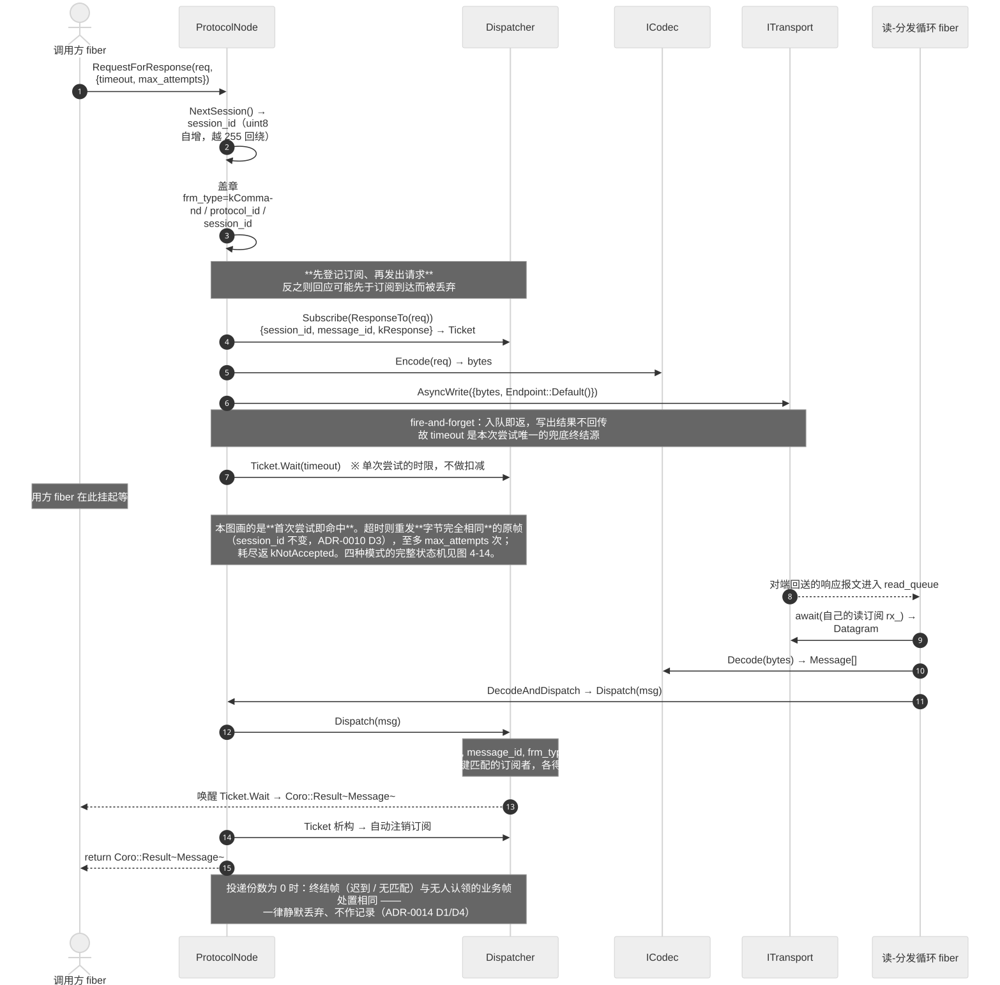

**图例说明**：`RequestForResponse` 的 happy path（**首次尝试即命中**）。本图的用途是把**关联与唤醒闭环**画细——订阅登记、编码、写出、`Ticket` 生存期、读-分发 fiber 的投递路径；四种交互模式的**完整状态机**见 §4.2.12 图 4-14，两图互补而不重复。

三处关键：① **先登记订阅、再发出请求**——反之则回应可能先于订阅到达而被丢弃；② 写出是 **fire-and-forget**，不等实际发出也无从得知是否发出成功，故 `timeout` 是本次尝试**唯一**的兜底终结源；③ `timeout` 是**单次尝试**的时限、**不做扣减**，超时即重发字节完全相同的原帧（`session_id` 不变，ADR-0010 D3），至多 `max_attempts` 次，耗尽返 `kNotAccepted`。请求终结后订阅随 `Ticket` 析构自动注销；session_id 由 `uint8` 计数器自增给出，取用不会失败。

> **变更（ADR-0010 D10，2026-08-26）**：本图原以 `Request(Message, milliseconds)` 作画，该方法**已删除**（#171）；改以其等价替代 `RequestForResponse(req, {timeout, 1})` 重绘。原图例"`timeout` 是本调用唯一的兜底终结源"隐含**总超时**语义（旧 `Request` 的 `Wait(timeout - 已耗时)`），现已改为按次计时。

#### 4.2.5 关闭收敛时序（MS_CLOSE）

**图 4-8（`seq-close`）**

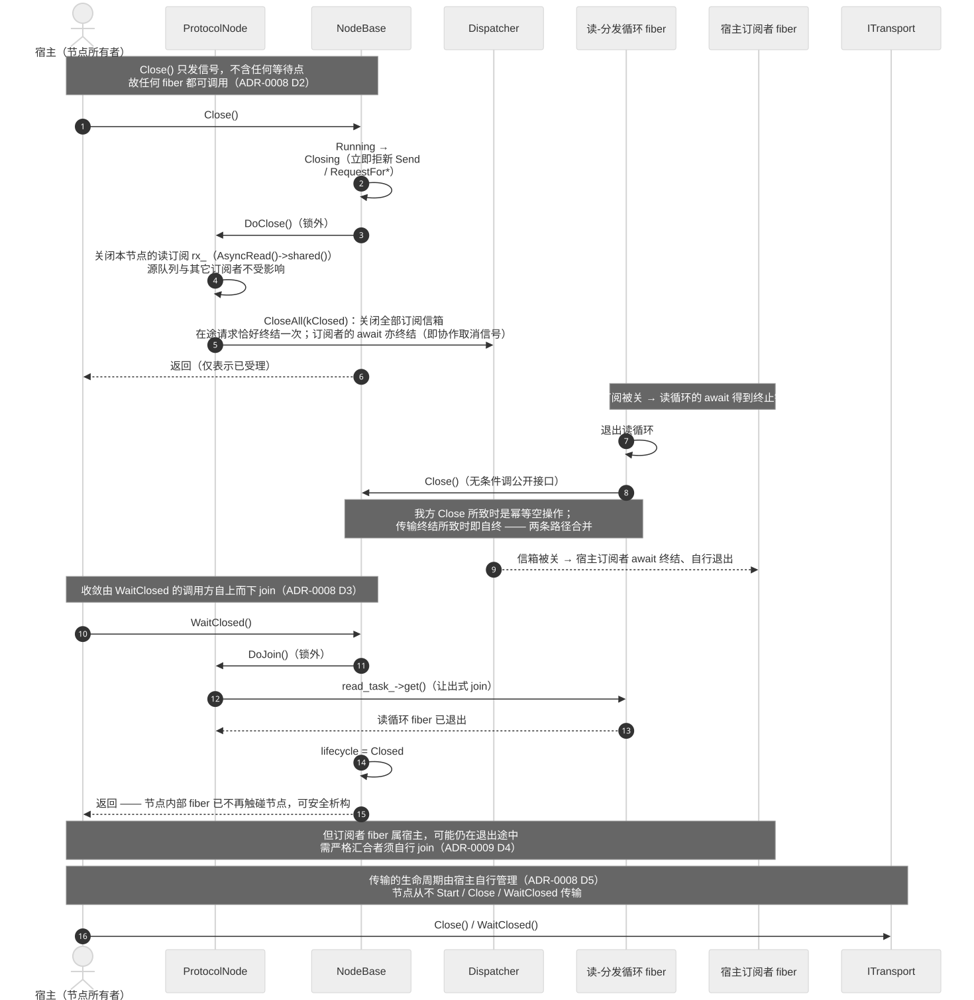

**图例说明（ADR-0008 D2/D3/D5）**：`Close()` **只发信号**（关本节点的读订阅 + `Dispatcher.CloseAll`——后者关闭全部订阅信箱，**即订阅者的协作取消信号**，ADR-0009 D4）即返回，**不含任何等待点**，故读-分发循环与业务处理器均可直接调用它。收敛移出内部 fiber：由 `WaitClosed()` 的调用方经 `DoJoin()` **自上而下** join 读循环与 handler 消费者，返回即全部内部 fiber 已不再触碰节点。读循环退出时无条件调 `Close()`——我方 Close 所致时是幂等空操作、传输终结所致时即自终，两条路径合并为一条。**传输的生命周期由宿主自理**，节点从不启停它。

#### 4.2.6 链路断开处置时序（MS_LINK_DOWN，原 MS_GEN_ISOLATION）

**图 4-9（`seq-link-down`）**

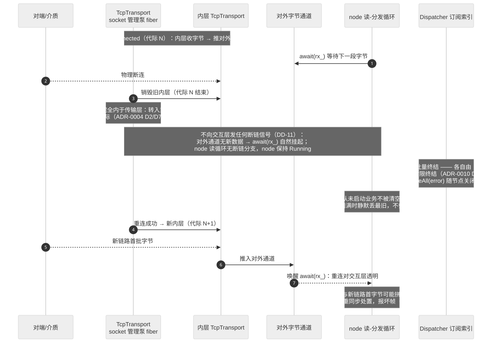

**图例说明（ADR-0004 D1/D3/D4 后的新流程；图已按新流程重绘，源文件随 ID 由 `seq-generation-isolation` 更名 `seq-link-down`，#112）**：链路断开对交互层**完全透明**——`TcpClientTransport` 的 connect-loop 转入重连，`Read` 因对外通道无数据而自然挂起，重连成功后新链路数据到达即被唤醒。node 读循环**无任何断链分支**，node 保持 Running。

**不再发生的动作**（原代际隔离）：不批量终结在途请求、不清空旧链路排队业务、无 reactor 协程、无状态下降沿甄别、**不向交互层发任何断链信号**。在途交互由各自**逐次传参**的阶段时限终结（ADR-0010 D6），或由 `Dispatcher::CloseAll(error)` 随节点关闭一并终结；旧链路排队业务不再被 Drain，故**无「连接代际隔离丢弃」归因**（丢弃归因七项 → 六项 → **五项**，见 DD-10）。

> **变更（#173 / #163，2026-08-26）**：原文"在途请求由各自**总超时（缺省 30 秒）**/取消/关闭终结"两处已不成立——节点级缺省超时 `default_request_timeout` **已删除**（时限改为必填、逐次传参），取消令牌亦随 ADR-0006 D3 退化为时限。归因项数原记"七项减六项"，其后「无 handler」一项随 handler 通道废止而删除（#163），现为**五项**。
>
> **TCP 侧已按 ADR-0011 重构完毕并在编译面内**（#179/#180/#181）。本图保留的是断链处置**决策**（DD-11），机制名已对齐当前接口（`Read()` → `await(rx_)`、`RequestClose()` → `Close()`、`PendingTable` → `Dispatcher` 订阅索引）。

#### 4.2.7 节点生命周期状态（MS_NODE_LIFECYCLE）

**图 4-10（`state-node-lifecycle`）**


**图例说明**：`Created→Running→Closing→Closed`。`Running` 由基类在 `DoStart()` 返回后置位（不再由子类中途回调）；`Closing→Closed` 由 `WaitClosed()` 的 `DoJoin()` 驱动。**并发 Start 不共享结果**——另一次正在初始化时返 `kInvalidState`（旧形态的一次性 latch 会让重试拿到陈旧失败，#150）。**不再需要重入守卫或使用契约**：`Close()` 拆成只发信号之后，内部工作单元直调它是安全的（ADR-0008 D2）。

#### 4.2.8 ~~TCP 连接状态机（MS_CONNECTION）~~ —— 已撤销

> **本节与图 4-11 已撤销（ADR-0011 **D12**，2026-08-27）。** 节号与图号**保留不复用**，以免打断既有交叉引用与追溯登记。
>
> **撤销理由：该状态机没有对应的代码实体。** 原图画 `Disconnected/Connecting/Connected/Reconnecting` 四状态 + 跃迁，但按 ADR-0011 的设计，`TcpTransport` **不持有连接状态枚举、也没有驱动跃迁的代码**——这四个"状态"实际是**外层泵所处的代码位置**：`Connecting` 是泵在等 `connected`，`Reconnecting` 是泵停在 `await_for(close_signal, reconnect_interval)` 的退避上，`Connected` 是泵在内层读流循环里。
>
> **而"泵所处的代码位置"正是图 4-15 画的东西**，且那张图有代码对应。两图讲同一件事、只有一张有实体，故删去无实体的一张。**内容并入 §4.2.13（图 4-15）。**
>
> **链路可用性不受影响**：`CurrentLinkState()` 保留，但它**不需要**任何状态成员——与 `UdpTransport.cpp:320` 同法，当场由 `lifecycle_` 与 `socket_->state()` 算出：未 Running 或无 socket → `kDown`；`ConnectedState` → `kUp`；`ConnectingState`/`HostLookupState`/未连接但泵仍会重试 → `kEstablishing`。最后一支是 TCP 与 UDP 的真正分歧——UDP 未绑定即报 `kDown`（"UDP 无连接，故**永不出现** `kEstablishing`"），而 `kEstablishing` 的枚举注释本就写着"正在建立（TCP 连接中 / **退避重连中**）；仅具连接管理的传输会给出"，这一支正是它存在的理由。
>
> **`ApplyConfig` 热更新的去留仍为待定**（**D11**），与本撤销无关。

#### 4.2.9 订阅凭据生存期状态（MS_TICKET）

**图 4-12（`state-dispatch-ticket`）**


**图例说明**：一票一键，信箱为 `Coro::Awaitable<T>`（队列语义，故同一凭据可多次 `Wait`——分段交互所需）。**注销靠凭据的生存期而非状态枚举**：`~Ticket`/`Reset()` 即从索引摘除，空桶与空 mask 一并清理，使 `Dispatch` 不再探测已无订阅的 mask。`CloseAll` 后再 `Subscribe` 返回的凭据其信箱已关闭，`Wait` 立即得到该终止原因。凭据内部以**弱引用**持有索引，故允许在 `Dispatcher` 析构之后再析构。

#### 4.2.10 传输层 socket 管理泵与读写双队列（MS_TRANSPORT_PUMP）

**图 4-13（`seq-transport-pump`）**

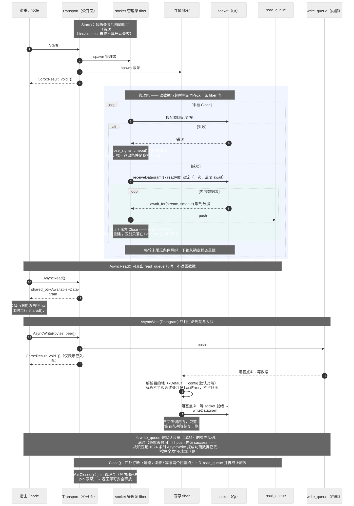

**图例说明（ADR-0007 + ADR-0008，UDP 先行）**：`Start()` 起**管理泵**与**写泵**两条 fiber 后即返回——首次 bind/connect 未成**不算启动失败**。管理泵为双层循环：**外层**按配置绑定/连接，失败则 `await_for(close_signal, timeout)` 退避后重试（**无限重试**，唯一退出条件是我方 `Close`，故 UDP **不自终**）；**内层**反复 `await_for(stream, timeout)` 并把数据投入 `read_queue`。**读数据与超时判断同在管理泵这一条 fiber 内**，且两处 `timeout` 是同一个量（`UdpConfig::silence_timeout`，默认 5s）——有链路时它是"多久没数据算坏"，没链路时它是"多久试一次"。静默超时 / 流终止 / 我方 `Close` 三者在内层**不作区分**，一律 break 回外层重建，区别只落在 `LastError()` 的归因上；每轮末尾无条件解绑，下轮从确定状态重建。
数据面与 socket 生命周期由此**彻底解耦**:重建不波及正在等待的读者。`Read()` **只交出 `read_queue` 句柄**，deadline/取消与是否 `shared()` 扇出全由调用方决定（传输层不设单读守卫）；`Write()` **只入队即返**（fire-and-forget，失败只进 `LastError()`/Trace），链路不可用时数据留在 `write_queue` 等待恢复，恢复后按序全部发出。终止表现为 **`read_queue` 被 `close()` 并携带终止原因**。
**待定（TBD-009）**：两条队列的容量上限与超限处置；硬约束是"丢弃必归因、字节流不得丢弃"。

#### 4.2.11 对象/线程/协程的动态创建与删除（MS_DYNAMIC_LIFECYCLE）

- **fiber（一个 node 内）**：`Start` 时 spawn 读-分发循环 fiber，**共一条**（ADR-0009 D1：内置 handler 消费者 fiber 已废止；订阅者的消费 fiber 属**宿主**，不计入节点内部工作单元）；`Close` **不再 spawn 任何 fiber**，且不含等待点——汇合由 `WaitClosed()` 在调用方 fiber 上 `FiberTask::get()` join 读循环完成（ADR-0008 D2）。**reactor fiber 已随 ADR-0004 D2/D3 取消，finalizer fiber 已随 ADR-0005 D1 取消。** 均由 AsyncTask `makeTask` 创建、返回即终止。
- **传输连接代际（内于传输层）**：`TcpTransport` 的 socket 管理泵每次成功物理连接使内部代际计数 +1；断链后 `abort()` 当前 socket、隔固定间隔（缺省 1s）在**同一 socket 对象**上重连建新代际（ADR-0011 **D3**：不新建对象，`abort()` 已把状态、缓冲与挂起信号一并清除；`Generation()` 已随 **D9** 删除，代际仅内部记账）；断链**不向交互层发任何信号**（完全透明，DD-11）。交互层不参与。
- **DDS 交接**：`DdsTransport` `Start` 对每 topic `Subscribe`，listener 回调在外线程构造 `Sample` 非阻塞 `Push`；`RequestClose` 先 `Unsubscribe` 停投递 → 交接边界 `Close` 唤醒在途 `Read` → provider `Shutdown`；迟到回调只捕获交接边界共享句柄、不触碰已销毁对象。
- **TcpServer 子 node**：每接受一条连接经 NodeFactory 派生 `ProtocolNode` + supervisor fiber；对端断开 → supervisor 驱动该 node `Closing→Closed` 并注销（连接生命=节点生命）。

#### 4.2.12 交互模式时序（MS_INTERACTION_MODES）

**图 4-14（`seq-interaction-modes`）**

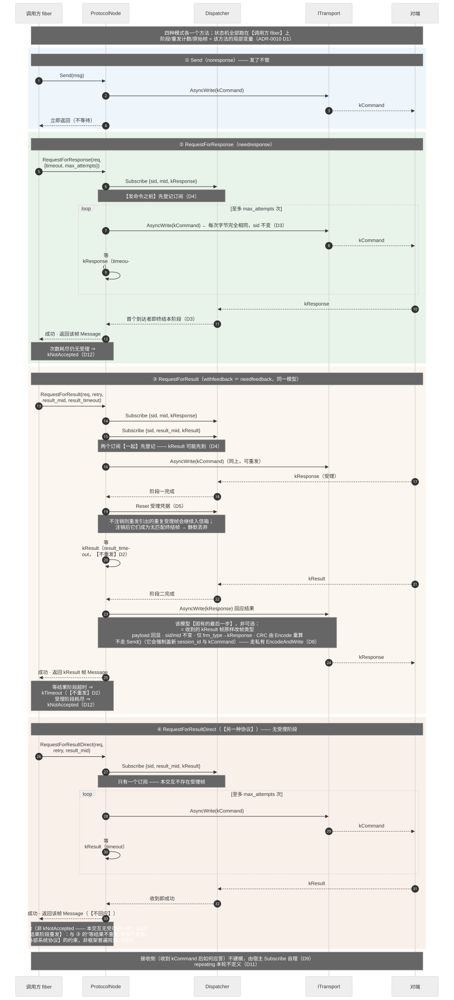

**图例说明（ADR-0010 / RT_NODE_002_a..g）**：四个方法分属**两种协议**——`Send`/`RequestForResponse`/`RequestForResult` 属外部系统协议（其中 `withfeedback` 与 `needfeedback` 为**同一模型**，合用 `RequestForResult`），`RequestForResultDirect` 属另一种协议。**状态机全部跑在调用方 fiber 上**——阶段、已发送次数与原始命令帧都是该方法的局部变量，故节点无"在途交互表"、`Dispatcher` 不认识模式（**D1**）。图中标出四个易错点：② ③ ④ 的订阅**必须在发命令之前登记**（**D4**，`kResult` 可能先于 `kResponse` 到达）；阶段一完成后**立即注销受理凭据**（**D5**，否则重发引出的重复受理帧继续入信箱）；第二阶段超时**不重发**（**D2**，`kResult` 未达意味着对端正在执行）；`RequestForResult` **末尾的回应帧完全由收到的 `kResult` 派生**（**D8**：仅改帧类型，payload/sid/mid 原样，CRC 由编码重算），且**不走 `Send()`**（它会强制盖新 `session_id`）——注意 `RequestForResultDirect` **不回应任何帧**，二者相反。两阶段的失败以不同错误码区分：阶段一耗尽为 `kNotAccepted`、阶段二超时为 `kTimeout`（**D12**）。接收侧不建模（**D9**），`repeating` 本轮不定义（**D11**）。

#### 4.2.13 TCP 传输泵与重连（MS_TCP_PUMP）

**图 4-15（`seq-tcp-pump`）** —— ADR-0011 定稿的形态，**已实现**（#179 读侧 / #180 写侧）。

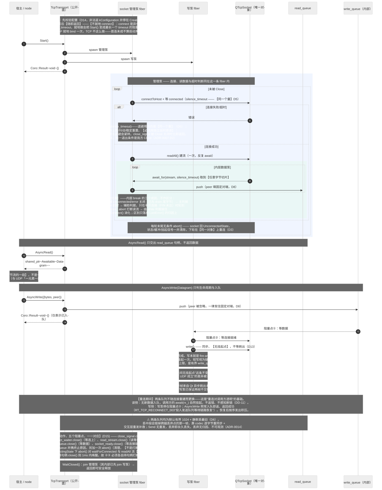

**图例说明**：与图 4-13（UDP 泵）**同构**，差异集中在四处，均已在图上标出：

| | UDP（图 4-13） | TCP（本图） |
|---|---|---|
| 外层动作 | `bind` —— 同步且瞬时 | `connectToHost` + 等 `connected` —— **异步**，但等待用的是**同一个时间量**（D5，不设单独的 `connect_timeout`） |
| 判活主判据 | `silence_timeout`（无连接，**唯一**判据） | **对端断开事件**；静默超时降为**辅助**（半开检测，**D4**） |
| 队列元素 | 一条**完整报文** | **任意字节切片**——组帧归 `ICodec`（RT_TRANSPORT_003） |
| 写侧 | `writeDatagram` 原子，无挂起点 | `write` **会短写**，刷缓冲有挂起点；**仍不做代际号校验**（**D7**） |

**两处刻意与 UDP 保持一致**：① **整个生命期一个 `QTcpSocket`**——每轮末尾 `abort()` 使其回到 `UnconnectedState`，下轮在同一对象上重连（**D3**，对应 UDP 的 bind→close→再 bind）；② **不自终**——连接失败、读流终止、静默超时一律回外层重试，唯一退出条件是我方 `Close`（沿用 ADR-0007 D2）。

**写侧的一条不变式被主动放弃**：`UdpTransport` 头注释写着"取到 socket 到写出之间无挂起点，该不变式**只对 UDP 成立**"。TCP 本可用代际号补上，本设计**选择不补**（**D7**）——断链时写出去半条即半条，由对端重同步。由此两个写泵在这一点上重新一致，且 `RT_TRANSPORT_004` 仍然满足：它禁止的是两帧字节**交错**（单消费者写泵保证），断链**截断**是另一回事。

**连接状态并入本图（ADR-0011 D12）**：原 §4.2.8 / 图 4-11 的四状态机已撤销——`TcpTransport` **不持有连接状态枚举、也没有驱动跃迁的代码**。四个"状态"即本图外层泵的四个代码位置：

| 原状态 | 泵所处位置 | `CurrentLinkState()` |
|---|---|---|
| `Disconnected` | 未 `Start` / 已 `Close`（泵未起或已退出） | `kDown` |
| `Connecting` | 泵在等 `connected`（`silence_timeout` 内） | `kEstablishing` |
| `Reconnecting` | 泵停在 `await_for(close_signal, silence_timeout)` 退避 | `kEstablishing` |
| `Connected` | 泵在内层读流循环里 | `kUp` |

**`CurrentLinkState()` 不需要任何状态成员**——与 `UdpTransport.cpp:320` 同法，当场由 `lifecycle_` 与 `socket_->state()` 算出。TCP 与 UDP 在此有一处真正的分歧：UDP 未绑定即报 `kDown`（其注释明写"UDP 无连接，故**永不出现** `kEstablishing`"），而 TCP 在**退避重连期间应报 `kEstablishing`**——`LinkState` 的枚举注释本就写着"正在建立（TCP 连接中 / **退避重连中**）；仅具连接管理的传输会给出"，这一支正是它存在的理由。

> **`CurrentLinkState()` 的定位（ADR-0011 D12）**：它是**统一的 I/O 事实查询，不面向业务调用方**，仅供**诊断与测试**观测。重连对交互层**完全透明**（DD-11），`ProtocolNode` 不消费它——经核实，`CurrentLinkState()` 在**生产代码中零使用者**，全部命中位于 `tests/`。链路不可用时发送**入队等待**（RT_TCP_RECONNECT_003），调用方不必也不应先查链路状态再决定是否发送。

**丢弃策略见 DD-15。**

#### 4.2.14 串口传输泵与设备重开（MS_SERIAL_PUMP）

**图 4-16（`seq-serial-pump`）** —— ADR-0012 定稿的形态，**已实现**（#193 重写 / #194 旧用例判定）。

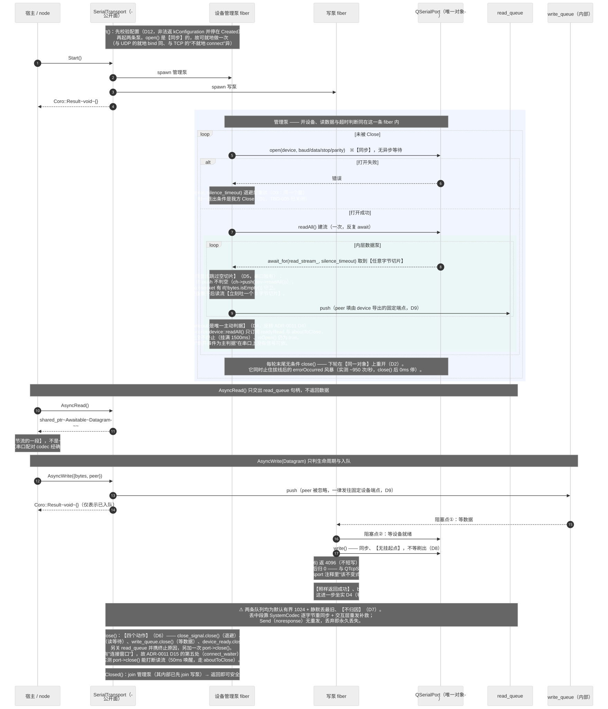

**图例说明**：与图 4-13（UDP 泵）、图 4-15（TCP 泵）**同构**，差异集中在三处，均已在图上标出：

| | UDP | TCP | **串口** |
|---|---|---|---|
| 外层动作 | `bind` —— 同步瞬时 | `connectToHost` —— **异步**，等待用同一个量 | `open` —— **同步**，故**无"等连上"这一处** |
| 判活主判据 | `silence_timeout`（**唯一**） | **对端断开事件**（主）+ 静默超时（辅） | `silence_timeout`（**唯一**，**反转回 UDP 形态**） |
| 空切片 | 不会出现 | 不会出现（`corosocket` 判空） | **必须显式跳过**（`coroiodevice` **不判空**） |

**时间量比 TCP 少一处用途**：串口的 `silence_timeout` 只承担**读静默判活**与**重开退避**两处（TCP 是三处，多一个"等连上"）——因为 `open()` 同步。这一点上串口回到 **UDP 的形态**。

**`Close()` 四处打断，不是 TCP 的五处**：串口**没有"连接窗口"**，故 ADR-0011 **D15** 不适用——实测 `port->close()` **能**打断读流（50ms 唤醒，走 `aboutToClose`），与 TCP 在 `ConnectingState` 下 `abort()` 双双唤不醒的情形**恰好相反**。

**判活判据的三介质分歧见 DD-16**，队列丢弃策略见 **DD-15**。

#### 4.2.15 DDS 双队列与专属写线程（MS_DDS_DUAL_QUEUE）

**图 4-17（`seq-dds-dual-queue`）** —— ADR-0013 定稿的**目标形态**，尚未实现。

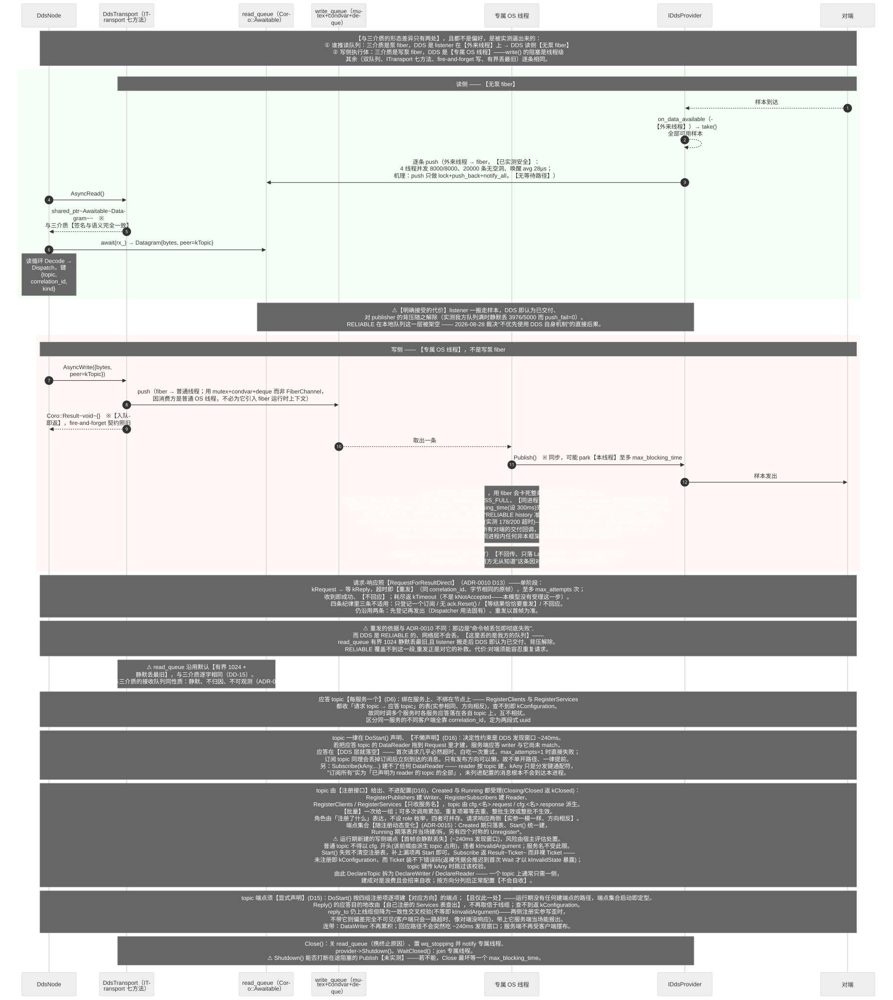

**图例说明**：DDS 沿用与三介质相同的**读写双队列**与完整的 `ITransport` 契约；**形态差异只有两处**，且两处都不是设计偏好，而是**被实测事实逼出来的**（详见 **DD-17**）：

| | UDP / TCP / 串口 | **DDS** |
|---|---|---|
| **谁推读队列** | 泵 fiber 从读流取数后推 | **listener，在外来线程上** → **读侧无泵 fiber** |
| **写侧执行体** | 写泵 fiber | **专属 OS 线程** —— `write()` 的阻塞是**线程级** |
| 其余（双队列 / 七方法 / fire-and-forget 写 / 有界丢最旧） | | **逐条相同** |

**阻塞的真实机理是「同进程交付在发布线程上同步执行」**（2026-09-01 实测）：Fast DDS 默认 `INTRAPROCESS_FULL`，同进程订阅方的 `on_data_available` **直接跑在发布线程上**——回调睡 2000ms 则 `Publish` 跑满 2000ms，而 `max_blocking_time`（设 300ms）**完全不参与**；`set_library_settings(INTRAPROCESS_OFF)` 后同场景降到 1–2ms。**这段阻塞没有上界，界由对端回调决定。**

> **原归因「`RELIABLE` history 满时卡住的是准入」已被证伪**：3.6.1 的 `DataWriterHistory::prepare_change` 中 history 满时**只有 `KEEP_ALL` 才等**，`KEEP_LAST` 直接丢最旧、不等，而 `DdsQos` 铺的正是 `KEEP_LAST`。**结论方向不变（写侧仍须专属 OS 线程），换的是依据。**

**由此多一条硬约束**：专属写线程**会顺带跑掉同进程内所有对端的交付回调**，故「读侧 listener 必须快且不阻塞」**是硬约束不是建议**。我方 listener 满足（只做 `push`，无等待路径）；但**同进程内任何非本框架的慢订阅方都会卡住我方整条写队列**——这是部署面约束，框架无法强制，须写进使用文档。

**两处最容易做错的**：① **`write_queue` 不能是 `FiberChannel`** —— 消费方是普通线程，而 `pop` 在非协程线程上会 crash；② **不得用写泵 fiber 代替专属线程** —— `Publish` 会 park 调用线程，fiber 会卡死整条线程上的所有 fiber，且 `ASYNCHRONOUS_PUBLISH_MODE` **绕不过去**（实测 178/200 超时，它挪走的是网络发送而非准入）。

**请求-响应照 `RequestForResultDirect`**（ADR-0010 **D13**）：`kRequest` → 等 `kReply`，**超时即重发**（同 `correlation_id`、字节相同的原帧），至多 `max_attempts` 次；**收到即成功、不回应**；耗尽返 **`kTimeout`**（不是 `kNotAccepted`——本模型根本没有受理这一步）。

**四条纪律里三条不适用**（这正是它与 `RequestForResult` 的分界）：只登记一个订阅（无受理）、无 `ack.Reset()`、**等结果阶段恰恰要重发**、不回应。**仍沿用两条**：先登记再发出（`Dispatcher` 用法的固有要求）、重发沿用同一 `correlation_id` 且以首帧为准。

**应答 topic 每服务一个、由该服务的全体客户端共用**（**D6**）：它**绑在服务上、不绑在节点上**——`RegisterClients` 与 `RegisterServices` 都收 `请求 topic → 应答 topic` 的表（**实参相同、端点方向相反**，见 **D16**）；`RequestForResultDirect` 按目标 topic 查已注册的 `Clients` 表，**查不到即 `kConfiguration`**。故一个客户端同时调多个服务时，各服务的应答落在各自 topic 上互不相扰。

区分**同一服务的不同客户端**全靠 `correlation_id`，故它定为两段式 `"<uuid>#<request_seq>"`——uuid 在**节点初始化时生成一次**（`QUuid::createUuid()`，`Qt5::Core` 已 PUBLIC 链入，不引入新依赖）保证跨节点不撞；`request_seq`（`uint32`）**从 0 自增**保证节点内不撞，**回绕明确接受**（届时旧订阅早已注销）。自增半段**不叫 `session_id`**——那是外部协议的匹配键，DDS 路径留缺省 `0`，同名会造成阅读陷阱。`Message::correlation_id` 本是 `std::string`，`≤47` 字节装得下，无需改结构。

"客户端过滤是不是给自己的"由 `Dispatcher` 的 `corr` 键天然完成，应用层不写过滤代码；**内部登记用具体 `corr`、公开面登记恒 `kAny`**，这一区别是共用 topic 得以区分客户端的全部根据。

**代价——读入放大**：同一服务的每个客户端都会收到该服务的**全部**应答，`N` 个并发客户端即约 `N` 倍读入量；多余样本一路进 `read_queue_` 并被解码后才落空，故**别人的应答可能把自己的挤掉**（队列有界 1024、静默丢最旧），这加强了 **D7** 重发的必要性。**放大只限于同一服务内**，调多个服务不叠乘。缓解手段 `ContentFilteredTopic` 本轮不采用。

**topic 由【注册接口】给出，不进配置**（**D16**）。`DdsNode` 的用法**不变**——`Publish` / `Subscribe` / `RequestForResultDirect` / `Reply` 的签名与语义一个字不动，换掉的只是"这些 topic 从哪来"：

```cpp
// 【须在 Start() 之前调用】，Running/Closing/Closed 一律返 kInvalidState；【批量】
Coro::Result<void> RegisterPublishers (std::vector<std::string> topics);          // 每个建 Writer
Coro::Result<void> RegisterSubscribers(std::vector<std::string> topics);          // 每个建 Reader
Coro::Result<void> RegisterClients (std::map<std::string, std::string> topics);   // 键 Writer、值 Reader
Coro::Result<void> RegisterServices(std::map<std::string, std::string> topics);   // 键 Reader、值 Writer
```

方法名用**复数**——直说是批量，免得读者以为要一个 topic 调一次。两个 pair 型用 **`std::map`** 而非 `vector<pair>`：天然去重，且从类型上排除"同一请求 topic 配了两个不同应答 topic"。

**只允许 `Start()` 之前注册**：端点集合仍"启动即定型、运行期恒定"，本步只把填结构体换成调四个函数，**没有引入运行期动态端点**——故各路径上都不会突然冒出 ~240ms 发现窗口，`DoStart()` 仍是唯一建端点的地方。

**批量、可多次调用（累加）、重复项幂等去重、整批生效或整批不生效**——半生效的注册会让调用方难判该重试哪些。

**角色由"注册了什么"表达，不设 `role` 枚举**：四者可任意并存（一个节点常兼任服务 A 的服务端与服务 B 的客户端）。另设枚举会招来"`role` 说是服务端却注册了 `Clients`"这类自相矛盾的输入，还得再定优先级规则。

**请求-响应两侧实参一模一样、端点方向相反**：客户端 `RegisterClients` 与服务端 `RegisterServices` 传相同内容，各自按角色建各自那一侧——不会填错方向，也不必协调。

**`DeclareTopic` 随之拆为 `DeclareWriter` / `DeclareReader` 两个方法**（**D15**）：一个 topic 上本节点通常只需要一侧，建成对是浪费且会招来自收（代价 9）。**这两个方法在 `ITransport` 七方法【之外】**——它们是 DDS 端点模型的必需品、三介质没有对应物，但**不改动 `ITransport` 本身**，故"换传输即可运行"的调用方不受影响（**D1**）。

**`IDdsProvider` 增两项**（**D13**）：`MatchedCount()`（判活）与 **`DeclareWriter(topic)`**（写侧端点声明钩子）。后者是 2026-09-01 的补正——初稿只增了 `MatchedCount`，读侧因 `Subscribe(topic, cb)` 碰巧已存在而成立，**写侧则无对应物**，`DeclareWriter` 只能登记意图、`DataWriter` 仍在首次 `Publish` 时惰性建，等于把「首次应答会丢」原样放回。补上后两侧对称：`DeclareReader` → `Subscribe`，`DeclareWriter` → `DeclareWriter`。**不设 `UndeclareWriter`**（端点启动即定型、只在 `Shutdown()` 整体拆除）。**`Publish` 遇未声明 topic 返 `kConfiguration`、不惰性建**——惰性建会让该钩子形同虚设（首帧照样在尚未 `matched` 时发出而丢掉）；且写侧端点启动即定型，运行期冒出未声明的 topic 必然是漏注册而非 I/O 故障，返 `kIo` 会把"配错了"伪装成"网络抖了一下"。已 `Shutdown` 时优先判 `kInvalidState`；该错误在 `DdsTransport` 层按写侧契约不回传、只落 `LastError()`。

**不新增 provider 侧的数据观察者接口**（**D13**）：既有的 `IDdsProvider::Subscribe(topic, cb)`（`cb` 收 `std::vector<uint8_t>`）已经是所需的钩子，`DeclareReader` 落到 provider 就是调它，闭包捕获 `topic` 即可填 `Datagram.peer`。**曾拟新增的 `SetDataObserver(std::function<void(Message)>)` 已否决**——`Message` 是 codec **之后**的产物而 provider 在 codec **之下**（跨层），且它与既有 `Subscribe` 是同一钩子的两种写法（重复）。

**注册与调用一一对应校验**：`Publish` 须已注册为 `Publishers`、`Subscribe(topic, kNotify)` 为 `Subscribers`、`Subscribe(topic, kRequest)` 为 `Services` 的键、`RequestForResultDirect` 为 `Clients` 的键，否则返 `kConfiguration`。这让"忘了注册"从**静默无效**（端点不存在，消息永远不来，看起来像对端没发）变成**显式错误**。**`Subscribe` 的 topic 键传 `kAny` 时跳过该校验**——`kAny` 不对应任何具体 topic，且它本就只在已注册范围内起作用。

**`Subscribe` 因此必须返 `Coro::Result<Ticket>`、不能返裸 `Ticket`**（**D8**）：`Ticket` 装不下 `kConfiguration`；返裸 `Ticket` 只能交出一个空凭据，其 `Wait` 返的是 `kInvalidState`（`Dispatcher.hpp:203`）——**错误码不对，且推迟到第一次 `Wait` 才暴露**，与"显式错误"的初衷正相反。

**`Start()` 失败不清空已注册的内容**（**D16**）：校验失败停在 `Created`，注册表**原样保留**，调用方补上漏项再 `Start()` 一次即可。

**`DdsNodeConfig` 只剩两项**：`uuid_override`（为空才 `QUuid::createUuid()`，测试注入用）与 `trace_sink`。历史遗留的 `inbox_topic` / `node_id` / `handler` / `business_queue_max_*` 一并删除。`DdsConfig`（传输层）保持 `domain_id` / `provider` / `qos`，**不含任何 topic**。

**topic 一律在 `DoStart()` 声明，不懒声明**（**D15/D16**）：决定性约束是 DDS 的发现窗口 **~240ms**（DD-17 的 `kEstablishing`）。若把**应答 topic 的 DataReader** 拖到 `RequestForResultDirect` 里才建，服务端的应答 writer 与它尚未 match，应答**在 DDS 层就落空**——首次请求几乎必然超时、白吃一次重试，`max_attempts == 1` 时直接失败；**订阅 topic 的 DataReader** 同理会丢掉订阅后立刻到达的消息。只有发布方向可以懒，故不为它单开路径，一律提前。

**`Subscribe(kAny, kind)` 建不了任何 DataReader**（**D16**）：DDS 的 reader 按 topic 建，`kAny` 只是分发键的通配符。"订阅所有 topic"的实际语义是「**已声明 topic 的全部**」，**不是**本 domain 上的全部——未列进 `topics` 的消息根本不会到达本进程。**接口文档须明写**，这是确定会被理解反的一处。

**`Reply()` 不做懒声明，运行期没有任何建端点的路径**（**D15**）：`DeclareWriter` / `DeclareReader` 只由 `DoStart()` 调用，端点集合**完全由启动前的注册决定、启动即定型、运行期恒定**。服务端的应答目的地随之改由**自己注册的 `Services` 表查出**，**不再取信于线缆**；查不到返 `kConfiguration`。

**`reply_to` 仍上线缆，但降为一致性交叉校验**：与查出的应答 topic 不等即返 `kInvalidArgument`。保留它不是冗余——两侧注册实参写歪时（客户端在 `cfg.get.reply` 上等、服务端注册成 `cfg.reply` 往外发），**若不带 `reply_to` 这种偏差完全不可见**，客户端只会一路超时，看起来像对端没响应；带上它服务端当场就能报出偏差。

**连带三处收益**：① `DataWriter` 不再累积——原先"每个出现过的 `reply_to` 永久留一个 writer、不回收"那条代价整条消失；② 运行期无 DDS 端点创建，回应路径不会突然吃一个 ~240ms 发现窗口；③ 服务端不再受客户端摆布——`reply_to` 曾是客户端说了算的目的地。

**代价：两侧注册实参歪了只能运行期发现**。跨进程无从静态校验，表现为服务端返 `kInvalidArgument` / `kConfiguration`、客户端重发耗尽后返 `kTimeout`——**两侧各有明确错误码，不是静默失败**。

**自收的精确判据是两个方向集合相交**（代价 9）：Fast DDS 默认不屏蔽同一 participant 内的收发匹配（3.6.1 只提供 `ignore_participant(GUID)`，无自环开关）。按角色注册后，

```
writer 侧 = Publishers ∪ Clients 的键 ∪ Services 的值
reader 侧 = Subscribers ∪ Clients 的值 ∪ Services 的键
自收 ⟺ writer 侧 ∩ reader 侧 ≠ ∅
```

典型用法下交集为空。**最危险的一种已被 D16 的注册校验拦下**——`Clients` 的键 ∩ `Services` 的键（自己请求自己，且 `corr` 由自己生成、`Dispatcher` **会真的匹配上**，形成调用方毫无察觉的自问自答）。**其余交集只造成自收白干、不会误配**（`kind`/`corr` 对不上，落到无订阅者），且可能是调用方有意为之（本地回环自测），故**不拦、只记明，框架不默认屏蔽**。

**topic 端点须显式声明**（**D15**）：`DdsNode::DoStart()` 按 **D16** 的四组注册项逐项建**对应方向**的端点；**且仅此一处**——运行期无建端点路径。`DeclareWriter` / `DeclareReader` 仍要求**幂等**，但理由是**注册里可能重复**（同一 topic 既注册为 `Subscribers`、又是某条 `Clients` 的值），幂等让 `DoStart()` 不必先去重。

**没有"topic 须唯一"这类部署约束**（**D12**）：topic 的合法性在**注册那一刻**判完（非空、键值不同、方向不冲突），`Start()` 只补判"四组注册全空"这一条，返 `kConfiguration`。唯一性的担子整个落在 `correlation_id` 的 uuid 半段上——那是节点自己生成的，无需部署方协调，也不会因配置写错而静默误配。

> **重发的依据与 ADR-0010 不同，须写明**：ADR-0010 那边是"命令帧丢包即彻底失败"，而 **DDS 是 `RELIABLE` 的、网络层不会丢**。**这里丢的是我方的队列**——`read_queue` 有界 1024 静默丢最旧（**DD-15**），且 listener 一搬走样本 DDS 即认为已交付、背压解除。**`RELIABLE` 覆盖不到这一段，重发正是对它的补救。** 代价：**对端须能容忍重复请求**（幂等或自行去重），框架不校验。

### 4.3 接口设计

#### 4.3.1 接口标识和接口图

```
[宿主应用]
   │ 节点/配置/订阅/请求/可观测        (JK_NODE_API 编程接口, CSC_NODE)
   │ 装配 codec                        (JK_CODEC 编解码扩展点, CSC_CODEC)
   ▼
[transport]
   │ ITransport 内部缝                  (JK_TRANSPORT 传输内部接口, CSC_IO)
   │ IDdsProvider                      (JK_PROVIDER DDS 抽象, CSC_IO)
   │ ITraceSink                        (JK_TRACE 观测出口, CSC_CORE)
   ▼
[Qt / Fast DDS / AsyncTask]
```

外部（面向使用方）接口 JK_NODE_API、JK_CODEC、JK_TRACE；内部缝 JK_TRANSPORT、JK_PROVIDER（框架自用，不对使用方开放为主 API）。**JK_OBSERVABLE 已随 ADR-0004 D2 取消**——连接观察能力并入 JK_TRANSPORT 的链路可用性，不再是独立多态缝。

#### 4.3.2 编程接口（JK_NODE_API）
- 优先级：高（核心对外 API）。
- 接口类型：C++ 类/成员函数（`node/ProtocolNode.hpp`、`node/DdsNode.hpp`、`io/tcp/TcpServer.hpp`）。
- 数据元素：`Message`、`std::chrono::milliseconds`（时限）、`RetryPolicy`（ADR-0010）、各 `*Config`、`MessageDispatcher::Key` / `Ticket`、`Coro::Result<Message>` / `Coro::Result<void>`。
  **变更（2026-08-26 核对）**：原文所列 `OperationOptions`（随 ADR-0006 D3 取消令牌一并退化为时限）、`InboundHandler`（随 ADR-0009 废止 handler 通道而删除）、`Status`（别名已删）**均已不存在**。
- 通信方式：同步函数调用；`RequestFor*`/`Send`/`Publish`/`WaitClosed` 为协程内让出式（不阻塞线程）。
- 协议特征：`ProtocolNode(transport,codec,config)` → `Start/Close/WaitClosed`、`Send(Message)`、`RequestForResponse(Message,RetryPolicy)`、`RequestForResult(Message,RetryPolicy,result_mid,result_timeout)`、`RequestForResultDirect(Message,RetryPolicy,result_mid)`、`Subscribe(Key)`；`DdsNode` → `Request(Message,target,options)`、`Publish(Message,topic)`；`TcpServer(config,factory)` 每连接派生 node。
  **变更（ADR-0010，2026-08-26）**：`ProtocolNode::Request(Message,options)` **已删除**（D10，#171）——时限与重试改由 `RetryPolicy` **逐次传参**（D6），节点配置面上不再有任何时限缺省值（#173 删除 `ProtocolNodeConfig::default_request_timeout`）。所列 `DdsNode::Request` 是**另一个方法**（三参、DDS 侧），不受此变更影响。

#### 4.3.3 编解码扩展点（JK_CODEC）
- 优先级：高（公共扩展点）。
- 接口类型：C++ 抽象类 `ICodec`（`codec/ICodec.hpp`）。
- 数据元素：`Message` ↔ `vector<uint8_t>`。
- 通信方式：同步函数调用，收发边界处装配到 node。
- 协议特征：`Encode(Message)→Result<bytes>`（一对一）；`Decode(data,len)→Result<Message[]>`（半包空、粘包多条）；分帧错误 `kFrame`、语义错误 `kCodec`。

#### 4.3.4 观测出口（JK_TRACE）
- 优先级：中（可选，未配置零影响）。
- 接口类型：C++ 抽象类 `ITraceSink`（`core/ITraceSink.hpp`）。
- 数据元素：`TraceEvent`（零分配视图：level/category/message/key/endpoint/error/size 等）。
- 通信方式：push，`OnTrace` 在库内部**可能持锁调用**——实现须快速返回、不阻塞、不回调本库任何 API（重入契约）。
- 协议特征：`TraceCategories.hpp` 定义 **12 个** category 常量（connect / generation / send / recv / decode / match / timeout / cancel / handler / reconnect / lifecycle / drop）。
  **实况标注（2026-08-26 核对）**：当前编译面内**仅 4 个有发射点**——`send` / `recv` / `decode`（`ProtocolNode`）与 `drop`（`RecordDrop` 专用）。`connect` / `generation` / `reconnect` 只由未参与编译的 `TcpClientTransport` 发射；`match` / `timeout` / `cancel` / `lifecycle` / `handler` **无任何发射点**（前四者自 ADR-0006/0008 重设计起即无来源，`handler` 更随 ADR-0009 废止 handler 通道而永久失去来源）。本条描述目标覆盖面，不表示已实现；是否重新接线或删除待评审。
  **实况标注（2026-08-20）**：`match`、`timeout·cancel`、`handler` 三类当前**定义了但无任何发射点**（ADR-0006/0008 重设计遗留漂移，非 ADR-0009 造成）；`handler` 一类随本轮 handler 通道废止而更无来源。是否重新接线或删除待评审。

#### 4.3.5 传输内部接口（JK_TRANSPORT）
- 优先级：高（框架正确性核心，内部缝）。
- 接口类型：C++ 抽象类 `ITransport`（`io/ITransport.hpp`）。
- 数据元素：`Datagram{bytes, peer}`（读写共用；原 `SendUnit` 已随 ADR-0008 D8 合并进本类型，字段 `source` 更名 `peer`）。
- 通信方式：**队列式**（ADR-0007 D1）。传输内部持两条 `Coro::Awaitable` 队列——`read_queue`（传输作**生产者**，把 I/O 收到的数据投入）与 `write_queue`（传输作**消费者**，取出待写 I/O 的数据）。socket 的创建、重建与关闭由传输内部的管理泵负责，对两端**完全透明**。
- 协议特征（**ADR-0008 D1**：七个方法，分三组）：

  | 组 | 方法 | 语义 |
  |---|---|---|
  | 任务 | `Start()` / `Close()` / `WaitClosed()` | 起泵后即返回 / **只发信号，不等待收敛** / join 全部内部工作单元 |
  | 数据 | `AsyncRead()` / `AsyncWrite(Datagram)` | 交出读队列的等待器句柄 / 送入一份数据 |
  | 观测 | `LastError()` / `CurrentLinkState()` | 每种介质都答得出的最小公分母 I/O 事实 |

- **读写刻意不对称**：读是"数据什么时候来"，只能交出等待器，由调用方自行决定超时、取消与是否扇出；写是"把这份数据发到那里去"，调用方给完即返回。因此**写队列是纯内部的**，调用方不感知其存在，也不需要知道它装的是什么。
- **`AsyncRead()` 交出等待器句柄**：签名为 `std::shared_ptr<Coro::Awaitable<Datagram>> AsyncRead()`，**返回 `read_queue` 的句柄而非一份数据**，不接受任何超时参数——超时与取消由调用方自行在句柄上 `await_for` / 接令牌。
  - **是否共享由调用方决定**：需要多消费者扇出时调用方自行 `shared()`；不共享则多个消费者天然抢占——socket 的读取本就是抢占式的。传输层因此**不设单读守卫**（RT_TRANSPORT_004 的该约束已删除）。
  - 未 `Start()` 时交出一个**已以 `kInvalidState` 关闭**的句柄——句柄式接口没有返回错误码的位置，故把该错误作为队列的终止原因交出。
- **`AsyncWrite()` 彻底 fire-and-forget（ADR-0008 D4）**：只判两件事——生命周期是否允许写、是否真的入队；返回成功仅表示"已受理并入队"，**不表示已发出**。目的地能否解析、报文是否超长、socket 是否写成，一律**不回传**，只落 `LastError()`。链路不可用时数据**留在队列中等待恢复**，不拒绝、不丢弃；恢复后按序全部发出（**接受对端可能收到过期数据**）。
  - `Datagram::peer` 在写侧读作**目的地**；`Endpoint::Default()` 表示"发往本传输配置的默认对端"，由实现自行解析，故传输无关的调用方恒可传它。
- **`Close()` / `WaitClosed()` 分工（ADR-0008 D2/D3）**：`Close()` 只发信号即返回、幂等，**不含任何等待点**；`WaitClosed()` join 全部内部工作单元，**不设时限也不返回结果**——`Awaitable::close()` 只保证唤醒等待者，而"可安全释放"要求 fiber 已跑完，只有 `Coro::FiberTask::get()` 给得了，它没有超时，故二者二选一。
- **读取终止语义（DD-11，表达经 ADR-0007 D4 改写）**：传输终结表现为 **`read_queue` 被 `close()` 并携带终止原因**，调用方在等待器上得到该终止错误后应停止读取；其余读取失败为可继续的瞬时错误。**"仅我方 `Close` 才终止"的语义不变**——具备重连能力的传输在内部透明重建，不向调用方暴露链路中断。
- **链路可用性（DD-7）**：`CurrentLinkState()` 返回 `LinkState`，为所有介质同形的当前 I/O 事实；连接管理策略不经本接口暴露。
- **删除的观测面（ADR-0008 D1）**：`LastSendTime()` / `LastReceiveTime()` 已删除——二者无人消费，且与 `LastError()`/`CurrentLinkState()` 不同，它们不是"此刻的 I/O 事实"而是历史记录。
- **待定（TBD-009）**：两条队列的容量上限与超限处置未定。硬约束：任何丢弃**必须归因**；**字节流介质不得丢弃**（丢流中段即帧错乱，正解为有界且满时阻塞生产者）。当前 AsyncTask 默认「有界 1024 + 静默丢最旧」为活跃隐患（#152）。

#### 4.3.6 DDS provider 抽象（JK_PROVIDER）
- 优先级：中。
- 接口类型：C++ 抽象类 `IDdsProvider`（`io/dds/IDdsProvider.hpp`）。
- 数据元素：topic 名、不透明字节、订阅回调。
- 通信方式：`Subscribe` 回调在 provider listener 线程触发（跨线程）。
- 协议特征：`Init/Shutdown/Subscribe/Unsubscribe/Publish`；实现 `FakeDdsProvider`（进程内总线）、`FastDdsProvider`（可选）。

## 5. CSCI 详细设计

各软件单元（CSU）对应 §4.1 部件，细度以"可据此直接编码"为准；结构性类图见 §4.1，本章聚焦逻辑与算法。每个 CSU 给出：单元设计决策 / 设计约束 / 软件逻辑 / 执行时序·数据流。

### 5.1 核心原语详细设计（CSU_CORE）

**单元设计决策**：直接复用 `Coro::Result<T,error_code>`（避免两套 expected 类型；~~原 `Result`/`Status` 两个别名已删除~~）；错误用 `TransportErrc` 机器可判别类别，不解析字符串（DD-5）；`SharedCompletion` 提供多等待者一次性完成（原子首胜 Complete），供多方共享收敛通知。

**设计约束**：不抛异常表达预期失败；并发数据受锁/原子保护；观测原语未配 sink 时仅一次判空（RT_TRACE_002）。

**软件逻辑**：
- **错误承载 / TransportErrc**：统一用 `Coro::Result<T,error_code>`，无返回值者 `Coro::Result<void>`（~~`Result`/`Status` 别名已删除~~）；`TransportErrc` **十四类**（kInvalidArgument/kInvalidState/kConfiguration/kConnection/kClosed/kTimeout/kCancelled/kIo/kFrame/kCodec/kResourceExhausted/kUnsupported/kInternal/**kNotAccepted**）经 `make_error_code` 归入 `transport_error_category()`。
- **Message**：`payload` + 两套元数据——通用交互（kind/correlation_id/reply_to，DDS 路径）与外部协议（frm_type/protocol_id/session_id/message_id，SystemCodec 路径）；`source`/`topic` 由 node 收到时按来源填。
- **Endpoint**：`kDefault`（config 默认目的地）/`kNet(ip,port)`/`kTopic(name)`，经 `SendUnit.destination`/`Datagram.source` 统一寻址。
- **Cancellation**：`CancellationSource.token()` 派发 `CancellationToken`；`Register(cb)` 返回 `CancellationRegistration`（RAII，`Reset` 解注册）；`Cancel` 触发全部回调。
- **~~SharedCompletion<T>~~**：**已删除（ADR-0008 D8）**——它是 `Awaitable::close()` 广播的手工重造。多等待者通知改用 `Awaitable::close()`（唤醒），"等到 fiber 真正跑完"改用 `Coro::FiberTask::get()`（汇合）；二者语义不同，混用正是旧形态把 `WaitClosed` 做成"带 deadline 的 close 等待"却又要求可安全析构的根源（见 §5.4）。
- **Dispatcher<T, Fields...>**：按键分配的消息路由器，详见 §5.2。
  **正确性依据（关键）**：`Coro::Awaitable` 底层 `FiberChannel` 的 `closed_` 是**持久 latch**（`std::atomic_bool`，`close()` 幂等置一次、不复位，随后 `notify_all()`；`pop`/`pop_wait_for` 的谓词均含 `closed_.load()`）。故"查已存结果落空 → 尚未 `await`"这段窗口内发生的 `Complete` **不会丢唤醒**——随后的 `await` 在已关闭通道上立即返回。若 `close()` 只是无 latch 的 `notify_all`，此处即为丢唤醒窗口。`await_for` 超时只 `return timeout`、不触碰 `closed_`，故超时不殃及其他等待者。
  **变更（ADR-0006 D3）**：原实现为每等待者分配独立 `Awaitable` 并维护 `map<id, weak_ptr>`（124 行），其唯一必要性是**每等待者独立取消**——deadline 不需要它（`Awaitable::await_for` 超时返回 `timed_out` 而不关闭 channel），而 `Awaitable::close()` 本就是广播。全仓生产代码无一处向 `WaitClosed` 传取消令牌，故取消能力连同 waiter map 一并移除（约 30 行取代 124 行）。
- **观测**：`RecordDrop(reason, counter, sink)`（计数 pull + 可选 Trace push，持锁调用）；`RecordEvent(category, sink, ...)`（仅 push）；`DropReason` **五项**（原七项：`kGenerationIsolationDrop` 随 ADR-0004 D3 撤销代际隔离而移除；`kNoHandlerConfigured` 随 ADR-0009 废止 handler 通道而移除，#163）；`TraceCategories` **12 个**常量（编译面内仅 4 个有发射点，见 §4.3.4）单一权威。

**执行时序/数据流**：见 §4.2.2（D1/D2/D3 一致性保护）；SharedCompletion 参与 §4.2.5 关闭汇合。

### 5.2 按键分配详细设计（CSU_DISPATCHER）

> 本节取代原 **CSU_PENDINGTABLE**（`node/PendingTable.hpp`，已删除）。ADR-0008 D6。

**单元设计决策**：请求↔响应关联由协议无关的 `Dispatcher<T, Fields...>`（`core/Dispatcher.hpp`）承担。调用方只提供**键提取函数**（给出一条消息各匹配字段的具体值），订阅时不参与匹配的字段填 `kAny`——**部分匹配由本单元实现**，调用方不写通配逻辑、不用哨兵值、不枚举字段组合。

**设计约束**：
- `kAny` 以 `std::optional` 的持值状态表达，**不占用字段值域**，故 `session_id` 这类 0..255 全用满的字段同样可以通配；`kAny` 与"该字段须等于 0"是两种不同的约束。
- 一条消息投给**全部**键匹配的订阅者，各得一份副本（`T` 须可拷贝）；单个订阅只关联一个键，故同一订阅者不会因一条消息收到多份。**不提供"独占投递"模式**——唯一性应由协议在键的设计上保证。
- 单条消息成本 **O(在用 mask 种数 + 收件人数)**，与订阅者总数无关。
- 单线程 fiber 协作，**不加锁**（ADR-0008 D9）：`Subscribe` / `Dispatch` / `~Ticket` 内均无挂起点；`Dispatch` 中的 `resolve` 仅入队并标记等待者就绪、不引发 fiber 切换，故索引在遍历期间保持稳定。键提取函数内不得回调本件。

**软件逻辑**：见 `core/Dispatcher.hpp`。
- 索引为两层：`unordered_map<Mask, unordered_map<Values, vector<Entry>>>`。`Mask` 是"哪些字段被约束"的位图，`Values` 是按该 mask 投影后的键值（未约束的字段置同一占位值）。**外层只保留存在订阅的 mask**，故探测次数随订阅情况自动收敛，既不枚举 2ⁿ 种字段组合，也不逐个求值谓词。
- `Subscribe(Key)`：推导 mask 与投影键值 → 建信箱 → 入索引 → 返回 `Ticket`。已 `CloseAll` 时返回一张信箱已关闭的凭据。
- `Dispatch(const T&)`：跑键提取函数得完整键 → 遍历在用 mask、逐个投影查表 → 命中桶内每个订阅者各 `resolve` 一份 → 返回投递份数。**返回 0 表示无匹配订阅，此时入参未被修改**，调用方可自行处置（转交处理器、归因丢弃）。
- `CloseAll(error)`：关闭全部信箱并置终止标记，令在途 `Wait` 恰好终结一次。
- `Ticket`：持一个信箱 + 析构注销，仅可移动；内部以**弱引用**持有索引，故允许在 `Dispatcher` 析构之后再析构。`Wait(timeout)` 让出式等待，信箱为队列语义——**同一凭据可多次等待**，一次交互需分段等待多条报文时，各段各自登记、各自设定时限。

**执行时序/状态**：见 §4.2.4（请求-响应时序）、§4.2.9（订阅凭据生存期状态）。

### 5.3 入站业务队列（原 CSU_BOUNDEDQUEUE，已删除）

> **已删除（ADR-0008 D8）**：`node/BoundedQueue.hpp` 是 AsyncTask `FiberChannel` 的手工重造（双端队列 + 等待者队列 + 互斥量 + 容量 + 丢弃），故取消，业务队列直接用 `Coro::Awaitable<Event>` + `setCapacity`。

**由此产生的语义变化（一并接受，见 #152）**：
- 满时的行为从 **tail-drop**（拒绝正到达的元素并归因计数）变为 **静默丢弃队首最旧的值**——对业务帧而言是"丢老留新"，与原语义相反；
- **字节数上界消失**，只剩事件数；
- 丢弃**既无计数也无归因**——AsyncTask 不提供丢弃计数，容量是唯一的调节手段。§3.6 的 loss=0 等式因此不再可直接验证。

`DdsTransport` 的跨线程有界交接（原 `BoundedQueue<Sample>`）**已按同一形态跟进完毕**（ADR-0013 **D2/D11**）：listener 在外来线程上直接 `push` 进传输的 `read_queue`，容量与丢弃策略与三介质逐字相同（**DD-15**），**不为它单设归因项**（`DropReason::kDdsHandoffOverflow` 随之删除，五项减为四项）。

### 5.4 节点基类详细设计（CSU_NODEBASE）

> 本节已按 **ADR-0008 D2/D3** 重写。原形态（模板方法 + 收敛并入读循环 + 五个反向回调）见 ADR-0005 D1/D2 与 ADR-0006 D1/D6。

**单元设计决策**：本单元只装**每个节点都有的**生命周期机制——状态机 `Created→Running→Closing→Closed`、幂等 `Start`、关闭仲裁与汇合。基类**非模板**、不持 `ITransport*`、对协议类型无感知；**不 include 任何协议或消息类型**。

**关键决策：`Close()` 只发信号，`WaitClosed()` 单独汇合。** 旧形态的 `Close()` 结尾无条件等待收敛，内部工作单元调用它即等于等自己退出、静默挂死，为此先后尝试过运行时重入守卫（ADR-0005 D6）与使用契约（ADR-0006 D8）。拆开之后：

- `Close()` **不含任何等待点**，因此**任何 fiber 都可调用**，包括节点自己的读-分发循环与入站业务处理器；
- 收敛不再由内部 fiber 自行完成，而由 `WaitClosed()` 的调用方经 `DoJoin()` **自上而下** join。

由此删除五个"子类在钩子中途回调基类"的反向动作——`MarkRunning()`、`SignalClose()`、`ConvergeAfterReadLoop()`、`JoinHandler()`、`DrainUnstartedBusiness()`；基类不再反向驱动子类，也不再需要 `close_signalled_` 握手。

**公开面（4）**：`Start()` / `Close()` / `WaitClosed()` / `IsRunning()`。返回 `Coro::Result<void>` 而非 `bool`——`bool` 会把"已 `Running`（成功）"与"已 `Closing`/`Closed`（RT_LIFECYCLE_003 要求 `InvalidState`）"压成同值，且 RT_LIFECYCLE_007 要求校验失败可据错误改配置重试（ADR-0006 D2 保留）。观测接口 `CloseDropCount()` / `LastCloseLatency()` **已删除**（ADR-0008 D10）。

**子类钩子（3）**：`DoStart()`（配置校验 + 传输就绪 + spawn 各 fiber）、`DoClose()`（发出全部汇合信号，**只发信号、不得等待任何 fiber**）、`DoJoin()`（join 本节点 spawn 的全部 fiber）。原 `ValidateConfig()` 并入 `DoStart()` 开头——它此前独立存在的唯一理由是绕开 `start_done_` 那个一次性 latch，latch 删除后两者行为一致。**配置校验是钩子的可选职责而非必备动作**：子类若无可校验的配置项，`DoStart()` 直接做就绪与 spawn 即可（`ProtocolNode` 自 #173 起即属此列，见 §5.6）。

**成员（4）**：`mutex_` / `lifecycle_` / `starting_` / `joined_`。原 `SharedCompletion` 三例（`start_done_` / `close_signalled_` / `closed_`）、`close_drop_count_`、`close_requested_at_`、`last_close_latency_` 全部删除。

**设计约束**：**持 `mutex_` 期间不调任何钩子、不出现挂起点**——三个钩子一律锁外调用，故基类不需要向子类下达"实现不得取锁、不得挂起"这类反向约束（旧形态的 `DrainUnstartedBusiness()` 正是持锁调用的虚函数）。

**软件逻辑**：见 `node/NodeBase.hpp` / `node/NodeBase.cpp`（92 行）。
- **`Start()`**：临界区内判生命周期并置 `starting_` → **锁外**调 `DoStart()` → 成功则由**基类**置 `Running`。**不承诺并发调用共享同一次初始化结果**：另一次 `Start()` 正在初始化时返 `kInvalidState`。旧形态用一次性 `SharedCompletion` 共享首次结果，而它 latch 后不再更新，第二轮重试的调用方会拿到上一轮的陈旧失败（#150）；启动是宿主调一次的动作，不值得为此保留一个坏 latch。
- **`Close()`**：首个关闭者 `Running→Closing` → **锁外**调 `DoClose()` 发出全部汇合信号即返回。从未 `Start()` 过则直接落 `Closed`（无 fiber 可汇合，不调 `DoClose()`）。幂等，仲裁点为 `lifecycle_` 单点。
- **`WaitClosed()`**：`joined_` 闩保证幂等（`FiberTask::get()` 是一次性的，第二个等待者会立刻拿到假的"已收敛"）→ **锁外**调 `DoJoin()` 让出式 join → 置 `Closed`。返回即意味着全部内部 fiber 已不再运行、不再触碰节点成员——这是"可安全析构"的充分条件。
- **致命错误自终（原 ADR-0005 D5）**：不再是独立分支。读-分发循环退出时**无条件调公开的 `Close()`**——我方 `Close` 所致时是幂等空操作，传输终结所致时即自终。两条路径由此合并为一条，不需要"退出时是否仍 `Running`"的判据。
- **析构**：基类析构时子类已析构完毕、虚派发已退回基类（纯虚 ⇒ UB），故每个具体 node 在**自身**析构函数体内调 `Close()` 后再 `WaitClosed()`。

**执行时序/状态**：见 §4.2.5（关闭收敛）、§4.2.7（生命周期状态），两图已按本节重绘。

### 5.5 交互节点详细设计（CSU_PROTOCOLNODE / CSU_DDSNODE）

> **变更（ADR-0008 D5/D6/D7）**：`ProtocolNode` 已重写，下文中与之冲突处以本注为准。
> - **不再拥有、也不启停传输**：改为按引用借用，宿主负责传输的 `Start` / `Close` / `WaitClosed`；读侧走 `AsyncRead()->shared()` 取自己的一路订阅，`DoClose()` 关闭它。
>   **更正（2026-08-27，AsyncTask 升至 `417790c`）**：原文"**只**关闭该订阅，源队列与其它订阅者**不受影响**"表述有误——`Awaitable::close()` 自上游 `3818265` 起**整流传播**，关闭 hub 表里全部消费者队列（实测确认）。**这正是要的语义**：节点关闭即读侧终结，宿主随后关传输。故准确表述是：一条传输**可**被多个节点共用并各得全量副本，但**任一节点 `Close()` 即终结整条读流**，不支持独立关停。详见 ADR-0008 D5 的更正注。
> - **请求关联改由 `Dispatcher`**：`PendingTable`、`CorrelationKeyStrategy`、`ProtocolKey`、`kResponseMarker` 及"响应命令码归一化"全部删除。键提取收为一行 `make_tuple(session_id, message_id, frm_type)`——帧类型成为键的独立字段后，请求与回应可直接区分。新增公开的 `Subscribe(Key)` 供分段交互与旁路监听。
> - **`session_id` 简化为自增计数器**：`std::uint8_t` 每次取用后自增、越过 255 自然回绕。0..255 空闲集、FIFO 退休窗口、RAII 租约与 `kResourceExhausted` 边界一并删除（推翻 RT_REQUEST_005/006）。
> - **八个观测接口全部删除**，丢弃只经 `ITraceSink` 上报。
> - 公开面收为 5 个：构造 / 析构 / `Request(Message, milliseconds)` / `Send(Message)` / `Subscribe(Key)`，另继承基类的四个生命周期方法。
> - **再变更（ADR-0010 D10，2026-08-26）**：`Request(Message, milliseconds)` **已删除**——与 `RequestForResponse` 语义相近而不相同，后者以 `max_attempts = 1` 完全覆盖其行为。`Send` 保留。
> - **当前公开面（截至 2026-08-26）**：构造 / 析构 / `Send(Message)` / `RequestForResponse` / `RequestForResult` / `RequestForResultDirect` / `Subscribe(Key)`，另继承基类的四个生命周期方法。
> - **新增（ADR-0010，2026-08-26）**：三个交互模式方法 `RequestForResponse` / `RequestForResult` / `RequestForResultDirect`（见下"交互模式"）。`Send` 保留；`Request` 已删除（**D10**）。
> - **配置面（#173，2026-08-26）**：`ProtocolNodeConfig` 现仅余 `protocol_id` 与 `trace_sink` —— `default_request_timeout` **已删除**。它是为已删除的 `Request`（单一总超时）而设，四种交互各阶段的时限是数量级不同的量，一个节点级缺省值套不上去（ADR-0010 **D6**：逐次传参）。由此 `ProtocolNode::ValidateConfig()` 失去唯一校验项、连同 `DoStart()` 中的调用一并删除（留一个恒成功的私有函数属死代码）。
>   **"不得永不超时"的保护未随之丢失**，改由 `ValidateInteraction()` 的**参数校验**承担——它拒绝任何非正的 `RetryPolicy::timeout` / `result_timeout`（返 `kInvalidArgument`），比缺省值更硬：缺省值只在调用方省略时兜底，参数校验则**拒绝**。SRS §3.1.4.4 对应条文已同步作废。

**单元设计决策（DD-3/DD-4）**：继承 `NodeBase`（生命周期），组合 `ICodec`+`Dispatcher`（**ADR-0009**：不再组合 `HandlerLoop`）、**按引用借用** `ITransport`，协议特有语义全内联本类；DdsNode 复用同套基座仅换键字段（D10 实证）。

**设计约束**：`Send` / `RequestFor*` 三个交互方法仅 Running 放行（否则 kClosed；`Request` 已随 ADR-0010 D10 删除）；session_id 空间协议特有（uint8=256）内联 ProtocolNode；correlation_id 确定性（node_id:序号）内联 DdsNode。

**软件逻辑（CSU_PROTOCOLNODE）**：见 `node/ProtocolNode.cpp`。
- **读-分发循环**（ADR-0006 D5 起为 node 的实现细节）：私有 `SpawnReadLoop()` 起一条长寿 fiber，`await(rx_)`（`AsyncRead()->shared()` 取得的本节点读订阅）→ 错误分类（仅 `kClosed` 退出、其余瞬时错误继续）→ 本类 `DecodeAndDispatch()``；退出后调基类 `ConvergeAfterReadLoop()` 兼任收敛者。两个 node 各持一份逐字相同的 13 行——D5 明确接受该重复（"不构成需要共享的机制"）；第三个 node 出现前不宜再抽共享件。
- **键派生**（ADR-0008 D6 后）：无独立策略件——`Dispatcher` 的键提取函数在 `ProtocolNode` 构造期以一行 lambda 给出：`make_tuple(session_id, message_id, frm_type)`。~~`CorrelationKeyStrategy`、`ProtocolKey`、`kResponseMarker` 与"响应键清标记位归一化"~~ 均已删除。
- **session_id**（ADR-0008 D7 后）：`std::uint8_t next_session_` 自增计数器，`NextSession()` 取用后自增、越过 255 自然回绕。~~空闲集 `deque<uint8>`、`pop_front` 取最久释放者、FIFO 退休窗口、`SessionLease` RAII 归还、256 全在途返 `kResourceExhausted`~~ 均已删除；**在途超过 256 时标识重复**，两个订阅落入同一桶、一条响应同时投给二者（SRS RT_REQUEST_MOT_2 已记该边界）。
- **Dispatch**（ADR-0009 D1/D5）：投递给全部键匹配的订阅者，各得一份副本。`kResponse`/`kResult`=响应帧未命中时仍归因 `kUnmatchedOrLateResponse`；**业务帧无人认领则静默丢弃、不归因**（订阅模型下无订阅者是常态而非异常，见 SRS §3.1.5.4）。
- **交互模式（ADR-0010，RT_NODE_002_a..g）**：四个方法，其中三个属**外部系统协议**（`Send` / `RequestForResponse` / `RequestForResult`——后者对应协议里的 `withfeedback` 与 `needfeedback`，二者经核实为**同一个通信模型**），一个属**另一种协议**（`RequestForResultDirect`）。**模式不作参数、不入节点状态**——状态机的阶段、已发送次数与原始命令帧全是该方法的局部变量，活在**调用方 fiber 的栈**上，故节点无"在途交互表"、`Dispatcher` 不认识模式。各方法的公共骨架：
  1. 取 `session_id` → 盖章；
  2. **发命令之前**同时登记两个订阅 `{sid, mid, kResponse}` 与（③④）`{sid, result_mid, kResult}`——`kResult` 可能先于 `kResponse` 到达，等收到受理再登记会丢帧（**D4**）；
  3. 第一阶段：发帧 → 等 `kResponse`，超时则**重发字节完全相同的原帧**（`session_id` 不变，**D3**），至多 `max_attempts` 次；耗尽返 **`kNotAccepted`**（**D12**）；
  4. 收到首个 `kResponse` 后**立即 `Reset()` 该凭据**（**D5**）——否则重发引出的重复受理帧会继续落入信箱；注销后它们成为无匹配终结帧，按 `kUnmatchedOrLateResponse` 归因；
  5. ③④ 第二阶段：等 `kResult`，超时返 `kTimeout`，**不重发**（**D2/D5**：`kResult` 未达意味着对端正在执行）；
  6. `RequestForResult` 收到 `kResult` 后回一帧回应（**该模型固有的最后一步**），该帧**完全由收到的 `kResult` 派生**：payload 原样回显、`session_id`/`message_id` 沿用不变、**仅**把 `frm_type` 改为 `kResponse`，CRC 由 `ICodec::Encode` 重算（`ProtocolNode` 不碰）。**不接受任何调用方参数**，故 ④ 与 ③ **签名相同**。该帧**不得走 `Send()`**（它会强制盖新 `session_id` 与 `kCommand`），走不盖章的私有 `EncodeAndWrite()`（**D8**）。

  7. **`RequestForResultDirect`（另一种协议）**：无受理阶段——登记 `{sid, result_mid, kResult}` 一个订阅，发命令后**直接等结果**，超时即**重发**（与 3 同法），耗尽返 `kTimeout`；收到即成功，**不回应**。其"等结果可重发"与 `RequestForResult` 的"等结果不重发"并存——后者是**外部系统协议**的约束，非框架普遍规则（**D13**）。

  **实现注记**：重发的帧字节完全相同，可编码一次重复写出，不必每次 `Encode`。
  **接收侧不建模**（**D9**）：节点收到 `kCommand` 后如何应答由宿主 `Subscribe` 自理，框架不提供对应辅助。
- **链路断开处置（DD-11/DD-12，取代原 reactor）**：**交互层不参与**——重连由传输内部透明完成，读循环无断链分支。不批量终结在途请求、不清空排队业务、**无 reactor 协程、无能力探测**——三介质同一段读循环（仅区分 `kClosed` 与其余）。
- **处理器能力面（RT_LIFECYCLE_005 / ADR-0006 D8；~~ADR-0009 D1 后仅存 DDS 侧~~ **ADR-0013 后全库不存在**）**：`HandlerContext` 已随 `ProtocolNode` 的 handler 通道一并移除；**`DdsHandlerContext` 亦随 ADR-0013 的 `DdsNode` 重写删除**——新公开面无处理器回调，入站业务一律经 `Subscribe` 交出的凭据由宿主自理。以下为其历史形态留档：~~`DdsHandlerContext` **保留** `RequestClose()`，但其语义为**只发起、不等待**——内部调框架的发信号路径 `SignalCloseIfFirstCloser()` 而非会等待的 `Close()`，受理即返回,收敛由读-分发循环完成。命名与 `ITransport::RequestClose()`（发信号）/ `WaitClosed()`（等待）的既有约定一致。**返回值仅表示"已受理"，不表示"已关完"**；处理器若需确认关闭完成，只能经可观测状态,不得在处理器内等待。

**软件逻辑（CSU_DDSNODE）**：见 `node/DdsNode.cpp`。**本节已按 ADR-0013 整体重写**（`DdsNode` 与 `DdsTransport` 自此均在编译面内）：

- **四个批量注册方法**（**D16**）：`RegisterPublishers` / `RegisterSubscribers` / `RegisterClients` / `RegisterServices`，**只在 `Created` 受理**（其后返 `kInvalidState`），累加 + 幂等去重 + **整批生效或整批不生效**；`Start()` 失败不清空注册表。
- **四个交互方法**（**D8**）：`Subscribe`（返 `Coro::Result<Ticket>`）/ `Publish` / `RequestForResultDirect`（**单阶段**，等结果时重发，耗尽 `kTimeout`）/ `Reply`（查自己的 `Services` 表，`reply_to` 作一致性交叉校验）。
- **关联**（**D6**）：`Dispatcher<Message, topic, correlation_id, kind>`；`correlation_id` 为两段式 `"<uuid>#<request_seq>"`。**`Subscribe` 交出的订阅其 `corr` 位恒 `kAny`，而 `RequestForResultDirect` 内部登记的那一条用【具体值】**——共用应答 topic 之所以能区分客户端全靠这一点。
- **`Subscribe` 的相位**（**D8**，#214 定、2026-09-01 改判）：**只许 `Running`**——`Created` 返 `kInvalidState`（调用序错误，与注册方法在非 `Created` 相位返 `kInvalidState` 对称：**注册只在 `Created`、订阅只在 `Running`**），`Closing` / `Closed` 返 `kClosed`；判据用 `NodeBase::CurrentLifecycle()`（`IsRunning()` 分不出 `Created` 与 `Closed`）。
  **`Start()` 之后再订阅是安全的**：`DataReader` 建于 `DoStart()`、DDS 发现约 **~240ms**，`Start()` 返回后的头 ~240ms 对端还没 `matched`，一条样本都到不了；推荐写法 `Start(); Subscribe();` 中间连让出都没有。**唯一要避免的是** `Start()` 之后先做慢活再订阅。
  **`Created` 期订阅是禁用法**：初版曾允许（理由是"注册 → 订阅 → `Start()`"为结构性零丢失次序），但该论证没算上那 ~240ms 余量，而放行带来了 **#217** 的静默挂起（`NodeBase::Close()` 从 `Created` 走时不调 `DoClose()`，`Dispatcher::CloseAll` 不执行，宿主的消费 fiber 永远等不到关闭信号）。**本次改判不能替代 #217** —— `ProtocolNode::Subscribe` 返裸 `Ticket`、无错误通道，拦不住 `Created` 期订阅。
- **传输的所有权**（**D8**）：节点**借用** `DdsTransport&`，**启停归宿主**——`DdsTransport::WaitClosed()` join 的是专属 OS 线程且最坏等待无上界，节点在 `DoJoin()` 里调它就是阻塞整条 fiber 线程。故节点 `Start()` 前宿主须先启传输。
- 无连接、无 reactor/重连——重连由传输内部透明完成（**DD-11/DD-12**）。

> **已删除的历史形态**（留档以免被旧文引用）：`DdsHandlerContext` / `HandlerLoop` / `PendingTable` / `inbox_topic` / `node_id` / `Request(Message,target)` 一律不再存在。其中 `reply_to=inbox`（每客户端一个信箱 topic）已由 **D6** 取代为**每服务一个、该服务全体客户端共用**的应答 topic。

**执行时序/数据流**：见 §4.2.3/§4.2.4/§4.2.6。

### 5.6 传输层详细设计（CSU_IO）

**单元设计决策（ADR-0007 D1，UDP 先行；TCP 已于 ADR-0011、串口已于 ADR-0012 跟进；DDS 设计见 ADR-0013，尚未实现）**：各介质实现**唯一**的 `ITransport` 契约（含链路可用性，DD-7），并统一为「**socket 管理泵 + 读写双队列**」形态——外层循环负责按配置创建/重建 socket 与失败重试，内层循环把 I/O 数据投入 `read_queue`；写侧由消费者从 `write_queue` 取出发出。socket 的生命周期与数据面由此**彻底解耦**：重建不波及正在等待的读者。**本轮仅 `UdpTransport` 落地该形态**，`TcpClientTransport` 已是其前身（#109 的连接泵 + 对外通道），`TcpTransport`/`SerialTransport` 待跟进（队列策略差异见 TBD-009）。
连接管理（TCP 客户端）与纯管道分离并**维持两层**（ADR-0004 D8：合并只会复制收发语义）；TCP 客户端内部改为**连接泵 + 对外通道**（ADR-0004 D6）；DDS 跨线程有界交接闭合 ADR-0001 未决项。

**设计约束**：并发写串行化保留（RT_TRANSPORT_004；其"单读"约束已随 ADR-0007 D4 删除，`AsyncRead()` 交出等待器句柄、是否共享由调用方 `shared()` 决定）、**发送完成语义与背压已撤销**（DD-6）；UDP/DDS 单次一报文/样本，过大发送前失败；**读取终止语义**（DD-11）：不可重连介质致命错误返 `kClosed`，可重连介质链路中断**对调用方透明**（`Read` 挂起至新链路就绪，不返回任何断链错误）；socket/串口在节点执行域 fiber 内创建（亲和纪律）。

**软件逻辑**：见 `src/io/*`。

> **实况标注（2026-09-01 核对）**：下表中 **`UdpTransport` / `TcpTransport` / `SerialTransport` / `DdsTransport` 四者均已按新形态实现并参与编译**（TCP 依 ADR-0011 #179/#180/#181，串口依 ADR-0012 #193/#194，DDS 依 ADR-0013 #201/#202/#203/#209/#204）。**仍排除于编译面的只剩 `TcpServer`**——本轮不做（ADR-0011 D10）。
>
> **`TcpTransport` 一行是例外**：它描述的是 **ADR-0011 定稿的目标形态**（尚未实现），不是历史代码。当前 `src/io/tcp/` 下的三个 .cpp 仍是重设计之前的实现，且 `TcpClientTransport.hpp:126` 引用着已删除的 `OperationOptions`、**头文件本身无法编译**。

| 单元 | 关键逻辑 |
|---|---|
| **TcpTransport**（ADR-0011 重构后） | **socket 管理泵 + 读写双队列**，与 `UdpTransport` 同构。外层泵：`connectToHost` + 等 `connected`（**用那唯一的 `silence_timeout`**，D5）→ 成功则建 `readAll` 流、`await_for(stream, silence_timeout)` 取切片入 `read_queue`；失败则 `await_for(close_signal, silence_timeout)` 退避。**每轮末尾无条件 `abort()`**，socket 回 `UnconnectedState`，下轮在**同一对象**上重连（**D3**，与 UDP 的 bind→close→再 bind 同模式）。写泵两个阻塞点（等数据 / 等连接就绪），短写循环刷缓冲；**不做代际号校验**——断链时半条即半条，由对端重同步（**D7**）。判活以**断开事件为主**、静默超时为辅（半开检测，**D4**）。**不自终**，唯一退出条件是我方 `Close`。 |
| ~~TcpClientTransport~~ | **已并入 `TcpTransport`**（ADR-0011 **D1**）：重连是 TCP 客户端的固定语义（RT_TCP_RECONNECT_001 不设开关），做成外层泵的一部分即可，无需单设包装类。原分层的理由是"`TcpServer` 复用裸管道"，但服务端连接**不重连**、外层泵形态本就不同，复用的是数据面而非泵形态。 |
| UdpTransport | **socket 管理泵 + 读写双队列**（ADR-0007，样板实现）。外层循环：按配置 bind → 失败**按 `silence_timeout` 所定间隔（默认 5 s）重试、无限重试**，唯一退出条件是我方 `Close`（**不自终**，RT_LIFECYCLE_008 的介质清单已去掉 UDP）。内层循环：`await` 报文流（带**静默超时**，可配、`0` 禁用、默认禁用）→ 投入 `read_queue`；流终止或静默超时 → 退出内层回外层重建。`Read()` 交出 `read_queue` 句柄;`Write()` 投入 `write_queue` 即返（fire-and-forget，链路不可用时排队等待恢复，恢复后按序全部发出）。寻址 kDefault→config 默认 / kNet→ip:port |
| **SerialTransport**（ADR-0012 重构后，**已实现**，#193/#194） | **设备管理泵 + 读写双队列**，与 `Udp`/`TcpTransport` 同构。外层泵：`open()`（**同步**，故无"等连上"这一处）→ 成功则建 `readAll` 流、`await_for(read_stream_, silence_timeout)` 取切片入 `read_queue`；失败则 `await_for(close_signal_, silence_timeout)` 退避。每轮末尾 `port->close()`，下轮在**同一对象**上重开。**唯一时间量** `silence_timeout` 两处共用（读静默 / 退避），比 TCP 少一处。**静默超时是唯一主动判据**（**D4 反转**：串口无断开事件）。**读泵须显式跳过空切片**（**D5**，串口独有）。**不自终**——TBD-005 已关闭，串口自动重开、与 TCP 同构。 |

> **三处"照抄样板就会漏"的串口独有点**（ADR-0012）：
> 1. **跳空切片**（**D5**）——`coroiodevice::readAll()` 的 `readyRead` 处理器是 `ch->push(dev->readAll())`，**无 `bytesAvailable()` 判断、无 `isEmpty()` 守卫**；其初次 drain 处**有**该检查，`corosocket::readAll()` 两处都有。**这是 `coroiodevice` 独有的结构性缺口**，UDP/TCP 都不需要这一行。
>    **注（#193 实测）**：该空切片在 Qt 5.15 / Linux PTY 上**未复现**——去掉 `continue` 后用例仍通过，计数探针亦未观测到。守卫缺失是事实，是否触发依 Qt 版本与设备驱动而异，故该用例定位为**契约断言**而非故障回归。
> 2. **判活判据反转**（**D4**）——实测：设备消失后 `readAll()` 流**完全不终止**（挂满 1500ms，`isOpen()` 仍为 true），因 `coroiodevice::readAll()` **只订阅 `readyRead` 与 `aboutToClose`**（对照 `corosocket::readAll()` 订阅五个，含 socket error 与 `disconnected`）。故 TCP 的"断开事件为主判据"在串口上**没有信号可依**。
> 3. **`errorOccurred` 是噪声而非事件**（**D11**）——实测拔线后以 **~950 次/秒**风暴式连发；`port->close()` 实测 0ms 止住。线路噪声类（`Parity`/`Framing`/`Break`）**只落 `LastError()`、不触发重建**，重建只由静默超时驱动。
| **DdsTransport**（ADR-0013 重构后，**目标形态、尚未实现**） | **读写双队列，完整实现 `ITransport`**，与三介质同形。**读侧无泵 fiber**——provider 的 listener 在**外来线程**上 `take()` 后直接 `push` 进 `read_queue`（跨线程 `push` 已实测安全）；`AsyncRead()` 交出该句柄。**写侧 `AsyncWrite` 入队即返**（fire-and-forget 照旧），由**一条专属 OS 线程**从 `write_queue` 取出并 `Publish`——因 `DataWriter::write()` 的阻塞是**线程级**（实测同进程订阅方回调睡 2000ms 时 `Publish` 跑满 2000ms，且回调就在发布线程上），用 fiber 会卡死整条线程上的所有 fiber。**QoS 统一一套**（**D4**）。链路可用性由 `matched` + `Liveliness` 提供（**D9**）。 |

> **DDS 与三介质的形态差异只有两处**（ADR-0013）：① **谁在推读队列**——三介质是泵 fiber 从读流取数后推，DDS 是 listener 在外来线程上推，**故 DDS 读侧没有泵 fiber**；② **写侧是 OS 线程而非 fiber 写泵**——`Publish` 的阻塞是线程级，这是四个介质里**唯一需要额外线程**的一处。其余（双队列、`ITransport` 七方法、fire-and-forget 写、有界丢最旧）**逐条相同**。
| TcpServer | corotcpserver accept 循环 fiber；每连接经 NodeFactory 派生 ProtocolNode + supervisor fiber |

**执行时序/状态**：见 §4.2.13（TCP 传输泵与重连，图 4-15）、§4.2.10（传输层泵与双队列）、§4.2.11（动态生命周期）。


#### 5.6.1 `TcpTransport` 三条路径的详细设计（ADR-0011）

> **已实现**（ADR-0011，#179/#180；测试见 `tests/tcp_transport_test.cpp` 等四个文件）。下列伪代码是当初实现票的依据，与落地代码一致；与 `UdpTransport` 同名部件一一对应，差异处已标注。

##### 成员（与 UDP 对齐，无连接状态枚举）

```cpp
TcpConfig                                   config_;
QTcpSocket*                                 socket_;         // 【整个生命期一个对象】(D3)
LifecycleState                              lifecycle_;      // Created/Running/Closing/Closed
std::error_code                             last_error_;
std::uint32_t                               generation_{0};  // 内部记账，不对外 (D9/D12)
Endpoint                                    peer_;           // 固定对端，构造时由 config 算出 (D8)
std::shared_ptr<Coro::Awaitable<Datagram>>  read_queue_;     // 有界 1024 丢最旧 (D6)
std::shared_ptr<Coro::Awaitable<Datagram>>  write_queue_;    // 同上
std::shared_ptr<Coro::Awaitable<void>>      socket_ready_;   // 泵→写泵：可以写了
std::shared_ptr<Coro::Awaitable<void>>      close_signal_;   // 打断退避
std::shared_ptr<Coro::Awaitable<void>>      connect_waiter_; // 【每轮重建】等连上，供 Close 打断 (D15)
std::shared_ptr<Coro::Awaitable<QByteArray>> read_stream_;   // 【每轮重建】读流，供 Close 打断 (D15)
Coro::FiberTask<void>*                      write_pump_;     // 由管理泵 join
```

**没有 `ConnectionState` 成员**（D12）：连接状态是泵所处的代码位置，`CurrentLinkState()` 当场由 `lifecycle_` 与 `socket_->state()` 算出。

##### ① 唯一的时间量（D5）

```cpp
struct TcpConfig {
  std::string   host = "127.0.0.1";
  std::uint16_t port = 0;
  /// 唯一的时间量，三处共用：等连上 / 读静默判链路坏 / 连不上时的重连间隔。
  /// **须为正**——它同时是退避间隔，零值退化为紧循环（D14）。
  std::chrono::milliseconds silence_timeout{5000};
  ITraceSink* trace_sink = nullptr;
};
```

与 `UdpTransport` 的做法**逐字相同**——其泵注释写着"两处的 timeout 是**同一个量**：有链路时它是'多久没数据算坏'，没链路时它是'多久试一次 bind'"。TCP 只是多了第三处用途（**等连上**），仍是同一个量；**连接不设单独的时限**。

**与 UDP 的一处不同**：UDP 允许 `silence_timeout == 0`（禁用静默判活，内部回落到默认值），**TCP 不允许**——它同时是重连退避间隔，零值会退化为紧循环。故 TCP 无"0 = 禁用"这一档。

##### ①' 重连的完整设计

**重连不是一个独立机制，而是外层泵 `while` 循环的自然结果。** 本设计里没有"重连模块"、没有重连状态、没有重连专用 fiber——`Connect()` 失败就退避、成功就进内层读流；内层一 `break` 就回到 `while` 顶部再 `Connect()`。**"重连"只是这个循环转了第二圈。**

**首连与重连不作区分**：泵的第一圈就是首连，此后每一圈都是重连，走同一段代码。由此不存在"首连失败"与"重连失败"两套处置。

###### 触发源（三条，内层 `break` 的三个成因）

| # | 触发 | 到达方式 | 归因 |
|---|---|---|---|
| ① | **对端断开** | `readAll()` 流被 `disconnected` / socket error 关闭（**已先 `drain()` 尾字节**）→ `await_for` 返错 | `MapSocketError`，或对端正常关闭时不记 |
| ② | **静默超时** | `await_for(stream, silence_timeout)` 超时 | `kTimeout` |
| ③ | **我方 `Close`** | `socket_->abort()` 打断读流 | 不记——不是故障 |

**三者在内层不作区分，一律 `break` 回外层**：①② 由外层重新 `Connect()` 消化，③ 由 `while (lifecycle_ < kClosing)` 判据接住。这与 `UdpTransport` 的处置**逐字相同**，只是 ① 的成因由"读流终止"具体化为"对端断开"。

**①是主判据、②是辅助判据（D4）**：正常断链走 ①，**立刻**发现；② 只在**半开连接**（对端进程消失、FIN 未达、socket 仍显示 `Connected`）时才轮得到。UDP 相反——它无连接、无断开事件，② 是其**唯一**判据。

###### 完整流转

```
                        ┌──────────────────────────────────────────┐
   Start()              │                                          │
     │                  ▼                                          │
     │   ┌────────► Connect()  ── 失败 ──► await_for(close_signal, │
     │   │              │                   silence_timeout)        │
     │   │              │ 成功                    │                 │
     │   │              ▼                         │                 │
     │   │   socket_ready.discard_pending()       │                 │
     │   │   socket_ready.resolve()   ← 通告写泵  │                 │
     │   │   generation_ + 1                      │                 │
     │   │              │                         │                 │
     │   │              ▼                         │                 │
     │   │   stream = readAll()                   │                 │
     │   │   loop { await_for(stream, silence)    │                 │
     │   │          → push 切片 }                 │                 │
     │   │              │ break（①②③ 之一）      │                 │
     │   │              ▼                         │                 │
     │   └───── socket_->abort() ◄────────────────┘                 │
     │            （每轮末尾无条件）                                 │
     │                  │                                          │
     │                  └──────► while (lifecycle_ < kClosing) ─────┘
     ▼                                    │ 否
   返回（不等首连成功）                    ▼
                              join 写泵 → 关 read_queue → Closed
```

###### `Start()` 不等首连成功

```cpp
Coro::Result<void> TcpTransport::Start() {
  if (lifecycle_ != LifecycleState::kCreated) return kInvalidState;
  if (auto v = ValidateConfig(); !v) return v.error();     // ← 见下"配置校验"
  socket_ = new QTcpSocket();                              // 本 fiber 内创建，守 Qt 对象亲和
  socket_->setProxy(QNetworkProxy::NoProxy);               // #123：不继承环境级代理策略
  lifecycle_ = LifecycleState::kRunning;
  write_pump_ = makeTask([this]{ RunWritePump(); });
  pump_       = makeTask([this]{ RunSocketPump(); });
  return {};                                               // 【不就地 connect】
}
```

**与 UDP 的一处差异**：`UdpTransport::Start()` **就地做一次 `Bind()`**，好让 `LocalPort()` / `CurrentLinkState()` 在返回后即可如实观测。TCP **不这么做**——`connect` 是异步的、要等一个 `silence_timeout`，就地做会把 `Start()` 变成一个最长一个 timeout 的阻塞调用。故 `Start()` 返回时 `CurrentLinkState()` 通常是 `kEstablishing`。

**"首连未成不算启动失败"**（沿用 ADR-0007 D2）：`Start()` 成功仅表示两条泵已起。宿主**不需要**等待首连——链路不可用时发送**入队等待**（RT_TCP_RECONNECT_003），故调用方可以 `Start()` 后立即发送。

###### 配置校验：`Start()` 时一次，失败停在 `Created`

**这是 TCP 与当前 `ProtocolNode` 的一处对照**：`ProtocolNode` 自 #173 起配置面上**已无任何校验项**；而 `TcpTransport` **有**，因为它的配置里有真正会导致灾难的值。

| 字段 | 约束 | 若不校验的后果 |
|---|---|---|
| `host` | 非空 | 连不上且错误信息无意义 |
| `port` | 非 0 | 同上 |
| `silence_timeout` | **须为正**（**D5** 合一后是唯一的时间量） | 三重后果：① 零值退化为**紧循环**（对端主机在而端口未监听时内核立即回 RST，`connect` 微秒级失败，烧 CPU 且向对端刷 SYN）；② 等连上无时限；③ 静默判活失效 |

**合一使校验反而更关键**：原先 `silence_timeout == 0` 只是"禁用静默判活"这一档可选行为；如今它同时是**等连上的时限**与**重连退避间隔**，零值直接导致紧循环。故 TCP **不设**"0 = 禁用"这一档，与 UDP 不同。

校验失败返 `kConfiguration`，**停在 `Created`**、未建 socket、未起泵，允许改配后重试（`RT_LIFECYCLE_007`）。

**这也是 SRS「不可重试失败」清单的落点**（SRS §3.1.7.4）。该清单在"**不自终**"的新形态下如此调和：

| SRS 的"不可重试失败" | 新形态下的处置 |
|---|---|
| 无效配置 | **`Start()` 时一次性拒绝**，根本不进入重连循环 |
| 非法生命周期操作 | `Start()`/`AsyncWrite` 的前置判据返 `kInvalidState` / `kClosed` |
| 显式关闭 | `while (lifecycle_ < kClosing)` 判据接住，泵正常退出 |
| 运行时退出 | `readAll()` 订阅了 `QCoreApplication::aboutToQuit`，流随之关闭 → 走触发源 ① |
| 内部不变量破坏 | 不设专门处置——本设计无跨轮不变量（每轮末尾 `abort()` 回到确定状态） |

**其余一切失败都是可重试的**，一律降为 `LastError()` 的诊断事实，泵**无限重试、不自终**（ADR-0007 **D2**）。SRS 的"可重试失败"清单（拒绝连接、连接超时、网络不可达、临时 DNS 失败、对端关闭或复位、致命 socket I/O 错误）**全部落在这一支**——**包括原本会自终的"致命 socket I/O 错误"**（ADR-0007 D2 已把 ADR-0005 D5 的自终适用介质缩小，本设计沿用）。

###### 退避：固定间隔，可被 `Close` 提前打断

```cpp
Coro::await_for(close_signal_, config_.silence_timeout);   // 唯一的时间量 (D5)
```

**必须用独立的延时原语**，不能拿"在未连接的 socket 上建读流"当退避——`UdpTransport` 的注释记着同一个坑（未 bind 的 socket 上建流会被当场关闭，`await_for` 0ms 返回 `no_message`，退避退化为紧转）。

`close_signal_` 被 `Close()` 关闭时**立即返回**，故退避可提前打断——否则一次 `Close()` 最坏要等一个 `silence_timeout`。

**无倍率、上限、抖动、稳定重置**（沿用 ADR-0005 **D4**，四套参数已撤销），且**不再是独立旋钮**——退避间隔就是那唯一的 `silence_timeout`（**D5**）。保留非零间隔的**唯一**理由是上表那一行的紧循环，与"退避"这一策略无关。

###### 重连期间：读侧与写侧的行为

**两条队列不随连接重建而更换**——这是"重连对调用方透明"的实现基础。

| | 重连期间 | 恢复后 |
|---|---|---|
| **读侧** | `read_queue` 无新数据入队；调用方的 `await(rx_)` **自然挂起**，不返回错误、不感知断链（DD-11） | 新链路首字节照常入队；**残尾与首字节可能拼成错帧**，由 codec 重同步（代价 3） |
| **写侧** | 写泵停在**阻塞点②**（等 `socket_ready_`）；`AsyncWrite` 照常**入队即返、返回成功**（RT_TCP_RECONNECT_003："投入发送队列等待链路恢复，不拒绝、不丢弃"） | 泵 `resolve()` 通告 → 写泵醒 → 按序发出积压 |

**积压超过 1024 条时静默丢最旧**（**D6**）——这是 RT_TCP_RECONNECT_003 那句"不拒绝、不丢弃"的**限定**：不拒绝始终成立，不丢弃只在**未超界时**成立。

**`socket_ready_` 的"先清后发"**：每轮外层都是一次真实的 down→up 跃迁，而写泵停在"等数据"（阻塞点①）时没人来取就绪信号，不清就会一直堆积。写泵若正停在阻塞点②，队列本就是空的，清是空操作、随后的 `resolve()` 照常叫醒它——**信号因此恒定只有 0 或 1 个 token**。

###### 代际（`generation_`）：只用于记账，不参与任何判定

每次 `Connect()` 成功 `+1`。**它不驱动任何控制流**：

- **不对外暴露**（`Generation()` 已随 **D9** 删除）；
- **写侧不校验代际**（**D7**）——断链时半条即半条；
- **不做代际隔离**——交互层不再于断链时批量终结在途请求（**DD-12**，代际隔离已撤销）；
- 唯一用途是 **Trace 事件的归类**与内部判重。

**为什么仍然保留**：断链重连若在诊断时无法分辨"哪一次连接"，Trace 事件将无法归组。这是纯观测需求，成本是一个 `std::uint32_t`。

###### 与节点层的关系：完全不通知（DD-11）

断链**不向交互层发任何信号**。节点保持 `Running`，读循环没有断链分支，在途交互**不被批量终结**——各自由**逐次传参**的阶段时限（ADR-0010 **D6**）或节点关闭时的 `Dispatcher::CloseAll` 终结。这是 `MS_LINK_DOWN`（图 4-9）画的内容，本设计不改其结论，只把机制名对齐到新形态。

##### ② 读路径 —— `RunSocketPump()`（外层 socket 管理 + 内层数据泵）

```cpp
void TcpTransport::RunSocketPump() {
  const auto timeout = config_.silence_timeout;   // 【唯一的时间量】(D5)，三处共用
  while (lifecycle_ < LifecycleState::kClosing) {
    // 发起连接并等待。用的就是那一个量——【不设单独的 connect_timeout】(D5)。
    // 句柄【存成成员】，因为 Close() 要靠 close() 它来打断：实测 abort() 在连接
    // 窗口内唤不醒任何等待（D15）。
    connect_waiter_ = Coro::coro(socket_).connectToHost(config_.host, config_.port);
    if (Coro::await_for(connect_waiter_, timeout)) {
      ++generation_;                              // 纯内部记账 (D9/D12)
      // 通告写泵。【先清后发】：每轮外层都是一次真实的 down→up 跃迁，而写泵停在
      // "等数据"时没人来取，不清就会一直堆积。信号因此恒定只有 0 或 1 个 token。
      socket_ready_->channel()->discard_pending();
      socket_ready_->resolve();

      // 每代重建读流（旧流已随上一轮 abort 死掉）。同样【存成成员】供 Close 打断 (D15)。
      read_stream_ = Coro::coro(socket_).readAll();
      for (;;) {
        auto chunk = Coro::await_for(read_stream_, timeout);   // ← 同一个量
        if (!chunk) {
          // 归因只落 LastError，不改控制流。三条成因【不作区分】，一律 break 回外层重连：
          //   ① 对端断开 —— 【主判据】(D4)，经流的自然终止到达；
          //   ② 静默超时 —— 【辅助判据】(D4)，只在半开连接（FIN 未达）时才轮到它；
          //   ③ 我方 Close —— 由 while 判据接住。
          if (chunk.error() == std::errc::timed_out) {
            last_error_ = make_error_code(TransportErrc::kTimeout);
          } else if (是 socket 错误) {
            last_error_ = MapSocketError(chunk.error());
          }
          break;
        }
        // chunk 是【任意字节切片】，不是一个完整帧（RT_TRANSPORT_003）；组帧归 ICodec。
        Datagram out{ 转字节(chunk.value()), peer_ };   // peer 固定对端 (D8)
        if (read_queue_->channel()->push(std::move(out)) != success) {
          break;   // read_queue 已关闭（我方 Close）→ 停止投递，回外层判生命周期
        }
      }
      read_stream_.reset();
    } else {
      // 连不上：归因后退避。close_signal_ 被 Close 关闭时立即返回，故退避可提前打断。
      last_error_ = MapSocketError(...);          // 不自终，降为诊断事实
      Coro::await_for(close_signal_, timeout);    // ← 退避，仍是同一个量
    }
    connect_waiter_.reset();
    // 每轮末尾【无条件 abort()】(D3)：socket 回 UnconnectedState，状态、缓冲与挂起的
    // 信号一并清除，下一轮从这一个确定状态重建 —— 不必区分上轮是怎么结束的，
    // 也【不需要新建 socket 对象】。对已断开的 socket 调 abort() 是空操作。
    // 注意它是【清理动作，不是打断手段】—— 实测在连接窗口内它唤不醒任何等待 (D15)。
    socket_->abort();
  }

  // 收尾：先 join 写泵（确保它不再碰 socket），再关读队列、落 Closed。
  if (write_pump_) (void)write_pump_->get();
  CloseQueue(read_queue_, make_error_code(TransportErrc::kClosed));
  lifecycle_ = LifecycleState::kClosed;
}
```

**断链为什么不需要单独订阅 `waitForDisconnected()`**：`corosocket.hpp` 的 `readAll()` 在 `disconnected` 与 socket error 两个信号上**都先 `drain()` 残留字节、再 `channel->close()`**。故断链经由**读流的自然终止**到达读泵，且**尾字节不丢**。`readAll()` 亦只推送非空切片，本循环无须判空。

**这也是 D4「主判据/辅助判据」的实现形态**：正常断链由流终止立刻发现，静默超时只在**半开连接**（对端进程消失、FIN 未达、socket 仍显示 `Connected`）时才轮得到。

##### ③ 写路径 —— `RunWritePump()`（两个阻塞点，与 UDP 同构）

```cpp
void TcpTransport::RunWritePump() {
  for (;;) {
    // ── 阻塞点①：等数据 ──（Close 关 write_queue 唤醒）
    auto item = Coro::await(write_queue_);
    if (!item) return;                       // 队列被关闭 → 退出（残留随之丢弃）
    const Datagram& unit = item.value();
    // unit.peer 【被忽略】：TCP 点对点，一律发往固定对端 (D8)。不判 kInvalidArgument ——
    // 那会让"传输无关的调用方"在 TCP 上跑不起来。

    // ── 阻塞点②：等连接就绪 ──（Close 关 socket_ready 唤醒）
    for (;;) {
      if (lifecycle_ >= LifecycleState::kClosing) return;
      if (socket_->state() == QAbstractSocket::ConnectedState) break;
      socket_ready_->channel()->discard_pending();     // 清陈旧标记
      if (!Coro::await(socket_ready_)) return;
    }

    // ── 写出 ──【同步，无挂起点】(D13)
    // setWriteBufferSize 全仓未设（Qt 默认 0 = 无上限），故 write() 接受全部数据后
    // 立即返回。【不等 bytesWritten、不等 bytesToWrite() == 0】——写本就是
    // fire-and-forget（ADR-0007 D3），等刷出不改变该语义、只让写泵多挂起一次。
    const qint64 size = 字节数(unit);
    const qint64 n = socket_->write(数据首址(unit), size);
    if (n < 0) {
      last_error_ = MapSocketError(...);          // 写失败 → 放弃本条
    } else if (n != size) {
      last_error_ = make_error_code(TransportErrc::kIo);   // 短写视为链路异常：
      // 【放弃残余，不循环重试】—— 既然不等刷出，短写就没有可等的东西。
      // 残余丢失落在 D7 的既定范围内：写了半条即半条，由对端重同步。
    }
    // 回阻塞点①取下一条。
  }
}
```

**写泵由此没有挂起点（D13）**，这带来一个结构性结果：`UdpTransport` 头注释中那条不变式——"**取到 socket 到写出之间没有挂起点**"——**对 TCP 也成立**。原注释写着"该不变式**只对 UDP 成立**（串口/TCP 的写有挂起点）"，本设计**消除了这条差异**：两个写泵在结构上完全同构，TCP 侧只多了"等连接就绪"这一个阻塞点的语义（UDP 是"等 bind 就绪"）。

**半帧从何而来（与 D7 的衔接）**：既然写泵自身无挂起点，半帧就**不是**"写到一半被调度走"造成的；而是 `write()` 把字节交给 Qt 内部缓冲后，其**异步刷出**尚未完成时链路断开、`abort()` 丢弃了未刷出的部分。成因在 Qt 侧，我方无从保证、也**不打算**保证（**D7**）。

**明确接受的代价：Qt 内部写缓冲无上限。** 链路长时间慢或断时，已交给 Qt 的字节在其内部缓冲里积压——这是**有界的 `write_queue_` 挡不住的部分**（它只挡"还没交给 Qt"的那一段）。若需给它设上界，可调 `setWriteBufferSize(N)`，但那会让 `write()` **真的开始短写**，届时须连同 **D13** 与 **D7** 一并重新评审。**本轮不设。**

**单消费者写泵保证 `RT_TRANSPORT_004`**（并发写串行化、两帧字节不交错）。**断链截断不属于交错**——它是一帧被切断，不是两帧被穿插。

##### ④ `Close()` 的打断点：五个动作，五个阻塞点，一一对应

`UdpTransport::Close()` 的注释写着"**四处打断缺一不可**——漏一处即一次收敛挂死"。TCP 是**五处**：

| # | 阻塞点 | 由谁打断 |
|---|---|---|
| ① | 管理泵：`await_for(close_signal_, timeout)` 退避 | `close_signal_->close()` |
| ② | 管理泵：`await_for(connect_waiter_, timeout)` 等连上 | **`connect_waiter_->close()`**（D15） |
| ③ | 管理泵：`await_for(read_stream_, timeout)` 读等待 | **`read_stream_->close()`**（D15） |
| ④ | 写泵：`await(write_queue_)` 等数据 | `write_queue_->close()` + `discard_pending()` |
| ⑤ | 写泵：`await(socket_ready_)` 等连接就绪 | `socket_ready_->close()` |

另加一次 `socket_->abort()`——**它是清理动作，不是打断手段**。

> **这推翻了本节初稿的说法。** 初稿写着"`socket_->abort()` 一处覆盖 ②③，故动作数与 UDP 相同"。**实测证伪**（D15 的三个探针）：socket 处于 `ConnectingState` 时 `abort()` 对 `waitForConnected()` 与 `readAll()` 流**双双唤不醒**，均挂满 3000ms 超时；而持句柄 `close()` **1 毫秒内**两处都醒。
>
> 成因：Qt 的 `QAbstractSocket::abort()` 在**连接中**的 socket 上**不发 `errorOccurred`**，而 `corosocket` 的 `waitForSignal` / `readAll` 都靠 socket error 或 `disconnected` 终结。UDP 没有这个窗口——它的 `bind()` 是同步的，其 `socket_->close()` 打断活跃读流是实测有效的。
>
> 若不改：`Close()` 若恰好落在一次连不上的连接尝试中，最坏要等**一整个 `silence_timeout`** 才收敛。故 ②③ 必须各自持句柄打断，**缺一不可**。`Close()` **只发信号、不等收敛**，收尾由管理泵自己跑完；`WaitClosed()` join 管理泵（其内部已先 join 写泵），返回即"两条 fiber 都不再触碰本对象"。

##### ⑤ `CurrentLinkState()` —— 无状态成员，当场算出

```cpp
LinkState TcpTransport::CurrentLinkState() const {
  if (lifecycle_ != LifecycleState::kRunning || !socket_) return LinkState::kDown;
  switch (socket_->state()) {
    case QAbstractSocket::ConnectedState:                          return LinkState::kUp;
    case QAbstractSocket::ConnectingState:
    case QAbstractSocket::HostLookupState:                         return LinkState::kEstablishing;
    default:                                                       return LinkState::kEstablishing;
    // ↑ 未连接但泵仍会重试 —— 这一支是 TCP 与 UDP 的【真正分歧】。
    //   UDP 未绑定即报 kDown（"UDP 无连接，故永不出现 kEstablishing"）；
    //   而 kEstablishing 的枚举注释本就写着"正在建立（TCP 连接中 / 退避重连中）"。
  }
}
```

**定位见 §4.2.13**：统一的 I/O 事实查询，**不面向业务调用方**，仅供诊断与测试观测。

### 5.7 编解码层详细设计（CSU_CODEC）

**单元设计决策**：`ICodec` 可有状态（`SystemCodec` 单线程喂滚动缓冲）或无状态并发（`DdsCodec` 多 listener 线程并发喂）；坏帧诊断 + 重同步。

**设计约束**：`Encode` 一对一；`Decode` 半包返回空、粘包返回多条；分帧错误 `kFrame`、语义错误 `kCodec`。**不设重置操作**（ADR-0004 D4 撤销）——透明重连后残尾与新链路首字节拼成的错帧，由既有校验与重同步处置（报坏帧、计入坏帧计数后恢复）。

**软件逻辑**：`SystemCodec`（外部协议流式，占位帧常量 TBD-003，跨切片拼帧 + 重同步）；`DatagramCodec`（报文式保边界）；`DdsCodec`（kind/correlation_id/reply_to 元数据，无状态）；`LengthFieldCodec`（长度字段分帧基元）。

**执行时序/数据流**：见 §4.2.3（Decode 在读循环、Encode 在出站）。

## 6. 需求可追踪性

与 REF-1（SRS）构成追溯关系。§6.1 为本文档每个设计单元到 SRS 需求的对应；§6.2 为每个 SRS 需求到设计单元的对应。

### 6.1 设计单元 → 需求

| 设计单元 | 类型 | 对应 SRS 需求 | 章节 |
|---|---|---|---|
| DD-1..DD-17 | 设计决策 | 见各决策标注（DD-11/12 由 ADR-0004 引入，DD-13 由 ADR-0005 引入且已被 ADR-0008 推翻，DD-14 由 ADR-0010 引入） | §3 |
| CSC_CORE | 部件 | RT_ERROR、RT_DATA_MESSAGE、RT_TRACE、RT_DESIGN_005 | §4.1.1、§5.1 |
| CSC_IO | 部件 | RT_TRANSPORT、RT_TCP_RECONNECT/RECONFIG、RT_IF_*、RT_IN_INTERFACE_002/003 | §4.1.2、§5.6 |
| CSC_CODEC | 部件 | RT_CODEC、RT_IF_SYSFRAME | §4.1.3、§5.7 |
| CSC_NODE | 部件 | RT_NODE、RT_REQUEST、RT_INBOUND、RT_LIFECYCLE、RT_DESIGN_003/008 | §4.1.4、§5.2–5.5 |
| MS_DFD_CONTEXT / MS_DFD_TOPLEVEL | 执行方案 | RT_IN_INTERFACE_001、RT_TRANSPORT、RT_REQUEST | §4.2.1、§4.2.2 |
| MS_NODE_DATAFLOW / MS_REQ_RESP | 执行方案 | RT_REQUEST、RT_NODE_003 | §4.2.3、§4.2.4 |
| MS_CLOSE / MS_NODE_LIFECYCLE | 执行方案 | RT_LIFECYCLE_001/003–007 | §4.2.5、§4.2.7 |
| MS_TRANSPORT_PUMP | 执行方案 | RT_TRANSPORT_008/010、RT_IF_UDP、RT_LIFECYCLE_008 | §4.2.10 |
| MS_LINK_DOWN | 执行方案 | RT_TCP_RECONNECT、RT_TRANSPORT_008 | §4.2.6 |
| ~~MS_CONNECTION~~ | **已撤销**（ADR-0011 D12）——无代码实体，并入 MS_TCP_PUMP | RT_LIFECYCLE_002 | §4.2.13 |
| MS_INTERACTION_MODES | 执行方案 | RT_NODE_002_a..g | §4.2.12 |
| MS_TCP_PUMP | 执行方案 | RT_TCP_RECONNECT_001..005、RT_TRANSPORT_003/004/010 | §4.2.13 |
| MS_SERIAL_PUMP | 执行方案 | RT_IF_SERIAL、RT_TRANSPORT_003/009/010、RT_NODE_006 | §4.2.14 |
| MS_DDS_DUAL_QUEUE | 执行方案 | RT_IF_DDS、RT_IN_INTERFACE_003、RT_NODE_007、RT_TRANSPORT_010 | §4.2.15 |
| MS_TICKET | 执行方案 | RT_REQUEST_003/004 | §4.2.9 |
| MS_DYNAMIC_LIFECYCLE | 执行方案 | RT_CORO_RUNTIME、RT_NODE_004、RT_DESIGN_004 | §4.2.11 |
| JK_NODE_API | 接口 | RT_IF_API | §4.3.2 |
| JK_CODEC | 接口 | RT_CODEC、RT_IF_SYSFRAME、RT_DESIGN_006 | §4.3.3 |
| JK_TRACE | 接口 | RT_TRACE_001/002 | §4.3.4 |
| JK_TRANSPORT | 接口 | RT_IN_INTERFACE_002、RT_TRANSPORT_008/009/010 | §4.3.5 |
| JK_PROVIDER | 接口 | RT_IN_INTERFACE_003、RT_IF_DDS | §4.3.6 |
| CSU_CORE | 详细设计 | RT_ERROR、RT_DATA_MESSAGE、RT_TRACE、RT_CORO_RUNTIME_005 | §5.1 |
| CSU_DISPATCHER | 详细设计 | RT_REQUEST_001..004、RT_IN_INTERFACE_004、RT_DESIGN_008 | §5.2 |
| ~~CSU_BOUNDEDQUEUE~~ | 已删除（ADR-0008 D8） | RT_DATA_BUFFER 的上界与归因**不再满足**；原 RT_HANDLER_004 已由 RT_INBOUND_003 承接（改由结构保证，不依赖队列上界） | §5.3 |
| CSU_NODEBASE | 详细设计 | RT_LIFECYCLE、RT_NODE_003、RT_DESIGN_008 | §5.4 |
| CSU_PROTOCOLNODE | 详细设计 | RT_REQUEST、RT_NODE_002_a..g（DD-14）、RT_NODE_003、RT_INBOUND、RT_TCP_RECONNECT | §5.5 |
| CSU_DDSNODE | 详细设计 | RT_NODE_004/005/007、RT_IF_DDS、RT_REQUEST | §5.5 |
| CSU_IO | 详细设计 | RT_TRANSPORT、RT_TCP_RECONNECT/RECONFIG、RT_NODE_006、RT_IF_* | §5.6 |
| CSU_CODEC | 详细设计 | RT_CODEC、RT_IF_SYSFRAME | §5.7 |

### 6.2 需求 → 设计单元

| SRS 需求 | 对应设计单元 |
|---|---|
| RT_CORO_RUNTIME_001..005 | DD-2 / CSC_CORE、CSC_NODE / CSU_NODEBASE / MS_DYNAMIC_LIFECYCLE |
| RT_TRANSPORT_001..009 | DD-6、DD-11 / CSC_IO / CSU_IO / JK_TRANSPORT / MS_DFD_TOPLEVEL |
| RT_CODEC_001..006 | CSC_CODEC / CSU_CODEC / JK_CODEC |
| RT_REQUEST_001..006 | DD-8 / CSC_NODE / CSU_DISPATCHER、CSU_PROTOCOLNODE / MS_REQ_RESP、MS_TICKET（**RT_REQUEST_005/006 已由 ADR-0008 D7 推翻**） |
| ~~RT_HANDLER_001..006~~ | **整组废止（ADR-0009）**，由 RT_INBOUND 取代；废止/承接对照见 SRS §3.1.5 引言 |
| RT_INBOUND_001..005 | CSC_NODE / CSU_PROTOCOLNODE、`Dispatcher` / MS_NODE_DATAFLOW（RT_INBOUND_003"不阻断解复用"由**结构**保证：投递非阻塞、消费在宿主 fiber）。**RT_INBOUND_004 的信箱容量与丢弃语义见 TBD-009** |
| RT_LIFECYCLE_001..007 | DD-7、DD-13 / CSU_NODEBASE / JK_TRANSPORT / MS_CLOSE、MS_NODE_LIFECYCLE、**MS_TCP_PUMP**（原 MS_CONNECTION，已撤销） |
| RT_NODE_001..007 | DD-3 / CSC_NODE / CSU_PROTOCOLNODE、CSU_DDSNODE / MS_NODE_DATAFLOW |
| RT_NODE_002_a..g（四种交互模式，ADR-0010；`repeating` 已废止，无遗留 TBD） | **DD-14** / CSU_PROTOCOLNODE §5.5「交互模式」/ **MS_INTERACTION_MODES**（§4.2 图 `seq-interaction-modes`）。`repeating` 仍为 TBD，无设计落点 |
| RT_TCP_RECONNECT_001..005 | DD-11、DD-12、**DD-15** / CSU_IO、CSU_PROTOCOLNODE / JK_TRANSPORT / MS_LINK_DOWN、**MS_TCP_PUMP**（原 MS_CONNECTION，已撤销） |
| RT_TCP_RECONFIG_001..006 | CSU_IO（`TcpTransport::ApplyConfig`）—— **本轮待定**（ADR-0011 **D11**），去留未裁决 |
| RT_ERROR_001..003 | DD-5 / CSC_CORE / CSU_CORE |
| RT_TRACE_001/002 | DD-10 / CSC_CORE / CSU_CORE / JK_TRACE |
| RT_DATA_MESSAGE/STATE/CONFIG/BUFFER | CSC_CORE、CSC_NODE / CSU_CORE、CSU_DISPATCHER（**RT_DATA_BUFFER 的队列上界与观测计数已随 ADR-0008 D8/D10 回退**） |
| RT_IN_INTERFACE_001..005 | DD-1 / JK_TRANSPORT、JK_CODEC、JK_PROVIDER、JK_NODE_API |
| RT_IF_API/SYSFRAME/TCP/UDP/SERIAL/DDS | JK_NODE_API、JK_CODEC、JK_TRANSPORT / CSU_IO、CSU_CODEC |
| RT_DESIGN_001..008 | §3 CSCI 级设计决策 DD-1..DD-17 / 全体单元 |
| RT_PERFORMANCE/TESTABILITY/SECURITY | 留 P6（不在本设计说明范围） |

---

## 7. 注解

### 7.1 术语缩略语

| 术语 | 含义 |
|---|---|
| CSCI / CSC / CSU | 计算机软件配置项 / 软件部件 / 软件单元 |
| JK / MS / DD | 接口（本文 ID）/ 执行方案-图（本文 ID）/ 设计决策（本文 ID） |
| 缝（seam） | 可测替换点（接口边界） |
| 节点所属执行域 | node 首次启动绑定的稳定 fiber 调度域 |
| 连接代际 | 每次成功物理连接递增的单调计数；**内于 `TcpTransport`**（ADR-0011 D1 合并后），仅作其内部记账与诊断，交互层不感知（ADR-0004 D3） |
| 链路可用性 | 所有介质同形的当前 I/O 事实（链路此刻是否可用），经 `ITransport` 基类暴露；不含连接管理策略（ADR-0004 D2） |
| ~~四方仲裁~~ | **已作废（2026-08-26 核对）**：原指"Resolve/超时/取消/FailAll 经**表锁 find+erase** 抢占终结权"。`PendingTable` 及其表锁仲裁已随 ADR-0008 D6 删除（改由 `Dispatcher` 按键投递）；请求取消能力亦已撤销（ADR-0008 D8 + 2026-08-26 裁决）。现行终结方为**三方**：响应 / 超时 / 关闭·断连 |
| loss=0 harness | 断言"无静默丢失"的测试：Σ命名计数 = 总丢弃。**覆盖面已收窄**（SRS §3.4.4）：无订阅者的业务帧不归因（ADR-0009 D5）、队列满时丢最旧且无计数（TBD-009 / #152）均不在其内；且该 harness 当前**不参与编译** |

### 7.2 未决项与技术债（详见 REF-3 §6、REF-2）

~~五模式精确状态机（TBD-001）~~ **已关闭**：交互行为已由 **ADR-0010** 全部定义（`repeating` 于 2026-08-26 废止，无遗留），实现见 #167 / #168；帧常量/CRC 真值（TBD-003）；性能基线固化（TBD-004，P6）；串口自动重连（TBD-005）。测试技术债：CGNAT 连接超时 flake、`FakeDdsProvider` 静态总线 repeat artifact。延后重构：node getter 聚合 `NodeStats`（等 P6 指标定型）。

### 7.3 图形来源与再生成

全部图形以 Mermaid 源保存于 `docs/diagrams/*.mmd`，渲染为同名 `.svg`。再生成：

```bash
cd docs/diagrams
for f in *.mmd; do
  npx -y @mermaid-js/mermaid-cli -i "$f" -o "${f%.mmd}.svg" \
    -c mermaid-config.json -p puppeteer-config.json
done
```

| 图号 | 类型 | ID | 源文件 |
|---|---|---|---|
| 图 4-1 | 部件依赖 | — | `sdd-csc-layers.mmd` |
| 图 4-2 | 类图 | CSC_IO | `sdd-csc-io.mmd` |
| 图 4-3 | 类图 | CSC_NODE | `sdd-csc-node.mmd` |
| 图 4-4 | 数据流 | MS_DFD_CONTEXT | `dfd-context.mmd` |
| 图 4-5 | 数据流 | MS_DFD_TOPLEVEL | `dfd-toplevel.mmd` |
| 图 4-6 | 数据流 | MS_NODE_DATAFLOW | `dataflow.mmd` |
| 图 4-7 | 时序 | MS_REQ_RESP | `seq-request-response.mmd` |
| 图 4-8 | 时序 | MS_CLOSE | `seq-close.mmd` |
| 图 4-9 | 时序 | MS_LINK_DOWN | `seq-link-down.mmd`（原名 `seq-generation-isolation.mmd`，#112 改名并按新流程重绘） |
| 图 4-10 | 状态 | MS_NODE_LIFECYCLE | `state-node-lifecycle.mmd` |
| ~~图 4-11~~ | ~~状态~~ | ~~MS_CONNECTION~~ | **已撤销**（ADR-0011 D12）：无代码实体，内容并入图 4-15。图号保留不复用。 |
| 图 4-12 | 状态 | MS_TICKET | `state-dispatch-ticket.mmd` |
| 图 4-13 | 时序 | MS_TRANSPORT_PUMP | `seq-transport-pump.mmd`（ADR-0007 引入） |
| 图 4-14 | 时序 | MS_INTERACTION_MODES | `seq-interaction-modes.mmd`（ADR-0010 引入；四种交互模式的状态机与失败码） |
| 图 4-15 | 时序 | MS_TCP_PUMP | `seq-tcp-pump.mmd`（ADR-0011 引入；**已实现**，#179/#180） |
| 图 4-16 | 时序 | MS_SERIAL_PUMP | `seq-serial-pump.mmd`（ADR-0012 引入；**已实现**，#193/#194） |
| 图 4-17 | 时序 | MS_DDS_DUAL_QUEUE | `seq-dds-dual-queue.mmd`（ADR-0013 引入；**目标形态，尚未实现**） |
| 附图 | 类图 | 总体 | `arch-class.mmd` |

---

*本文件基线：master（v0.4.5+）。与 SRS 冲突时以 SRS 优先；路线图以 REF-3 为准。ID 体系对齐 REF-4 AsyncTask SDD。*
