# 通信中间件框架软件需求规格说明书（协程原生）

**版本：** 草案 v3<br>
**日期：** 2026-07-22<br>
**状态：** 目标需求，尚未全部实现<br>
**需求标识前缀：** `RT`（Requirement—Transport）

> 本文件规定协程原生目标架构的、可由调用方或通信对端观察并验证的行为。类名、方法签名、线程投递方式、容器和队列实现等内部设计，除非构成兼容性或强制架构约束，否则留在软件设计说明书（SDD）中。

## 1. 范围

### 1.1 标识

- 软件名称：通信中间件框架（transport）。
- 软件类型：C++17 通信中间件库。
- 目标版本：协程原生目标架构。
- 目标平台：Linux；基准硬件见 3.6.2。
- 需求状态用语：
  - **应/不得**：强制、可验收的需求；
  - **暂定**：当前作为验收基线，后续变更须评审；
  - **TBD**：尚未具备最终验收条件，不得用占位值通过正式验收。

### 1.2 概述

本软件提供三层解耦的通信能力：

1. **Transport（传输）**：面向 TCP、UDP、串口和 DDS 的纯字节或样本收发，不解释线缆格式和业务语义；
2. **Codec（编解码）**：在逻辑消息与线缆字节之间转换，负责序列化、分帧、校验和重同步；
3. **Comm/node（交互节点）**：组织请求关联、入站分发、超时、连接状态及协议交互。

目标架构以 **AsyncTask 协程运行时**作为统一异步运行环境。AsyncTask 是 M:N 协作式运行时，不是单线程调度器：不同节点允许并行推进；同一节点的状态变更和入站业务处理保持串行语义。

本软件用于本机进程间和跨网络通信，不属于消息代理、通用路由守护进程，也不解释 payload 的业务含义。

## 2. 引用文档

| 编号 | 文档 | 用途 |
|---|---|---|
| DOC-1 | `README.md` | 项目概览与构建入口 |
| DOC-2 | git tag `v0.3.0` | as-built 需求基线存档（P0 已从 master 删除，见该 tag） |
| DOC-3 | git tag `v0.3.0` | as-built 内部设计存档（P0 已从 master 删除，见该 tag） |
| DOC-3b | `docs/设计说明书-协程原生.md` | 协程原生目标架构 SDD + 分期路线图 |
| DOC-4 | `docs/adr/`（0001 架构总纲、0002 发送/丢弃/生命周期、0003 SDD 与路线图） | 协程原生架构决策 |
| DOC-5 | `CONTEXT.md` | 项目统一术语 |
| DOC-6 | `third_party/AsyncTask/doc/需求规格说明.md` | AsyncTask 运行时能力与约束 |
| DOC-7 | `CHANGELOG.md` | 已实现版本与迁移记录 |
| STD-1 | ISO/IEC 14882:2017 | C++17 语言标准 |
| EXT-1 | Qt 5.12 或更高的 Qt 5 版本 | Core、Network、SerialPort 基础能力 |
| EXT-2 | eProsima Fast DDS 2.13 或兼容版本 | 可选 DDS provider |
| EXT-3 | 外部系统协议正式说明 | 帧类型、CRC 等互操作常量；文档编号 TBD |

引用发生冲突时，本 SRS 对目标产品行为具有优先权；第三方运行时自身行为以其正式需求或接口文档为准。本 SRS 不重复定义 AsyncTask 的 worker 数、affinity 类型、事件泵或调度算法。

## 3. 需求

### 3.1 能力需求（RT_BASIC_ABILITY）

#### 3.1.1 AsyncTask 集成能力（RT_CORO_RUNTIME）

##### 3.1.1.1 功能需求

- **RT_CORO_RUNTIME_001** 框架应以 AsyncTask 作为通信节点、异步 I/O、等待、定时和协作取消的运行环境，不得另设业务线程执行器代替 AsyncTask 调度。
- **RT_CORO_RUNTIME_002** 框架应支持不同节点在 AsyncTask 的多个运行线程上并行推进，不得把系统限定为单一全局调度线程。
- **RT_CORO_RUNTIME_003** 每个节点首次成功启动时应获得稳定的所属执行域；节点运行期间不得迁移。实现可自动选择执行域，也可接受宿主明确指定的固定执行域。
- **RT_CORO_RUNTIME_004** 同一节点的连接状态、请求关联状态和入站业务处理应呈现无数据竞争的串行语义；业务处理器挂起期间，同一节点不得启动下一个入站业务处理器，但请求响应匹配和控制事件仍应继续推进。
- **RT_CORO_RUNTIME_005** 节点公共异步操作应允许从任意 AsyncTask fiber 调用，并安全转交到节点所属执行域。

**动因**：传统回调式 I/O 把一段交互逻辑拆散到多个回调、状态散落成员变量、控制流难跟踪；若在协程运行时之外另设业务线程执行器，二者会争线程并割裂取消与背压传导。故强制以单一 AsyncTask 运行时承载，异步逻辑以协程 await 顺序书写、等待时让出线程而不阻塞。

由此派生的动因型需求：
- **RT_CORO_RUNTIME_MOT_1** 顺序化异步：交互逻辑以协程 await 顺序书写，取代回调地狱与成员变量传状态。
- **RT_CORO_RUNTIME_MOT_2** 单一调度体系：不另设业务线程执行器，避免与协程运行时争线程、割裂取消/背压。
- **RT_CORO_RUNTIME_MOT_3** 同节点串行去竞争：同一节点状态串行访问，免细粒度锁与数据竞争；不同节点仍并行。

##### 3.1.1.2 输入输出

- 输入：宿主提供的 AsyncTask 运行环境、可选执行域配置、来自任意 AsyncTask fiber 的节点操作。
- 输出：异步操作的结构化成功或失败结果；不得以未捕获异常向调用方报告预期失败。
- 需要挂起的操作若从非 AsyncTask fiber 调用，应立即返回 `InvalidState`，不得永久阻塞或产生未定义行为。

##### 3.1.1.3 行为过程描述

1. 宿主启动 AsyncTask 运行环境。
2. 节点在首次成功启动时绑定所属执行域。
3. 其他 fiber 发起操作时，节点将操作转交所属执行域并异步等待结果。
4. 不同节点可并行；同一节点按本 SRS 规定的串行和优先级规则处理状态。
5. 运行环境停止时，节点按 3.1.6 的关闭规则收敛。

##### 3.1.1.4 行为参数

- 调度模型：M:N、协作式；具体 worker 数和 affinity 策略由 AsyncTask 与 SDD 决定。
- 节点执行域：首次成功启动后稳定、不迁移。
- 同节点入站业务处理并发数：1。
- 裸线程调用：仅无需挂起且明确声明为线程安全的查询可被允许；其余返回 `InvalidState`。

#### 3.1.2 多介质传输能力（RT_TRANSPORT）

##### 3.1.2.1 功能需求

- **RT_TRANSPORT_001** 框架应支持 TCP 客户端、TCP 服务端连接、UDP、串口和 DDS 通信，并向节点提供一致的异步收发语义。
- **RT_TRANSPORT_002** 传输层应只处理字节、样本、来源和目的地址，不得解释消息类型、请求关联或 payload 业务含义。
- **RT_TRANSPORT_003** TCP 和串口应按字节流交付，单次读取不承诺帧边界；UDP 每次交付一个完整数据报；DDS 每次交付一个完整样本。
- **RT_TRANSPORT_004** 并发写操作应被串行化，任何单帧字节不得与另一帧交错。
  **变更（ADR-0007 D4）**：原"同一传输实例同一时刻最多存在一个有效读操作"的约束**已删除**。读取接口改为交出**等待器句柄**，是否多消费者、是否广播共享由**调用方**决定（需要扇出时自行 `shared()`）；不共享时多个消费者天然抢占——socket 的读取本就是抢占式的。扇出策略属调用方语义，传输层无从判断。
- **RT_TRANSPORT_005** UDP 的一次写入应对应一个完整数据报，DDS 的一次写入应对应一个完整样本，不得拆分为多个传输单元。
- **RT_TRANSPORT_006** TCP 服务端的每条已接受连接应建立独立节点；UDP 多对端通过网络地址区分，DDS 多路通信通过 topic 等寻址信息区分。
- **RT_TRANSPORT_007** 同一节点来自多个 fiber 的并发发送排序为“节点执行域到达顺序”：单个 fiber 先后发起的发送必按其程序顺序上线；来自不同 fiber 的并发发送在节点所属执行域内串行化并取得某个一致全序，但该顺序不保证可由调用方的墙钟时序预测。不得以“跨调用方全局 FIFO”作为验收条件。
- **RT_TRANSPORT_008** 传输层读取应对所有介质呈现统一的终止语义：**传输终结**（我方关闭，或不具备重连能力的传输发生底层致命错误）表现为**读取队列被关闭并携带终止原因**，调用方在等待器上得到该终止错误后应停止读取；其余读取失败均为可继续的瞬时错误。
  **变更（ADR-0007 D4）**：原表述为"`Read` 返回 `Closed`"。改为队列关闭+终止原因，仅是**承载形式**随读取接口改为交出等待器而变，"何时算终结"的语义不变。**具备自动重连能力的传输应在内部透明处理链路中断**——读取在重连期间挂起、重连成功后于新链路继续交付，**不向调用方暴露链路中断事件**。调用方如需感知链路状况，经链路可用性查询（RT_TRANSPORT_009）获取。
- **RT_TRANSPORT_010** 传输层应以两条内部队列承载数据面（ADR-0007 D1）：**接收队列**（传输作生产者，把 I/O 收到的数据投入）与**发送队列**（传输作消费者，取出待写 I/O 的数据）。socket 的创建、重建与关闭由传输内部的管理循环负责，对两端**完全透明**。
  **已定案（2026-08-28 裁决，原 TBD-009 关闭）**：两条队列一律取 AsyncTask 默认的「**有界 1024 + 静默丢弃队首最旧值**」，**不为字节流介质另设策略**（ADR-0011 **D6** / SDD **DD-15**）。原约束"任何丢弃**必须归因**"与"字节流介质不得丢中段"**均已解除**：前者见 §3.6 改写后的归因要求，后者的依据是 codec 逐字节重同步 + 交互层重发这两层补救。#176 / #152 据此关闭，不再追踪。
  ~~原文（已作废）：**未决（TBD-009）**：两条队列的容量上限与超限处置未定。约束：任何丢弃**必须归因**（§3.6 的 `Σ命名原因 == 总丢弃` 不得破裂）；**字节流介质不得丢弃**（丢流中段即帧错乱，正解为有界且满时阻塞生产者）；报文介质（UDP）的元素是完整应用包，可丢但须归因。
- **RT_TRANSPORT_009** 传输层应提供**链路可用性**查询，作为对所有介质一致的当前 I/O 事实：具备连接管理的传输如实反映其连接状态；无连接或单设备介质以"链路是否可用"作答（如已绑定、设备已打开）。链路可用性属 I/O 事实，不要求调用方据此推断连接管理策略。

**动因**：node 需要在不感知介质差异的前提下完成收发。若每种介质各有一套终止错误与状态观察方式，node 就必须按介质分支（探测能力接口、另起观察协程），交互层与传输层被迫耦合。故把读取终止收敛为单一含义、把重连完全内化于传输、把连接状态收敛为统一的链路可用性事实，使 node 对全部介质使用同一段读取循环，且无需处理任何链路中断事件。

由此派生的动因型需求：
- **RT_TRANSPORT_MOT_1** 介质无关拉模型：node 以统一 `Read` 一次一片拉字节/样本，切换介质零改动（对齐 RT_IN_INTERFACE_001）。
- **RT_TRANSPORT_MOT_2** 终止语义单一化：读取失败中仅 `Closed` 表示"应停止"，重连对调用方透明，node 无需知道哪种介质会重连、也不处理链路中断事件。
- **RT_TRANSPORT_MOT_3** 状态获取无特例：链路可用性对所有介质同形，node 不需按介质探测可选能力接口。

##### 3.1.2.2 输入输出

- 输入：介质配置、待发送字节或样本、可选目的地址、取消信号和操作超时。
- 输出：收到的数据及来源信息，或结构化失败结果。
- TCP/串口来源在连接存续期间表示该连接对端；UDP 来源应包含发送方地址和端口；DDS 来源应包含足以进行主题路由的信息。
- 配置非法时应在创建底层通信资源或发送数据之前返回 `Configuration` 或 `InvalidArgument`。

##### 3.1.2.3 行为过程描述

1. 节点校验配置并启动传输。
2. 接收数据被送入对应编解码器；传输层不自行拼接或拆解业务帧。
3. 发送操作在节点所属执行域内串行进入底层介质。
4. 对端断开、I/O 失败或关闭时，传输将原因报告节点，由节点按连接状态和重连规则处理。

##### 3.1.2.4 行为参数

- 活动读操作上限：每传输实例 1 个；违反时返回 `InvalidState`。
- 流式部分写失败：当前发送返回 `Io` 或 `Connection`；当前物理连接必须关闭；不得继续在该连接发送，也不得自动重发残缺帧。
- 发送成功的含义：发送成功仅表示该帧已被交付给下层发送通路，**不表示对端已接收**，也不表示已进入操作系统发送缓冲；送达由介质可靠性与上层请求超时各自负责。
- **发送侧无框架级缓冲上界**（2026-08-06 需求重审：原 RT_TRANSPORT_008 的"帧进内核才算成功 + 协程背压"要求已删除）。由此框架不再保证发送侧内存有界，快发送方不再被自然节流；若实测出现发送侧内存增长或需要更高吞吐控制，应以"有界发送缓冲阈值背压"作为独立能力重新评审。
- UDP/DDS 单次发送超出介质或配置允许大小时，应在发送前失败，不得静默截断。
- UDP 单包可恢复 I/O 错误可仅影响当前操作；不具备重连能力的介质（已接受的 TCP 连接、DDS）发生连接级或设备级**致命**错误时，读取应返回 `Closed`（而非 `Connection`/`Io`），并按 3.1.6 处理。
  **变更（2026-08-28）**：**UDP 与串口已移出本条清单**——UDP 随 ADR-0007 **D2**、串口随 ADR-0012 **D1**，二者均**不自终**，底层致命错误一律降为 `LastError()` 的诊断事实、由泵重试消化。
- **透明重连的已知代价**：具备自动重连的传输跨链路中断对调用方透明，断链前未成帧的残留字节与新链路首字节在调用方看来是连续字节流，可能拼接成错帧。该情形由编解码器的校验与重同步机制处置（报坏帧后恢复、计入坏帧计数），框架**不**另设编解码器重置动作（2026-08-06 需求重审决定：重置带来的接口负担大于其收益，且错帧已有检出与恢复手段）。
- ~~`Connection` 在**写路径**仍有明确含义：链路不可用时发送立即失败（见 RT_TCP_RECONNECT_003），不缓存等待重连。~~
  **已作废（2026-08-27 裁决，ADR-0011）**：本句与 **RT_TCP_RECONNECT_003** 正文直接矛盾——后者自 ADR-0007 D3 起要求"投入发送队列等待链路恢复，不拒绝、不丢弃"。本句是 ADR-0004 时代遗留，漏跟 D3 的改动。**以 RT_TCP_RECONNECT_003 为准**：链路不可用时发送**入队等待**，`AsyncWrite` 返回成功仅表示已入队。`Connection` 在写路径不再有"立即失败"这一含义。

#### 3.1.3 编解码能力（RT_CODEC）

##### 3.1.3.1 功能需求

- **RT_CODEC_001** 框架应允许用户提供自定义编解码器，并将其装配到节点；编解码器是公共扩展能力。
- **RT_CODEC_002** 编码应把一条逻辑消息转换为一个完整线缆帧；解码应把输入转换为零条、一条或多条逻辑消息。
- **RT_CODEC_003** 流式编解码器应支持跨任意接收切片拼帧；报文式编解码器应保持单个数据报或样本边界。
- **RT_CODEC_004** 编解码器应检查同步头、声明长度、字段范围、校验值和最大帧长，不得将非法帧交给入站业务处理器。
- **RT_CODEC_005** 流式解码缓存应有确定上界：最多保留一个最大合法线缆帧和重新同步所必需的同步头后缀；畸形输入不得导致内存无界增长。
- **RT_CODEC_006** 同批输入中的坏帧应单独丢弃并报告；坏帧前后已经完整解码的合法帧应继续交付。

##### 3.1.3.2 输入输出

- 编码输入：一条逻辑消息及协议配置。
- 编码输出：完整线缆帧，或 `Frame`、`Codec`、`InvalidArgument`、`Unsupported` 等结构化失败。
- 解码输入：字节流切片、完整数据报或完整 DDS 样本。
- 解码输出：按接受顺序排列的零到多条合法消息，并可伴随坏帧诊断；具体 C++ 返回类型留给 API/SDD。

##### 3.1.3.3 行为过程描述

1. 编码器校验字段和帧长，成功后生成完整帧。
2. 流式解码器追加允许范围内的数据，扫描同步信息并提取完整帧。
3. 坏帧产生结构化 `Frame` 诊断、指标和 Trace，然后尝试重新同步。
4. 可确认的后续合法帧继续交付；无法确认下一帧边界时，仅保留重新同步所需的最小后缀。

##### 3.1.3.4 行为参数

- 外部系统协议最大帧长及字段范围见 3.2.7。
- 不设置固定的连续坏帧数量或错误率关闭阈值。
- 可恢复坏帧不得关闭节点或连接。
- 只有解码器判定数据流无法恢复，或底层发生致命 I/O 错误时，才关闭当前物理连接；TCP 客户端随后按 3.1.7 重连。
- 精确同步算法、缓存容器及诊断返回结构属于 SDD。

#### 3.1.4 请求关联能力（RT_REQUEST）

##### 3.1.4.1 功能需求

- **RT_REQUEST_001** 节点应支持多个并发在途请求，并依据协议提供的关联信息把响应交给唯一请求等待者。
- **RT_REQUEST_002** 正在使用的关联标识不得重复分配或被覆盖；冲突应在发送前返回 `ResourceExhausted` 或 `InvalidState`。
  **变更（ADR-0008 D7，2026-08-19；2026-08-25 补记）：本条已被推翻。** 关联标识为 `std::uint8_t` 自增计数器，越过 255 自然回绕，**不做冲突检测、不返回 `ResourceExhausted`**。在途交互超过 256 时标识重复，两个订阅落入同一桶，一条响应将同时投给二者——代价与 RT_REQUEST_005/006 同源，见其变更注。
- **RT_REQUEST_003** 每个请求应且只能以成功、`Timeout`、`Connection`、`Closed` 或其他明确错误之一完成一次，完成后应释放关联资源。
  **变更（2026-08-25 裁决）：`Cancelled` 一支撤销。** ADR-0008 **D8** 已把"`Request` 失去取消令牌"列为明确接受的代价；本次裁决确认**不补回取消能力**，故请求的终结方式由四种减为三种（响应 / 超时 / 关闭·断连）。宿主需要提前放弃时，以较短的总超时表达。
- **RT_REQUEST_004** 迟到、重复、无匹配或旧连接代际的响应不得完成新的请求，也不得交给入站业务处理器。其中"旧连接代际"一支由物理事实保证而非框架动作：旧链路已关闭，其字节不会投递到新链路；且在途请求的关联标识在其终结前不被释放，新请求取不到同一关联键。
- **RT_REQUEST_005** 关联标识的生成和复用策略应保证迟到响应不会被错误匹配；具体递增、退休窗口或代际实现属于 SDD。
  **变更（ADR-0008 D7，2026-08-19）：本条已被推翻。** 关联标识简化为 `std::uint8_t` 自增计数器（越过 255 自然回绕），不再维护空闲集、退休窗口与租约。在途交互数不超过 256 时迟到响应仍不会误配；**超过 256 时标识重复，一条响应会同时投给两个订阅**。若协议存在此量级的并发，应在关联键中引入更宽的区分字段。
- **RT_REQUEST_006** 同一节点同时在途请求数应至少支持 256；达到上限时，新请求应在发送前返回 `ResourceExhausted`。
  **变更（ADR-0008 D7，2026-08-19）：本条已被推翻。** 关联标识的取用不会失败，`Request` / `Send` 均不再返回 `ResourceExhausted`；框架不再对同时在途请求数设上限，也不再据此背压。

**动因**：请求-响应在并发在途、乱序、迟到、断连下极易误配或重复终结。故以唯一登记 + 恰好一次终结保证配对正确（**"session 退休窗口"一支随 ADR-0008 D7 撤销**，改由自增回绕 + 256 在途上限内不复用来保证迟到响应不误配）。

由此派生的动因型需求：
- **RT_REQUEST_MOT_1** 恰好一次终结：响应/超时/断连**三方**单点抢占，一个请求恰好终结一次，不重复不遗漏。（原"四方"含取消，随 RT_REQUEST_003 的变更撤销。）
- **RT_REQUEST_MOT_2** 迟到不误配：关联标识（`session_id`）的分配策略应使退休标识的迟到响应不误配到复用后的在途请求。
  **变更（ADR-0008 D7，2026-08-19；2026-08-25 补记）：原文所述机制已整体撤销。** "FIFO 复用最大化退休窗口"依赖的空闲集、FIFO 退休窗口与 RAII 租约**全部删除**，改为 `std::uint8_t` 自增计数器越过 255 自然回绕。
  **现行保证的边界**：在途交互数**不超过 256** 时，标识不会重复，迟到响应仍不会误配；**超过 256 时标识重复**，两个订阅落入同一桶，一条响应将**同时投给二者**——本条的"不误配"在该量级下**不再成立**。
  依据（ADR-0008 D7）：若协议存在此量级的并发，应在键中引入更宽的区分字段，而非回到号池。

##### 3.1.4.2 输入输出

- 输入：逻辑请求、目的地址、关联信息生成条件、总超时和取消信号。
- 输出：唯一匹配响应，或机器可判别的失败结果。
- 迟到、重复和无匹配响应的输出仅进入指标和 Trace，不进入业务消息流。

##### 3.1.4.3 行为过程描述

1. 节点接受请求并立即启动总超时计时。
2. 在发送前建立唯一关联；无法建立时不得发送。
3. 请求等待发送、实际发送和响应匹配。
4. 首个合法终结条件完成请求并清理关联。
5. 后续响应被丢弃并按“迟到”“重复”或“无匹配”分类报告。（原含“旧代际”一类，随 ADR-0004 **D3** 撤销交互层代际隔离而移除——节点不再感知连接代际，`DropReason::kGenerationIsolationDrop` 已删。）

##### 3.1.4.4 行为参数

- 总超时从节点接受请求时开始，包含发送排队、实际发送和等待响应的全部时间。
- **时限必填，不设节点级缺省值**：交互方法的时限与重试次数由调用方**逐次给出**（RT_NODE_002_e），**不接受非正值**——零或负值等价于"永不超时"，一律返 `InvalidArgument`。
  **变更（2026-08-26 裁决）**：原文"调用方未显式给出总超时时，节点应套用其配置的默认请求超时"**已作废**，节点级缺省值 `default_request_timeout` 随之取消。依据：该缺省值是为已删除的 `Request`（单一总超时）设计的，而四种交互各阶段的时限是**数量级不同**的量（受理 vs 执行完成），一个节点级缺省值套不上去；且 ADR-0010 **D6** 已定"逐次传参"。**"不得永不超时"这一保护并未丢失**，改由参数校验直接保证——比缺省值更硬：缺省值只在调用方省略时兜底，参数校验则**拒绝**任何非正时限。此项保证 RT_REQUEST_003"每个请求恰好终结一次"在链路断开后仍然成立——链路断开本身不再终结在途请求（见 RT_TCP_RECONNECT）。
- 发送开始前超时或取消：从待发送集合移除，不得发送。
- 已开始发送后超时：本地返回 `Timeout`，不得截断已开始写入的帧。
- ~~已开始发送后取消：本地立即返回 `Cancelled`……~~ **本条随取消能力撤销而作废（2026-08-25）**：框架不提供请求取消，故不存在"发送后取消"这一时刻。
- 已开始写入后自身失败：按 3.1.2.4 的部分写失败规则处理。
- 对从未建立过关联的响应，记录 `InvalidState` 诊断，但节点和连接继续运行。

#### 3.1.5 入站业务交付能力（RT_INBOUND）

> **组名变更（ADR-0009，2026-08-20）**：原 `RT_HANDLER`（入站业务处理能力）整组废止。节点不再内置"入站业务处理器"通道——`Config::handler`、`HandlerContext` 与消费者 fiber 全部移除，入站业务消息改由**订阅**承载：调用方按键 `Subscribe`，在**自己的 fiber** 上消费自己的信箱。本节改述订阅模型下框架仍须保证的性质。
>
> **废止 / 承接对照（供追溯）**：
>
> | 原需求 | 处置 |
> |---|---|
> | RT_HANDLER_001（组合式注册处理器） | **废止** → 由 RT_INBOUND_001（订阅式取用）取代 |
> | RT_HANDLER_002（运行于 fiber，不在 Qt/DDS 回调线程） | **承接** → RT_INBOUND_002 |
> | RT_HANDLER_003（同节点严格串行） | **废止** → 降为调用方契约，见 RT_INBOUND_005 |
> | RT_HANDLER_004（匹配/关闭不被处理器阻塞） | **承接并加强** → RT_INBOUND_003（由结构保证而非约定） |
> | RT_HANDLER_005（结构化结果不用异常） | **废止** → 调用方自身代码风格，非框架可保证之事 |
> | RT_HANDLER_006（兜住逃逸异常并隔离） | **废止** → 降为调用方契约，见 RT_INBOUND_005 |
> | RT_HANDLER_MOT_1（有界不耗尽内存） | **改述** → 上界改由订阅信箱容量承担，见 §3.1.5.4 与 TBD |
> | RT_HANDLER_MOT_2（串行不竞争） | **废止** → 同 RT_HANDLER_003 |
> | RT_HANDLER_MOT_3（协作取消不强杀） | **承接** → RT_INBOUND_004 |

##### 3.1.5.1 功能需求

- **RT_INBOUND_001** 应用应以**订阅**方式取用入站业务消息：按键订阅、各订阅者持有独立信箱、一条消息投给全部键匹配的订阅者且各得一份副本；无需继承框架节点类型或重写虚函数。
- **RT_INBOUND_002** 入站消息应经订阅信箱在 AsyncTask fiber 上交付；框架不得在 Qt I/O 回调线程或 DDS provider listener 线程内执行调用方代码。
- **RT_INBOUND_003** 请求响应匹配、读-分发循环与关闭处理**不得**被任何订阅者的消费进度阻塞。**依据**：投递为"入信箱即返回"的非阻塞动作，订阅者在自己的 fiber 上消费；读-分发循环因此始终可继续解复用后续消息（含本节点在途请求的响应）。此性质由**结构**保证，不依赖调用方遵守约定。
- **RT_INBOUND_004** 节点关闭时应关闭全部订阅信箱，使在途 `await` 恰好终结一次；框架**不得**强杀订阅者的 fiber。信箱关闭即订阅者的协作取消信号。
- **RT_INBOUND_005** 框架**不**保证下列性质，它们是**调用方契约**：① 同一订阅者内部或多个订阅者之间的串行；② 调用方消费代码逃逸异常的隔离；③ 信箱容量之外的任何背压。调用方以一条 fiber 顺序消费即得串行，需要并发则自行起多条；异常须自行 `try/catch`。

**动因**：入站消息若在读-分发循环上就地处理，则消费代码一旦挂起即阻断解复用，本节点在途请求的响应将无从送达而死锁；故消费必须与读循环解耦到另一条 fiber。订阅模型天然提供该解耦，且投递、容量、关闭信号三者已由订阅机制承担，节点无须再自备第二条通路。

由此派生的动因型需求：
- **RT_INBOUND_MOT_1 不阻断解复用**：投递非阻塞、消费在调用方 fiber，读循环与请求匹配任何时候都不被业务消费拖住。
- **RT_INBOUND_MOT_2 协作取消不强杀**：关闭经"关闭信箱"传达，订阅者自行收手，框架不强杀 fiber。

##### 3.1.5.2 输入输出

- 输入：已成功解码并经键匹配判定投递给该订阅者的逻辑消息。
- 输出：调用方自定；协议需要响应时，响应语义由对应协议能力规定。
- 坏帧、迟到响应、重复响应和无匹配响应不得作为订阅投递的输入。

##### 3.1.5.3 行为过程描述

1. 调用方以键 `Subscribe`，取得一份独立信箱凭据。
2. 调用方在自己的 fiber 上循环 `await` 该信箱。
3. 读-分发循环解出消息后按键投递给全部匹配的订阅者（入信箱即返回，不等待消费）。
4. 调用方消费该消息，其间可自由挂起；读-分发循环同时继续解复用后续消息。
5. 节点关闭时框架关闭全部信箱，在途 `await` 得到终止错误，调用方 fiber 自行退出。

##### 3.1.5.4 行为参数

- **上界由订阅信箱容量承担**。节点不再持有业务队列，故"每节点业务队列双上界（事件数 + 字节数）"一并废止；当前仅有**事件数**上界，**字节数上界不复存在**。
- **信箱满时的行为为"丢弃最旧、静默、不归因"**，且该丢弃**不可观测**。这是既有 `Coro::Awaitable` 的语义，本轮由处理器队列层整体上移到订阅信箱层。
  **已裁决接受（2026-08-28，#152 关闭）**：不加归因、不改容量策略。依据见 §3.6 改写后的归因要求与 ADR-0011 **D6**——丢弃后果由 codec 逐字节重同步与交互层重发两层补救兜底；`Send`（noresponse）不在第二层补救内，其丢弃即永久丢失，属明确接受的代价。原表述"问题未被解决，仅换层"已不适用：它现在是**已定案的行为**，不是待处置的隐患。
- **无订阅者认领的业务消息不产生任何归因记录**（ADR-0009 D5，明确接受）：订阅模型下"没有订阅者"是调用方的正常选择而非异常，故不计入丢弃归因。§3.6 的完整性归因由此收窄为"框架能判定成因的**帧级**丢弃有命名原因"——**队列溢出亦不归因**（2026-08-28 裁决，见 §3.6）。
- 框架不跨节点核算聚合内存；宿主须保证 Σ(各订阅信箱上限 + DDS 交接队列上限) 落在 3.6.2 的 RSS 预算内。
- 不规定业务消息最大排队时延；该时延受调用方消费速度影响。
- 节点关闭时调用方应尽快从当前消费中返回；框架**不**对其设时限、不观测计数、也**不得**强制销毁 fiber。**注意**：`WaitClosed` 的返回**不**保证调用方的消费 fiber 已退出（见 RT_LIFECYCLE_006），需要严格汇合的宿主须自行 join。

#### 3.1.6 节点生命周期与关闭能力（RT_LIFECYCLE）

##### 3.1.6.1 功能需求

- **RT_LIFECYCLE_001** 节点生命周期应为 `Created → Running → Closing → Closed`；进入 `Closed` 后不得重新启动。
- **RT_LIFECYCLE_002** TCP 客户端物理连接状态应与节点生命周期分离，至少包括 `Disconnected`、`Connecting`、`Connected` 和 `Reconnecting`。
  **变更（2026-08-27，ADR-0011 D9/D12）**：这四个状态**不再是代码实体**——`TcpTransport` 不持有连接状态枚举、也没有驱动跃迁的代码。它们是外层 socket 管理泵的**四个代码位置**：`Connecting` 是泵在等 `connected`，`Reconnecting` 是泵停在退避上，`Connected` 是泵在内层读流循环里，`Disconnected` 是泵未起或已退出。
  对外只呈现 `LinkState` 三值：`Disconnected` → `kDown`，`Connecting`/`Reconnecting` → `kEstablishing`，`Connected` → `kUp`；该映射**当场由 `lifecycle_` 与 `socket_->state()` 算出**，不需要状态成员。`State()` 与 `WaitForState()` 均已删除。
  本条自此是**传输内部的设计要求**，其满足性由 §4.2.13（图 4-15）的泵形态承载——原 MS_CONNECTION / 图 4-11 已随之撤销（**D12**）。连接状态是 TCP 客户端在 `Running` 内的子状态，而非与节点生命周期对等的第二生命周期；它对外经统一的链路可用性呈现（RT_TRANSPORT_009），交互层不据其做连接管理决策。（非重连节点的致命错误处置见 RT_LIFECYCLE_008。）
- **RT_LIFECYCLE_003** 启动应是并发安全的幂等操作：初始化期间的并发启动共享同一次结果，不得重复创建资源；已 `Running` 时再次启动成功；`Closing` 或 `Closed` 时返回 `InvalidState`。
- **RT_LIFECYCLE_004** 关闭应是并发安全的幂等操作：第一次调用触发关闭；后续调用不得重复关闭资源；多个 fiber 可等待同一完全关闭结果；已 `Closed` 时再次关闭直接成功。
- **RT_LIFECYCLE_005** 关闭的**等待**应由节点**外部**发起。节点内部工作单元（**读-分发循环**，共一条；ADR-0009 D4 起入站业务处理器已废止，订阅者 fiber 属宿主而非节点）**不得等待**本节点完全关闭——等待收敛即等待自身退出，必然自锁。该约束为**使用契约**，框架**不设运行时守卫**（ADR-0006 D8）。
  **框架侧的保证**：内部工作单元**不存在**需要等待关闭的合法用途，故不为其提供任何会等待的入口——入站业务处理器的能力面提供 `RequestClose()`，其语义为**只发起、不等待**（受理即返回，收敛由读-分发循环完成，见 RT_LIFECYCLE_006）；读-分发循环的收敛走框架内部路径，从不调用公开关闭接口。

  **变更（ADR-0008 D2，2026-08-19）：本条的"使用契约"表述已作废，改由接口形态保证。** 公开的 `Close()` 拆成"只发信号"，等待收敛移入独立的 `WaitClosed()`；`Close()` 因此**不含任何等待点，任何 fiber 都可调用**，包括节点自己的读-分发循环与入站业务处理器。框架不再需要为内部工作单元另设专用入口——`HandlerContext::RequestClose()` 保留但直接转调公开的 `Close()`，`SignalClose()` / `ConvergeAfterReadLoop()` 已删除。捕获节点引用在处理器内直调 `Close()` 不再是违约面；直调 `WaitClosed()` 仍会自等待，但那是显式的 join 语义，不再是隐蔽陷阱。
  **违约后果（明确接受）**：调用方若捕获节点引用并在处理器内直接调用**等待型**关闭接口，将静默挂死。取"契约 + 不提供入口"而非运行时错误码，理由见 ADR-0006 D8。
  **注**：原列举的第三条内部工作单元"连接状态观察器"已随 ADR-0004 D2（链路可用性并入 `ITransport`）取消，不再是风险面。
- **RT_LIFECYCLE_006** 完全关闭通知应支持多个等待者，且只有在**节点自身的**内部工作单元与活动 I/O 全部退出后才能完成。**依据**：内部工作单元持有节点状态引用，未待其全部退出即释放节点将造成访问已释放对象。
  **变更（ADR-0009 D4，2026-08-20）：覆盖面收窄。** 节点内置的入站业务处理器已废止，"内部工作单元"由**两条**（读-分发循环 + 处理器消费者）收窄为**一条**（读-分发循环）。订阅者的消费 fiber 属于**宿主**而非节点，节点无从 join——`WaitClosed` 返回时它们**可能仍在退出途中**（信箱已关闭，其在途 `await` 已终结，至多再跑完手上那一条即退出）。
  **明确接受的代价**：需要"关闭返回即全部业务消费已停止"的宿主，**须自行 join 自己的消费 fiber**；框架不再代为保证。
- **RT_LIFECYCLE_007** 启动前配置校验失败时，节点应保持 `Created`，允许宿主修正配置后重试；由于尚未成功启动，重试时可以重新选择节点所属执行域。
- **RT_LIFECYCLE_008** 非重连节点（TCP 服务端已接受连接、DDS）无 `Reconnecting` 状态；
  **变更（2026-08-28，ADR-0012 D1）**：**串口已移出本条适用面**——它自本轮起**自动重开设备、不自终**（见 RT_IF_SERIAL）。ADR-0002 **D3′**"自动重连为 TCP 客户端专属语义"随之推翻；ADR-0005 **D5** 自终的适用介质**再次缩小**（继 ADR-0007 移除 UDP 之后），当前仅余 DDS 与"TCP 服务端已接受连接"两支，且两者均未按新形态重构。
  原文（对余下两支仍成立）：非重连节点无 `Reconnecting` 状态；其底层连接或设备发生致命错误时，节点应**自行**进入 `Closing→Closed`（该连接的生命等同节点生命），不得停留在 `Running` 而内部收发已终止。自终收敛后，完全关闭等待者应被唤醒。**与 RT_LIFECYCLE_005 的边界**：自终的收敛驱动不得由"被收敛所等待的内部工作单元"自身执行——那等同于等待自身退出；实现应另设**不被收敛等待**的执行体承担该驱动，故不与"关闭由外部发起"相冲突。
- **RT_LIFECYCLE_009** 节点析构应保证收敛：析构在语义上等价于"发起关闭并等待完全关闭完成"，宿主未显式关闭即释放节点时不得泄漏内部工作单元。**约束**：不得在节点自身的内部工作单元中析构该节点（与 RT_LIFECYCLE_005 相冲突，会使析构无法收敛）。

**动因**：并发启动/关闭、多方等待完全关闭若无纪律，会重复拆资源或漏等；而内部工作单元持有节点状态引用，过早释放节点即访问已释放对象。故并发幂等 + 多等待者共享收敛 + "全部退出才收敛"。关闭方向上取"等待仅外部发起"的单向契约：内部工作单元等待自身退出必然自锁。**框架不设运行时守卫**，而是**不为内部工作单元提供任何会等待的入口**——处理器能力面的"请求关闭"只发起不等待，读-分发循环的收敛走框架内部路径（ADR-0006 D8）。

由此派生的动因型需求：
- **RT_LIFECYCLE_MOT_1** 并发幂等：多路并发 Start/Close 共享同一次结果，不重复 spawn 或拆资源。
- **RT_LIFECYCLE_MOT_2** 关闭方向单一：**等待**一律自外向内发起。内部工作单元可**发起**关闭（只发信号、立即返回），但不得等待其完成；框架据此不提供会等待的内部入口，以杜绝"谁在关谁"的歧义与自等待死锁。不设运行时守卫，违约（捕获节点引用直调等待型接口）后果为静默挂死，属使用契约（ADR-0006 D8）。
- **RT_LIFECYCLE_MOT_3** 收敛即安全释放：完全关闭以"全部内部工作单元已退出"为准，使宿主可在其后安全释放节点。

##### 3.1.6.2 输入输出

- 输入：启动、关闭、等待关闭、运行环境退出和底层致命错误。
- 输出：节点生命周期、TCP 连接状态、启动结果和完全关闭结果。
- 用户主动关闭导致的未决操作返回 `Closed`；超时返回 `Timeout`；远端断开返回 `Connection`。（**调用方取消返回 `Cancelled`** 一支随取消能力撤销而作废，见 RT_REQUEST_003；`TransportErrc::kCancelled` 枚举值本身保留，供传输层与其它路径使用。）

##### 3.1.6.3 行为过程描述

1. 有效启动使节点进入 `Running`；TCP 客户端可同时处于 `Connecting` 或 `Reconnecting`，不要求首次物理连接已建立。
2. 第一次关闭使节点进入 `Closing`，立即拒绝新操作。关闭可由外部发起（发起并等待收敛），也可由入站业务处理器经其能力面**只发起不等待**地请求；等待收敛只能在节点外部进行（RT_LIFECYCLE_005 / ADR-0006 D8）。
3. 未开始发送的操作返回 `Closed`，所有在途请求恰好一次返回 `Closed`。
4. 节点中止活动 I/O 并关闭物理连接，不等待业务响应，也不默认排空发送队列。
5. 已启动处理器进行协作清理，但不得再通过该节点发送。
6. 所有内部工作退出后进入 `Closed`，唤醒全部关闭等待者。
7. 非重连节点因底层致命错误自终时（RT_LIFECYCLE_008），第 2–6 步由节点自身发起并完成，宿主无需干预；其可观察结果与外部发起关闭一致。

##### 3.1.6.4 行为参数

- 默认不提供“排空后关闭”；若后续需要，应作为独立能力定义。
- 关闭时延指标当前为**设计目标，非验收条件**（TBD-007）；P6 实测后升格为可验收指标。当前取值：空闲节点 P99 ≤100 ms；正常负载 P99 ≤500 ms；最多 256 个在途请求时完全关闭 ≤1 s。上述目标仅适用于遵守 3.1.5.4 协作取消要求的处理器。
- 处理器协作取消的响应时限同为**设计目标**（TBD-007）：框架不得因处理器超时而强杀其执行单元，仍应等待其实际退出；是否就"处理器取消超时"单设可观测计数由 P6 依实测决定（现无该计数——ADR-0005 D8 已移除）。

#### 3.1.7 TCP 客户端重连能力（RT_TCP_RECONNECT）

##### 3.1.7.1 功能需求

- **RT_TCP_RECONNECT_001** TCP 客户端在节点保持 `Running` 时应自动重连，直到成功或节点关闭；该能力为 TCP 客户端固定语义，不设置运行时 `auto_reconnect` 开关。
- **RT_TCP_RECONNECT_002** 物理连接断开时，节点**不主动终结**当前在途交互；这些交互按其**逐次传参**的阶段时限（ADR-0010 **D6**）或节点关闭（`Dispatcher::CloseAll`）终结。断开与重连均不得使任何请求被自动重放。
  **变更（2026-08-27，ADR-0011）**：原文"按其各自总超时（**含缺省值，见 3.1.4.4**）、**调用方取消**或节点关闭终结"两处已不成立——节点级缺省超时 `default_request_timeout` 已删除（#173，时限改为必填、逐次传参），取消令牌亦随 ADR-0006 D3 退化为时限。下方 2026-08-06 重审注中"总超时缺省值成为强制项"一句随之作废；该强制性现由 `ValidateInteraction` 的参数校验承担（拒绝非正时限）。
  > 2026-08-06 需求重审变更：原文要求"断开时所有在途请求立即且恰好一次返回 `Connection`"。该要求迫使节点在交互层做连接代际隔离（观察连接状态跃迁并批量终结在途请求），是交互层与连接管理耦合的主要来源。改为不主动终结后，代际概念从交互层完全消失；代价是断链后在途请求至多等待一个总超时才失败，故总超时缺省值成为强制项。
- **RT_TCP_RECONNECT_003** `Connecting` 或 `Reconnecting` 状态下的新发送应**投入发送队列等待链路恢复**，不拒绝、不丢弃；发送接口不等待实际发出，失败不作为其返回值，只经最近错误与 Trace 呈现（ADR-0007 D3）。请求-响应的在途终结仍由其各自总超时/取消/关闭负责。
  **变更（ADR-0007 D3）**：原要求"立即返回 `Connection`，不得缓存等待重连"，**已推翻**。
  **已定案（ADR-0007 D3，2026-08-12）**：链路恢复后积压报文**按序发出**，不做帧级时效、不在重连时清空。对端可能收到一批已过期数据，属**明确接受的代价**。帧级时效被否决——"数据新鲜度"是应用语义，不应塞进纯字节管道。
  **限定（2026-08-27，ADR-0011 D6）**："全部"须加一条限定——发送队列是**有界**的（沿用 AsyncTask 默认容量 1024），积压超过容量时**静默丢弃队首最旧值**，且 `push` 仍返回 `success`、`AsyncWrite` 仍报成功。故"不拒绝、不丢弃"在**积压未超界时**成立，超界后既不拒绝也**确实丢弃**。丢弃的后果由两层补救兜底：codec 逐字节重同步（只毁跨越丢弃点的那一帧）与交互层重发（ADR-0010）。**`Send`（noresponse）不在第二层补救内**——它无重试，丢弃即永久丢失。该丢弃当前**无归因**，§3.6 的完整性恒等式在此路径上不成立（#152/#176）。
- **RT_TCP_RECONNECT_004** 每次成功物理连接应建立新的连接代际；旧代际的字节、响应、连接成功、断开或其他迟到事件不得影响新代际。
  **变更（2026-08-27，ADR-0011 D3/D7/D9）**：① 代际**不再对外暴露**（`Generation()` 随 **D9** 删除），仅作传输内部记账；② 代际隔离靠**每轮末尾无条件 `abort()`** 达成——socket 回到 `UnconnectedState`，挂起的信号与缓冲一并清除，**同一 `QTcpSocket` 对象复用**，不需要每代际新建对象；③ **写侧不保证"整条帧同代际"**（**D7**）：TCP 的 `write` 会短写、刷缓冲有挂起点，断链时写出去半条即半条，**由对端自行重同步**，我方不做保证、也因此不需要写侧代际号校验。这不违反 **RT_TRANSPORT_004**——该条禁止的是两帧字节**交错**，单消费者写泵已保证；断链**截断**是另一回事。
- **RT_TCP_RECONNECT_005** 节点应提供连接状态查询；其形态为对所有介质一致的**链路可用性**（RT_TRANSPORT_009，`LinkState` 三值：`kDown`/`kEstablishing`/`kUp`），不得要求调用方按介质探测可选能力接口。
  **定位（2026-08-27，ADR-0011 D12）**：该查询是**统一的 I/O 事实**，**不面向业务调用方**，仅供**诊断与测试**观测。**业务调用方不需要、也不应感知链路连接状态**——重连对交互层完全透明（DD-11），链路不可用时发送**入队等待**（RT_TCP_RECONNECT_003），故调用方不必先查链路再决定是否发送。
  经核实：`CurrentLinkState()` 在**生产代码中零使用者**（`ProtocolNode`/`NodeBase`/`examples` 均不调用），全部命中位于 `tests/`。本轮**保留**该接口（它是 `ITransport` 七方法之一、实现零成本），但如实登记其定位。
  **变更（2026-08-27，ADR-0011 D9）**：原文"多 fiber 条件等待……如有需要由具体传输实现以自身方法提供"——该自有方法 `WaitForState` **已删除**，本轮**不提供**任何形式的条件等待。连接状态查询只剩 `CurrentLinkState()` 一个出口，其余（`State`/`Generation`/`AttemptCount`/`LastFailure`）一并删除，观测统一走 `ITraceSink`（与 ADR-0008 **D10** 同向：全部计数与时延 getter 已删，一个事实一条出口）。

##### 3.1.7.2 输入输出

- 输入：有效 TCP 端点、**唯一的时间量**（`silence_timeout`，三处共用：等连上 / 读静默 / 重连间隔）、关闭信号和底层连接事件。
  **变更（2026-08-27，ADR-0011 D5）**：原文所列"连接超时、重连间隔、读静默超时"三个旋钮**合并为一个**。
- 输出：**链路可用性**（`CurrentLinkState()`）与**最近错误**（`LastError()`）。~~其余经 `ITraceSink` 呈现~~ —— **观测出口已随 ADR-0014 撤销**，此二者是框架对外的**全部**可观测面。
  **变更（2026-08-27，ADR-0011 D9）**：原文所列"配置版本、连接代际、最近失败、连续尝试次数和下一次尝试时间"**均不再对外暴露**——
  `Generation`/`AttemptCount`/`LastFailure`/`NextAttemptTime` 一并删除，代际与尝试次数转为传输内部记账。
- ~~等待首次 `Connected` 的调用方超时只结束该次等待，不停止后台重连。~~
  **已作废（同上）**：`WaitForState` 已删除，不存在"等待进入指定连接状态"这一调用。宿主若需等待链路就绪，自行轮询 `CurrentLinkState()` 或依赖写队列的天然缓冲（RT_TCP_RECONNECT_003：未连接时发送入队等待，不必先等连接）。

##### 3.1.7.3 行为过程描述

1. 有效配置启动后，节点进入 `Running`，TCP 状态进入 `Connecting`。
2. 连接失败后按固定重连间隔进入 `Reconnecting`。
3. 连接成功后建立新代际并进入 `Connected`。
4. 运行中断开时**直接重连**，不终结在途请求、不清空未开始处理的业务事件（代际隔离已撤销，见 RT_TCP_RECONNECT_002）；重连对交互层透明。
5. `Close` 终止当前连接尝试和后续重连。

##### 3.1.7.4 行为参数

- 重连间隔：**固定**，取值即那唯一的时间量（`silence_timeout`，缺省 5 s）；无限次重试，直到关闭。
  **变更（2026-08-27，ADR-0011 D5）**：原文"固定 **1 s**"是独立旋钮 `reconnect_interval` 的值，该旋钮**已并入** `silence_timeout`。
  > 2026-08-07 决策变更：原为指数退避（初值 1 s、倍率 2、上限 30 s、±20% 抖动、稳定 60 s 后重置级别）。改为固定间隔以简化连接管理——倍增/上限/抖动/稳定重置四套参数一并取消。保留非零间隔是必要的：对端主机在而端口未监听时内核立即回 RST，无间隔重连将退化为紧循环（烧 CPU 且向对端刷 SYN）。抖动本用于避免大量客户端同时重连打垮服务端，若后续部署规模需要可再作为独立能力评审。
- ~~单次连接超时：暂定默认 5 s，可配置范围 100 ms～60 s。~~
  **已作废（2026-08-27，ADR-0011 D5）**：`connect_timeout` 这一旋钮**已删除**。等待连接建立用的就是那唯一的时间量——**连接不设单独的时限**。
- **唯一的时间量**（`silence_timeout`，缺省 5 s，**须为正**）：三处共用——① 等连接建立；② 读等待超过该时长即判链路已坏；③ 连不上时的重连退避间隔。
  **不设"0 = 禁用"这一档**（与 UDP 不同）：它同时是退避间隔，零值会退化为紧循环（对端主机在而端口未监听时内核立即回 RST，`connect` 微秒级失败）。该校验属**不可重试失败**，`Start()` 时一次性拒绝（ADR-0011 **D14**）。
  **新增（2026-08-27，ADR-0011 D4）**：TCP 有真正的断开事件，它是链路坏了的**主判据**；静默超时降为**补充**，
  用于检测**半开连接**（对端进程消失但 FIN 未达，socket 仍显示 `Connected`）。这与 UDP 相反——UDP 无连接、无断开事件，
  静默超时是其**唯一**主动判据。
- 可重试失败：拒绝连接、连接超时、网络不可达或暂时不可用、临时 DNS 失败、对端关闭或复位、致命 socket I/O 错误。
- 不可重试失败：无效配置、非法生命周期操作、显式关闭、运行时退出、内部不变量破坏。
- 断开时**不丢弃**尚未开始处理的业务事件、**不终结**在途请求（代际隔离已撤销，见 RT_TCP_RECONNECT_002）；在途请求由各自总超时/取消/关闭终结。已开始的处理器可完成清理，但不得在新连接上隐式发送旧连接的响应。

#### 3.1.8 TCP 运行时重配置能力（RT_TCP_RECONFIG）

##### 3.1.8.1 功能需求

- **RT_TCP_RECONFIG_001** 宿主应能显式提交完整 TCP 连接管理配置快照；框架不负责监听配置文件或配置中心。
- **RT_TCP_RECONFIG_002** 热更新范围仅包括主机、端口、连接超时和重连间隔，不包括传输类型、编解码器、协议语义、节点类型或节点执行域。
- **RT_TCP_RECONFIG_003** 配置应先完整校验再原子应用；任一字段非法时整个更新失败，旧配置和旧连接保持不变。
- **RT_TCP_RECONFIG_004** 配置版本应单调递增；过期或乱序快照不得覆盖当前配置。相同版本和相同内容可作为成功的无操作处理。
- **RT_TCP_RECONFIG_005** 端点变化应建立新连接代际并隔离旧代际事件；配置应用成功不得被解释为已经连接成功。
- **RT_TCP_RECONFIG_006** 每次非空的成功配置应用应产生一次规范化的配置变更通知；旧代际随后到达的原始连接事件应被忽略，不得形成误导性的新状态通知。

##### 3.1.8.2 输入输出

- 输入：完整配置快照及其单调版本。
- 输出：应用结果、当前有效配置版本，以及必要的状态、指标和 Trace。
- 失败结果应区分参数非法、版本过期、生命周期非法和内部错误。

##### 3.1.8.3 行为过程描述

1. 宿主提交配置快照。
2. 节点完整校验字段和版本；失败时不改变任何运行状态。
3. 主机或端口变化时，节点停止接受新发送，旧在途请求以重配置导致的 `Connection` 原因完成，关闭旧连接并立即尝试新端点。
4. 新端点首次失败后按固定重连间隔重试。
5. 仅策略参数变化时，正在进行的连接尝试或已经开始的重连等待使用旧快照；下一次连接动作使用新参数。

##### 3.1.8.4 行为参数

- 快照粒度：全量、原子。
- 端点变化后的第一次连接尝试：立即进行，不先等待重连间隔。
- 已运行处理器可完成清理，但不得在新连接上隐式响应旧连接的请求。（原「旧代际未开始的业务事件不得再启动处理器」随代际隔离撤销而移除，见 RT_TCP_RECONNECT_002。）
- 配置变更和自动重连是两个独立需求；不得通过 `auto_reconnect` 开关混合两者语义。

#### 3.1.9 协议交互节点能力（RT_NODE）

##### 3.1.9.1 功能需求

- **RT_NODE_001** 框架应提供外部系统协议节点和 DDS 节点，并支持请求—响应、反馈、周期发送和发布—订阅等目标交互能力。
- **RT_NODE_002** 外部系统协议的交互行为**已全部定义**（ADR-0010）：`noresponse`、`needresponse`，以及**同为一个模型**的 `withfeedback` 与 `needfeedback`；**另一种协议**的"直取结果"交互一并定义于此（RT_NODE_002_g）。
  **变更（2026-08-26 裁决）**：原第五种 `repeating` **已废止**，不再需要，从本条移除而非继续挂 TBD。本条**无遗留 TBD**。

  **RT_NODE_002_a（模式与接口一一对应）** 四种交互行为应各由一个独立接口承载，**交互模式不得作为参数传入，也不得存入节点状态**。各模式的状态机应完全运行于调用方的执行单元内。
  **依据**：终结性是**交互的属性**而非帧的属性——同一个 `kResponse`，在 `needresponse` 中是终结帧，在 `withfeedback` 中只是中间受理。若模式可变或存于节点，节点须为每次在途交互保存阶段、重发计数与原始帧；模式与接口一一对应后，这些状态天然是调用方的局部状态。

  | 来源协议 | 协议行为 | 接口 | 帧序列 | 我方最后动作 |
  |---|---|---|---|---|
  | 外部系统协议 | `noresponse` | `Send` | → 命令 | 无 |
  | 外部系统协议 | `needresponse` | `RequestForResponse` | → 命令 · ⏱← 回应 | 无 |
  | 外部系统协议 | `withfeedback` **与** `needfeedback`（**同一模型**） | `RequestForResult` | → 命令 · ⏱← 回应 · ⏱← 结果 | **回一帧回应** |
  | **另一种协议** | — | `RequestForResultDirect` | → 命令 · ⏱← 结果（**无中间回应**） | 无 |

  **RT_NODE_002_b（状态机）**

  ```
  ① Send（noresponse）
     → kCommand                                     ⇒ 结束（不等待）
  ② RequestForResponse（needresponse）
     → kCommand
     ⏱ 等 kResponse ──超时──▶ 重发 ──次数耗尽──▶ kNotAccepted
     ← kResponse                                    ⇒ 成功
  ③ RequestForResult（withfeedback ＝ needfeedback）
     → kCommand
     ⏱ 等 kResponse ──超时──▶ 重发 ──次数耗尽──▶ kNotAccepted
     ← kResponse（受理）
     ⏱ 等 kResult   ──超时──▶ kTimeout（不重发）
     ← kResult
     → kResponse（回应结果 ＝ 该 kResult 帧原样改帧类型） ⇒ 成功
  ④ RequestForResultDirect（另一种协议）
     → kCommand
     ⏱ 等 kResult   ──超时──▶ 重发 ──次数耗尽──▶ kTimeout
     ← kResult                                      ⇒ 成功（不回应）
  ```

  **RT_NODE_002_c（重发仅限受理阶段——限外部系统协议）** 对 `needresponse` 与 `withfeedback`／`needfeedback`，重发只应发生在等待 `kResponse` 的受理阶段；等待 `kResult` 的阶段超时后应**直接终结，不得重发**。
  **依据**：`kResult` 未达意味着对端正在执行，重发命令有使其**重复执行**的风险。
  **适用面（2026-08-26 明确）**：本条**只约束外部系统协议**，**不是框架的普遍规则**。RT_NODE_002_g 的"直取结果"交互没有受理阶段，其唯一等待阶段**必须可重发**，与本条并存不构成矛盾。

  **RT_NODE_002_d（重发沿用同一关联标识，以首帧为准）** 重发应发出**字节完全相同**的原帧（`session_id` 不变），本阶段由**最先到达**的那一帧终结，框架不区分它对应第几次尝试。
  **约束（明确接受）**：由此**要求对端能容忍重复命令**（幂等，或自行按 `session_id` 去重）。这是协议层假设，框架不校验。

  **RT_NODE_002_g（另一种协议的"直取结果"交互）** 框架应支持一种**不含受理阶段**的交互：发出命令后**直接等待结果帧**，收到即成功且**不回应**；未在时限内收到则**按重试次数与时限重发**，耗尽后以 `Timeout` 终结。
  **依据**：该交互属**另一种协议**，不受 RT_NODE_002_c 约束——它没有受理阶段，唯一的等待就是等结果，若不重发则命令帧一旦丢失即彻底失败、无任何补救。
  **失败码**：重发耗尽返 `Timeout` 而非 `NotAccepted`——后者的语义是"对端**没有受理**"，而本交互不存在受理这一步。
  **并存风险（明确接受）**：同一节点上的交互方法分属两种协议，调用方须自行确保所用方法与对端协议匹配；**框架不校验**（它对协议语义不透明）。

  **RT_NODE_002_f（回应结果帧由收到的结果帧派生，不接受调用方参数）** `RequestForResult` 末尾回发的回应帧应**完全由收到的 `kResult` 帧派生**：payload **原样回显**，`session_id` 与 `message_id` **保持不变**，**仅**将帧类型改为回应帧，校验和由编解码器在编码时重新计算。框架**不得**为该帧提供内容参数。
  **依据**：回复内容是协议的确定逻辑而非调用方的自由选择；且 payload 为整块拷贝，框架**不解读其内部结构**，`Message::payload`"应用字节、框架不解读其语义"的定位得以保持。

  **RT_NODE_002_e（重试次数与各阶段时限由调用方逐次给出）** 重发次数、第一阶段等待时限、第二阶段等待时限应作为**调用参数**逐次传入，不得仅由节点级配置固定。
  **依据**：两阶段是**数量级不同**的等待——第一阶段是"对端受理"，第二阶段是"对端执行完"；且同一节点上不同命令的耐受度不同。
- **RT_NODE_003** 节点应各自实现协议可观察语义；目标架构不得引入独立的 `InteractionEngine` 或 `InteractionPolicy` 公共架构层。
- **RT_NODE_004** DDS provider 可从任意线程交付样本；框架应非阻塞地安全转交到节点所属执行域，不得在 provider listener 线程访问节点可变状态或执行业务处理器。
- **RT_NODE_005** DDS 同一 topic 被框架接受的样本应保持接受顺序；关闭或取消订阅后的迟到回调不得访问已销毁对象或交付新业务事件。
- **RT_NODE_006** 无连接介质（UDP、串口、DDS）的链路判活属协议/交互层能力，应由心跳与超时（DDS 另可用 Liveliness/Deadline QoS）判定；传输层不得为无连接介质构造伪连接状态，只暴露 I/O 事实（最近收发时间戳、收发计数、单操作错误），供协议层据此形成健康结论。
- **RT_NODE_007** DDS provider 与节点执行域之间应以**有界队列**非阻塞交接样本；队列满时**丢弃队首最旧值**，**静默、不归因**，与其余三个介质的接收队列语义一致（SDD **DD-15**）；本地已丢弃的样本不得宣称由 DDS Reliable 自动恢复。
  **变更（2026-08-28，ADR-0013 **D11**）**：原文"满时丢弃**最新**样本（tail-drop）并记 `ResourceExhausted`、丢弃**计数**和 Trace"**三处与现状不符**：① `FiberChannel` 实际丢**最旧**；② 计数器自 ADR-0008 **D10** 起已不存在（归因只经 `ITraceSink` push）；③ 丢弃是**静默**的。现改为与 DD-15 一致——DDS 的接收队列与 UDP/TCP/串口的同类，三者都不为它单设归因项。
  **`DropReason::kDdsHandoffOverflow` 随之删除**（五项 → 四项；后又随 #212 减为**两项**）：其唯一生产者是原先那条独立的交接队列，现已并入传输的 `read_queue`。
  **一处明确接受的代价**：listener 一搬走样本，**DDS 即认为已交付、对 publisher 的背压随之解除**（实测我方队列满时静默丢 3976/5000 而 `push_fail=0`）。这是 2026-08-28 裁决"**不优先使用 DDS 自身机制**"的直接后果。

**动因**：把五种交互模式的协议语义塞进一个共享交互引擎会造出难维护的上帝对象、不同协议互相牵制。故不共享引擎、协议语义内联各 node，公共只复用协议无关的挂起-应答与生命周期机制。

由此派生的动因型需求：
- **RT_NODE_MOT_1** 无共享引擎：协议可观察语义（键派生、终结判别、寻址、盖章）各 node 自实现，不塌回 engine+policy。
- **RT_NODE_MOT_2** 基座协议无关可复用：挂起-应答表 / 有界队列 / 运行时机制对协议不透明，新协议节点低成本复用（对齐 RT_DESIGN_008）。

##### 3.1.9.2 输入输出

- 外部协议输入输出：命令、状态、响应、结果、心跳、payload、协议和关联字段，以及网络或串口寻址信息。
- DDS 输入输出：topic、样本、关联标识、来源和回送地址等元数据。
- 精确业务方法名称、handler 类型和 C++ 签名属于 API/SDD。

##### 3.1.9.3 行为过程描述

1. 节点接收传输数据并调用已装配的编解码器。
2. 合法消息优先进行请求响应匹配。
3. 未匹配且属于业务输入的消息进入有界业务队列。
4. 协议节点依据相应协议状态机生成必要响应或周期输出。
5. 五种外部协议交互的完整行为在对应 TBD 关闭后补入本节。

##### 3.1.9.4 行为参数

- 控制和处理优先级：
  1. 关闭、取消、配置代际和连接代际切换；
  2. 请求响应匹配与请求完成；
  3. 普通入站业务消息；
  4. Trace 和非关键统计输出。
- 优先级仅约束可观察结果，不规定线程、队列或调度算法。
- DDS listener 转交必须有界且不得阻塞 listener；交接队列默认容量 1024 样本且 16 MiB、独立可配（事件数 1～65536，字节上限范围见 3.1.5.4），满时按 RT_NODE_007 丢最新；与 DDS QoS 的一致性在正式 DDS 集成需求中细化，但 listener 后的本地丢样不得归因于 DDS Reliable 自动恢复。

#### 3.1.10 错误与可观测能力（RT_ERROR_TRACE）

##### 3.1.10.1 功能需求

- **RT_ERROR_001** 所有可预期失败应通过 `Coro::Result<T>` 或等价的非异常结果返回；公共异步边界不得抛出异常。
  **变更（2026-08-25 核对）**：原文所举的 `Status` 类型别名已不存在——无返回值的可失败操作统一用 `Coro::Result<void>`。
- **RT_ERROR_002** 错误应包含稳定、机器可判别的类别和可供诊断的文本，不得要求调用方解析字符串前缀判断类别。
- **RT_ERROR_003** 最低错误类别应包括：`InvalidArgument`、`InvalidState`、`Configuration`、`Connection`、`Closed`、`Timeout`、`NotAccepted`、`Cancelled`、`Io`、`Frame`、`Codec`、`ResourceExhausted`、`Unsupported`、`Internal`。
  **新增（ADR-0010 D12，2026-08-26）**：`NotAccepted` —— 交互第一阶段重发次数耗尽仍未收到受理帧，语义为"对端**始终没有受理**"，与"已受理但未在时限内出结果"（`Timeout`）区分开。
- ~~**RT_TRACE_001** 框架应提供可插拔的结构化 Trace 和指标出口~~ —— **本条撤销**（ADR-0014，2026-09-03）。框架**不再提供任何可观测性出口**：`ITraceSink` / `Observability` / `TraceCategories` / `DropReason` 一并删除，四处 `trace_sink` 配置字段与 8 处发射点移除。
  **撤销依据**：本条定义的双面观测（ADR-0003 D13）早已塌缩——pull 面随 ADR-0008 **D10** 删尽，队列丢弃随 **D8** 换 `FiberChannel` 后既无计数也无归因，#152 裁决"不加归因"，#212 把 `DropReason` 六项减为两项。**留半条比删干净更糟**（ADR-0014 **D3**）。
- ~~**RT_TRACE_002** 未配置 Trace sink 时不得改变控制流、字节流和错误结果~~ —— **随 RT_TRACE_001 一并撤销**：已无 sink 可配。

##### 3.1.10.2 输入输出

- ~~输入：各层操作、状态变化、异常条件和可选 Trace sink~~ —— **随 RT_TRACE_001 撤销**（ADR-0014）。
- 输出：结构化结果、计数器、时延分布和结构化 Trace 事件。
- Trace 应至少支持关联同一节点、配置版本、连接代际和请求；具体字段名称和序列化格式属于 SDD/API。

##### 3.1.10.3 行为过程描述

失败在最接近发生位置被分类并向调用方或节点返回；节点根据类别执行继续、丢弃当前事件、关闭物理连接或完全关闭。可观测出口记录事实，但不得反向改变协议控制流。

##### 3.1.10.4 行为参数

- 用户关闭→`Closed`；总超时→`Timeout`；远端断开→`Connection`。（"调用方取消→`Cancelled`"一支随请求取消能力撤销而作废，见 RT_REQUEST_003 的变更注；`kCancelled` 枚举值保留供其它路径使用。）
- 单条坏帧和单个处理器失败只隔离当前事件；连接级致命错误关闭当前物理连接；内部不变量破坏应报告 `Internal` 并进入安全关闭。
- ~~Trace sink 自身失败不得导致通信操作失败；失败应被隔离并计数~~ —— **随 RT_TRACE_001 撤销**：已无 sink。
- payload 记录必须由宿主显式启用，并受脱敏和大小限制；具体策略 TBD。

### 3.2 外部接口需求（RT_INTERFACE）

#### 3.2.1 接口标识和接口图

宿主应用经库编程接口（RT_IF_API）驱动交互节点；节点一侧对接 Codec 公共扩展点（RT_IF_SYSFRAME / DDS 消息格式）与四类介质接口（RT_IF_TCP/UDP/SERIAL/DDS）。见图 3-1。

**图 3-1 外部接口图（`srs-interface`）**



#### 3.2.2 库编程接口（RT_IF_API）

- 宿主应能创建和配置节点、装配编解码器、**订阅入站消息**、启动与关闭节点、发送消息、按**四种交互模式**发起请求（`Send` / `RequestForResponse` / `RequestForResult` / `RequestForResultDirect`，见 RT_NODE_002_a）及读取可观测状态。
  **变更（ADR-0009，2026-08-20）**："注册入站业务处理器"改为"订阅入站消息"（`Subscribe(Key)` + 宿主自有消费 fiber）。
  **未满足项（2026-08-25 登记）**：原文中的"**等待连接状态**"在任何一层都未实现——`ITransport::CurrentLinkState()` 是**瞬时查询**，无"等待状态跃迁"的入口，节点层亦无链路状态 API。该能力与 RT_NODE_006（无连接介质判活）同属**本版不做**，见 §4.4。
- 公共可失败操作应返回结构化结果；需要挂起的操作应可从 AsyncTask fiber 使用。
- 节点供应用组合使用，不要求应用继承节点类型。
- 节点/handler 的确切 C++ 类名、函数签名、所有权和 ABI 兼容规则由 API/SDD 固化；固化后如作为公开兼容契约，应回填本节。
- ~~入站业务处理器的能力面**不含关闭本节点**……~~ **本条随 ADR-0009 废止内建 handler 通道而作废（2026-08-20）**：不再有"处理器能力面"这一概念。订阅者是**宿主自己的 fiber**，持有节点引用，可调用节点的任何公开接口（含 `Close()`——它只发信号、不含等待点，故不构成自锁）。
- **接口变更登记（ADR-0009，2026-08-20）**：节点内置入站业务处理器通道整体移除，属**破坏性变更**，须在 `CHANGELOG.md` 标注。移除项：`ProtocolNode::Config::handler`、`HandlerContext`（含其 `Send()` / `RequestClose()` / `cancellation()`），以及 `ProtocolNode` 上的观测访问器 `BusinessQueueOverflowCount()` / `HandlerExceptionCount()` / `LastHandlerDuration()`；`ProtocolNode` 内不再产生 `DropReason::kNoHandlerConfigured`。**本轮保留**：`HandlerLoop<Event>` 类、`DdsHandlerContext`、`DdsNode` 的同名访问器与该归因枚举值——它们随 `DdsNode` 改造票一并移除（ADR-0009 D2/D6）。替代能力为 `Subscribe(Key)` + 调用方自有消费 fiber。**`DdsNode` 侧本轮不动**（ADR-0009 D6），过渡期内两种入站模型并存。
- **接口变更登记（ADR-0010 D10，2026-08-26）**：`ProtocolNode::Request(Message, milliseconds)` **移除**，属**破坏性变更**，须在 `CHANGELOG.md` 标注。替代能力为 `RequestForResponse(req, {timeout, max_attempts = 1})`——单次尝试时"总超时"与"单次超时"等价，**无能力缺口**。`Send` 保留（对应独立的 `noresponse` 行为，不与任何 `RequestFor*` 重叠）。
  **续（#163，2026-08-25）**：`HandlerLoop<Event>` 与 `DropReason::kNoHandlerConfigured` **已一并删除**（丢弃归因六项减为五项）。ADR-0009 初稿称二者"因 `DdsNode` 仍在用而暂留"，该前提经核对不成立——`DdsNode` 调用着 ADR-0006/0008 已删除的四个接口且不在库源文件清单内，是重设计之前的代码而非活着的使用者。**仍保留**的仅 `DdsHandlerContext` 与 `DdsNode` 侧同名访问器，二者位于未编译文件中，随 `DdsNode` 复活/重写票处置。
- **接口变更登记（ADR-0011，2026-08-27）**：TCP 传输三件套 `TcpTransport` / `TcpClientTransport` / `TcpServer` **合并为一个 `TcpTransport`**（重连内建为外层泵的一部分，不再分"裸管道 / 重连外壳"两层），属**破坏性变更**，须在 `CHANGELOG.md` 标记。同批删除的公开面：
  | 删除项 | 依据 | 替代 |
  |---|---|---|
  | `TcpClientTransport::State() → ConnectionState` | **D9** | `CurrentLinkState()`（`LinkState` 三值） |
  | `TcpClientTransport::WaitForState(target, options)` | **D9** | 无。本轮不提供条件等待；其参数 `OperationOptions` 本已随 ADR-0008 D3 删除，该声明当前无法编译 |
  | `Generation()` / `AttemptCount()` / `LastFailure()` | **D9** | `ITraceSink` 事件；代际与尝试次数转内部记账 |
  | `TcpClientTransport` 整个类 | **D1** | 并入 `TcpTransport` |
  | `TcpServer` | **D10** | **不在本轮**；复活时按"同一个类的不重连模式"设计，而非恢复旧分层 |

  **`ApplyConfig` 与 RT_TCP_RECONFIG 的去留：本轮待定（D11）**，专门讨论后补入本登记。
- **接口变更登记（已撤销）**：曾登记"处理器能力面上的『请求关闭』入口（`HandlerContext::RequestClose` / `DdsHandlerContext::RequestClose`）应随 RT_LIFECYCLE_005 改写而移除"。该登记**已由 ADR-0006 D8 撤销**：二者**保留**，但语义明确为**只发起、不等待**（内部改调框架的发信号路径，不再经会等待的 `Close()`），故不构成自锁面，无需移除。
- **接口变更登记**：处理器取消超时观测的公开访问器（`ProtocolNode::HandlerCancelOverrunCount()`）**已**随 §3.1.5.4 取消该观测而移除（#119），属破坏性变更，已在 `CHANGELOG.md` 标注。
- **接口变更登记**：`WaitClosed(OperationOptions)` 的**取消令牌**支持**应**随共享完成量轻量化而移除（ADR-0006 D3），`deadline` 支持不变。属**能力移除**（非断言放松），实施时须在 `CHANGELOG.md` 标注，并删除专为该能力而写的用例。依据：全仓生产代码无任何一处向 `WaitClosed` 传入取消令牌；`Awaitable::await_for` 超时不关闭 channel，故 deadline 无需为每等待者分配独立通道。
  **变更（ADR-0008 D3/D8，2026-08-19）：`OperationOptions` 整个类型已删除**，`WaitClosed()` 连 `deadline` 一并取消，签名为无参且不返回结果。依据：`Awaitable::close()` 只保证唤醒等待者，而"可安全释放"要求 fiber 已跑完，只有 `FiberTask::get()` 给得了——它没有超时，故 deadline 与"可安全释放"二选一。`Request` 的超时改为直接收 `std::chrono::milliseconds`；**取消令牌随之从请求路径消失**，在途请求只能等超时。

#### 3.2.3 TCP 接口（RT_IF_TCP）

- 采用 TCP/IP 字节流，不保留应用帧边界。
- 客户端应支持 3.1.7 的自动重连和 3.1.8 的运行时重配置。
- 服务端每条接受连接对应独立节点；监听、接受失败和连接关闭应可观测。
- TCP keepalive、TLS、socket 缓冲区和 Nagle 策略为 TBD 或 SDD 配置，不在本版固定。

#### 3.2.4 UDP 接口（RT_IF_UDP）

- 一次接收应保留一个 UDP 数据报及发送方 IP/端口；一次发送产生一个数据报。
- 不承诺可靠、重传或有序；数据报过大、地址非法或发送失败应结构化报告。
- 性能基准使用不分片的 1200 B payload；更大报文只作观察项，除非部署网络另有正式约束。
- **socket 就绪与重试（ADR-0007 D2；2026-08-25 修正）**：socket 创建/bind 失败或读取流终止时，应按 `silence_timeout` 所定间隔（**默认 5 秒**）重建重试，**无限重试**；唯一的退出条件是我方关闭。D2 原文的"固定 3 秒"作废——该间隔与静默超时**共用同一配置项**（见下条）。UDP 因此**不属**非重连节点，不适用 RT_LIFECYCLE_008 的自终。
  **依据**：UDP 无连接，bind 失败多为暂态（接口未就绪、地址尚未配好、端口短暂被占）；把暂态失败等同于"连接的生命等同节点生命"并不成立，会迫使宿主重建整个节点。
- **静默超时（ADR-0007 D5；2026-08-25 修正）**：应可配置"指定时长内无数据即判链路故障"，触发后重建 socket。**默认启用、默认值 5 秒**；该配置项**同时承载 bind 失败后的重试间隔**，故**不接受 `0`**（置 0 会使 bind 退避退化为不带间隔的紧转）。D5 原文的"必须可关闭（`0` = 禁用）"与"默认禁用"**一并作废**。**无周期性流量的部署**改由把本项配成足够大的值（如数小时）来等效禁用——"静默链路不得被误判为故障"这一要求由取值表达，不再有 `0` 这个专用出口。**已知耦合（明确接受）**：调大本项以避免误判，会同时拉长 bind 失败后的重试间隔。
- **源端口稳定性（使用契约，2026-08-25）**：`local_port = 0` 时由 OS 分配临时端口，而**每次重 bind 都会换到新的源端口**（静默超时默认启用后，空闲端点约每 5 秒重建一次）。对端若按收到报文的源地址回帧，将因此失联。**协议要求固定源端口时，宿主应显式配置 `local_port`**；协议无此要求时，接受源端口更换。框架**不**实现"重 bind 沿用上次端口"。

#### 3.2.5 串口接口（RT_IF_SERIAL）

- 支持设备路径、波特率、数据位、停止位和校验方式配置，外加**唯一的时间量** `silence_timeout`（**须为正**，两处共用：读静默判链路坏 / 重开退避间隔）。
  **新增（2026-08-28，ADR-0012 D3）**：`SerialConfig` 原本**一个时间量都没有**。串口的 `open()` 是**同步**的，故比 TCP 少一处用途（无"等连上"），回到 UDP 的形态；但**不设"0 = 禁用"这一档**（与 UDP 不同）——它同时是退避间隔，零值会退化为紧循环。
- 串口按字节流处理，不承诺读取边界等于协议帧边界。
- **串口断开后应自动重开设备**，与 TCP 客户端的重连**同构**：静默超时 → `close()` → 固定间隔退避 → `open()` 重试，**无限重试、不自终**，唯一退出条件是我方 `Close`。重开对交互层**完全透明**（两条内部队列不随设备重开而更换）。
  ~~原文：串口断开后的自动重连策略为 TBD；确定前不得宣称与 TCP 客户端相同。~~
  **已作废（2026-08-28 裁决，ADR-0012 D1，TBD-005 关闭）**：现明确**宣称与 TCP 客户端同构**。
  **依据**：原立场（致命错误 → 自终）**要求一个串口拿不到的输入**——经实测，设备消失后 `readAll()` 流**完全不终止**（`isOpen()` 仍为 true），因为 `coroiodevice::readAll()` **只订阅 `readyRead` 与 `aboutToClose`**，而 `QSerialPort` 在设备消失时两者都不发。唯一可得的判据是**静默超时**，用它判自终会把"对端暂时不发数据"误判为设备死亡。**不是自终不好，是它的前提在串口上不成立。**

#### 3.2.6 DDS 接口（RT_IF_DDS）

- 支持可配置 domain、topic 和 QoS，并通过 provider 适配具体 DDS 实现。**QoS 为统一一套，对所有 topic 一视同仁**（ADR-0013 **D4**）。
- 每个 DDS sample 保持为一个完整输入单元。
- **传输层实现完整的 `ITransport` 契约**（ADR-0013 **D1**）：`AsyncRead()` / `AsyncWrite()` 签名与语义**与其余三个介质一致**，读写各一条内部队列。**与三介质的唯一形态差异是"谁在推读队列"**——三介质是泵 fiber 从读流取数后推，DDS 是 provider 的 listener 在外来线程上推，**故 DDS 读侧没有泵 fiber**。
- **`DdsConfig` 增两项 QoS 参数**：`max_blocking_time` 与 `liveliness_lease`（ADR-0013 **D10**）。二者是**转达给 DDS 的 QoS 参数**，语义由 DDS 定义；DDS 无 connect、无退避、无静默判活，故**不引入**三介质那种"我方定义的时间量"。
- **链路可用性由 `matched` + `Liveliness` 提供**（ADR-0013 **D9**）：`kDown` = `matched == 0` 或 `alive == 0`；`kEstablishing` = endpoint 已建但 `matched` 未 > 0（约 240ms 窗口，**无 DDS 原生事件**，由我方状态推出）；`kUp` = `matched > 0` 且 `alive > 0`。
  **必须配 `AUTOMATIC_LIVELINESS`**：实测仅靠 `matched` 时，对端被**硬杀**要等 **~19.8 秒**（participant lease 默认 20s）才检出，**期间谎报 `kUp`**；配 `lease = 2s` 后 **2.0s 检出**。
- ~~DDS Reliable/BestEffort、History、Depth 等 QoS 与框架本地队列行为必须分别描述；本地已经丢弃的样本不得宣称可由 DDS reliability 恢复。~~
  **变更（2026-08-28，ADR-0013 D2/D11）**：前半句仍成立并已落实（见 RT_NODE_007）；**后半句须加强**——不只是"不得宣称可恢复"，而是 **`RELIABLE` 在本地队列这一层被实际架空**：listener 一搬走样本 DDS 即认为已交付、背压解除。**明确接受，见 RT_NODE_007 的代价注。**
  另记一处**不可观测**：实测 `KEEP_LAST` 下消费侧不 take 时丢 4995/5000，而 **DDS 自己的 `on_sample_lost` / `on_sample_rejected` 全是 0**——即便去查 DDS 侧也查不到。
- **topic 由【注册接口】按角色给出，须在 `Start()` 之前注册，并在 `Start()` 时一次性声明**（ADR-0013 **D16**）：`DdsNode` 提供四个**批量**注册方法——`RegisterPublishers`（每个 topic 建 `DataWriter`）、`RegisterSubscribers`（建 `DataReader`）、`RegisterClients`（客户端：键建 writer 发请求、值建 reader 收应答）、`RegisterServices`（服务端：键建 reader 收请求、值建 writer 发应答）。**topic 不进配置**；`Running` 及其后阶段注册返 `kInvalidState`。
  可多次调用（累加）、重复项幂等去重、**整批生效或整批不生效**。**角色由"注册了什么"表达，不另设 `role` 枚举**；四者可任意并存。**端点集合仍"启动即定型、运行期恒定"**——本项只把配置换成接口，不引入运行期动态端点。**调用与注册须一一对应**（`Publish`→`Publishers`、`Subscribe(·,kNotify)`→`Subscribers`、`Subscribe(·,kRequest)`→`Services` 键、`RequestForResultDirect`→`Clients` 键），未命中返 `kConfiguration`——使"忘了注册"从静默无效变为显式错误。
  **不得懒声明**，依据是 DDS 的发现窗口 **~240ms**：应答 topic 的 `DataReader` 若拖到发请求时才建，对端的应答 writer 与它尚未 `matched`，应答**在 DDS 层即落空**——首次请求几乎必然超时并白耗一次重试，`max_attempts == 1` 时直接失败；订阅 topic 同理会丢掉订阅后立刻到达的消息。**不设任何例外**：服务端回送用的应答 `DataWriter` 由 `RegisterServices` 的值在启动时建好，**运行期没有任何建端点的路径**。服务端的应答目的地由**自己注册的内容**决定，**不取信于线缆**；线缆上的 `reply_to` 降为一致性交叉校验，不等即返 `kInvalidArgument`——保留它是为了让两侧注册实参写歪这类偏差**当场可诊断**，否则客户端只会一路超时、看起来像对端没响应。
- **"订阅所有 topic"的语义须按"已注册为 reader 的 topic 的全部"理解**（ADR-0013 **D16**）：订阅接口的 topic 键可传通配，但**通配只作用于框架的分发键，不建任何 `DataReader`**（DDS 的 reader 按 topic 建）。其实际范围是 `Subscribers` ∪ `Services` 的键 ∪ `Clients` 的值；**未注册的 topic，其消息根本不会到达本进程。** 接口文档须明写此点。**订阅接口须返 `Coro::Result<Ticket>` 而非裸 `Ticket`**——未注册即返 `kConfiguration`，而凭据类型装不下错误码；返裸凭据会把错误推迟到首次等待才以 `kInvalidState` 暴露。**topic 键传通配时跳过该校验**（通配不对应任何具体 topic，其作用域已由注册天然限定）。
- **请求-响应的寻址与关联**（ADR-0013 **D6**）：请求与应答 topic **由服务名派生**——`cfg.<服务名>.request` / `cfg.<服务名>.response`，`cfg.` 为固定字面前缀；**注册与调用一律只说服务名**，派生规则不外泄到调用方，两侧用同一函数派生故不可能配歪。应答 topic 仍是**每服务一个**、由该服务的全体客户端共用；区分同一服务的不同客户端**全靠 `correlation_id`**，其构成为 `"<uuid>#<request_seq>"`——uuid 于节点初始化时生成一次（保证跨节点不撞），`request_seq` 为 `uint32` 自节点内 0 起自增。**客户端无须自写过滤**：他人的应答因 `corr` 不匹配而落到无订阅者。
- Fast DDS 未安装时，框架的非 DDS 能力仍应可构建和使用。

#### 3.2.7 外部系统协议帧接口（RT_IF_SYSFRAME）

当前候选线缆布局如下；它是通信对端可观察的互操作契约，最终值必须由 EXT-3 确认：

| 顺序 | 字段 | 宽度 | 字节序/约束 | 状态 |
|---:|---|---:|---|---|
| 1 | `head_flag` | 4 B | 候选 `AA BB CC DD` | TBD |
| 2 | `frm_type` | 1 B | COMMAND/RESPONSE/RESULT/STATE/HEARTBEAT 的真实数值 | TBD，阻塞正式互操作验收 |
| 3 | `protocol_id` | 1 B | 外部系统协议标识 | 待 EXT-3 确认 |
| 4 | `session_id` | 1 B | 请求关联字段 | 待 EXT-3 确认 |
| 5 | `reserve` | 4 B | 候选全 0 | TBD |
| 6 | `crc` | 2 B | 候选小端；算法与覆盖范围 TBD | TBD，阻塞正式互操作验收 |
| 7 | `frm_len` | 2 B | 候选小端；长度含义待确认 | TBD |
| 8 | `message_id` | 2 B | 候选小端 | 待 EXT-3 确认 |
| 9 | `payload` | 可变 | 不解释业务语义 | — |

- 占位枚举值或可注入 CRC 函数只能用于开发和测试，不得替代正式协议常量通过互操作验收。
- 最大线缆帧及 payload 长度应在 EXT-3 明确；现有“`frm_len ≤65535`”仅为候选实现上限，标记 TBD。
- 协议交互行为的精确时序另见 `RT_NODE_002`（RT_NODE_002_a..g，ADR-0010；含另一协议的直取结果交互）：**已全部定义，无遗留 TBD**（原第五种 `repeating` 已于 2026-08-26 废止）。

### 3.3 内部接口需求（RT_IN_INTERFACE）

本 SRS 不固定内部 `ITransport` 方法、DDS bridge、挂起表、队列、channel、锁、Qt signal 或 wakeup 机制。上述内容由 SDD 描述，但内部设计必须满足以下需求级约束：

- **RT_IN_INTERFACE_001** 节点、编解码和传输三层应保持职责隔离；传输不得依赖逻辑消息或协议交互语义。
- **RT_IN_INTERFACE_002** 编解码能力应是应用可提供和装配的公共扩展点；内部传输抽象不要求作为用户公共 API 暴露。内部传输抽象应对所有介质同形——包含收发、关闭、I/O 事实（最近收发时刻、最近错误、链路可用性）——**不得**要求交互层按介质探测可选能力接口来获取连接相关信息。
- **RT_IN_INTERFACE_003** DDS provider 与节点执行域之间必须存在安全、非阻塞、有界的线程交接边界；其名称和实现形式由 SDD 决定，不要求存在名为 `DdsBridge` 的组件。
  **落实（2026-08-28，ADR-0013 D2/D3）**：**读侧** listener 在外来线程上直接 `push` 进传输的 `read_queue`——**安全性已实测**（外来线程 → fiber 的 `FiberChannel::push`：4 线程并发 8000/8000、20000 条无空洞、唤醒时延 avg 28µs；机理是 `push` 只做 `lock`+`push_back`+`notify_all`，**无等待路径**）。**读侧因此没有泵 fiber。**
  **写侧的"非阻塞"落在调用方一侧**：`AsyncWrite` 入队即返（fire-and-forget，ADR-0007 D3 照旧），真正的 `Publish` 由**一条专属 OS 线程**执行——实测 `DataWriter::write()` 的阻塞是**线程级**，用 fiber 会卡死整条线程上的所有 fiber。
  **机理（2026-09-01 实测修订）**：Fast DDS 默认 `INTRAPROCESS_FULL`，**同进程订阅方的 `on_data_available` 直接跑在发布线程上**——回调睡 2000ms 则 `Publish` 跑满 2000ms，`max_blocking_time`（设 300ms）不参与，**该阻塞无上界**。原归因「`RELIABLE` history 准入满」已证伪（`KEEP_LAST` 满时丢最旧、不等）。
  **连带一条部署约束**：专属写线程会顺带跑掉同进程内所有对端的交付回调，故**同进程内任何慢订阅回调都会卡住整条写队列**；框架无法强制，须在使用文档中声明。
  **反方向不能用 `FiberChannel`**：其文档明载"**非协程线程上 `pop` 会 crash**"，故 `write_queue` 用 `std::mutex` + `condition_variable`。
- **RT_IN_INTERFACE_004** 请求关联的内部实现应集中复用“唯一登记、恰好一次完成、全部收敛和资源清理”机制，但不得形成承载协议判别和读循环的独立交互引擎。
- **RT_IN_INTERFACE_005** 若具体内部接口、类或签名留给设计阶段，SDD 应给出其线程归属、生命周期、错误映射和测试替身方案。

### 3.4 内部数据需求（RT_IN_DATA）

#### 3.4.1 逻辑消息数据（RT_DATA_MESSAGE）

- 框架应表达 payload、消息类别、关联信息、来源、目的地和协议所需元数据。
- 不要求所有介质共用一个包含全部字段的 C++ `Message` 结构；具体类型拆分和存储布局由 SDD 决定。
- payload 所有权和生命周期必须明确，异步操作完成前不得出现悬空引用。

#### 3.4.2 状态与关联数据（RT_DATA_STATE）

- 节点生命周期、TCP 连接状态、配置版本和连接代际应分别存储，不得用一个布尔量混合表示。
- 每个在途请求应能唯一关联其关联标识、超时状态和恰好一次完成状态。
  **变更（2026-08-25 核对）**：原文的“连接代际”随 ADR-0004 **D3** 撤销（节点不再感知代际，代际是传输内部事实）；“取消状态”随请求取消能力撤销（见 RT_REQUEST_003）。
- 状态变化应具备足够信息支持诊断，但诊断文本不得作为机器判别依据。

#### 3.4.3 配置数据（RT_DATA_CONFIG）

- 配置应是可完整校验的数据快照。
- TCP 运行时配置应携带单调版本；应用成功后，所有后续连接动作应能指出所用版本。
- 密钥、凭据等安全数据不属于当前配置范围；若后续加入，应另行规定存储、日志和清除要求。

#### 3.4.4 缓冲与计量数据（RT_DATA_BUFFER）

- ~~面向外部输入或异步生产者的缓存应具备计数指标~~ —— **本条撤销**（ADR-0014，2026-09-03）：全部计数接口已随 ADR-0008 **D10** 删除，本轮连 trace 一路也一并撤掉，**缓存不再有任何计量出口**。
  **变更（2026-08-25 核对）**：原文“入站业务队列……（tail-drop + 命名归因）”**已失效两处**：① 节点侧的入站业务队列随 ADR-0009 废止 handler 通道而不存在，其位置由**订阅信箱**承担；② 信箱的满时行为是**丢弃最旧、静默、无归因计数**（`Coro::Awaitable` 语义，见 TBD-009 / #152），与原文的 tail-drop（丢最新 + 命名归因）**语义相反**。DDS 交接边界仍为 tail-drop + 命名归因（该路径当前不参与编译）。
  > **已知缺口（2026-08-06 需求重审引入，留待后续优化）**：① 发送侧不再有框架级上界（原 RT_TRANSPORT_008 已删）；~~② 具备自动重连的传输在内部使用无界通道向读取方交付字节……正解是"有界且满时阻塞生产者"……~~
  > **②已作废（2026-08-28 裁决）**：现状与原文相反——通道**是有界的**（1024，满则静默丢最旧），且"满时阻塞生产者"这条**在当前原语上无法实现**（`FiberChannel` 无阻塞 push、无 `size()`）。裁决为**接受丢弃**，依据见 §3.6 与 ADR-0011 **D6**。①（发送侧无框架级上界）仍成立，留待性能与硬化阶段复核。
- ~~统计至少包括：收发数量/字节、最近发送/接收时间戳、错误类别、坏帧、迟到/重复/无匹配响应、队列深度与丢弃、链路状态~~ —— **本条撤销**（ADR-0014）：无计数、无 trace，一项都不再统计。
  **变更（ADR-0008 D10，2026-08-19）：全部计数与时延 getter 已删除**——`NodeBase` 的 close_drop 计数与关闭时延、`ProtocolNode` 的八个观测接口、`HandlerLoop` 的三个计数、传输的收发时间戳。观测只剩 `ITraceSink` 一条出口（一个事实一条出口），要统计须在 sink 侧自行累计。**§3.6 的 loss=0 等式因此不再可直接验证**，且业务队列换用 `FiberChannel` 后其丢弃既无计数也无归因（#152）。
- ~~框架本地丢弃或重复抑制中能判定成因的帧级丢弃，应归因到恰好一个命名原因并经 `ITraceSink` 上报~~ —— **本条撤销**（ADR-0014）：`DropReason` 与 `ITraceSink` 均已删除。**框架内部的丢弃自此完全静默**：队列满丢最旧、坏帧、迟到/无匹配响应三条路径均无任何记录，**排障只能靠宿主自己**在 codec 或订阅侧加日志。这是明确接受的代价（ADR-0014「明确接受的代价」①②③）。
  **变更（2026-08-28，按实现校准）**：原文"**每一次**……归因到恰好一个**命名且计数**的原因"两处均不成立——「计数」自 ADR-0008 **D10** 起已不存在（归因只 push、不计数），「每一次」被三类已定案的静默丢弃证伪（无订阅者业务帧 / 传输双队列溢出 / 订阅信箱溢出）。详见 §3.6.2。
  **变更（2026-08-28，按实现校准）**：原文"不得存在无计数的静默丢失"**整条不再成立**，且有两层原因：**①「计数」自 ADR-0008 D10 起已不存在**——归因只经 `ITraceSink` push，无任何计数器；**②静默丢失是已定案的行为**，共三类：无订阅者认领的业务帧（ADR-0009 **D5**）、传输双队列溢出、订阅信箱溢出（后两者见 2026-08-28 裁决，#176 / #152 已关闭）。
  另记一处覆盖缺口：`kBadFrame` 在 `SystemDatagramCodec` 下**不可达**（其 `Decode` 对扫不出帧的报文返回空成功）。本条的完整性保证限于**框架能判定成因的帧级丢弃**，与 §3.6 一致。
- 指标计数溢出、复位周期和导出格式由 SDD/API 决定。

### 3.5 设计和实现约束（RT_DESIGN）

- **RT_DESIGN_001** 使用 C++17 和 CMake，目标运行平台为 Linux。
- **RT_DESIGN_002** AsyncTask 是强制协程运行时；不得引入 `IExecutor`/`ThreadExecutor` 等独立业务调度体系。AsyncTask 本身按 M:N 模型使用。
- **RT_DESIGN_003** 目标架构不得设置独立 `InteractionEngine`/`InteractionPolicy` 层；协议可观察行为归相应节点，公共内部机制仅承担协议无关的生命周期与关联纪律。
- **RT_DESIGN_004** 每个逻辑传输会话对应一个节点；TCP 服务端每连接一个节点。一个节点不得持有多条 TCP 连接并充当连接路由器。
- **RT_DESIGN_005** 预期失败不抛异常，使用结构化结果；第三方异常必须在框架边界捕获并转换。
- **RT_DESIGN_006** 应支持替换编解码器与 DDS provider；替换不得改变其余层的需求语义。~~及 Trace sink~~ —— **Trace sink 已随 ADR-0014 撤销**。
- **RT_DESIGN_007** 不固定 Qt callback、coro socket、队列、channel、affinity、锁或对象持有形式；这些属于 SDD，除非未来被提升为兼容性约束。
- **RT_DESIGN_008** 框架应支持在现有库基础上**快速实现新的外部协议**：新增一个协议应通过 (1) 为其线缆格式提供或复用一个**编解码器**（公共扩展点，RT_CODEC）；(2) 复用**协议无关的请求关联基座**（唯一登记／恰好一次完成／全部收敛，RT_IN_INTERFACE_004）与节点组合、读-分发循环、生命周期；(3) 以**内联或节点级配置注入**方式提供该协议特有的关联键派生与可观察交互语义来完成——不需修改框架内部，也不需复制挂起-应答、恰好一次完成、生命周期等并发关键机制。该可扩展性不得以恢复独立 `InteractionEngine`／`InteractionPolicy` 为代价（RT_DESIGN_003）：复用的公共基座保持协议无关，协议特有语义（关联键派生、终结判别、未匹配路由）由该协议节点承载或以其节点级配置注入，不得下沉为框架级共享 policy；新协议作者与宿主不应被要求触碰框架的并发原语或串行化实现。可扩展性以后续期新增一个**参考协议节点**（仅提供 codec + 键派生 + 交互语义、复用现有基座即可运行）为验证。

### 3.6 其他需求（RT_OTHER）

#### 3.6.1 安全与鲁棒性（RT_SECURITY）

- 本版本不提供加密、身份认证或访问控制；这些能力由外部协议、部署网络或 DDS provider/QoS 提供。
- 所有外部输入必须进行长度、范围、状态和资源上限校验。
- 畸形输入、未知来源和异常断连不得导致崩溃、越界访问、use-after-free 或内存无界增长。
- 默认 Trace 不记录完整 payload，不得意外记录未来配置中的凭据或密钥。

#### 3.6.2 性能与容量需求（RT_PERFORMANCE）

**基准环境 PERF-REF-1**

- CPU：飞腾 FT-2000/4，AArch64，4 核，2.2 GHz；
- 内存：8 GiB；
- 网络：两台同等设备，1 Gbit/s 全双工以太网，MTU 1500，无人为后台流量；
- Linux 发行版、内核、编译器版本、编译优化参数、Qt/Fast DDS 版本：TBD，正式测试前必须固化。

**负载模型**

- payload：64 B、1 KiB、16 KiB；UDP 另测 1200 B 不分片 payload；payload 不含框架和线缆头。
- 单节点实际业务峰值：100 Hz。
- 单节点吞吐：1 KiB payload 持续至少 200 msg/s、持续 10 min；突发至少 300 msg/s、持续 60 s。
- 容量：暂定 30 节点 ×100 Hz，即聚合至少 3000 msg/s、持续 10 min；实际部署基线为 20 节点。
- 稳定性：暂定 20 节点 ×100 Hz、1 KiB、持续 24 h；预热 30 min 后至结束 RSS 增长不超过 10%，无崩溃、无资源泄漏、无框架导致的丢失或重复，并能完全关闭。

**时延指标**

| 场景 | P50 | P95 | P99 | 状态 |
|---|---:|---:|---:|---|
| 内存 Fake 基线单向 | ≤1 ms | ≤3 ms | ≤5 ms | 暂定 |
| 内存 Fake 基线本地 RTT | — | ≤6 ms | ≤10 ms | 暂定 |
| 两机 TCP/UDP 单向 | — | ≤5 ms | ≤10 ms | 暂定 |
| 两机 TCP/UDP RTT | — | ≤10 ms | ≤20 ms | 暂定 |
| 两机 DDS 单向 | — | ≤10 ms | ≤20 ms | 暂定 |
| 两机 DDS RTT | — | ≤20 ms | ≤40 ms | 暂定 |

- 两机单向时延的时钟同步方法和允许误差为 TBD；未解决前可用 RTT 作为正式指标、单向时延作为观察值。
- 串口不采用固定消息频率指标：有效吞吐应达到按波特率、数据位、起始位、停止位和校验位计算的理论有效吞吐的至少 80%；框架附加时延暂定不超过理论线缆时延 +5 ms。

**CPU、内存和观测开销**

- 30 节点 ×100 Hz、1 KiB 时，进程 CPU P95 暂定不超过四核总能力的 50%（Linux `top` 口径不超过 200%），且任一核心不得连续 60 s 高于 90%。
- 20 个空闲节点的进程平均 CPU 暂定不超过四核总能力的 5%。
- 完整通信进程 RSS 暂定不超过 1 GiB；内存 Fake 基线在聚合负载下暂定不超过 512 MiB。
- 重复创建并完成请求后，在途关联资源不得随轮次持续增长。
- ~~未配置 Trace sink 时，吞吐、CPU 和 P99 时延影响暂定不超过 2%；配置 no-op sink 时不超过 10%~~ —— **本条撤销**（ADR-0014）：已无 sink，不存在该开销。

**完整性**

- **“框架导致的消息丢失和重复 = 0”** 定义为可验证判据：在无外部故障且供给负载不超过配置容量时，TCP、串口和采用 DDS Reliable QoS 的框架路径应使每条已接受入站业务消息恰好一次完成、每个已发送帧恰好一次上线，且所有损失类计数器读数为 0。
- **覆盖面（ADR-0009 D5，2026-08-20）**：下述完整性要求限于**框架已知的**丢弃。无订阅者认领的入站业务消息不产生归因记录，不计入本节等式（依据见 §3.1.5.4）。
- ~~**帧级丢弃**中框架能判定成因者，应归因到恰好一个命名原因并经 `ITraceSink` 上报~~ —— **本条撤销**（ADR-0014）。**框架内部的丢弃自此完全静默**，无归因、无出口；排障归宿主自理。
  **不归因的丢弃有三类，均为明确接受**：
  | 类别 | 依据 |
  |---|---|
  | 无订阅者认领的入站业务帧 | ADR-0009 **D5**——订阅模型下"没人订阅"是宿主的正常选择而非异常 |
  | 传输层两条内部队列（`read_queue` / `write_queue`）溢出 | 2026-08-28 裁决（#176 / #152 关闭）；ADR-0011 **D6** / SDD **DD-15** |
  | 订阅信箱（`Ticket` 的 `Coro::Awaitable`）溢出 | 同上 |
  | **DDS 传输的 `read_queue` 溢出** | 2026-08-28 裁决（ADR-0013 **D11**）——与其余三介质的接收队列同性质。另：实测 `KEEP_LAST` 下 **DDS 自己也不报**（丢 4995/5000 而 `on_sample_lost = 0`、`on_sample_rejected = 0`） |
  后两类的共同成因：`FiberChannel` 满时**静默丢弃队首最旧值**且 `push` 仍返 `success`，**溢出本身不可观测**（无公开 `size()`、无阻塞 push；AsyncTask 升至 `417790c` 后复核仍然如此）。其后果由**两层补救**兜底——codec 逐字节重同步（只毁跨越丢弃点的那一帧）与三个 `RequestFor*` 的重发。**代价**：`Send`（noresponse）无重试、不在第二层补救内，丢弃即永久丢失，故队列丢弃对四种交互的后果**不均等**。
  **因此 `Σ(命名原因) == 总丢弃` 不再是本规格的要求。**

  > **变更（2026-08-28，按实现校准）**：原文要求"框架的**每一次**本地丢弃……归因到恰好一个**命名且计数**的原因……使 Σ(命名原因计数) 等于观测到的总丢弃"。该表述有两处不成立：**①「计数」自 ADR-0008 D10 起已不存在**（`ProtocolNode` 的归因函数注释即写明"只上报，**不计数**"）；**②「每一次」**被上表三类丢弃证伪。
  > **`DropReason`（2026-09-01 起为**两项**——`kDdsHandoffOverflow` 随 ADR-0013 **D11** 删除，`kBusinessQueueOverflow` 与 `kCloseDrop` 随 #212 删除，二者的产生点均已在设计上取消）中，编译面内只有两项有生产者**：`kBadFrame` 与 `kUnmatchedOrLateResponse`（均出自 `ProtocolNode`）。`kBusinessQueueOverflow` 与 `kCloseDrop` **全库零生产者**（前者随 `BoundedQueue` 删除，后者随 D10 删除计数）；`kDdsHandoffOverflow` 的唯一生产者 `DdsTransport` **不在编译面内**。
  > 2026-08-06 需求重审：原清单中的"连接代际隔离丢弃"随 RT_TCP_RECONNECT_002 改写而移除——交互层不再于断链时批量终结在途请求或清空旧链路排队业务，该归因项不再产生。
- UDP 和 DDS BestEffort 在受控网络中的消息丢失率暂定 ≤0.01%；框架本地丢弃中**能判定成因的帧级丢弃**应可观测并逐因归因（三类不归因的例外见上）。
- 性能测试应分别报告框架内存基线和真实介质集成结果，不得用 loopback 结果替代两机验收。

#### 3.6.3 可测试性与验收（RT_TESTABILITY）

- 应提供内存 Fake 传输/provider 或等效测试替身，验证生命周期、关联、乱序响应、超时、队列溢出和关闭。
  **变更（2026-08-25 核对）**：“取消”与“重连代际”两项移除——前者随请求取消能力撤销，后者随 ADR-0004 D3 撤销交互层代际隔离（重连对交互层完全透明，节点侧无代际可验）。
- 应测试至少 256 个并发在途请求及乱序响应，验证恰好一次完成和资源清理。
- 应通过命名丢弃原因计数器验证“框架导致丢失/重复 = 0”：容量内负载下断言各损失类计数器为 0，过载下验证每次丢弃计入正确的命名原因（见 3.6.2、3.4.4）。
- 应对 TCP、UDP、串口和 DDS 分别进行真实介质集成；串口可使用物理回环或明确标记的 PTY 回归测试，正式硬件验收条件 TBD。
- 每条原子需求应能追溯到测试、分析或检查证据。标题性章节标识不等同于原子需求，不要求为说明文字逐句编号。
- Fast DDS 为可选依赖；未安装时允许跳过真实 DDS 集成，但不得跳过 provider 契约和节点行为的 Fake 测试。

#### 3.6.4 待定项（RT_TBD）

正式发布本 SRS 前至少关闭以下事项：

| 编号 | 待定事项 | 对验收的影响 |
|---|---|---|
| ~~TBD-001~~ | ~~五种外部协议交互的状态机、终结帧、超时和重试~~ | **已关闭（2026-08-26）**：交互行为已由 **ADR-0010** 全部定义并实现（#167 / #168），见 RT_NODE_002_a..g；原第五种 `repeating` 已废止，无遗留。 |
| ~~TBD-002~~ | ~~多线程/多 fiber 并发发送的跨调用方排序~~ | **已关闭(v3)**：排序 = 节点执行域到达顺序（RT_TRANSPORT_007） |
| TBD-003 | 外部协议正式文档、`frm_type` 真值、CRC 算法/范围和长度定义 | 阻塞正式互操作验收 |
| TBD-004 | PERF-REF-1 软件基线和单向时钟同步方法 | 阻塞最终性能复现 |
| ~~TBD-005~~ | ~~串口自动重连能力及真实硬件验收条件~~ | **已关闭（2026-08-28 裁决，ADR-0012 **D1**）**：串口**自动重开设备、与 TCP 同构、不自终**；原"过渡默认（致命→`Closing→Closed`）"**已推翻**，依据是该默认要求一个串口拿不到的判据（见 RT_IF_SERIAL）。**真实硬件验收条件仍未满足**——全部实测建立在 PTY 上，仓库历来无物理串口实测记录，已登记为 ADR-0012 的明确接受代价③，另行安排真机验收 |
| ~~TBD-006~~ | ~~业务队列字节上限配置范围、DDS 本地交接容量与溢出策略~~ | **已关闭(v3)**：字节范围 64 KiB～256 MiB（3.1.5.4）；DDS 交接有界 + tail-drop（RT_NODE_007） |
| ~~TBD-009~~ | ~~收发队列的容量上限与超限处置~~ | **已关闭（2026-08-28 裁决）**：容量取 AsyncTask 默认「有界 1024 + 静默丢最旧」，**不归因、不另设策略**，传输双队列与订阅信箱一并适用。原约束"丢弃必归因、字节流不得丢弃"**均已解除**（依据：codec 逐字节重同步 + 交互层重发两层补救；且"满时阻塞生产者"在当前原语上无法实现）。见 §3.6 改写后的归因要求、ADR-0011 **D6** / SDD **DD-15**；#176 / #152 已关闭 |
| TBD-007 | 标记为“暂定”的性能、关闭和协作取消数值 | 可先按暂定值测试，发布前评审 |

## 4. 注释

### 4.1 术语

| 术语 | 含义 |
|---|---|
| AsyncTask | 本目标架构强制使用的 M:N 协作式协程运行时 |
| 节点所属执行域 | 节点可变状态和串行业务处理所在的稳定 AsyncTask 执行上下文；不等同于全系统单线程 |
| 入站业务处理器 | 应用注册的、处理普通入站业务消息的协程处理逻辑；不是底层 I/O 回调 |
| 请求等待 fiber | 发起请求并等待唯一响应或失败结果的调用方协程 |
| 连接状态观察器 | 观察 TCP 物理连接状态变化的应用能力，不承载业务处理 |
| ~~Trace sink~~ | ~~接收结构化诊断事件的可插拔出口~~ —— **术语随 ADR-0014 撤销** |
| 连接代际 | 每次成功建立物理 TCP 连接后形成的隔离标识，用于拒绝旧连接迟到事件 |
| 配置版本 | 宿主提交的单调 TCP 配置快照版本，与连接代际是不同概念 |
| Transport | 纯字节/样本传输能力；内部抽象的名称和签名属于 SDD |
| Codec | 逻辑消息与线缆格式之间的公共可扩展能力 |
| node | 交互编程入口；组合使用，负责协议行为、关联、分发和生命周期 |

完整且规范的项目术语以 `CONTEXT.md` 为准。

### 4.2 需求与设计边界

下列内容不在本 SRS 固定，应在 SDD/API 文档说明：

- `ITransport`、`ICodec`、`Result` 等具体 C++ 声明和方法名；
- 内部挂起表的类名、模板参数、map/channel、锁和清理伪代码；
- DDS 线程交接组件的名称、队列类型和唤醒方式；
- Qt signal/slot、coro socket、affinity、线程投递和对象持有实现；
- 编解码滚动缓冲、重新同步算法和 CRC 函数适配结构；
- 测试替身类名、构建目标和源文件布局。

若上述某项未来成为公开兼容契约或强制互操作行为，应通过需求变更提升到本 SRS。

### 4.3 范围外

- payload 业务语义；
- 消息代理和通用路由服务；
- 本版本内建的加密、认证和访问控制；
- TCP 业务请求跨连接自动重放；
- 默认优雅排空关闭；
- 自动监听配置文件或配置中心；
- 运行时切换传输类型、编解码器、节点类型或执行域。

### 4.4 与当前实现的关系

本文件描述目标行为，不表示 as-built 版本已经满足。当前实现与目标架构的差异应在 `CHANGELOG.md`、迁移计划和测试追溯矩阵中维护，不在需求条目中混入实现进度说明。

**生命周期需求的实现状态（2026-08-06 需求重审后新增/改写；ADR-0005 分票实施中）：**

| 需求 | 当前实现状态 |
|---|---|
| **RT_LIFECYCLE_005**（关闭的等待仅外部发起；框架不为内部工作单元提供等待型入口） | **已满足**（ADR-0006 D8，#144）。`HandlerContext::RequestClose` / `DdsHandlerContext::RequestClose` 保留但改调框架的发信号路径，只发起不等待；读-分发循环的收敛走私有路径，从不调公开关闭接口。运行时重入守卫**按 D8 明确不做**；捕获节点引用在处理器内直调等待型 `Close`/`WaitClosed` 将静默挂死，属已接受的违约面。 |
| **RT_LIFECYCLE_008**（非重连节点致命错误自终） | **已满足**（ADR-0005 D5，#120）。读-分发循环退出时若节点仍 `Running`（即非我方 `Close` 所致），由其自行置 `Closing` 并发出与 `Close` 完全相同的一组汇合信号，再走同一段收敛代码，`WaitClosed` 的等待者随之被唤醒。判据为"退出时是否仍 `Running`"，不按介质分支：TCP 客户端无限重连、`Read` 只在我方 `Close` 后返 `kClosed`，天然不自终；TCP 服务端已接受连接仍由 `TcpServer` supervisor 驱动收敛。 |
| **RT_LIFECYCLE_009**（析构保证收敛 + 禁止在内部工作单元中析构） | 部分满足。析构已等价于关闭并等待收敛；"禁止在内部工作单元中析构"尚未有强制手段，仅为文档约束。 |

**其它已知未实现项（2026-08-25 登记，本版明确不做）：**

| 需求 | 状态 |
|---|---|
| **RT_NODE_002**（交互行为的精确状态机） | **已全部满足**（ADR-0010；实现见 #167 / #168）。原第五种 `repeating` 已废止（2026-08-26 裁决），本条无遗留 TBD。 |
| **RT_NODE_006**（无连接介质链路判活，应由心跳与超时实现） | **未实现且本版不做**（裁决）。`FrameType::kHeartbeat` 枚举已存在但无任何心跳逻辑；`ProtocolNode` 无判活能力。传输层 UDP 的 `silence_timeout` 是 **I/O 层**的"多久没字节"，**不是**协议层判活，二者不可互相替代。 |
| **RT_IF_API "等待连接状态"** | **未实现且本版不做**（裁决）。`ITransport::CurrentLinkState()` 仅为瞬时查询，无等待入口；节点层无链路状态 API。与 RT_NODE_006 同源，一并排期。 |
| **RT_REQUEST 取消能力** | **已撤销**（2026-08-25 裁决，非"未做"）。见 RT_REQUEST_003 的变更注。 |
| **RT_TCP_RECONNECT 全组** | **设计已定、实现待做**（ADR-0011，2026-08-27）。TCP 三件套当前**排除于编译面**（`TcpClientTransport.hpp` 仍引用已删除的 `OperationOptions`，无法编译）。按 ADR-0011 重构后恢复。 |
| **RT_TCP_RECONFIG 全组** | **待定**（ADR-0011 **D11**）。`ApplyConfig` 热更新是否保留尚未裁决；在此之前该组需求既不登记为满足，也不登记为不做。 |
| **RT_TRANSPORT_001/006 的 TCP 服务端部分** | **未实现，本轮不做**（ADR-0011 **D10**）。服务端连接不重连、外层泵只跑一轮，是与客户端不同的泵形态，须单独设计。 |
| **RT_IF_DDS 全组** | **设计已定、实现待做**（ADR-0013，2026-08-28）。`DdsTransport` / `DdsNode` 当前**排除于编译面**；`DdsTransport` 引用着已随 ADR-0008 D8 删除的 `BoundedQueue<Sample>`。另：本机已装 **Fast DDS 3.6.1**，而 `FastDdsProvider` 按 2.x 写（包名 `fastrtps`→`fastdds`、命名空间、`TopicDataType` 签名、`ReturnCode_t` 位置均变），**须重写**；`CMakeLists.txt:75` 的 `if(FALSE)` 硬禁用须一并解除。 |
| **RT_IF_SERIAL 全组** | **设计已定、实现待做**（ADR-0012，2026-08-28）。`SerialTransport` 当前**排除于编译面**——存在 **13 处不可编译引用**（7 个已删符号 + 4 个已改签名的 `override`），实质是重写而非修补。 |

上述三项的实现方案已由 **ADR-0005** 评审定稿（005→D6、008→D5、009→D7），按该 ADR 的 **D9「每票只改一件事」**纪律分票实施；D1（收敛并入读循环，#118）、D2（handler 汇合改 `FiberTask::get()`）与 D8（删除取消超时观测，#119）、D5（致命错误自终，#120）已落地；仅剩 D6（对应 005）待实施（#121）。

### 4.5 需求标识说明

需求标识采用统一前缀体系，便于设计说明（SDD）双向追溯（见 `docs/软件设计说明-GJB438C.md` §6）：

- **`RT_BASIC_ABILITY`**：能力需求分类标识（§3.1）。
- **`RT_xxxx`**：具体能力条目标识（如 `RT_CORO_RUNTIME`=AsyncTask 集成、`RT_REQUEST`=请求关联），`xxxx` 为英文描述性后缀；条目内原子需求以 `RT_xxxx_nnn` 三位序号编号（如 `RT_TRANSPORT_008`）。
- **`RT_xxxx_MOT_y`**：附属于能力条目的**动因型需求**（`y` 为动因序号），说明"为什么这样要求"——把设计取舍的理由固化为可追溯条目，供 SDD 的设计决策（DD-n）对应。仅核心能力设动因型需求。
- **`RT_INTERFACE`**（§3.2）：外部接口需求分类。具体接口以 `RT_IF_xxx` 标识（`RT_IF_API`/`RT_IF_TCP`/`RT_IF_UDP`/`RT_IF_SERIAL`/`RT_IF_DDS`/`RT_IF_SYSFRAME`）。
- **`RT_IN_INTERFACE`**（§3.3）：内部接口需求分类。具体条目以 `RT_IN_INTERFACE_nnn` 标识。
- **`RT_IN_DATA`**（§3.4）：内部数据需求分类。具体条目以 `RT_DATA_xxx` 标识（`RT_DATA_MESSAGE`/`RT_DATA_STATE`/`RT_DATA_CONFIG`/`RT_DATA_BUFFER`）。
- **`RT_DESIGN`**（§3.5）：设计和实现约束分类。具体条目以 `RT_DESIGN_nnn` 标识。
- **`RT_OTHER`**（§3.6）：其他需求分类。

追溯口径：SDD §6.1（设计单元→需求）与 §6.2（需求→设计单元）以本节标识为锚；能力期每条原子 `RT_*` 追溯到至少一个验收测试（见 `docs/设计说明书-协程原生.md` §7 矩阵）。
